---
---

# 监控 Dashboard

## 一. 功能概述

监控Dashboard为用户提供了可跨资源类型、跨指标类型、跨可用区的自定义集中监控服务，用户可根据业务需求，将各类维度的数据集中在同一个面板下，进行统一可视化监控。
监控Dashboard支持丰富的监控时间周期，在每种监控周期下对应的的监控间隔粒度都有所不同，用户可根据监控场景选择符合需求的时间周期。同时，若需要对某一个时间周期下的关键时间点进行进一步操作，可选择‘暂停’刷新的设置，面板将停止自动刷新。

## 二. 术语解释

1. 指标：指标作为具体监控资源中的变量值，如云主机的CPU使用率，也是本次监控Dashboard最核心的变量。

2. 面板：可自定义图表的面板区域，一个账号可创建多个面板，可对面板进行重命名、删除等操作。

3. 图表：一张监控图表由资源所属区域、某一类具体资源、该资源的某一个具体指标、需要监控的资源实例（上限10个），四个主要因素构成，最终集成为图形化数据，本期支持折线图+列表详述。

4. 监控周期：监控指标的时间范围，目前分别支持：最近6小时、最近一天、最近两周、最近一个月、最近六个月、用户自定义周期。按面板页面级统一控制。

5. 监控粒度：实时监控指标的时间粒度，具体监控的时间粒度与对应的时间周期有关。

## 三. 核心功能

1. 监控面板: 监控面板是可供用户自定义编辑的监控视图区，可向监控面板内加入不同区域、不同资源、不同指标的监控图表。

2. 监控图表: 用户可自行创建某个可用区内，某类资源的多个实例、单个指标集成的数据图形。 创建完成后，可对已创建的图表进行查看、修改、数据导出、删除等操作。
	
3. 面板全屏: 用户可在面板图表生成之后进行集中监控， 若暂时不再操作图表以及面板的其他功能，仅需要盯屏查看监控图表以及数据，可选择“全屏”显示模式，进入全屏式面板。全屏式面板的监控可视化图表效果更佳，同时依然可以支持在监控面板上的数据查看、时间周期切换等功能。

## 四. 操作步骤

### (一). 创建监控面板

操作步骤

1. 登录控制台。
2. 点击左侧导航栏“运维与管理”，选择“监控Dashboard”即可进入。
3. 进入监控Dashborad后，系统默认为用户创建一个面板，用户可直接在该面板上进行监控图表的创建。如下图：
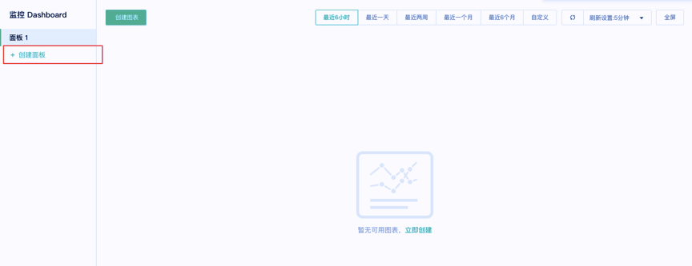

4. 用户也可以点击上图“创建面板”按钮，重新创建一个空面板。

### (二). 修改监控面板

操作步骤

1. 进入监控Dashboard内，在左侧监控Dashboard面板目录管理列内，可对需要修改的面板进行操作。
如下图，鼠标悬浮在需要修改的面板名称上，点击右侧按钮，可选择具体要执行的修改操作 – 重命名。
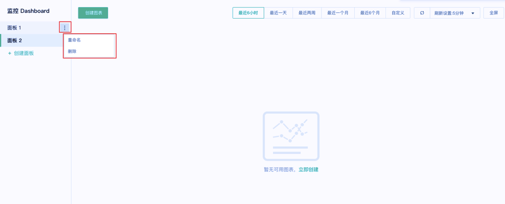

### (三). 删除监控面板

按上一步操作方式，可在修改操作功能上选择“删除”，可删除所选面板。
注：该操作会同步删除面板内的所有图表。

### (四). 创建监控图表

操作步骤：
1. 点击面板内“创建图表”按钮。
2. 选择资源所属区域，如下图：
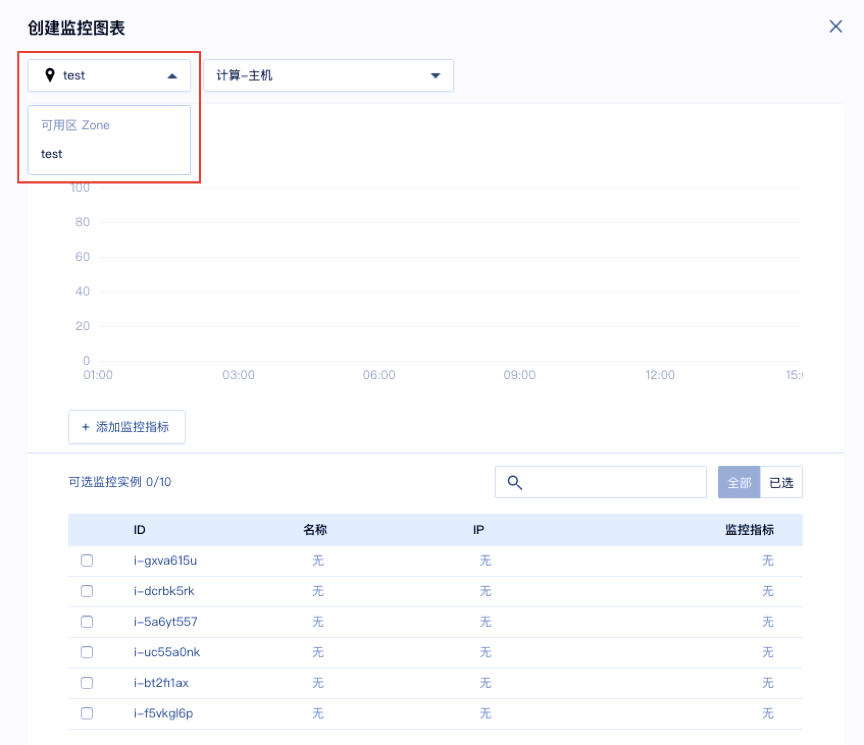
 
3. 选择需要集中监控的具体资源类型，如，选择“计算 – 主机”，如下图：
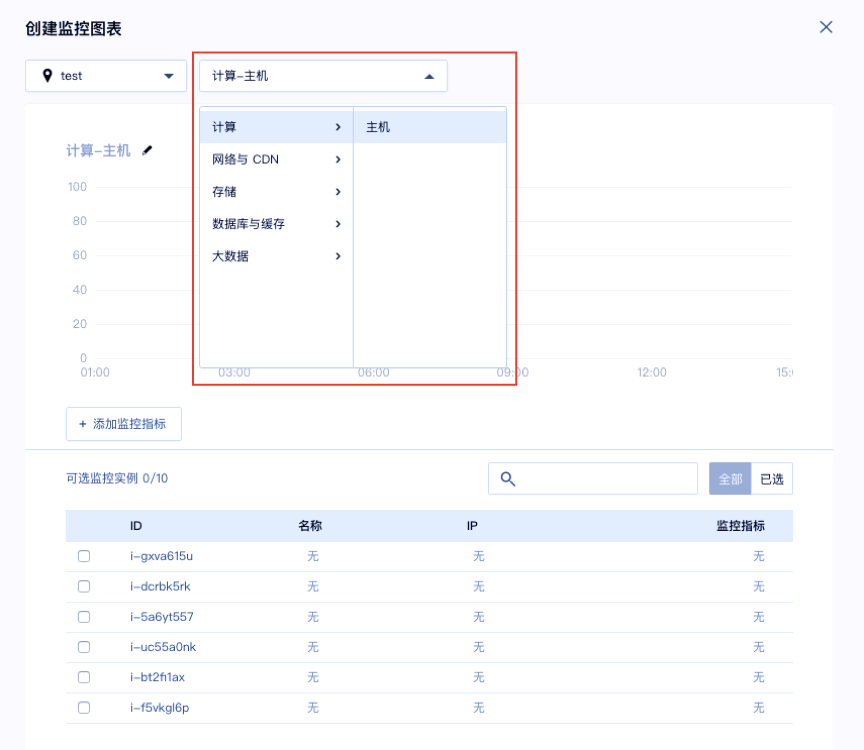
 
4. 选择需要集中监控的具体资源的指标，如，选择对主机的CPU利用率的监控，如下图：
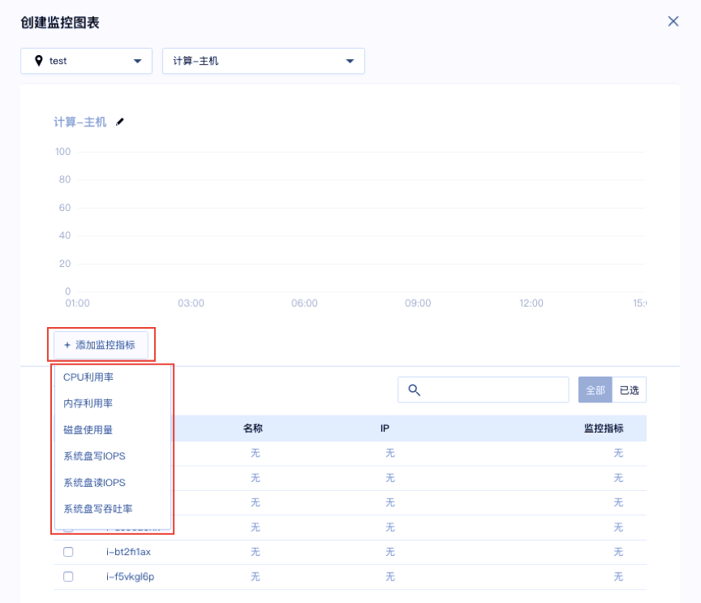

为了同时创建多张监控图表，在本步骤 – 指标选择上，支持同时选择多个指标（不限制同时可创建的指标数量），即可批量创建图表，如下图：
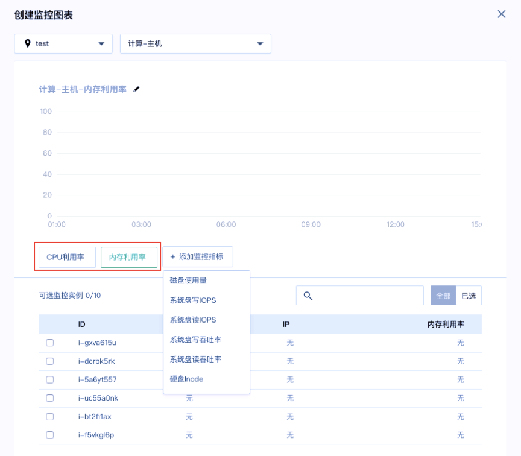

5. 选择需要集中监控的具体资源实例，如，选择了“主机”的指标监控，那么所选区域下的具体资源实例，在创建流程的最下方会自动筛选出来，用户可以自行勾选，最多可选择10个实例，如下图： 
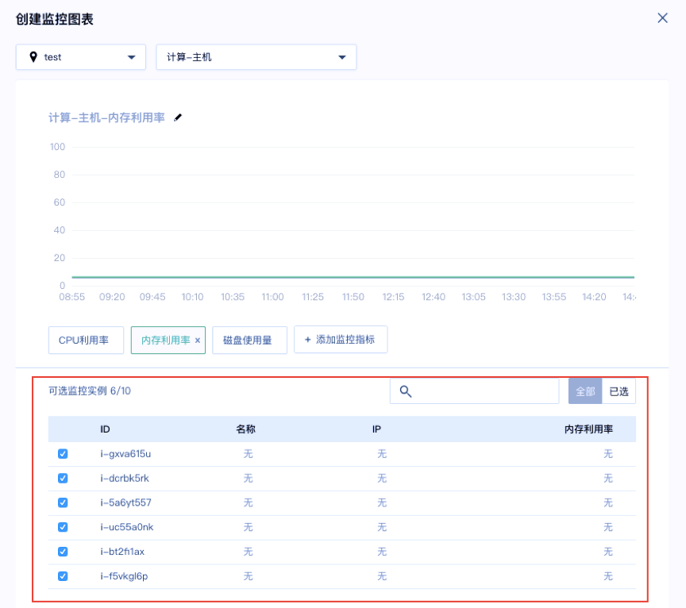

6. 资源实例勾选完成后，所选实例的监控指标预览图会在创建流程中实时展示出来，供用户参考，如下图：
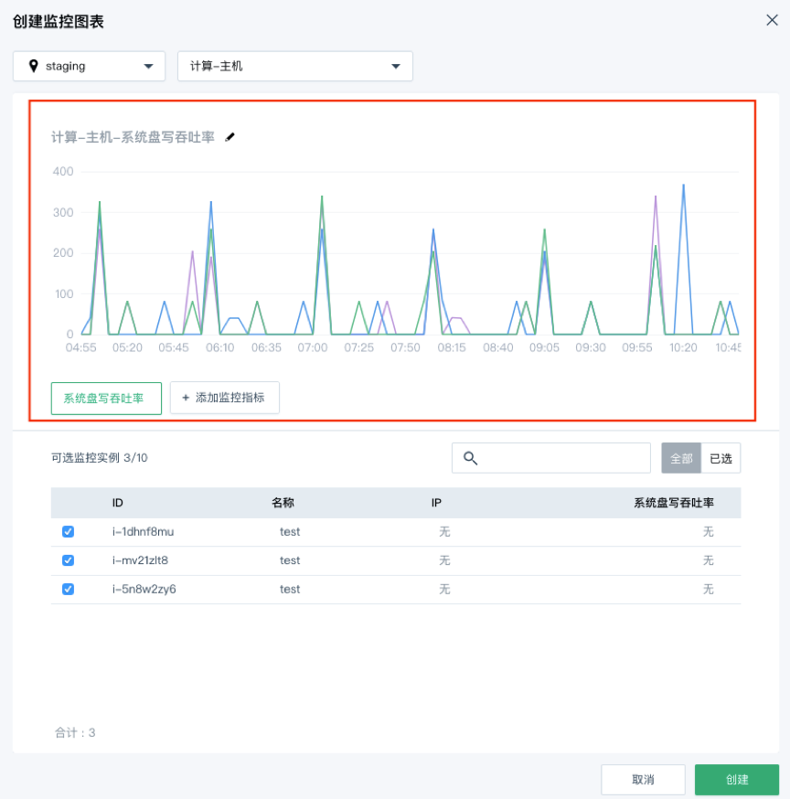

7. 点击“创建”按钮，即创建完成。可前往所属面板上，查看监控结果。

### (五). 查看监控图表

操作步骤
1. 面板上的图表根据所选时间周期，联动展示具体的监控时间间隔与监控粒度，如下图：
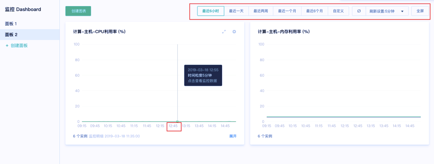
 
2. 将鼠标悬浮于某个图表上，点击某一个时间刻度，会自动展开图表上的所有监控数据，如下图，点击图表上的一个时间点，下方自动展开资源详情信息，可查看具体数据：
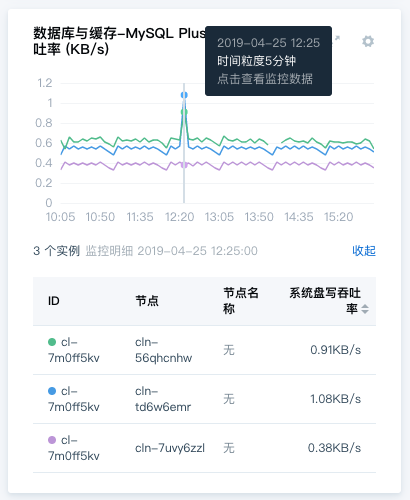

3. 基于上一步已展开的资源详情页，可继续对指标数据信息进行排序，点击最后一列指标列名上的排序按钮，可按监控指标的升序/降序排列出所监控的实例，如下图所示：
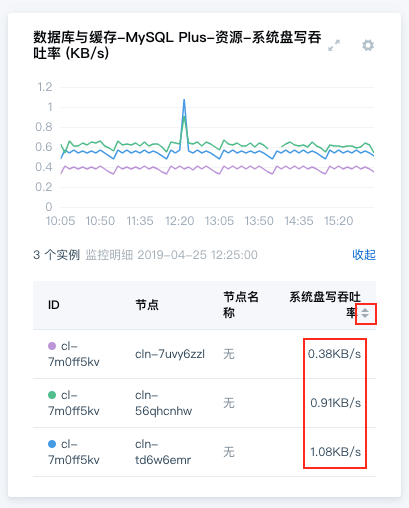
 
4. 基于第二步已展开的资源详情页，若监控实例的指标数据分布过于密集，不便于定位问题，可取消部分资源的指标数据显示。在资源详情页内点击某实例行，即可取消此条折线，如下图，取消后两个实例的监控，图表内只剩一个实例的指标数据信息，再次点击可恢复数据：
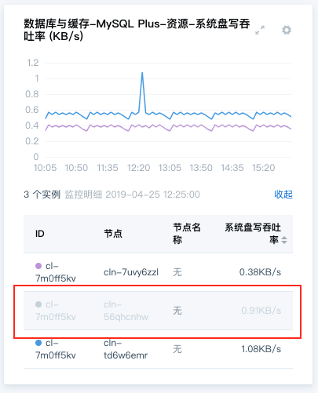

### (六). 图表二次操作

可对已创建的图表进行二次操作，包含修改、删除、导出。点击图表上的按钮可选择具体要执行的操作，如下图：
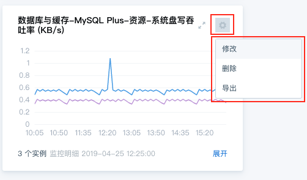

(1). 修改

支持修改的内容有：

  1 . 重命名

  2 . 可增加、删除监控指标

  3 . 可增加、删除监控实例
  
点击「修改」按钮，可在编辑格式下进行修改，如下图：
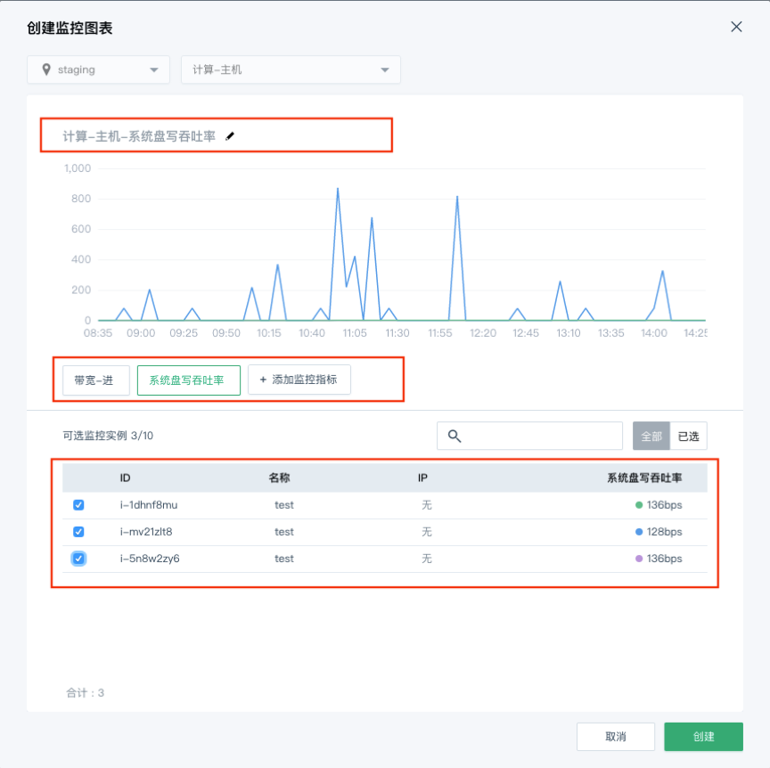
 
(2). 删除
点击「删除」按钮，图表以及图表内的数据会被一并删除，此操作不可逆。

(3). 导出
为了方便用户对有效监控数据的再次利用，平台提供导出监控数据功能，点击「导出」按钮，即可完成。

### (七). 查看监控大屏

待监控面板内的图表基本确定之后，可点击「全屏」按钮，在全屏模式下进行统一监控。
上述图表的所有查看功能，包括具体时间点监控数据详情查看、图表详情页内的排序、取消等，都可支持。如下图：
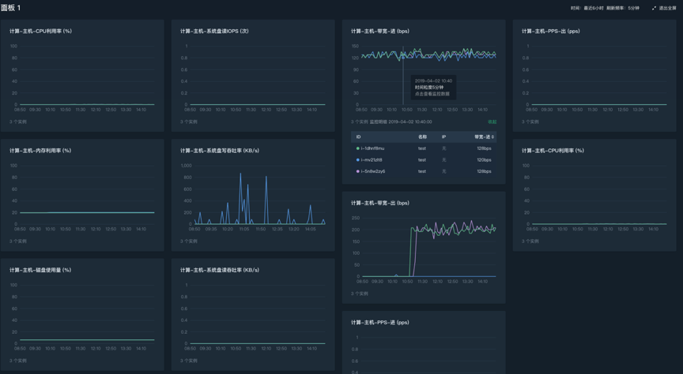
