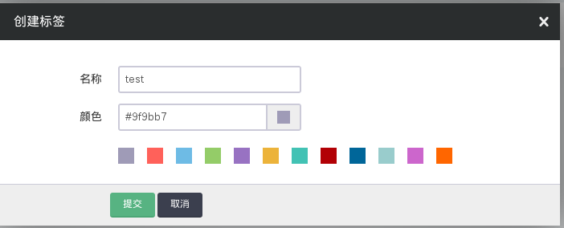
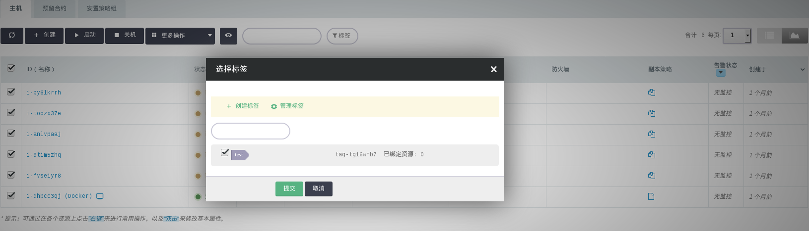
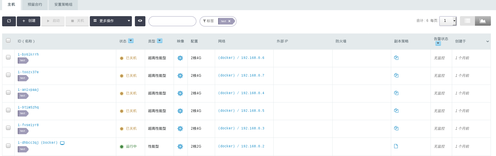

---
---

# 标签

标签(Tag) 用于分类分组您的云资源，更方便日常管理。

随着您的业务的增长，资源的使用也是日益的增多，日积月累，资源检索会成为日常的需求，那么贴标签这样一个功能，可以让您随时随地的根据实际情形来过滤自己的各种基础设施资源。下面我们就以一个为一组主机贴标签为例，演示一下，标签的使用方式：

## 创建和管理标签

在青云的终端控制台，打开“管理”->“标签”页面，点击“创建”：

## 给资源贴标签

我们以主机为例，打开“计算”->“主机”页面，选中要打标签的主机，然后点击“绑定标签”：

## 利用标签来过滤资源

我们以主机为例，打开“计算”->“主机”页面，使用搜索框旁边的“标签”按钮，过滤想要的资源：

就是这么简单和神奇，enjoy!
