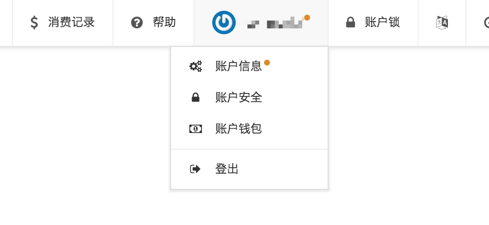
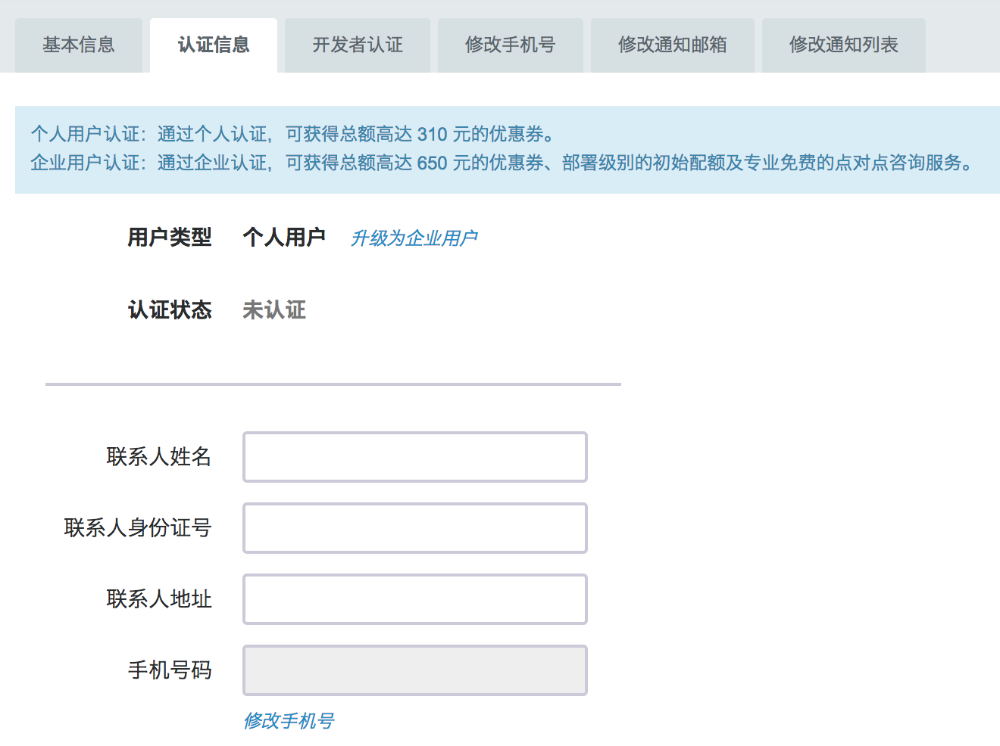
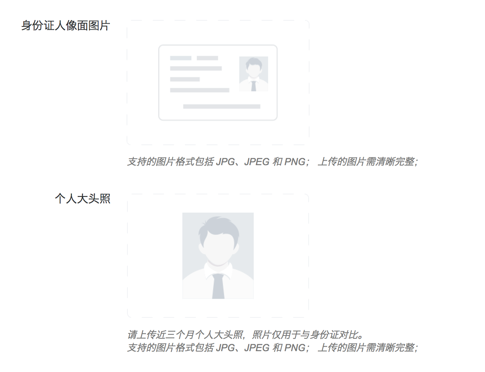
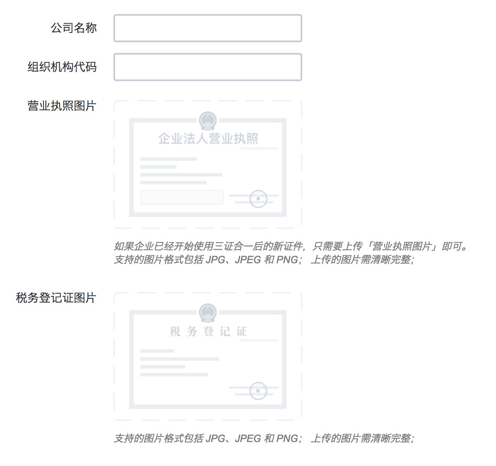

---
---

# 账号认证

注册为青云用户后，您需要完成账号的认证，才能获得创建资源所需的初始配额。有两种类型的账号认证：个人认证和企业认证。个人认证完成后，可以获得测试级别的初始配额，以及总额 310 元的优惠券；企业认证完成后，可以获得部署级别的初始配额、总额高达 650 元的优惠券，以及专业免费的点对点咨询服务。

>注解
注册为青云用户后，请尽快完成账号认证，以获取初始配额。

账号认证的过程如下：

*   从控制台顶部导航用户头像 - 账户信息，进入用户信息页；
*   用户信息页的“认证信息”标签页，进入用户认证;
*   默认的认证类型为个人认证，如需要企业认证，则点击“升级为企业认证”;
*   按要求字段填写信息，并上传相应图片，提交即可等待认证完成。

## 认证入口

在控制台顶部导航用户头像区域，可以找到账号信息的入口。

>注解
如果您没有完成注册，在用户名的右侧会有一个红点提示。

## 个人认证

如果您是个人用户，可以申请个人认证。只需要提供您的个人基本资料，以及身份证照片、个人正面肖像照即可。

身份证需要上传人像那一面的照片，肖像照请提供近三个月个人大头照，照片仅用于与身份证对比。

>注解
您的个人信息和照片，仅用于身份认证。我们保证不会泄露您的个人隐私。

## 企业认证

企业用户可以通过企业认证，获得更多的配额、更大额的注册优惠，以及专业免费的点对点咨询服务。除了个人认证所需的联系人信息外，还需提供企业名称、组织机构代码、营业执照、税务登记证照片等。

>注解
认证审核会在 3 个工作日内完成，如果您有特殊情况急需完成注册，请通过工单联系我们，加速办理。
