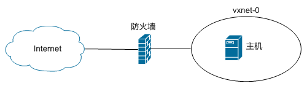

---
---

# 快速上手指南

想要最快开始使用青云，最佳途径就是使用 WEB 控制台。 本篇指南旨在帮助新用户快速上手创建一个主机， 因此只会涉及最基本功能，不会详细探讨青云的全部功能。

如果您需要了解如何使用 SDN 网络功能来构建自己的网络拓扑，请参考网络拓扑指南。

## 总览

为了行文方便，假设我们的任务是创建一台主机，并将该主机连接至互联网。



## 操作

第一步：创建一台主机


WEB 控制台，点击左边导航条中的“计算与网络 -> 主机”，接着在右边区域点击“新建”按钮， 这时会弹出创建主机的向导：

*   首先选择使用哪个映像作为模版，比如 CentOS 6.4 64bit，点击“下一步”；
*   接着指定 CPU 和内存的数量，可以使用顶部的推荐类型快速配置， 也可以自行定制各自的数量，点击“下一步”；
*   接着指定该主机将连接至哪些网络， 简单地使用默认的基础网络 vxnet-0，点击“下一步”；
*   本指南不涉及网络拓扑，如果您有多台主机，需要组网，请参考网络拓扑指南。
*   最后给主机命名、并指定数量，点击“创建”，即可。
*   通常在10秒钟左右即可完成。

第二步：申请一个公网 IP，并分配给主机


登录 WEB 控制台，点击左边导航条中的“计算与网络 -> 公网IP”， 接着在右边区域点击“申请”按钮，这时会弹出申请表单：

*   名称：为您申请的这个 IP 地址取个名字，方便记忆与使用。可选。
*   个数：1个
*   带宽：这个是互联网带宽（上行下行一样）。
*   注意：青云内部网络通讯带宽不受影响，均为 512Mbps。
*   IP分组：选择您希望使用的公网IP提供方
*   ICP备案：如果您打算做公开的网站，在中国大陆得备案。

点击“提交”，即可。如果您在表单中标示了需要 ICP 备案， 那么您申请到的公网 IP 不能立刻投入使用，需要完成政府备案流程方可； 如果您在表单中标示了不需要 ICP 备案，那么您申请到的公网 IP 可以立刻开始使用。 因为本教程仅仅是个演示，所以不需要 ICP 备案了。

申请到手的公网 IP 会列在右边主显示区域，右键点击它， 选择“分配到主机”，在弹出的对话框中选择您在第一步中创建的主机，点击“提交”即可。


第三步：连接到您的主机


青云提供了有两种方法来连接主机。

方法一，使用青云终端。

登录 WEB 控制台，点击导航条中的“主机”， 在右边主显示区域会列出您名下的全部主机， 每台主机 ID 旁边都有一个显示器模样的按钮，点击它， 即可打开青云终端连接至该主机的本地显示器。

您可以在使用的映像的详情页或本指南中找到所用映像的默认终端用户名和密码。 登录成功后，切记修改密码、且使用复杂密码以保护自己的资源。

> 警告
您可以在使用的映像的详情页中找到默认终端用户名和密码。 登录成功后，切记修改密码、且使用复杂密码以保护自己的资源。


方法二，使用 SSH。

在能使用 SSH 之前，需要先打开防火墙的 TCP 22 端口。 在主机列表页中打开该主机的详情页， 在“绑定资源”项下可以看到该主机使用的防火墙， 打开这个防火墙的配置页，新建一个下行规则：

*   方向：下行
*   操作：接受
*   协议：tcp
*   起始端口：22
*   点击“提交”，对话框关闭，然后点击上方的“更新规则”，即可。

登录 WEB 控制台，点击左边导航条中的“SSH密钥”， 在右边主显示区域点击“新建”，在弹出的对话框中输入一个名称， 指定一个加密方法，点击“提交”。 青云会立刻为您创建一对密钥，并要求您立刻下载私钥。

在 SSH 密钥列表页中右键点击刚刚创建的钥匙， 选择“加载到主机”，在弹出的对话框中选择您第一步中创建的主机， 点击“提交”，即可。 然后，您就可以使用 SSH 远程安全地登录了:


```
$ ssh -i /path/to/kp-1234abcd root@ip_address
```


第四步：创建一个硬盘，并连接至主机


这一步是可选的，主要是为了演示一下如何为主机添加更多硬盘（块级存储设备）。

登录 WEB 控制台，点击左边导航条中的“硬盘”， 在右边主显示区域点击“新建”， 在弹出的对话框中指定名称、数量、容量，点击“提交”，即可。

在硬盘列表页中右键点击刚刚创建的硬盘，选择“加载到主机”， 在弹出的对话框中选择您第一步中创建的主机，点击“提交”。 然后登录到您的主机，用 fdisk -l 或 parted -l 之类的工具即可看到新硬盘。 因为是新硬盘，所以首次使用时需要分区、格式化之后才可加载使用。

第五步：清理

我们已经完成了简单演示的任务， 可以在以上各个资源的列表页中删除/销毁您不再需要的资源。
