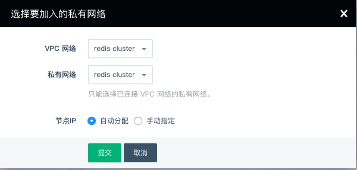
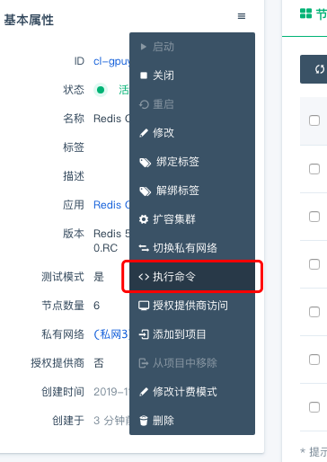
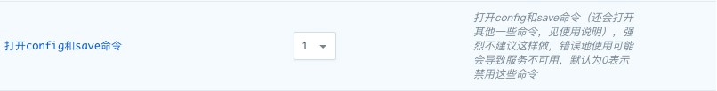

---
---

# Redis Cluster 更多

## 切换私网

您可以在 「基础属性」栏选择切换私网，之后选择对应的 VPC 网络和私有网络，点击提交即可。



## 文件下载

`Redis 5.0.5 - QingCloud 2.0.0` 在「配置参数」栏添加了 WebConsole 的服务，您可以通过该服务下载日志、RDB 数据文件和 AOF 文件，该服务默认没有密码，建议在使用时配置密码


您可以通过浏览器访问 http://[ip]:80 来访问下载页面


您也可以在虚机中使用以下链接来下载需要的文件

> 设置了用户名和密码的用户，需要将链接中的 \[username\]、\[password\]、\[ip\] 分别替换为您的用户名、密码和目标 ip 

> 未设置用户名和密码的用户可以删除 _\[username\]:\[password\]@_ 部分，并将 \[ip\] 替换为目标 ip 即可

```shell
# 下载 RDB 文件
wget http://[username]:[password]@[ip]/redis/dump.rdb

# 下载 AOF 文件
wget http://[username]:[password]@[ip]/redis/appendonly.aof

# 下载日志文件
wget http://[username]:[password]@[ip]/redis/redis-server.log

```

## 禁用命令的执行

为了您的数据安全，我们禁用了部分命令，并在前端开启了常用的命令操作：




- 清空数据
  - 你可以根据需求来选择不同的执行命令：
    - FLUSHALL: 清空所有的数据
    - FLUSHDB: 清空指定数据库的数据
- RDB 文件下载
  - 先执行 BGSAVE 命令，该命令会在主节点生成最新的 RDB 文件
  - 根据 [文件下载](https://docs.qingcloud.com/product/database_cache/redis-cluster/index#%E6%96%87%E4%BB%B6%E4%B8%8B%E8%BD%BD) 的说明下载主节点的 RDB 文件使用

## 迁移

迁移数据既包括 Redis standalone 之间也包括从 Redis Standalone 到 Redis Cluster。

### 从 Redis standalone 迁移数据到 Redis cluster

Redis 4.x　提供了一个从 Redis standalone (包括旧版本 2.8.17) 迁移数据到 Redis cluster　的工具 redis-trib.rb， 请 下载 [Redis 4.x](http://download.redis.io/releases/redis-4.0.6.tar.gz)，解压后进入 Redis src目录， 执行以下命令:　
(假设 Redis standalone 的主节点 IP 为 192.168.100.11，端口为 6379，Redis cluster 其中一个节点的 IP 为 192.168.100.20，端口为 6379)。

```shell
./redis-trib.rb import --from 192.168.100.11:6379　192.168.100.20:6379 --copy
```

redis 5.x 对 shell 命令行做了些修改，需要先下载 [Redis 5.x](http://download.redis.io/releases/redis-5.0.3.tar.gz)，解压后进入 Redis src目录，执行以下命令

```shell
./redis-cli --cluster import 192.168.100.20:6379 --cluster-from 192.168.100.11:6379 --cluster-copy
```

> 运行上述命令务必添加 --copy 或者 --cluster-copy 参数，否则会导致仅迁移数据而不是复制数据

### 从 Redis cluster 迁移数据到 Redis cluster

假设您有两个 Redis cluster：

Redis cluster A：主节点为 192.168.2.31:6379,192.168.2.32:6379,192.168.2.35:6379

Redis cluster B：主节点为 192.168.2.14:6379,192.168.2.17:6379,192.168.2.19:6379

您需要将数据从 Redis cluster A 迁移到 Redis cluster B

- 迁移方式

步骤一：迁移 slots，在选择 redis-port 迁移时，该过程是必要的

通过以下[命令](https://redis.io/commands/cluster-nodes)检查 Redis cluster A 和 Redis cluster B 的 slots 分布是否一致，在不一致的情况下，可以使用 [migrateSlots.sh](https://github.com/QingCloudAppcenter/redis/tree/master/operations) 将 Redis cluster B 的 slots 分布迁移至与 Redis cluster A 一致

```shell
./redis-cli -h 192.168.2.31 cluster nodes

./redis-cli -h 192.168.2.14 cluster nodes
```

步骤二：做数据迁移

- 4.x 的用户可以使用 redis-port 来迁移

使用 [redis-port](https://github.com/CodisLabs/redis-port/releases) 来迁移，下载程序后，执行 ./redis-sync -m [源地址:端口号] -t [目标地址:端口号]，提示完成\[100%\]，即可终止程序，此工具也支持 rdb 文件导入，比较灵活，详细说明参见 https://github.com/CodisLabs/redis-port

> 注意：「源地址」与「目标地址」的 slots 分布需要一致

- 4.x 和 5.x 的用户可以通过 RDB 文件来迁移数据
  - 通过 [禁用命令的执行](https://docs.qingcloud.com/product/database_cache/redis-cluster/index#%E7%A6%81%E7%94%A8%E5%91%BD%E4%BB%A4%E7%9A%84%E6%89%A7%E8%A1%8C) 一栏 `RDB 文件下载` 下载源集群各主节点的 RDB 文件，并保存至网络与目标集群相通的虚机中
  - 在虚机中下载并创建 redis-server 实例，先关闭 redis-server 实例，复制欲迁移的 RDB 文件到 redis-server 的数据目录，并重启该虚机的 redis-server 实例
  - 参考 [从 Redis standalone 迁移数据到 Redis cluster](https://docs.qingcloud.com/product/database_cache/redis-cluster/index#%E4%BB%8E-redis-standalone-%E8%BF%81%E7%A7%BB%E6%95%B0%E6%8D%AE%E5%88%B0-redis-cluster) 中的描述，将虚机的 redis-server 中的数据迁移至目标集群
  - 对其余的 RDB 文件依次按照上述步骤迁移至目标集群即可

## 其他

为了更好的管理 Redis 服务，我们默认禁用一些 Redis 的命令，禁用的命令列表如下：

- BGREWRITEAOF
- BGSAVE
- DEBUG
- CONFIG
- SAVE
- SHUTDOWN
- SLAVEOF
- KEYS

为兼容 Redis 5.0.3 - QingCloud 1.2.1 之前的版本，自 Redis 5.0.3 - QingCloud 1.2.1 起默认开启了如下命令，升级集群的用户依旧保持开启该命令，我们强烈建议新建集群的用户禁用掉该命令，该命令的误操作，会对数据造成不可恢复的丢失：

- FLUSHDB
- FLUSHALL

您可以通过参数配置页打开 CONFIG 和 SAVE 命令，但我们强烈不推荐您这么做。错误地使用 CONFIG 命令可能会导致服务的不可用，我们建议您在生产环境上使用默认设置来禁用这两个命令。 当您需要打开命令时，设置'打开config和save命令'为１，保存配置，服务会自动重启以生效。



## Redis cluster Paas文档

请访问[这里](../cache_redis_cluster.html)