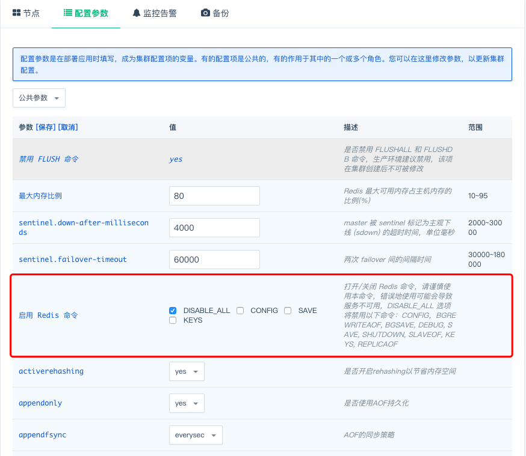

---
---

# Redis 进阶
​	部署完成后您将看到如下信息


- 服务端口信息

  **Redis standalone on QingCloud** 提供一个读写IP，此IP始终指向主节点。当发生主从切换时，此IP将指向新的主节点，无需手动更改主节点IP

  

## 节点实时角色

`Redis 5.0.3 - QingCloud 1.2.2` 新增了 `节点实时角色` 一栏，可以非常方便且实时的获取集群中节点的主从状态


`Redis 5.0.5 - QingCloud 2.0.0` 更改为 `节点角色` 一栏，该栏可以反映 redis 角色的状态变化，方便更好的定位问题


## 伸缩节点

- 删除节点

​	您可以从多个节点减少到一个节点，由于您可能删除主节点，会造成服务的短暂不可用，所以请在服务压力较小的情况下减少节点，剩下的节点就会以主节点继续提供服务。

**`Redis 5.0.3 - QingCloud 1.2.2` 版本的用户可以先根据 `节点实时角色` 判断集群的节点角色，防止删掉主节点，造成集群服务的短暂不可用。**

**`Redis 5.0.5 - QingCloud 2.0.0` 对待删除节点增加了限制：禁止删除主节点，防止造成服务的短时间不可用**


​
​

- 增加节点

​	您可以从单节点增加到多节点，增加节点的过程中服务不会停止。为在线升级方便，从单节点增加到多节点后，集群将自动拥有主从切换的能力，无需任何额外操作。​
​	
​

    

## 切换私网

如果您有切换私网的需求，也可以在控制台实现

> 该操作会重启集群，请在集群压力较小时操作。

- 步骤一

在 `基本属性` 中选择「切换私有网络」


- 步骤二

选择您要切换的 VPC 网络和私有网络，点击提交即可


## 扩容集群

如果集群的配置不满足现在的需求，可以在控制台实现集群的扩/缩容。

> 该操作会重启集群，请在集群压力较小时操作。

- 步骤一


​

- 步骤二

操作完上面的步骤，就会出现下面的选项，按照自己的需求选择相应的内存和磁盘大小，确认无误后点击提交即可
​
​

## 测试服务

​	集群创建完成后，您可以使用 redis-cli 来测试服务是否正常运行

在同一私网下创建一台 Linux 主机，下载与集群 redis 版本相同的 redis，这里以 [redis 5.0.5](http://download.redis.io/releases/redis-5.0.5.tar.gz) 版本为例，编译，进入 src 目录执行下面的命令

- 查询主节点的角色

```shell
$~: ./redis-cli -h 192.168.0.248 info replication
# Replication
role:master
connected_slaves:2
slave0:ip=192.168.0.15,port=6379,state=online,offset=99623,lag=1
slave1:ip=192.168.0.16,port=6379,state=online,offset=99623,lag=1
master_replid:b48a740d36aba2c61fcf7a8d820cbbfdeb3b94eb
master_replid2:0000000000000000000000000000000000000000
master_repl_offset:99623
second_repl_offset:-1
repl_backlog_active:1
repl_backlog_size:1048576
repl_backlog_first_byte_offset:1
repl_backlog_histlen:99623

```

- 插入一个 key value 对

```shell
$~: ./redis-cli -h 192.168.0.251 set a b
OK
```

- 获取 key 的 value

```shell
$~: ./redis-cli -h 192.168.0.251 get a
"b"
```


## 参数修改

​	可以在此修改环境参数，参数修改完成保存后，集群将重启以应用新的参数配置，所以请在服务压力相对较小的时候修改参数。
​	

> **如果修改了 port 参数，则需要打开集群网络防火墙中的对应的端口号。如修改 port 参数为 6378 ，此时需要打开防火墙的 6378 端口。**
> ​
> ​ ​	

 

## 监控告警

​	可以在此为节点配置告警信息，随时监控您的服务


## 同步日志

`Redis 5.0.3 - QingCloud 1.2.2` 添加了「同步日志」的功能，您可以打开「同步日志」，下载 redis-server.log，也可以通过浏览器来查看日志信息，默认的用户名为 caddy，密码为 caddy，您可以在「配置参数」中修改为您自己的用户名和密码。


## 文件下载

`Redis 5.0.5 - QingCloud 2.0.0` 在「配置参数」栏添加了 WebConsole 的服务，您可以通过该服务下载日志、RDB 数据文件和 AOF 文件，该服务默认没有密码，建议在使用时配置密码


您可以通过浏览器访问 http://[ip]:80 来访问下载页面


## 禁用命令的执行

为了您的数据安全，我们禁用了部分命令，并在前端开启了常用的命令操作：


- 清空数据
  - 您可以根据需求来选择不同的执行命令
    - FLUSHALL: 清空所有的数据
    - FLUSHDB: 清空指定数据库的数据
- RDB 文件下载
  - 先执行 BGSAVE 命令，该命令会在主节点生成最新的 RDB 文件
  - 根据 `文件下载` 的说明下载主节点的 RDB 文件使用


## 迁移现有数据

​	如果您目前有 **Redis( >= 2.6.0)** 数据库数据想迁移到 **Redis on QingCloud** 上来，可以使用下列的方式来迁移:

- **redis-port** 您也可以使用 [redis_port](https://github.com/CodisLabs/redis-port/releases) 来迁移， 下载程序后，执行 `./redis-sync -m [源地址:端口号] -t [目标地址:端口号] `，如下图，提示完成[100%]，即可终止程序。此工具也支持rdb文件导入，比较灵活，详细说明请参见 https://github.com/CodisLabs/redis-port


## 备份恢复

可以对集群进行手动备份，也可以在集群列表页面右键选择备份时间进行自动备份。


如果需要从备份创建出一个独立于原有数据库服务的新数据库服务，可以在详情页的『备份』标签下右键相应的备份点，再选择『从备份创建集群』即可。


## 升级版本

> 如果在您集群的基本属性中存在如下图所示的『有新版本可用，关闭集群后升级』，便可升级版本。


操作步骤：

- 步骤一，先关闭集群，点击如图所示的『升级』，就会出现步骤二中的界面
  
- 步骤二，选择需要升级的版本，点击升级即可


## 其他

为了更好的管理 Redis 服务，我们默认禁用一些 Redis 的命令，禁用的命令列表如下：

- **BGREWRITEAOF**
- **BGSAVE**
- **DEBUG**
- **CONFIG**
- **SAVE**
- **SHUTDOWN**
- **SLAVEOF**
- **KEYS**

为兼容 Redis 5.0.3 - QingCloud 1.2.2 之前的版本，该版本默认开启了如下命令，升级集群的用户依旧保持开启该命令，我们强烈建议新建集群的用户禁用掉该命令，该命令的误操作，会对数据造成不可恢复的丢失：

- **FLUSHDB**
- **FLUSHALL**

您可以通过参数配置页打开 _CONFIG_ 、 _SAVE_ 、 _KEYS_ 命令，但我们强烈不推荐您这么做。错误地使用 _CONFIG_ 命令可能会导致服务的不可用，我们建议您在生产环境上使用默认设置来禁用这三个命令。 当您需要打开命令时，在配置参数页取消勾选 DISABLE_ALL 选项，并勾选您需要打开的命令，保存配置，服务会自动重启以生效。

