---
---
## Redis Standalone

Redis 是一个基于内存、键值对的开源存储系统，并且支持数据持久化。本例中，将介绍如何使用和管理 Redis standalone (一主多从)缓存服务， Redis cluster (多主多从)服务请见下一章节。目前 Redis standalone 支持版本 2.8.17 和 3.0.5。

### 创建

第一步：选择基本配置

在创建的对话框中，您需要指定缓存服务的类型为 Redis 及版本。 每个 Redis standalone 缓存服务都会包含 1 个主节点和 N 个从节点 (N 可以为 0 即没有从节点)，其中 1 + N 等于您选择的缓存节点个数。 在这里，我们指定节点个数为 2，即这个 Redis 缓存服务将拥有一个主节点和一个从节点，选择缓存大小、配置组以及自动备份策略，然后点击提交。

>注解
主节点是可读可写的，而从节点是只读的。并且 Redis standalone 不支持主从切换。


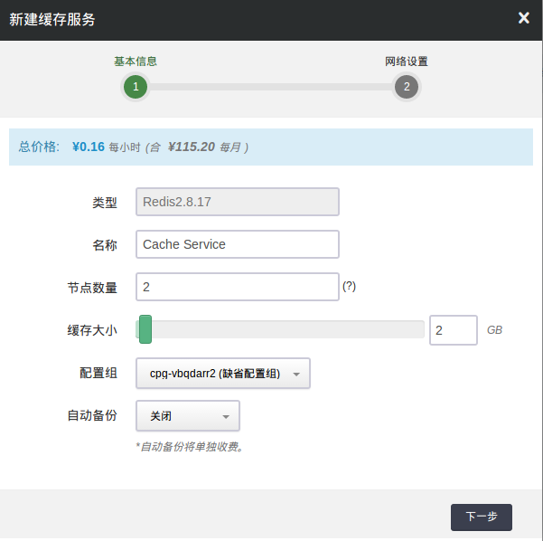

第二步：配置网络


在配置网络的过程中，我们首先需要选择缓存服务要加入的私有网络，然后我们可以为缓存服务中的每个缓存节点指定 IP，例如我们指定 主节点的 IP 为 192.168.100.10，从节点的 IP 为 192.168.100.11，您也可以选择”自动分配”，让系统自动指定 IP。

>注解
如果之前指定的 IP 并不是您预期的，您也可以在缓存服务运行过程中随时更改 IP, 另外 3.0.5 版本暂不支持运行中更改 IP 功能。

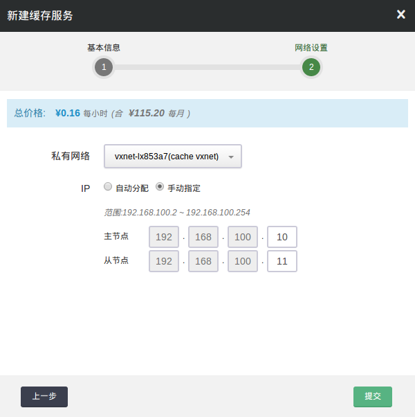

第三步：创建成功


当缓存服务创建完成之后，我们可以查看缓存节点的运行状态。 如图所示，缓存节点的 IP 为我们指定的 IP 地址，同时为 “活跃” 状态，表示各缓存节点连接正常。

>注解
在缓存服务运行过程中，您可以随时添加和删除缓存从节点，但是不能删除或添加主节点。

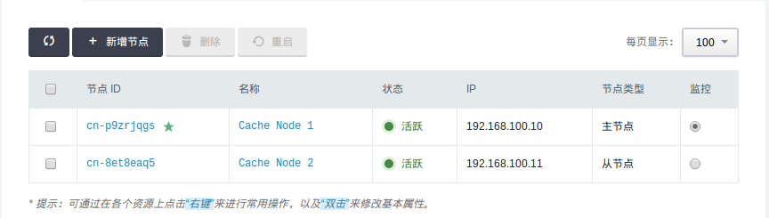

第四步：连接缓存


当缓存服务创建完成之后，我们可以进行连接测试。 如图所示，我们可以连接到主节点查询服务状态，并尝试写入数据。

>注解
默认情况下，缓存服务将使用系统的默认配置，但您可以随时对配置项进行更改并应用到缓存服务中。

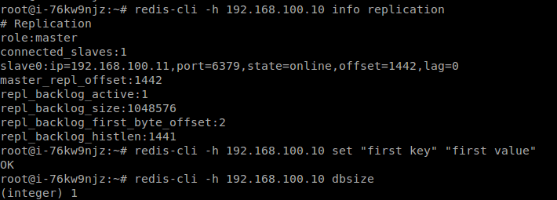

### 扩容

在缓存服务运行过程中，会出现服务能力不足或者容量不够的情况，您都可以通过扩容来解决。

1）增加缓存节点

 Redis standalone 缓存服务支持一主多从的架构。当读的能力不足时，您可以通过增加缓存从节点来提升读性能。 如图所示，我们在原有 Redis 基础上新增两个节点，并在创建时为新节点指定 IP。

>注解
如果服务能力过剩，您也可以删除多余的缓存从节点。

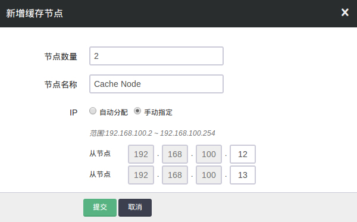

下图为扩容之后的节点列表。

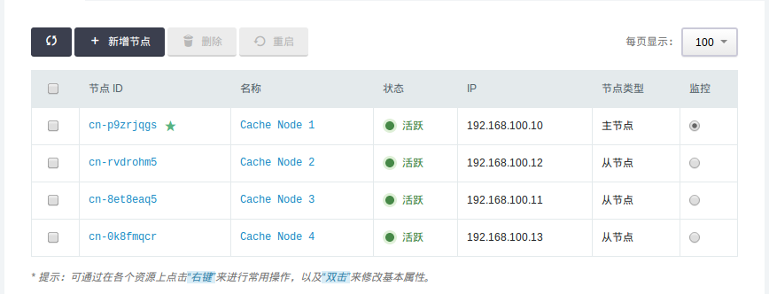

2）增加缓存容量


当缓存容量不足时，您可以通过扩容操作来提升缓存容量。 如下图所示，我们可以将原有缓存服务的容量从 1 GB 提升到 2 GB。

>注解
存储容量只能扩容，不支持减少存储容量。在线扩容期间，缓存服务会被重启。

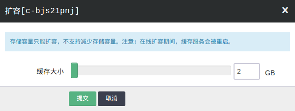

### 备份

Redis standalone 缓存服务本身支持数据持久化，您还可以通过备份功能对缓存服务进行定期备份，从而对关键时间点的数据进行保护。 缓存服务支持自动备份、手动备份、基于备份创建新缓存等功能。 备份功能是块级别的 (block level)，最大程度保证数据安全， 同时备份过程不会影响正在运行的缓存服务。

1）配置自动备份


缓存服务支持定期自动备份，目前为每天一次，您可以从一天中选择一个合适的时间段来进行自动备份。 一般会选择凌晨或者业务压力小的时候进行备份操作。

>注解
如果之前设置的备份时间不符合预期，您可以随时变更，同时您也可以随时关闭自动备份功能。

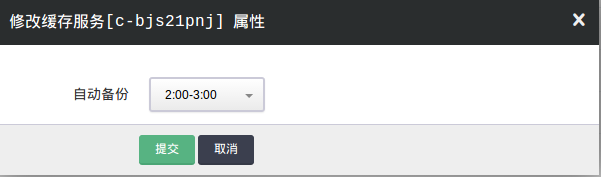

2.  手动备份


除了自动备份，您可以在需要的时候随时对缓存服务进行手动备份。

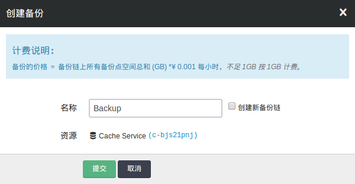

和青云QingCloud 其他资源的备份相同，每个缓存最多有两条备份链，每条备份链可以有多个备份节点，包含一个全量节点和多个增量节点。 更多关于备份功能的介绍可以参见 [_备份与恢复指南_](../storage/snapshot.html#guide-snapshot) 。

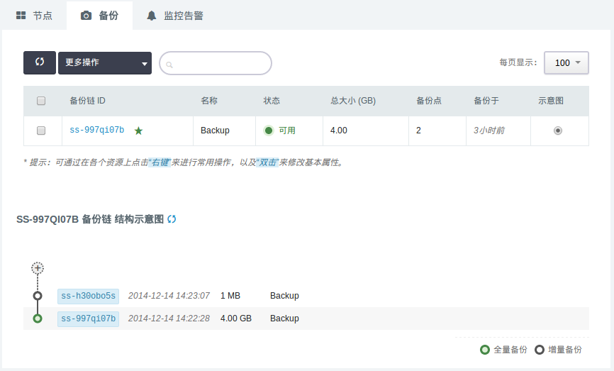

3.  通过备份创建新的缓存服务


您可以基于任意一个备份点创建新的缓存服务，这样新的缓存服务将拥有和备份点一样的数据。

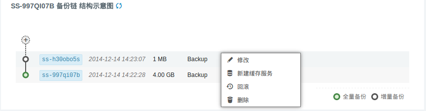

### 监控

我们提供了强大的监控和告警功能，帮助用户更好的管理和维护运行中的 Redis 缓存服务。

1）监控服务


我们提供了多达十几项的监控数据，来帮助用户随时了解缓存服务的运行状态和各项指标。 每一项监控都提供了历史监控和实时监控，最短时间间隔可以达到 10s。 Redis 服务的监控数据是通过 Redis 的 Info 命令来进行采集的。 我们提供的监控项目为如下：

1.  节点资源监控

*   **带宽监控**： 监控缓存节点的网卡出/入流量。
*   **基础资源监控**： 包括 CPU、内存、硬盘等监控

2.  缓存服务监控

*   **内存监控**： 缓存服务的实际内存使用率，对应 used_memory 字段。
*   **Get操作**： Get 相关操作的总数。
*   **Set操作**： Set 相关操作的总数。
*   **Key类型操作数**： Key类型操作数的总数。
*   **String类型操作数**： String类型操作数的总数。
*   **List类型操作数**： List类型操作数的总数。
*   **String类型操作数**： String类型操作数的总数。
*   **Hash类型操作数**： Hash类型操作数的总数。
*   **Set类型操作数**： Set类型操作数的总数。
*   **Sorted Set类型操作数**： Sorted Set类型操作数的总数。
*   **总连接数**： 建立总连接数，对应 total_connections_received 字段。
*   **当前连接数**： 活跃的连接数，对应 connected_clients 字段。
*   **查询命中数**： 查询的命中个数，对应 keyspace_hits 字段。
*   **查询未命中数**： 查询的未命中个数，对应 keyspace_misses 字段。
*   **查询命中率**： 查询命中率，对应 keyspace_hits / ( keyspace_hits + keyspace_misses )。
*   **总Key个数**： 缓存中总的 key 个数，所有 db 的 key 个数总和。
*   **已过期Key个数**： 缓存中已过期 Key 个数，对应 expired_keys 字段。
*   **被拒绝Key个数**： 缓存中被拒绝 Key 个数，对应 evicted_keys 字段。当缓存内存不足时，会根据用户配置的 maxmemory-policy 来选择性地删除一些 key 来保护内存不溢出。

下图显示了一些监控的图表：

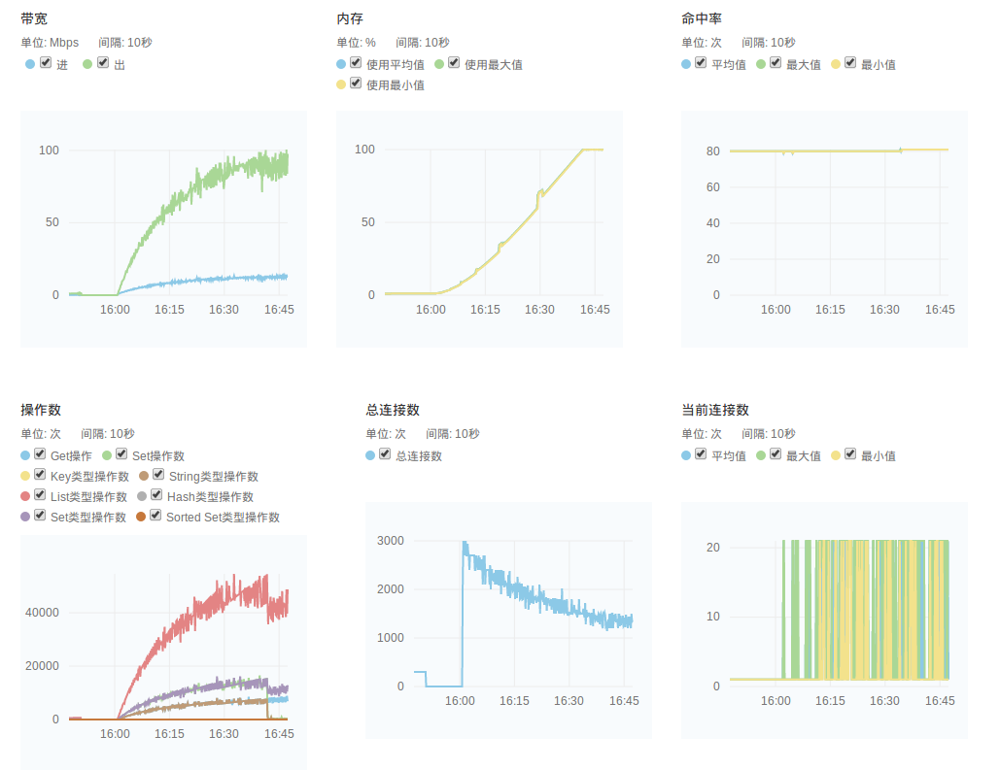

2）告警服务


我们支持对每个缓存节点配置监控告警策略，当发生异常时，会触发用户设定的告警阈值，并发送短信和邮件通知给用户。 缓存目前支持的监控告警规则有”内存使用率”、”被拒绝的 key 个数”等：

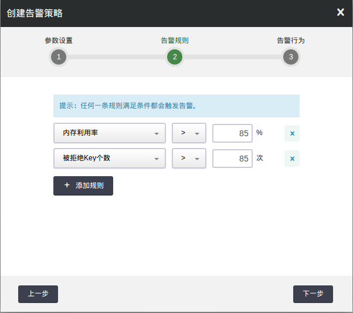

更多关于告警服务的内容可以参见 [_监控告警_](../management/alarm.html#guide-alarm) 。


### 配置[¶](#id7 "永久链接至标题")

我们通过缓存配置组来管理缓存服务的配置。缓存服务和缓存配置组是解耦的，您可以创建多个独立的缓存配置组，并应用到不同缓存服务。 缓存服务在运行过程中，也可以随时变更缓存配置组。

1）创建新的缓存配置组


默认情况下，我们会为每个用户创建一个缺省配置组。用户也可以创建新的配置组，如图所示：


>注解
缺省配置组不可以被删除。


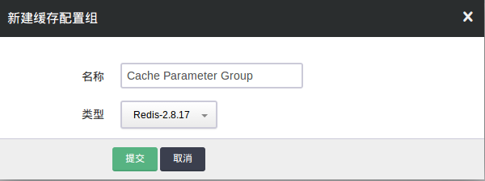

2.  修改配置项


点击该新建的缓存配置组，我们可以对每项配置项进行修改，如图所示：

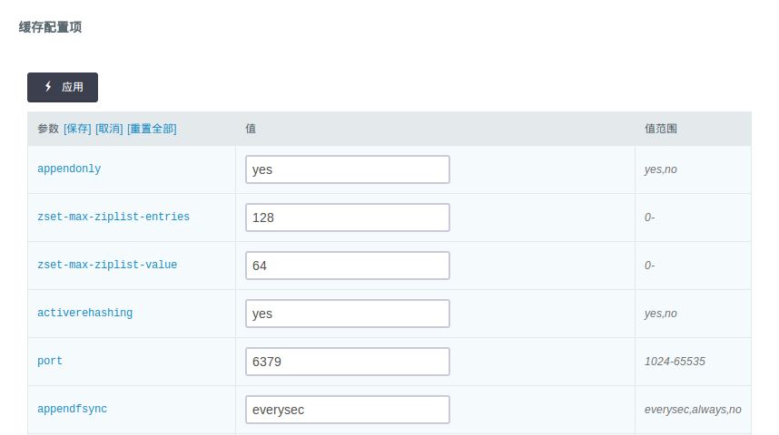

修改完后，我们需要进行 “保存”，并点击 “应用” 让新的配置生效。


>注解
当配置发生变化时，将会重启对应的缓存服务。


3.  常用配置项


*   **port**： 缓存服务端口，默认为 6379。
*   **appendonly**： 是否开启可持久化功能，yes 表示开启(默认)，no 表示禁用。注意，当未启用可持久化时，缓存数据会因为缓存服务重启而丢失。
*   **appendfsync**： 可持久化方式，everysec 表示每秒主动将数据刷新到磁盘(默认)，always 表示每次插入操作都会刷新到磁盘(强一致性, 但是性能会差)，no 表示依赖操作系统来刷新磁盘。
*   **maxmemory-policy**： 指定当内存满时对 key 的删除策略，默认为 volatile-lru，从过期的数据集中挑选最近最少使用的数据淘汰。
*   **requirepass**： 指定 redis 的访问密码。设置该参数后，整个 redis 中每个节点的访问都需要该密码，该密码也作为节点之间同步的密码。当该参数为空时，表示不需要密码。
*   **slowlog-log-slower-than**: 慢日志阈值设置，-1为禁止，0为记录所有的命令，正数值为记录执行时间大于该值的操作。详情见 [Redis 官方文档](http://redis.io/commands/slowlog)。
*   **slowlog-max-len**: 记录慢日志长度。
*   **latency-monitor-threshold**: 延迟监控阈值设定，0为禁止监控。详情见 [Redis 官方文档](http://redis.io/topics/latency-monitor)。
*   **disable-commands**： 指定需要禁用的 redis 命令，需要禁用的多个命令之间用”,”号分隔。

其他更多的配置项解释请参见 [Redis 官方文档](http://redis.io/topics/config)。


### 迁移

为了方便用户将已有的 Redis 数据迁移至青云QingCloud 的 Redis 中，或者从旧版本升级到新版本，我们提供了一个特殊的缓存配置项 “slaveof-host” 来实现这一目标。 首先假设用户已有的 Redis 服务为一台青云QingCloud 外部的主机，服务 IP 为 1.2.3.4，端口为默认端口 6379 (源 Redis 服务端口必须是 6379)。 新创建的缓存的节点位于某私有网络中，主机 IP 为 192.168.100.2，端口也为 6379。


>注解
slaveof-host 方式只对 Redis standalone 有效，对 Redis cluster 无效


1.  将新节点配置为已有节点的从节点


我们需要修改新节点对应的配置项 “slaveof-host”，填入已有节点的 IP。这样新节点可以作为已有节点的从节点，进行数据同步。


>注解
为了让迁移之后的数据能在新节点上持久化，需要保证新节点启用了持久化的配置，即 “appendonly” 选项需要为 “yes”.


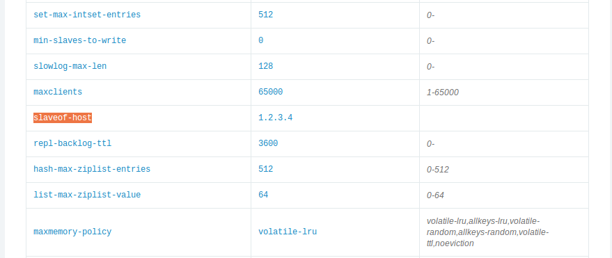

修改完后，我们需要进行 “保存”，并点击 “应用” 让新的配置生效。

2.  确认同步状态

通过 Redis 命令来查看新节点的数据是否已经和已有节点数据同步，一种简单的方式是比较两者的键值个数是否相等。

3.  恢复新节点配置

恢复新节点对应的配置项 “slaveof-host”，重新设置为空 “”，断开同步关系，让新节点重新成为缓存服务的主节点。

>注解
修改完后，我们需要进行 “保存”，并点击 “应用” 让新的配置生效。


### 性能

我们可以通过 Redis 自带的性能测试工具 redis-benchmark 来进行性能测试。

我们的测试对象为 8GB 内存的 Redis 缓存服务，如下为性能型 Redis 测试结果:

```
# redis-benchmark -q -n 1000000
PING_INLINE: 89919.97 requests per second
PING_BULK: 83049.58 requests per second
SET: 82365.54 requests per second
GET: 85207.91 requests per second
INCR: 80211.76 requests per second
LPUSH: 86117.80 requests per second
LPOP: 86355.79 requests per second
SADD: 93414.30 requests per second
SPOP: 101040.72 requests per second
LPUSH (needed to benchmark LRANGE): 92165.90 requests per second
LRANGE_100 (first 100 elements): 41301.83 requests per second
LRANGE_300 (first 300 elements): 11453.05 requests per second
LRANGE_500 (first 450 elements): 7625.67 requests per second
LRANGE_600 (first 600 elements): 6178.48 requests per second
MSET (10 keys): 49193.23 requests per second
```

我们的测试对象为 8GB 内存的 Redis 缓存服务，如下为超高性能型 Redis 测试结果:

```
# redis-benchmark -q -n 1000000
PING_INLINE: 146348.59 requests per second
PING_BULK: 138350.86 requests per second
SET: 141743.45 requests per second
GET: 142918.39 requests per second
INCR: 146993.97 requests per second
LPUSH: 148367.95 requests per second
LPOP: 145201.11 requests per second
SADD: 124455.51 requests per second
SPOP: 112637.98 requests per second
LPUSH (needed to benchmark LRANGE): 107642.62 requests per second
LRANGE_100 (first 100 elements): 51392.74 requests per second
LRANGE_300 (first 300 elements): 18827.07 requests per second
LRANGE_500 (first 450 elements): 12450.97 requests per second
LRANGE_600 (first 600 elements): 9635.77 requests per second
MSET (10 keys): 73292.29 requests per second
```

### 其他

为了更好的管理 Redis 服务，我们默认禁用一些 Redis 的命令，禁用的命令列表如下：

*   **BGREWRITEAOF**
*   **BGSAVE**
*   **DEBUG**
*   **CONFIG**
*   **SAVE**
*   **SHUTDOWN**
*   **SLAVEOF**
