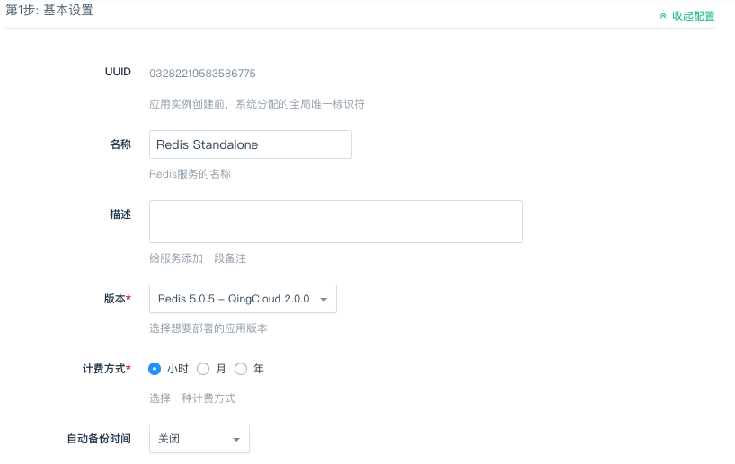

---
---

# 部署 Redis standalone 服务

> 为了您的数据安全，目前 **Redis standalone on QingCloud** 需要部署在私有网络内。请您在部署服务之前，先创建一个私有网络。

### 一. 选择基本配置

​      填写集群的名称，描述，选择应用的版本 _Redis 5.0.5 - QingCloud 2.0.0_ （也可以根据需求选择其他版本，这里以该版本为例），计费方式及自动备份时间您可以根据需求选择，自动备份时间默认关闭。

  在 `广东2区` 和 `北京3区` 的用户可以按照需求选择「多可用区部署」或「单可用区部署」

### 二. 配置节点

​        配置节点，根据业务需要选择节点类型、核数、内存、磁盘大小和数量（后续可以随时调整），单节点集群仅供测试使用，正式环境建议使用多节点保证高可用。

 

### 三. 选择私有网络

​     在此选择您在开始创建好的私有网络。
​ 

> **1、对于 `广东2区` 和 `北京3区` 创建集群的用户需要注意，集群的部署方式应与私网的部署方式保持一致，需要同时为 「多可用区部署」或者同时为「单可用区部署」** 
> ​  
> **2、对于 _Redis 5.0.3 - QingCloud 1.2.1_ 节点之间的防火墙必须放行 TCP/22 和 TCP/6379 这两个端口，否则会导致服务异常。**

> **3、对于其他版本的必须放行 TCP/26379 和 TCP/6379 这两个端口，否则会导致服务异常**

### 四. 配置 Redis 环境参数

​       **Redis Standalone on QingCloud** 提供了 **Redis** 大部分配置参数，您可以在此根据需要修改相应的参数。

 

- _requirepass_ : 如果您想为您的 **Redis** 服务设置密码，请在此填写，注意密码长度以保证安全， `Redis 5.0.3 - QingCloud 1.2.2` 及之后的版本添加了对密码的限定，可由数字、字母或 `!@#$%^&*()./;` 组成，且最少6位。
- _禁用 FLUSH 命令_ : 为了兼容之前版本的 app ，默认是不禁用 FLUSHALL 和 FLUSHDB 命令的，但是我们强烈建议您在生产环境下禁用该命令，该命令的误操作会对数据造成不可恢复的丢失。

### 五. 部署

​       阅读并同意青云 AppCenter 用户协议之后即可马上部署您的应用。