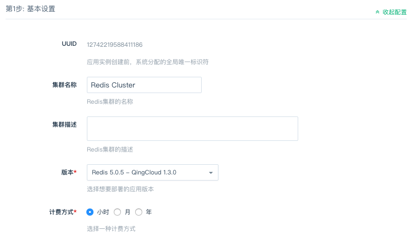
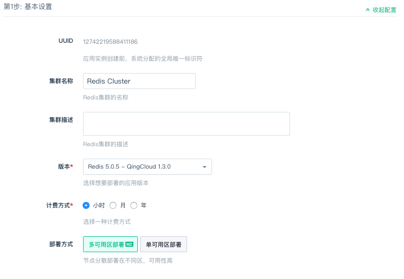
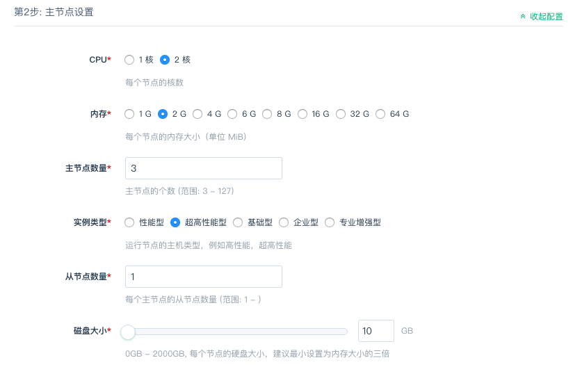
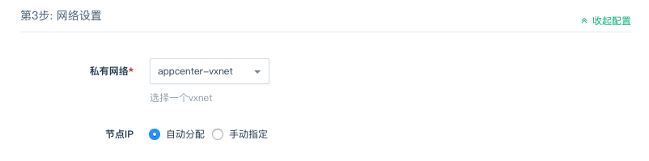
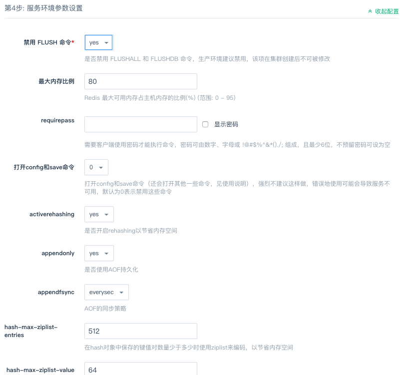
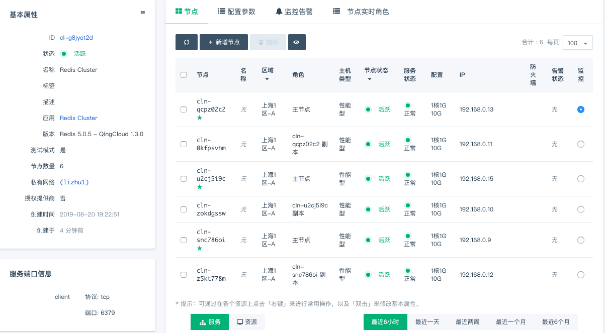

---
------

# 创建 Redis cluster App

### 一. 准备

在部署 App 之前，您需要创建一个 VPC 网络和关联一个 Vxnet 私有网络，详情见 ([VPC 指南](https://docs.qingcloud.com/product/network/vpc))

### 二. 选择基本配置

填写集群的名称，描述，选择应用的版本。

在 `北京3区` 、`广东2区` 和 `上海1区` 的用户可以根据实际需求选择「多可用区部署」和「单可用区部署」

### 三. 节点配置

配置 Redis 节点，包括内存、主节点数量、实例类型等信息。

### 四. 网络配置

选择服务部署的私有网络，可以选择之前创建的任意网络。

> `北京3区` 、`广东2区` 和 `上海1区` 的用户需要注意：被选择私网的部署方式应与集群的部署方式保持一致，即都为 「多可用区部署」或者都为「单可用区部署」

### 五. 环境参数配置

- 禁用 FLUSH 命令：为兼容 Redis 5.0.3 - QingCloud 1.2.1 之前的版本，自 Redis 5.0.3 - QingCloud 1.2.1 起添加了此项，默认是不禁用的，但我们强烈建议您禁用它，FLUSHALL 和 FLUSHDB 命令的误操作会造成数据不可恢复的丢失。

### 六. 创建成功

当 Redis cluster 服务创建完成之后，我们可以查看 Redis cluster 中各节点的运行状态。 

