---
---

# 资源协作（Collaboration）

## 总览

我们收到过很多用户各种各样的需求，有说，“希望主账号能管理子账号的资源”， 或者是“开发人员只能使用云桌面功能”，或者是“提供资源分组”等等。总结起来，用户 希望能够在青云控制台上灵活地权限配置，达到不同部门以不同权限访问不同资源的效果。

**Collaboration** 正是这样一种功能。

通过 **Collaboration** ，可以让青云用户通过更细粒度的权限控制，将资源授权给其他用户，实现管理和协作。

用一句话概括 **Collaboration** ，就是可以 **将任意资源的特定权限授权给任意用户（包括子账号和其他青云账号）** 。

随后，我们将一步一步演示操作一种常用的应用场景，即“如何将 _大数据平台组_ 的 _运维_ 权限授权给 _运维部门_ ”。

先简单介绍下， **Collaboration** 里相关的三个对象：

*   资源组（Resource Group），以下简称 RG。
*   用户组（User Group），以下简称 UG。
*   角色（Group Role），以下简称 GR。

[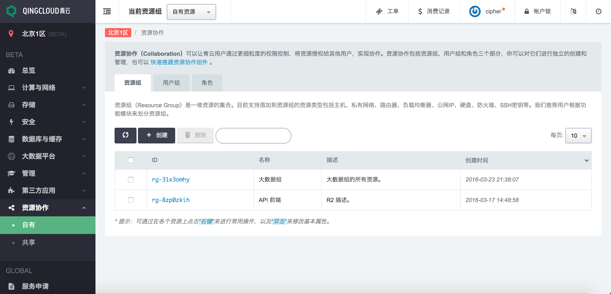](_images/overview.png)

## 资源组

资源组是一堆资源的集合。

我们推荐用户根据 **功能模块** 来划分资源组。功能模块根据用户的业务不同，常见的功能模块有：大数据平台、官网组、API 模块组等等。

我们先创建一个资源组： _大数据组_ 。

[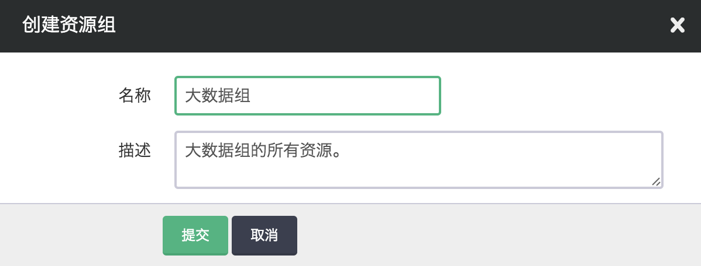](_images/create_rg.png)

并把跟大数据业务相关的资源加入到该 RG 中，如主机、路由器、私有网络、公网 IP、硬盘等。

[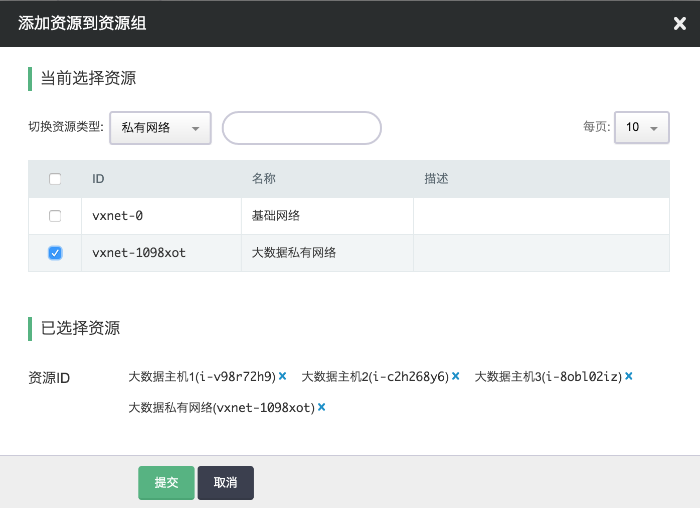](_images/add_instance_to_rg.png)

注解

基础网络（vxnet-0）属于青云管理的资源，用户不需要也没有权限将 vxnet-0 加入到自己的资源组中。

添加完后，可以看到这个 _大数据组_ 这个资源组里面的所有资源列表：

[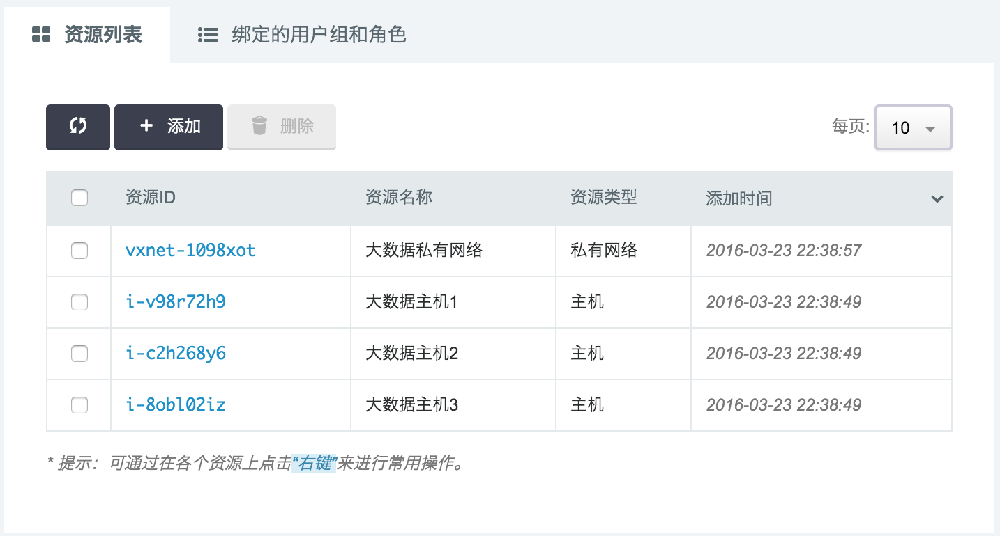](_images/describe_rgi_detail.png)

## 用户组

用户组是一群用户的集合。

用户组可以按照部门来进行划分，常见如：开发组、运维组。或者根据公司组织架构，细分为：大数据开发组、API功能模块开发组等。

注解

可以将任意用户加入到该用户组中，如子账号或其他主账号。可以输入用户 ID 或账号邮箱。

创建一个用户组： _运维部门_ 。

[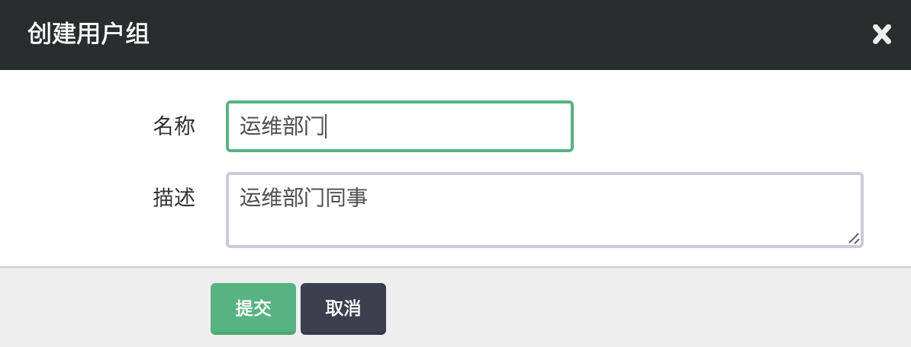](_images/create_ug.png)

将运维部门所有人员的账号加入到该用户组中：

[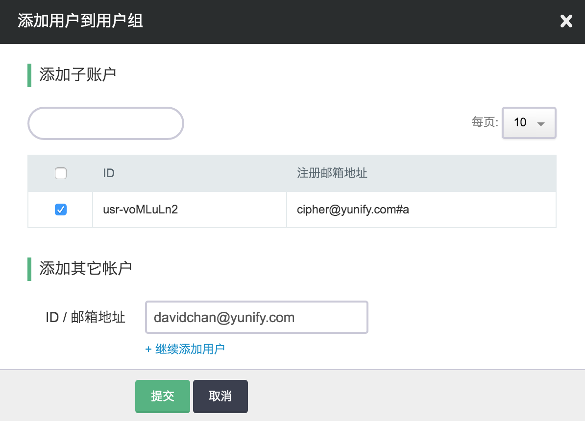](_images/add_users_to_ug.png)

添加完后，可以看到 _运维部门_ 里的所有人员。

[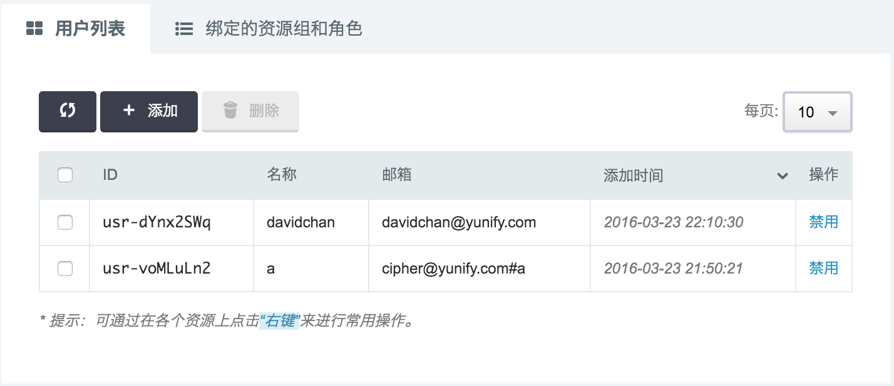](_images/describe_ugm_detail.png)

## 角色

角色是一组权限的集合。

一个用户组对一个资源组的操作权限是由角色来定义的。

创建一个角色： _运维_ 。

[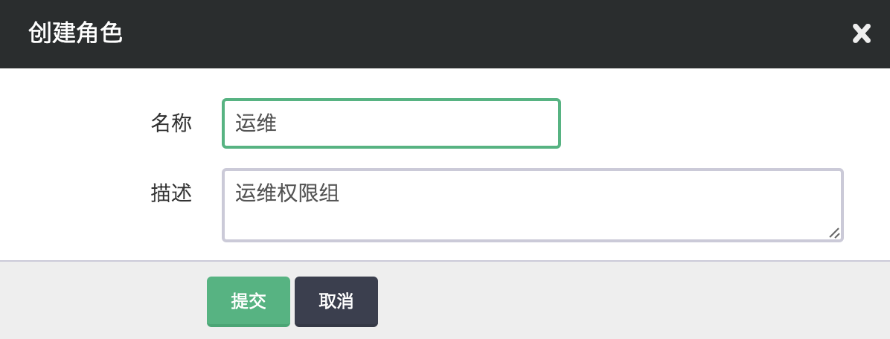](_images/create_gr.png)

配置该角色的权限。对于 _运维_ 角色，我们希望他们具有以下权限：

1.  添加所有资源的查看权限：

[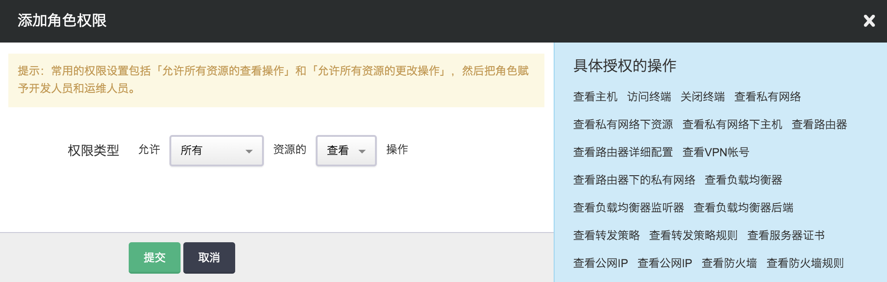](_images/add_describe_to_gr.png)

注解

创建完 GR 后，会自动添加两条 “监控的查看操作” 和“所有资源的查看操作” 的规则。 这里只是为了演示添加操作。

2.  添加所有资源的更改权限：

[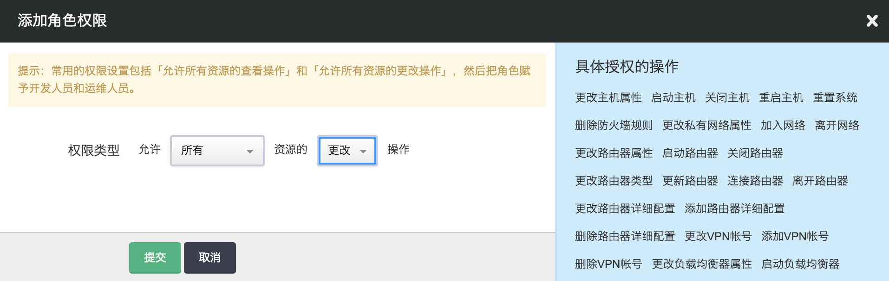](_images/add_modify_to_gr.png)

配置完后，可以改到 _运维_ 角色的所有权限。

[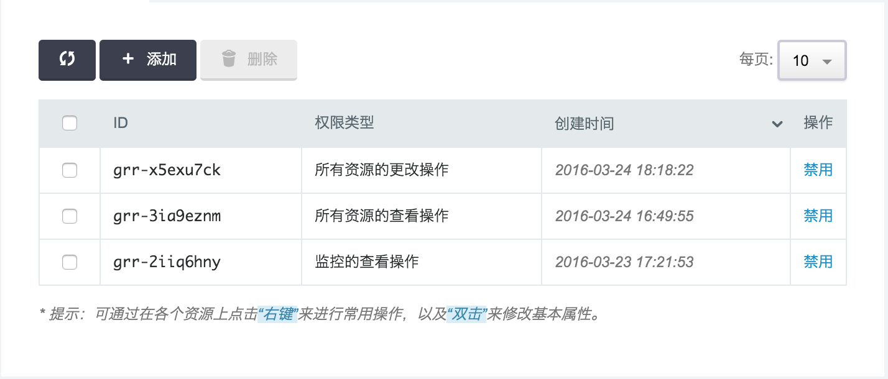](_images/describe_grr_detail.png)

警告

如果将 资源的删除权限 授权给其他人，意味着他们能直接删除该资源。 请谨慎授权删除权限。

## 授权与操作

仅仅创建这些对象是不够的，我们还需要通过授权将资源组和用户组关联起来。

### 授权

可以在资源组中，将该资源组授权给用户组，同时指定该用户组在该资源组的角色，

[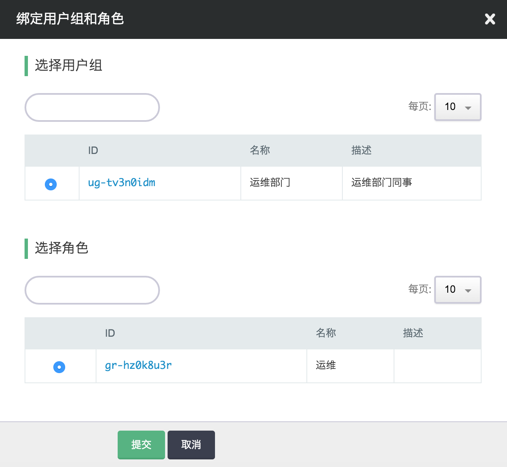](_images/grant_rg_to_ug.png)

至此，我们可以说： _运维部门_ 在 _大数据资源组_ 具有了 _运维_ 权限。

### 操作共享/授权的资源组

用户组成员 david#yunify.com 登录到控制台后，可以在导航栏看到，选择查看 **自有资源组** 或者是 **共享资源组** 。

[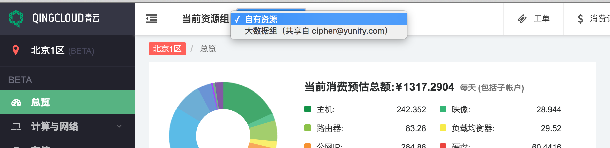](_images/switch_between_rgs.png)

切换到 _大数据资源组_ 后，控制台上只会看到在该资源组的相关资源。

[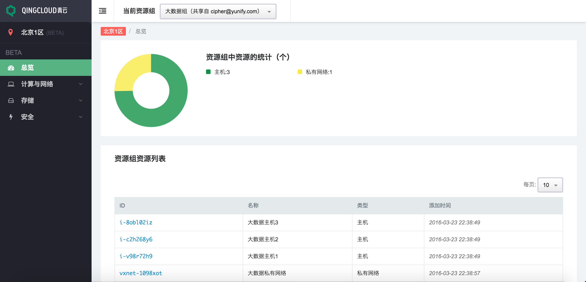](_images/list_resources_in_share_rg.png)

_运维组_ 人员可以查看主机的监控信息：

[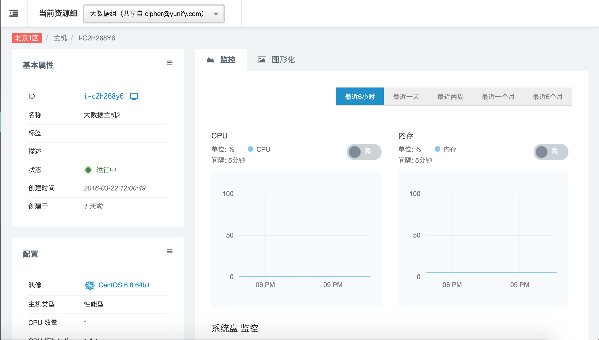](_images/get_instance_monitor.png)

如果没有权限操作该资源时，操作后会弹出提示。

[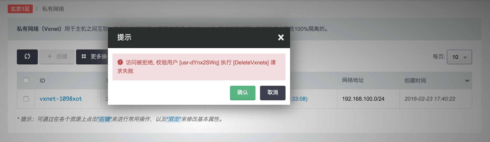](_images/delete_eip_through_sub_channel.png)

## 取消授权

在资源组的“绑定的用户组和角色”里，能够看到该资源组绑定的所有用户组，以及该用户组在当前资源组的角色。

可以在这里解绑关联关系：

[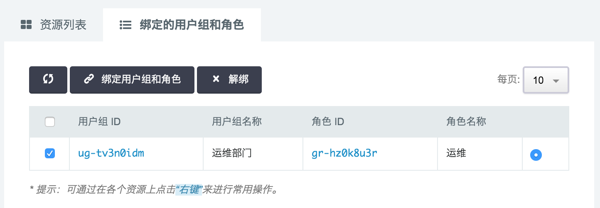](_images/revoke_rg_from_ug.png)
