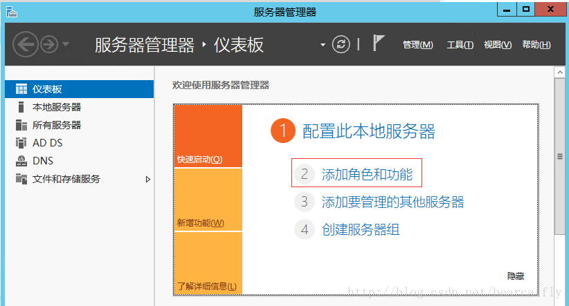
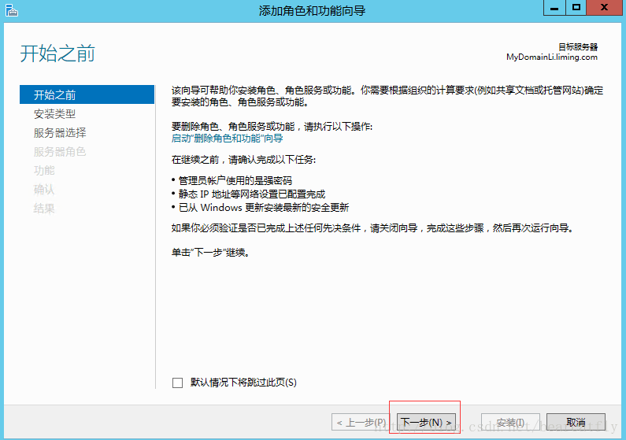
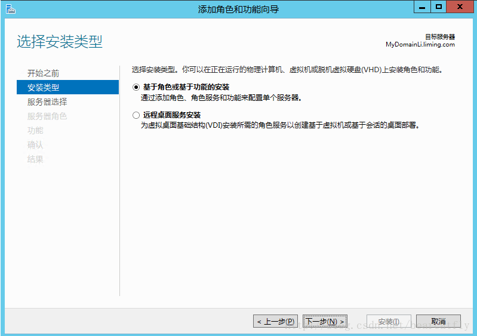
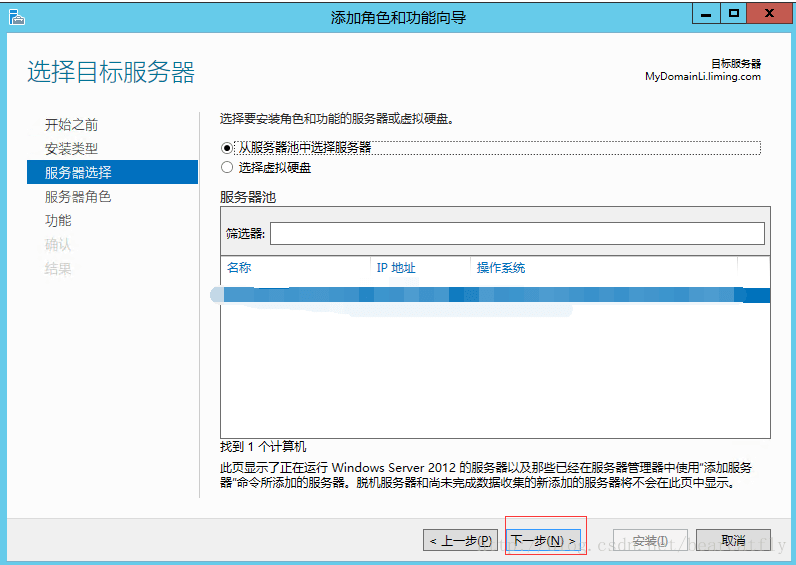
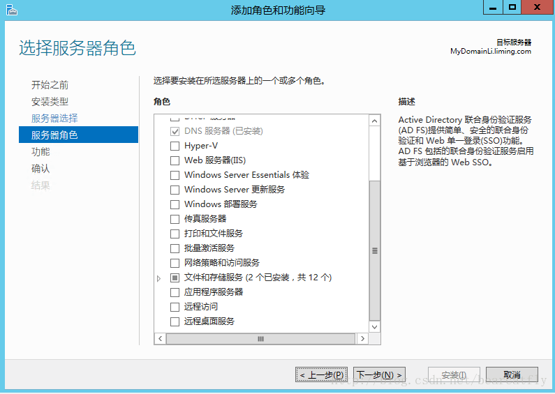
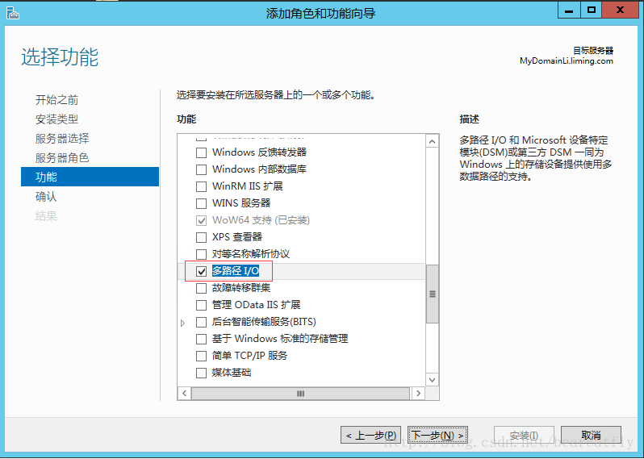
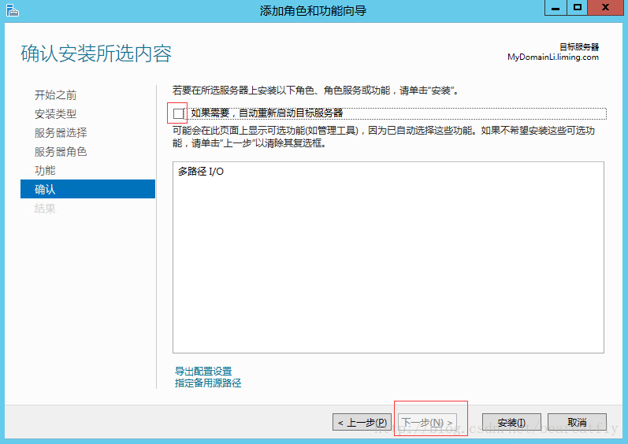
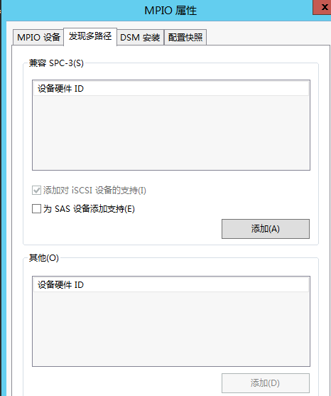

---
---

# 物理主机 + 共享存储（NeonSAN）功能用户指南

## 创建物理主机 

请参考：[物理主机](https://docs.qingcloud.com/product/computing/bm_instance)

## 创建 NeonSAN 硬盘

请参考： [企业级分布式 SAN (NeonSAN)](https://docs.qingcloud.com/product/storage/shared/vsan)

## 创建 VSAN，并将 NeoSAN 硬盘挂载到 VSAN 上

请参考：[Virtual SAN（vSAN）](https://docs.qingcloud.com/product/storage/shared/vsan)

## 主机端配置

### Windows 系统

多路径：

（1）以 Windows 2012 R2 版本为例（其他版本类似）。

1、	首先打开服务器管理器，选择"添加角色和功能"。



2、	点击“下一步”。



3、	点击“下一步”。



4、	点击“下一步”。



5、	点击“下一步”。



6、	重点：勾选“多路径 I/O” ，点击下一步。



7、	勾选“如果需要，自动重新启动目标服务器”，安装 MPIO 是需要重启的。然后点击安装。



8、	等待重启安装完成。 

9、	MPIO 设置 （服务器管理-工具-MPIO），MPIO 属性页面，单击发现多路径，勾选“增加对 iSCSI 设备的支持”。



（2）配置 Windows iSCSI 客户端，请参考文档 [Virtual SAN（vSAN）](https://docs.qingcloud.com/product/storage/shared/vsan)

> 注解：当创建的 VSAN 为多节点时， 点击程序的发现页面，然后点击『发现门户』，输入每个 VSAN 节点的 IP 。

### Linux 系统

（1）多路径：

 以 ubuntu16.04 为例：

- 启动 ubuntu16.04主机，安装 multipath：

```
apt-get install multipath-tools
```

- 关闭服务：

```
service multipath-tools stop
```

- 增加/修改配置
  修改 ```/etc/multipath.conf```

配置内容如下:

```
blacklist{
devnode "^vd"
}
defaults {
user_friendly_names yes
path_grouping_policy multibus
failback immediate
no_path_retry queue
}
devices {
device {
vendor "LIO-ORG"
path_selector "queue-length 0"
path_checker "tur"
hardware_handler "1 alua"
prio "alua"
prio_args "exclusive_pref_bit"
fast_io_fail_tmo 25
}
}

```

- 登录 iSCSI 目标

```
#!/bin/bash
mkdir -p /etc/multipath; touch /etc/multipath/wwids;
for IP in ip1 ip2 ip3(这里输入VSAN各节点IP地址); do
for IQN in `iscsiadm -m discovery -t st -p ${IP}:3260 | awk '{print $2}'`; do
iscsiadm -m node -T ${IQN} -p ${IP}:3260 -l
done
done
```

- 启动服务

```
service multipath-tools start
```

```multipath -ll```  可以看到 mpath 信息。

```ls /dev/mapper/```  可以看到对应的盘符. 后续可以格式化等操作，开始使用。

（2）配置 Linux iSCSI 客户端，请参考文档 [Virtual SAN（vSAN）](https://docs.qingcloud.com/product/storage/shared/vsan)
