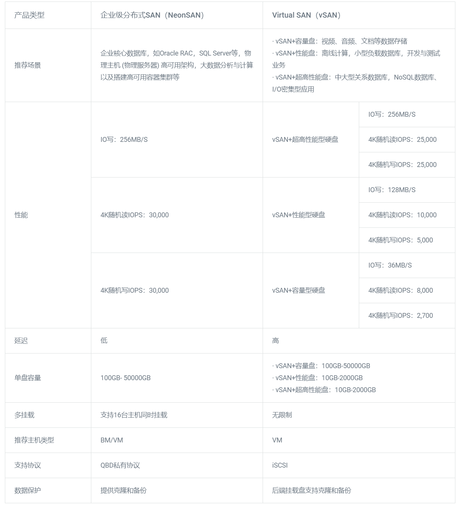

---
---

# 使用场景

## 企业级分布式 SAN（NeonSAN）

### 企业核心数据库

企业 OLTP 在线访问类业务，如财务、采购、生产、客户管理系统需应对大量用户频繁访问的场景，要求系统能快速响应；企业 OLAP 后台分析型业务，如经营与风险分析、销售与财务分析、生产与供应预测等要求系统具备高性能和高可用。NeonSAN 提供高性能、低延时、大容量的数据存储服务，充分满足 Oracle RAC、RadonDB 等核心数据库 OLTP/OLAP 的处理能力；同时，NeonSAN 的数据分片及多副本策略，确保核心数据库高可用。

推荐方案：Oracle RAC / MySQL Plus + NeonSAN

### 物理主机高可用架构

NeonSAN 可以实现存储和计算的分离，当物理主机发生故障时，备用物理主机可以立刻挂载同一数据卷继续工作，计算节点的任何变化都不会影响数据的可靠与安全性。同样的数据，可以在不同的物理主机之间共享，不受物理主机磁盘个数和容量的限制。NeonSAN 的高性能特性可以为物理主机提供近乎本地 SSD 同等水平的读写性能；此外，NeonSAN 的多副本数据强一致性，多路径自动切换功能都是搭建物理主机高可用架构的最佳之选。

推荐方案：物理主机 / 物理服务器 + NeonSAN

### 大数据分析和计算

大数据分析和计算往往对数据吞吐能力有着极高的要求，而大数据平台(如 HDFS)本身就带有数据冗余复制能力。NeonSAN 提供的灵活副本配置策略，可按卷自由选择 1~3 副本（私有云部署），让大数据平台获得极高的吞吐能力的同时，避免额外副本造成的空间浪费，有效降低大数据场景下的数据存储成本。

推荐方案：Hadoop / Spark / HBase + NeonSAN

### 高可用容器集群

以 Docker 为主流的容器和以 Kubernetes 为主流的容器应用编排与管理平台在企业 DevOps 持续交付流程、微服务架构中起到越来越重要的作用。大量的容器应用，如有状态的数据类应用都会需要 NeonSAN 提供的高性能、大容量盘服务；NeonSAN 提供的多主机/容器共享盘服务更为需要实现高可用特性的应用——包括高可用的 Kubernetes 集群自身，都提供了良好的基础。

推荐方案：虚拟主机 / 物理主机 + Kubernetes + NeonSAN

##  Virtual SAN（vSAN）

### 共享文件系统

对于需要部署共享文件系统 (如：OCFS、Redhat GFS) 的业务，QingCloud 通过 Virtual SAN 更好地满足您的各种需求。

### 数据库高可用

对于 Oracle RAC 和 Microsoft SQL Server 集群等需要共享存储的大型分布式数据库，您可以通过 Virtual SAN 轻松部署，并且通过 QingCloud 的 VPC 和分布式防火墙可以对数据库进行安全的保护。同时，通过应用市场的数据库审计产品，您可以实现云上核心数据访问状态的可视化、可控化，提供智能化报告。

## 使用场景推荐

