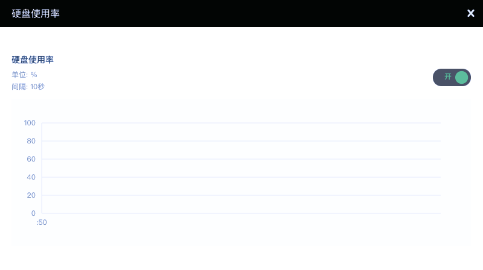
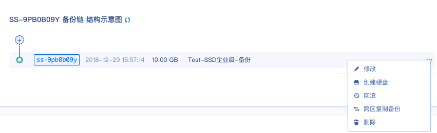
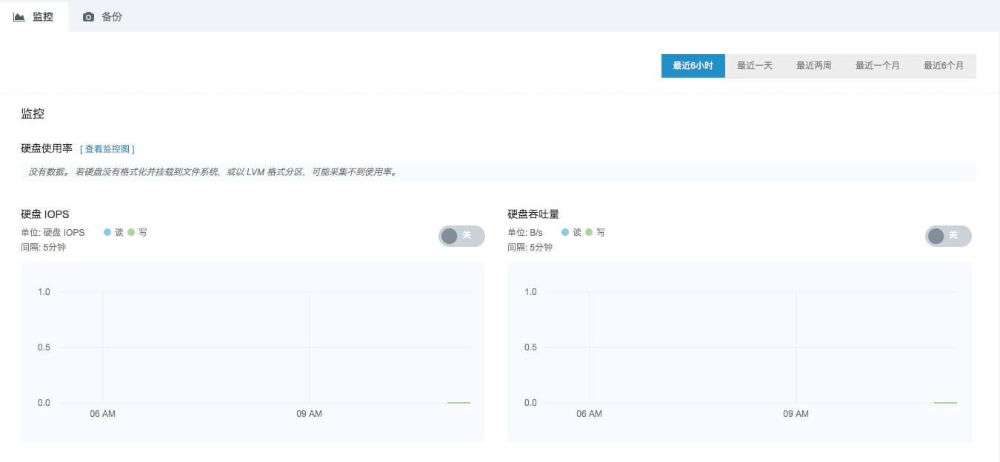

---
---

# 监控配置

## 基础型硬盘

在基础型硬盘挂载到主机时，可以点击硬盘题目，查看监控情况，界面如下。

在硬盘 IOPS 和硬盘吞吐量打开时，可以看到硬盘 IOPS 和硬盘吞吐量数据展示。还可以点击硬盘使用率右侧的 **查看监控图** 来查看硬盘使用率。

## SSD 企业型硬盘

在超高性能型硬盘挂载到主机时，可以点击硬盘条目，查看监控情况，界面如下。

在硬盘 IOPS 和硬盘吞吐量打开时，可以看到硬盘 IOPS 和硬盘吞吐量数据展示。还可以点击硬盘使用率右侧的 查看监控图来查看硬盘使用率。

## 企业级分布式 SAN (NeonSAN)

在企业级分布式 SAN (NeonSAN) 挂载到主机时，可以点击条目，查看监控情况，界面如下

在硬盘IOPS和硬盘吞吐量打开时，可以看到硬盘IOPS和硬盘吞吐量数据展示。还可以点击硬盘使用率右侧的 **查看监控图** 来查看硬盘使用率。

## 容量型硬盘

在容量硬盘挂载到主机时，可以点击硬盘题目，查看监控情况，界面如下

在硬盘IOPS和硬盘吞吐量打开时，可以看到硬盘IOPS和硬盘吞吐量数据展示。还可以点击硬盘使用率右侧的 **查看监控图** 来查看硬盘使用率。