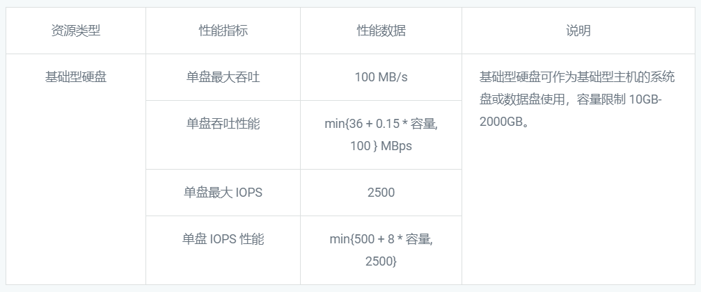
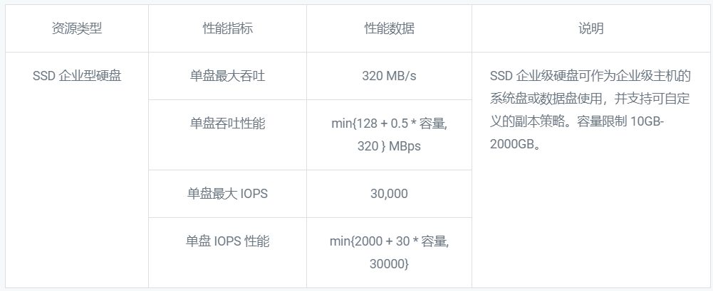
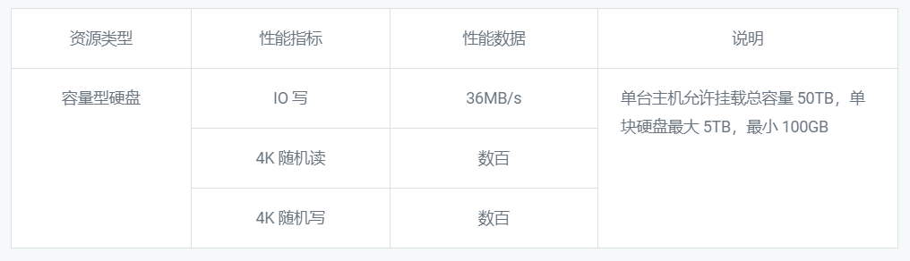
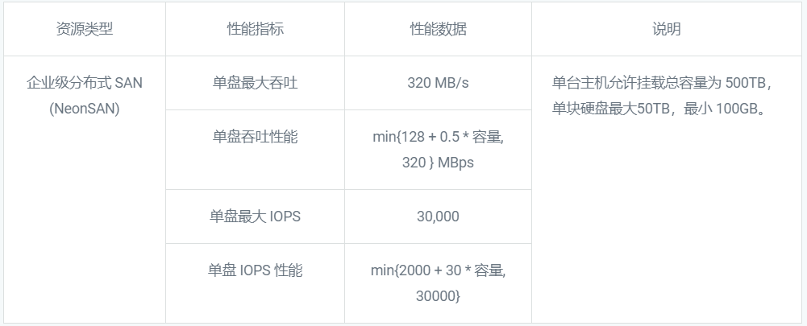

---
---

# 产品类型

QingCloud 提供多种类型的块存储：基础型硬盘、SSD 企业级硬盘、容量型硬盘和企业级分布式 SAN (NeonSAN)，为不同类型和要求的业务提供完整的存储服务，满足企业对存储系统的复杂要求。

## 基础型

基础型硬盘提供均衡的价格与性能，单块硬盘容量最高 2TB， I/O 吞吐性能最高可达 100 MB/s ，IOPS 最高 2500，适用于数据不被高频访问、低 I/O 负载要求的应用，例如多媒体业务、大数据离线分析、数据仓库、日志处理等业务。

## SSD 企业型

SSD 企业级硬盘采用全闪存架构，相对于基础型硬盘，SSD 企业级硬盘的随机读写能力和顺序读写能力都得到了显著提升。单块硬盘容量最高 2TB， IO 吞吐性能最高可达 320 MB/s，IOPS 最高 30000，适用于对 IOPS 和吞吐要求很高的服务，例如：数据库服务、大数据服务以及其它关键性服务。

## 容量型

容量型硬盘支持更大的单块硬盘容积，最高可达5TB，适用于对容量要求较高的应用，例如视频、音频、文档等离线业务。

## 企业级分布式 SAN (NeonSAN)

企业级分布式 SAN (NeonSAN) 是基于全闪存架构提供的分布式 SAN 服务，与超高性能型硬盘相比，单盘存储量更大，最大可达到50TB。适用于对 IOPS、吞吐、容量和稳定性要求很高的业务，例如：企业核心数据库 Oracle RAC 、 SQL Server 故障转移集群、企业级分布式数据库 RadonDB、物理主机高可用架构、大数据分析计算，以及搭建高可用容器集群等。

