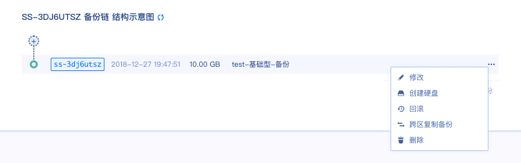

---
---

# 备份配置

## 备份基础型硬盘

左键点击基础型硬盘条目，进入如下界面。

鼠标右键点击备份链 ID，跳出如下界面。

**修改备份名称或描述**

点击 **修改**，跳出如下界面。

在名称填入要修改名称，在描述框里输入新的描述，点击 **提交**。

**基于备份新建硬盘**

点击 **创建硬盘**，跳出如下界面。

在名称框里填入新硬盘的名称，选择副本策略，点解 **提交**，可以硬盘首页看到如下界面。

当新建硬盘的状态显示为“可用”时，表示新硬盘已经创建成功。

**共享备份**

点击 **共享备份**，跳出如下界面。

可以选择共享给子账号还是共享给其他账号，选择要共享给的子账号或填写要给共享的其他用户 ID / 注册邮箱地址，点击 **提交**。鼠标右键双击备份链接入备份属性修改界面，可以看到共享列表，里面有已经添加成功的共享账号列表。

**跨区复制备份**

点击 **跨区复制备份**，跳出如下界面。

选择要复制到区域，点击 **提交**。

### 备份属性修改

鼠标左键双击备份链条目，或者在备份链条目下面，可以看到备份链结构示意图，假如双击备份链条目，进入如下界面。

鼠标左键点击备份链右侧的 **···** ，可以选择对备份链的修改、创建硬盘、回滚和删除，如下图。

## 备份SSD 企业型硬盘

左键点击 **SSD** 企业级硬盘条目，进入如下界面。

鼠标右键点击备份链 ID，跳出如下界面。

**修改备份名称或描述**

点击 **修改**，跳出如下界面。

在名称填入要修改成的名称，在描述框里输入新的描述，点击 **提交**。

**基于备份新建硬盘**

点击 **创建硬盘**，跳出如下界面。

在名称框里填入新硬盘的名称，选择副本策略，点解 **提交**，可以硬盘首页看到如何界面

当新建硬盘的状态显示为“可用”时，表示新硬盘已经创建成功。

**共享备份**

点击 **共享备份**，跳出如下界面。

可以选择共享给子账号还是共享给其他账号，选择要共享给的子账号或填写要给共享的其他用户 ID / 注册邮箱地址，点击 **提交**。鼠标右键双击备份链接入备份属性修改界面，可以看到共享列表，里面有已经添加成功的共享账号列表。

**跨区复制备份**

点击 **跨区复制备份**，跳出如下界面。

选择要复制到区域，点击 **提交**。

### 备份属性修改

鼠标左键双击备份链条目，或者在备份链条目下面，可以看到备份链结构示意图，假如双击备份链条目，进入如下界面。

鼠标左键点击备份链右侧的 **···** ，可以选择对备份链的修改、创建硬盘、回滚和删除，如下图所示。

## 备份企业级分布式 SAN (NeonSAN)

左键点击企业级分布式 SAN (NeonSAN)条目，进入如下界面

鼠标右键点击备份链ID，跳出如下界面

**修改备份名称或描述**

点击 **修改** ，跳出如下界面

在名称填入要修改成的名称，在描述框里输入新的描述，点击 **提交** 。

**基于备份新建硬盘**

点击 **创建硬盘** ，跳出如下界面

在名称框里填入新硬盘的名称，点解 **提交** ，可以硬盘首页看到

当新建硬盘的状态显示为“可用”时，表示新硬盘已经创建成功。

**共享备份**

点击 **共享备份** ，跳出如下界面

可以选择共享给子账号还是共享给其他账号，选择要共享给的子账号或填写要给共享的其他用户ID/注册邮箱地址，点击 **提交** 。鼠标右键双击备份链接入备份属性修改界面，可以看到共享列表，里面有已经添加成功的共享账号列表。

**跨区复制备份**

点击 **跨区复制备份** ，跳出如下界面

选择要复制到区域，点击 **提交** 。

### 备份属性修改

鼠标左键双击备份链条目，或者在备份链条目下面，可以看到备份链结构示意图，假如双击备份链条目，进入如下界面

鼠标左键点击备份链右侧的 **...** ，可以选择对备份链的修改、创建硬盘、回滚和删除，界面如下

## 备份容量型硬盘

左键点击性能型硬盘条目，进入如下界面

鼠标右键点击备份链ID，跳出如下界面

**修改备份名称或描述**

点击 **修改** ，跳出如下界面

在名称填入要修改成的名称，在描述框里输入新的描述，点击 **提交** 。

**基于备份新建硬盘**

点击 **创建硬盘** ，跳出如下界面

在名称框里填入新硬盘的名称，点解 **提交** ，可以在硬盘首页看到，界面如下

当新建硬盘的状态显示为“可用”时，表示新硬盘已经创建成功。

**共享备份**

点击 **共享备份** ，跳出如下界面

可以选择共享给子账号还是共享给其他账号，选择要共享给的子账号或填写要给共享的其他用户ID/注册邮箱地址，点击 **提交** 。鼠标右键双击备份链接入备份属性修改界面，可以看到共享列表，里面有已经添加成功的共享账号列表。

**跨区复制备份**

点击 **跨区复制备份** ，跳出如下界面

选择要复制到区域，点击 **提交** 。

### 备份属性修改

鼠标左键双击备份链条目，或者在备份链条目下面，可以看到备份链结构示意图，假如双击备份链条目，进入如下界面

鼠标左键点击备份链右侧的 **...** ，可以选择对备份链的修改、创建硬盘、回滚和删除，如下图

