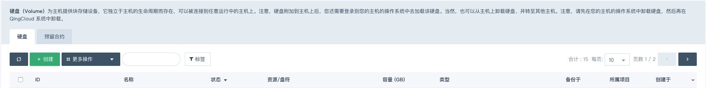
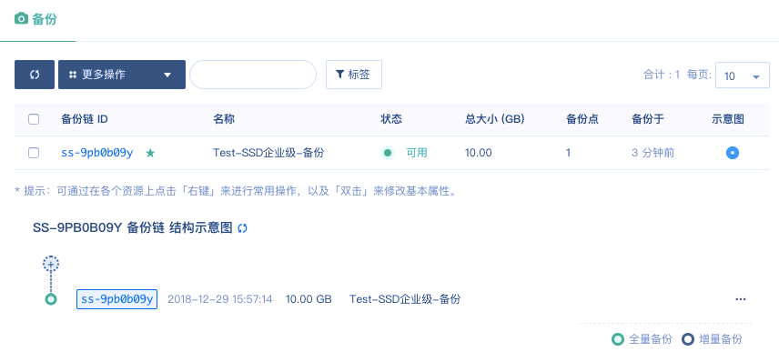
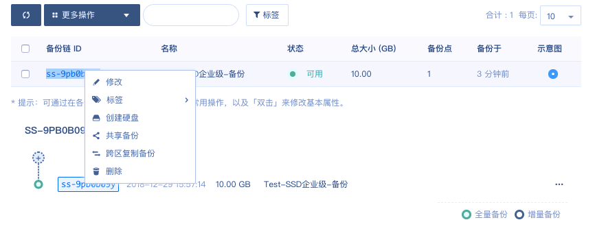
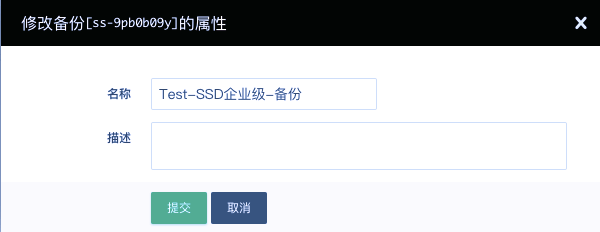
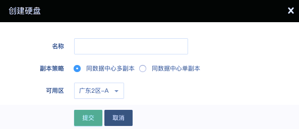
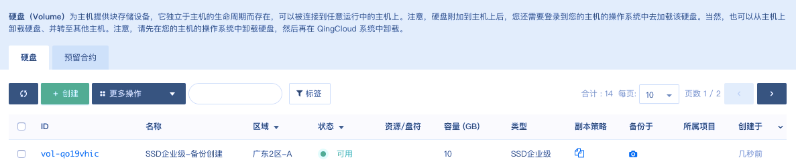
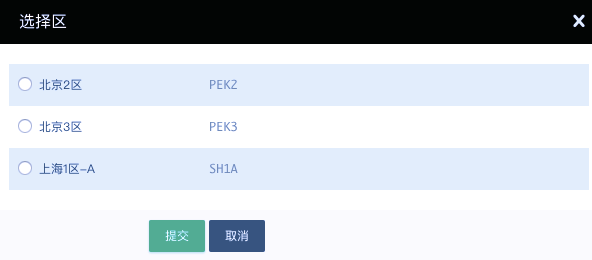

---
---

# 创建存储

## 创建并配置基础型硬盘

### 第一步：创建基础型硬盘

点击 **存储** 中的 **硬盘** 进入如下界面。

点击 **创建** 跳出如下界面。

在名称框里输入创建的硬盘名称，在数量框里输入需要创建的硬盘数量，在类型中选择基础型，拖动滑动按钮选择容量大小，或者在右边的输入框中输入容量大小，副本策略可选择同数据中心多副本，或同数据中心单副本，点击 **提交** ，进入如下界面。

 

当状态显示为“可用”时，表示创建成功。

> 注解：
>
> IOPS 范围参考：500 – 2500
>
> 单盘 IOPS 计算公式： min{500 + 8 * 容量, 2500}
>
> IO 吞吐范围参考：36 MB/s - 100MB/s
>
> 单盘 IO 吞吐计算公式：min{36 + 0.15 * 容量, 100 } MBps

### 第二步：配置服务

鼠标右键点击硬盘条目，或选中硬盘条目鼠标左键点击更多操作，跳出如下界面。

	

**加载基础型硬盘到主机**

点击 加载硬盘到主机，跳出如下界面。

选择需要加载该基础型硬盘的主机，点击 **提交**，即可挂载到指定主机。

> 注解：基础型硬盘为非共享型硬盘，不可以同时挂载到多台主机。还可以从主机页面，鼠标右键点击主机条目，来选择 硬盘，进行硬盘加载，界面如下。

**修改基础型硬盘名称或属性**

点击 **修改**，跳出如下界面。

可以修改基础型硬盘的属性，包括名称和描述，然后点击 **修改**。

**克隆基础型硬盘**

点击 **克隆硬盘**，跳出如下界面。

在名称框填入名称，写入拷贝数量，类型选择基础型或 SSD 企业型，点击 **提交**，进入如下界面。

	
当状态显示为“可用”时，表示克隆成功。

**扩容**

点击 **扩容**，跳出如下界面。

**备份**

点击 **备份**，跳出如下界面。

点击 **继续**，进入如下界面。

在名称框里填入名称，有需要的选择创建新备份链，点击 **提交**。

在备份列表内，可以看到状态显示为“可用”，表示备份已经创建成功。

**标签**

点击 **标签**，为已经创建的基础型硬盘绑定标签，跳出如下界面.

如果没有标签或已有标签不适用，可以选择 **创建标签**，或者进行标签管理。选择标签，点击 **提交**，进入如下界面。

**添加到资源组**

点击 **添加到资源组**，选择需要添加到的资源组，点击 **提交**。

## 创建并配置SSD 企业型硬盘

### 第一步：创建 SSD 企业级硬盘

点击 **存储** 中的 **硬盘**，进入如下界面。

点击 **创建** 跳出如下界面。

 

在名称框里输入创建的硬盘名称，在数量框里输入需要创建的硬盘数量，在类型中选择 **SSD企业级**，拖动滑动按钮选择容量大小，或者在右边的输入框中输入容量大小，副本策略可选择同数据中心多副本，或同数据中心单副本，点击 **提交**，进入如下界面。

当状态显示为“可用”时，表示创建成功。

> 注解：
>
> IOPS 范围参考：2000 – 30000
>
> 单盘 IOPS 计算公式： min{2000 + 30 * 容量, 30000}
>
> IO 吞吐范围参考：128MB/s - 320 MB/s
>
> 单盘 IO 吞吐计算公式：min{128 + 0.5 * 容量, 320 } MBps

### 第二步：配置服务

鼠标右键点击硬盘条目，或选中硬盘条目鼠标左键点击更多操作，跳出如下界面。

**加载 SSD 企业级硬盘到主机**

点击 **加载硬盘到主机**，跳出如下界面。

选择需要加载该 SSD 企业级硬盘的主机，点击 **提交**，即可挂载到指定主机。

> 注解：**SSD** 企业硬盘为非共享型硬盘，不可以同时挂载到多台主机。

还可以从主机页面，鼠标右键点击主机条目，来选择 **硬盘**，进行硬盘加载，界面如下：

**修改 SSD 企业级硬盘名称或属性**

点击 **修改**，跳出如下界面。

可以修改 **SSD** 企业级硬盘的属性，包括名称和描述，然后点击 **修改**。

**克隆 SSD 企业级硬盘**

点击 **克隆硬盘**，跳出如下界面。

在名称框填入名称，写入拷贝数量，类型选择基础型或 SSD 企业级，点击 **提交**，进入如下界面。

当状态显示为“可用”时，表示克隆成功。

**扩容**

点击 **扩容**，跳出如下界面。

**备份**

点击 **备份**，跳出如下界面。

点击 **继续**，进入如下界面。

在名称框里填入名称，有需要的选择创建新备份链，点击 **提交**。可以左键点击 **SSD** 企业级硬盘条目，进入如下界面。

可以看到状态显示为“可用”，表示备份已经创建成功。

**标签**

点击 **标签**，为已经创建的 SSD 企业级硬盘绑定标签，跳出如下界面。

如果没有标签或已有标签不适用，可以选择 **创建标签**，或者进行 **标签管理**。选择标签，点击 **提交**，进入如下界面。

**添加到资源组**

点击 **添加到资源组**，选择需要添加到的资源组，点击 **提交**。

**备份配置**

左键点击 **SSD** 企业级硬盘条目，进入如下界面。

鼠标右键点击备份链 ID，跳出如下界面。

**修改备份名称或描述**

点击 **修改**，跳出如下界面。

在名称填入要修改成的名称，在描述框里输入新的描述，点击 **提交**。

**基于备份新建硬盘**

点击 **创建硬盘**，跳出如下界面。

在名称框里填入新硬盘的名称，选择副本策略，点解 **提交**，可以硬盘首页看到如何界面

当新建硬盘的状态显示为“可用”时，表示新硬盘已经创建成功。

**共享备份**

点击 **共享备份**，跳出如下界面。

可以选择共享给子账号还是共享给其他账号，选择要共享给的子账号或填写要给共享的其他用户 ID / 注册邮箱地址，点击 **提交**。鼠标右键双击备份链接入备份属性修改界面，可以看到共享列表，里面有已经添加成功的共享账号列表。

**跨区复制备份**

点击 **跨区复制备份**，跳出如下界面。

选择要复制到区域，点击 **提交**。

## 创建并配置企业级分布式 SAN (NeonSAN)

### 第一步：创建加载企业级分布式 SAN (NeonSAN)

点击 **存储** 中的 **硬盘** 进入如下界面

点击 **创建** 跳出如下界面

在名称框里输入创建的硬盘名称，在数量框里输入需要创建的硬盘数量，在类型中选择超高性能容量型，拖动滑动按钮选择容量大小，或者在右边的输入框中输入容量大小，副本策略可选择2-3，点击 **提交** ，进入如下界面

当状态显示为“可用”时，表示创建成功。

> 注解：IO 吞吐 256 MB/s; 单块最小容量 100 GB、最大容量 50 TB，容量可选最小粒度为 100 GB

### 第二步：配置服务

鼠标右键点击硬盘条目，或选中硬盘条目鼠标左键点击更多操作，跳出如下界面

**加载企业级分布式 SAN (NeonSAN) 到主机**

点击 **加载硬盘到主机** ，跳出如下界面

选择需要加载该企业级分布式 SAN (NeonSAN) 的主机，点击 **提交**，即可挂载到指定主机。

> 注解：企业级分布式 SAN (NeonSAN)为共享型，可以同时挂载到多台主机

还可以从主机页面，鼠标右键点击主机条目，来选择 **硬盘**，进行硬盘加载，界面如下

**修改企业级分布式 SAN (NeonSAN) 名称或属性**

点击 **修改**，跳出如下界面

可以修改企业级分布式 SAN (NeonSAN) 的属性，包括名称和描述，然后点击 **修改** 。

**克隆企业级分布式 SAN (NeonSAN)**

点击 **克隆硬盘** ，跳出如下界面

在名称框填入名称，写入拷贝数量，类型选择企业级分布式 SAN (NeonSAN) ，点击 **提交** ，进入如下界面

当状态显示为“可用”时，表示克隆成功。

**扩容**

点击 **扩容** ，跳出如下界面

**备份**

点击 **备份** ，跳出如下界面

点击 **继续** ，进入如下界面

在名称框里填入名称，有需要的选择创建新备份链，点击 **提交** 。可以左键点击企业级分布式 SAN (NeonSAN) 条目，进入如下界面

可以看到状态显示为“可用”，表示备份已经创建成功。

**标签**

点击 **标签** ，为已经创建的企业级分布式 SAN (NeonSAN) 绑定标签，跳出如下界面

如果没有标签或已有标签不适用，可以选择 **创建标签** ，或者进行 **标签管理** 。选择标签，点击 **提交** ，进入如下界面

**添加到资源组**

点击 **添加到资源组** ，选择需要添加到的资源组，点击 **提交** 。

## 创建并配置容量型硬盘

### 第一步：创建容量型硬盘

点击 **存储** 中的 **硬盘** 进入如下界面

点击 **创建** 跳出如下界面

在名称框里输入创建的硬盘名称，在数量框里输入需要创建的硬盘数量，在类型中选择容量型，拖动滑动按钮选择容量大小，或者在右边的输入框中输入容量大小，点击 **提交** ，进入如下界面

当状态显示为“可用”时，表示创建成功。

> 注解：IO 吞吐 36 MB/s; 单块最小容量 100 GB、最大容量 5 TB，容量可选最小粒度为 100 GB

### 第二步：配置服务

鼠标右键点击硬盘条目，或选中硬盘条目鼠标左键点击更多操作，跳出如下界面

**加载容量型硬盘到主机**

点击 **加载硬盘到主机** ，跳出如下界面

选择需要加载该容量型硬盘的主机，点击 **提交**，即可挂载到指定主机。当硬盘条目状态显示为“使用中”时，表示已经挂载成功。

> 注解：容量型硬盘为共享型硬盘，可以同时挂载到多台主机，如果您把一块容量盘绑定到多个主机上, 请确保使用集群文件系统，例如OCFS2, 否则磁盘可能会损坏

还可以从主机页面，鼠标右键点击主机条目，来选择 **硬盘**，进行硬盘加载，界面如下

**修改容量型硬盘名称或属性**

点击 **修改**，跳出如下界面

可以修改容量型硬盘的属性，包括名称和描述，然后点击 **修改** 。

**克隆容量型硬盘**

点击 **克隆硬盘** ，跳出如下界面

在名称框填入名称，写入拷贝数量，类型选择容量型，点击 **提交** ，进入如下界面

当状态显示为“可用”时，表示克隆成功。

**扩容**

点击 **扩容** ，跳出如下界面

**备份**

点击 **备份** ，跳出如下界面

点击 **继续** ，进入如下界面

在名称框里填入名称，有需要地选择创建新备份链，点击 **提交** 。可以左键点击容量型硬盘条目，进入如下界面

可以看到状态显示为“可用”，表示备份已经创建成功。

**标签**

点击 **标签** ，为已经创建的容量型硬盘绑定标签，跳出如下界面

如果没有标签或已有标签不适用，可以选择 **创建标签** ，或者进行 **标签管理** 。选择标签，点击 **提交** ，进入如下界面

**添加到资源组**

点击 **添加到资源组** ，选择需要添加到的资源组，点击 **提交** 。