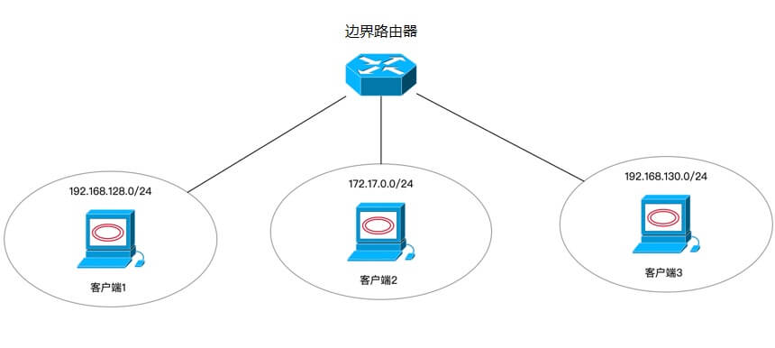
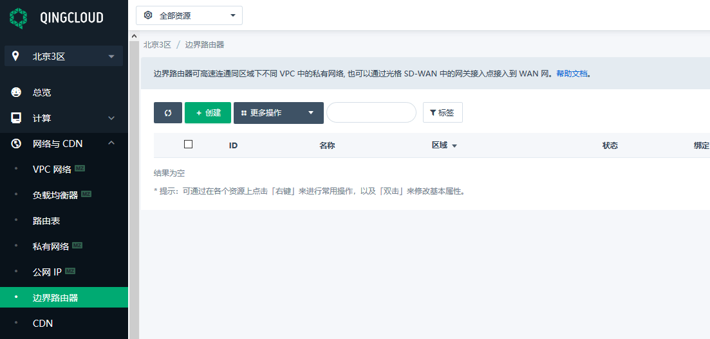
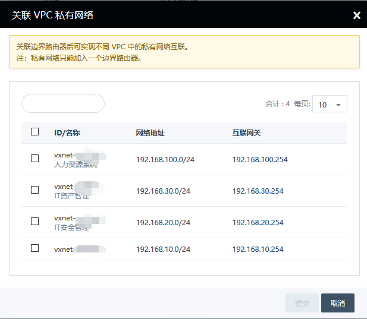
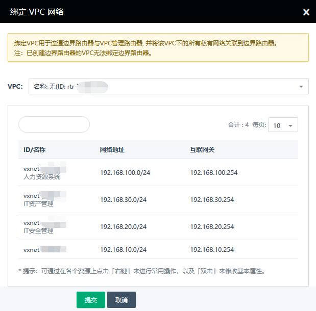
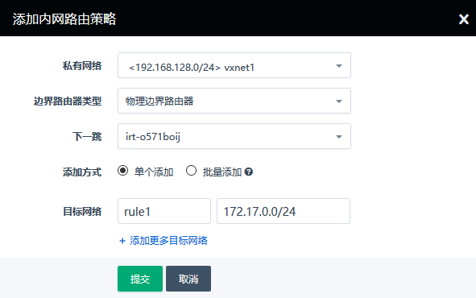
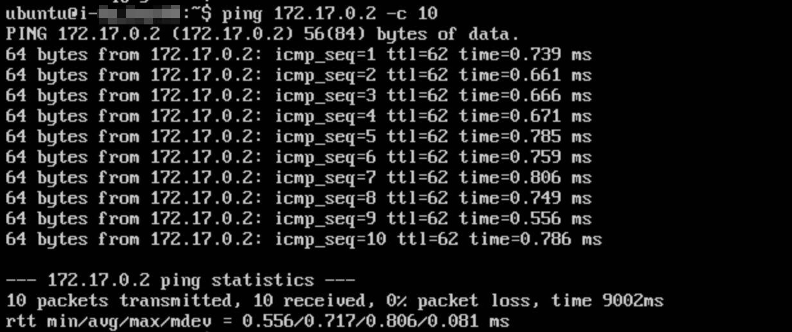
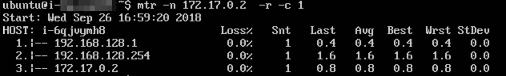
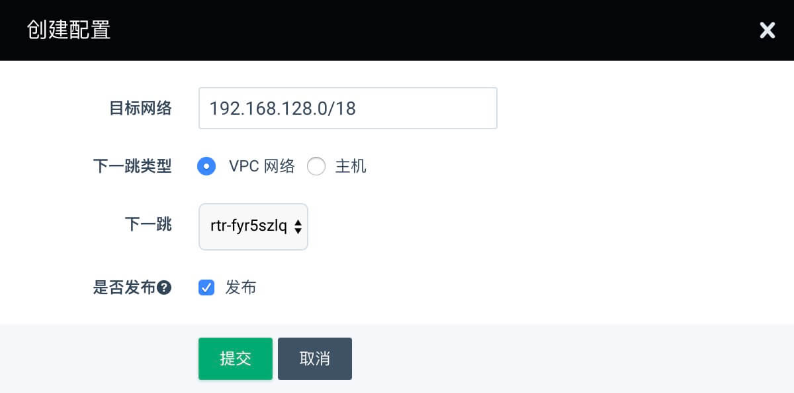

---
---

# 边界路由器

边界路由器是用于连接不同网络的路由器，青云的边界路由器可以连接多种不同的网络场景：第一种，可以连接不同 VPC 内部的虚拟私有网络；第二种，可以连接虚拟私有网络和物理网络；第三种，可以连接 VPC 与专线或者 SD-WAN。

场景一：连接不同 VPC 内部的虚拟私有网络，实现更大规模的主机组网，和更高的网络性能。此前最常用的方式是通过隧道来打通不同的VPC，边界路由器可以避免隧道带来的种种弊端，比如隧道必须消耗公网流量费用，带宽受限等等。

场景二：连接虚拟私有网络和物理网络，实现虚拟机和物理机混合组网，例如 Oracle 数据库或者 SAP 更希望在 BM 主机中运行，与 Web Server所在的虚拟主机混合组网。

场景三：连接虚拟私有网络和 SD-WAN，实现青云公有云与用户私有部署环境的直联，服务之间的调用与纯内网访问完全一致，仿佛用户有了一套企业专用的网络。


如下图所示, 客户端 1 在私有网络 192.168.128.0/24 中, 客户端 2 在私有网络 172.17.0.0/24 中, 客户端 3 在私有网络 192.168.130.0/24 中。
通过以下步骤即可实现客户端 1 与客户端 2 , 3 互联。

1. 创建边界路由器。
2. 关联边界路由器: 将客户端 1 和客户端 2 所在的私有网络关联到边界路由器, 将客户端 3 所在的VPC关联到边界路由器。
3. 配置边界路由器策略: 为客户端 1 , 2 , 3 所在的私有网络添加边界路由器策略。

[](../network/_images/intranet_router_topology.jpg)

## 创建边界路由器

在"网络与 CDN"下的"边界路由器"页面中, 点击"创建"即可创建边界路由器。

[](../network/_images/intranet_router.png)

## 关联边界路由器

在边界路由器详情页, 点击"关联 VPC 私有网络", 以选择需要关联的私有网络。

[](../network/_images/intranet_router_detail.png)

勾选客户端 1 和客户端 2 所在的私有网络, 将其关联到边界路由器。

[](../network/_images/intranet_router_vxnet.png)

```
注意：边界路由器 IP 不能与私有网络中已使用的 IP 冲突。
```

在边界路由器详情页, 点击"绑定 VPC 网络", 选择客户端 3 所在的VPC。

[](../network/_images/intranet_router_vpc_detail.jpg)

## 配置内网路由策略

私有网络关联到边界路由器后, 点击"路由设置", 可进入到内网路由策略配置页面。

[](../network/_images/intranet_router_detail_vxnet.png)

在内网路由策略配置页面, 填写规则名称, 设置目标网络, 点击提交。
对于本示例, 需要添加三次内网路由策略: 一是为客户端 1 所在私有网络添加目标网络为 172.17.0.0/24 和目标网络为 192.168.130.0/24 的内网路由, 二是为客户端 2 所在私有网络添加目标网络为 192.168.128.0/24 的内网路由, 三是为客户端 3 所在的私有网络添加目标网络为 192.168.128.0/24 的内网路由

[](../network/_images/intranet_router_route.png)

```
注意：设置好内网路由策略后,需要点击 VPC 的"应用修改＂以生效
```

## 测试

在客户端 1 执行 ping 命令, 可以 ping 通客户端 2。

[](../network/_images/intranet_router_ping.png)

在客户端 1 执行 mtr 命令, 可以发现数据包经过边界路由器转发到客户端 2。

[](../network/_images/intranet_router_mtr.png)

在客户端 1 执行 ping 命令, 可以 ping 通客户端 3。

[](../network/_images/intranet_router_ping2.jpg)

在客户端 1 执行 mtr 命令, 可以发现数据包经过边界路由器转发到客户端 3。

[](../network/_images/intranet_router_mtr2.jpg)

## 配置边界路由器静态路由

在边界路由详情页,点击“路由设置”中的添加路由，可以进入静态路由配置页面。

[](../network/_images/intranet_router_static_route.jpg)

```
注意：设置好内网路由策略后,需要点击"应用修改＂以生效
注意：边界路由器静态静态路由个数默认最大额度为10
```

边界路由器静态路由应用场景可见[专线经 VPC 访问公网](../sd_wan/quick_start/line_connect_eip.html)
和[光盒经 VPC 访问第三方网络](../sd_wan/quick_start/cpe_connect_tunnel.html)

