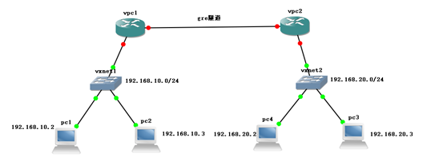
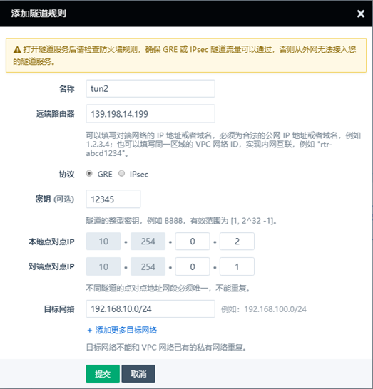
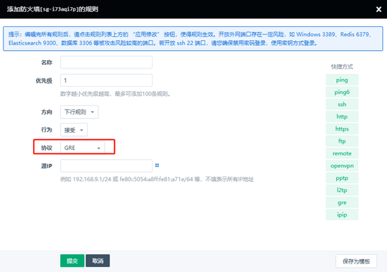
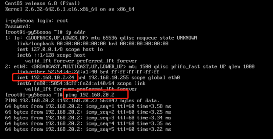
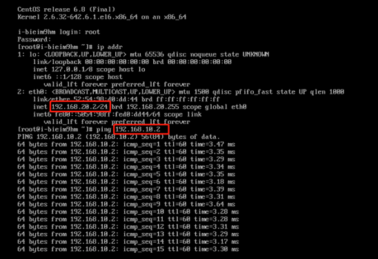

---
---

# GRE 隧道

如下图所示，假设您在青云pek3使用的路由器是 vpc1，绑定的公网ip是，pek3a使用的路由器是vpc2，绑定的公网ip是，这两个路由器背后各连接有两个私有网络，它们将通过 GRE 隧道连接在一起，使pc1、pc2、pc3、pc4都可以通过内网互通

**vpc1基本信息**                                                          

公网ip:139.198.14.199

资源id:rtr-2803sfzh

子网：192.168.10.0/24

区域：pek3

**vpc2基本信息**

公网ip:139.198.12.195

资源id:rtr-xxqqwifd

子网：192.168.20.0/24

区域:pek3a

## 1. 在青云控制台pek3中的操作

登录 WEB 控制台---网络与CDN---vpc网络---详情界面---配置管理---隧道服务---添加隧道规则

在弹出的对话框里，填写以下项目:

- 协议: 默认为 GRE 协议

- 名称: 为该隧道起个名字，比如 tun1

-  远端路由器 IP: vpc2的公网 IP 139.198.12.195

- 密钥: 一个两端共同使用的约定整型数字，比如 12345，有效范围为 [1, 2^32 -1]

- 本地点对点 IP: 隧道在vpc1这边的地址，比如 10.254.0.1

- 对端点对点 IP: 隧道在成品vpc2这边的地址，比如 10.254.0.2

- 目标网络: 在本例中为vpc2的私有网络 192.168.20.0/24

## 2. 在青云控制台pek3a中的操作

登录 WEB 控制台---网络与CDN---vpc网络---详情界面---配置管理---隧道服务---添加隧道规则

在弹出的对话框里，填写以下项目:

- 协议: 默认为 GRE 协议

- 名称: 为该隧道起个名字，比如 tun2

- 远端路由器 IP: vpc2的公网 IP 139.198.14.199

- 密钥: 一个两端共同使用的约定整型数字，比如 12345，有效范围为 [1, 2^32 -1]

- 本地点对点 IP: 隧道在vpc2这边的地址，比如 10.254.0.2

- 对端点对点 IP: 隧道在成品vpc1这边的地址，比如 10.254.0.1

- 目标网络: 在本例中为vpc1的私有网络 192.168.10.0/24

## 3. 隧道两边vpc网络的防火墙均放行下行gre协议，并应用修改防火墙

## 4. 测试连通性，使用192.168.10.2主机去ping一下192.168.20.2这个主机，结果如图

## 5. 测试连通性，使用192.168.20.2主机去ping一下192.168.10.2这个主机，结果如图

