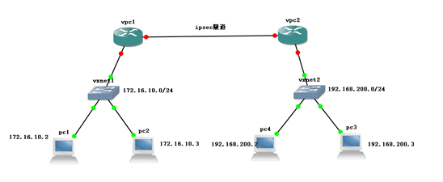
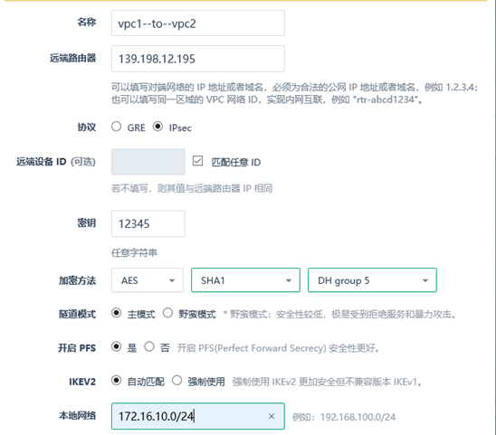
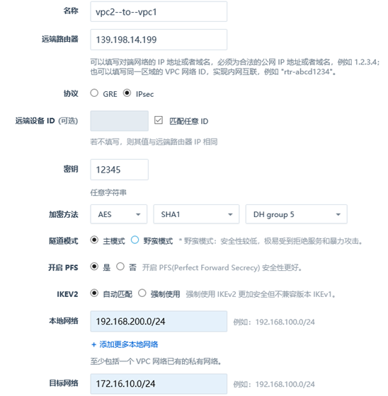
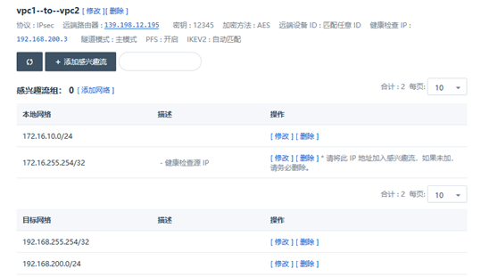
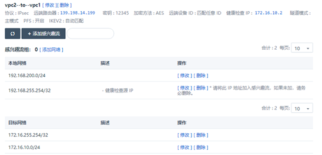
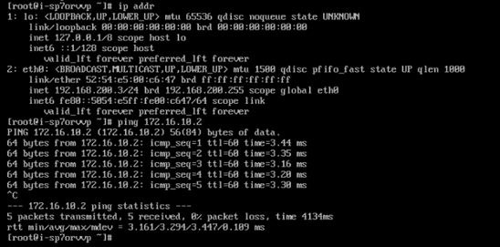
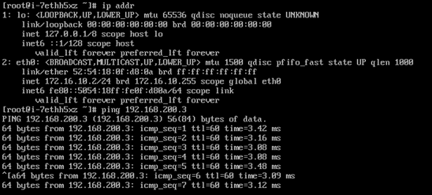

---
---

# IPsec 隧道

**1. 需求背景**

如下图所示，假设您在青云pek3使用的路由器是 vpc1，绑定的公网ip是，pek3a使用的路由器是vpc2，绑定的公网ip是，这两个路由器背后各连接有两个私有网络，它们将通过ipsec 隧道连接在一起，使pc1、pc2、pc3、pc4都可以通过内网互通

**2. vpc1基本信息**                                               

公网ip:139.198.14.199

资源id:rtr-2803sfzh

子网：172.16.10.0/24

区域：pek3  

**3. vpc2基本信息**

公网ip:139.198.12.195

资源id:rtr-xxqqwifd

子网：192.168.200.0/24

区域:pek3a

**4、隧道参数配置说明**

* **名称**：IPsec连接的名称，比如pek3---to---pek3a
* **协议：**选择ipsec协议
* **远端设备ID：**作为用户网关的标识，用于第一阶段的协商。若不填写，则其值与远端路由器 IP 相同，如果需要手动填写，需设置为FQDN格式，如@xxxxxxx
* **远端路由器**：可以填写对端网络的 IP 地址或者域名，必须为合法的公网 IP 地址或者域名，例如 1.2.3.4；也可以填写同一区域的 VPC 网络 ID，实现内网互联，例如 "rtr-abcd1234"。
* **秘钥**：用于隧道两端之间的身份认证，需要手动指定密钥，不能为空
* **加密方法：**选择第一阶段协商使用的的加密算法，目前支持aes、3des两种。
* **认证算法：**第一阶段协商使用的认证算法。支持sha1和md5。
* **DH分组：**选择第一阶段协商的Diffie-Hellman密钥交换算法。
* **隧道模式：**
  * 主模式（main）：协商过程安全性高。

  * 野蛮模式（aggressive）：协商快速且协商成功率高。

* **PFS：**（Perfect Forward Secrecy，完善的前向安全性）特性是一种安全特性，指一个密钥被破解，并不影响其他密钥的安全性，因为这些密钥间没有派生关系。开启 PFS安全性更好
* **IKEV版本**：目前支持IKE V1和IKE V2，强制使用 IKEv2 更加安全但不兼容版本 IKEv1
* **本端网络：**与本地vpc连接的私有网络，如图中的172.16.0.0/24。
* **目标网段：**远端vpc连接的私有网络，如图中的192.168.200.0/24，可以填写多个网段。
* **健康检查IP：**用于健康检查的目标地址，必须处于目标网络中且可以 ping 通，也可以同时添加 ip 和端口，例如 192.168.200.2 ；目标地址可以添加多个，也可以为空。
* **健康检查源ip**:本地自动生成的一个地址，如192.168.255.254/32，请将此 IP 地址加入感兴趣流，如果未加，请务必删除。
* **SA生存周期（秒）**设置第二阶段协商出的SA的生存周期。默认值为86400秒。

**5. 在青云控制台pek3中的操作**

登录 WEB 控制台---网络与CDN---vpc网络---详情界面---配置管理---隧道服务---添加隧道规则

在弹出的对话框里，填写以下项目:

* **名称**：vpc1---to---vpc2
* **协议：**选择ipsec协议
* **远端设备ID**：匹配任意id
* **远端路由器**：139.198.12.195
* **秘钥**：12345
* **加密方法：**aes
* **认证算法：**sha1
* **DH分组：**DH group 5
* **隧道模式：**主模式（main）
* **PFS：**是
* **IKEV版本**：自动匹配
* **本端网络：**172.16.10.0/24。
* **目标网段：**192.168.200.0/24
* **健康检查IP：**192.168.200.3 

**6. 在青云控制台pek3a中的操作**

登录 WEB 控制台---网络与CDN---vpc网络---详情界面---配置管理---隧道服务---添加隧道规则

在弹出的对话框里，填写以下项目:

* **名称**：vpc2---to---vpc1
* **协议：**选择ipsec协议
* **远端设备ID**：匹配任意id
* **远端路由器**：139.198.14.199
* **秘钥**：12345
* **加密方法：**aes
* **认证算法：**sha1
* **DH分组：**DH group 5
* **隧道模式：**主模式（main）
* **PFS：**是
* **IKEV版本**：自动匹配
* **本端网络：**192.168.200.0/24。
* **目标网段：**172.16.10.0/24
* **健康检查IP：**172.16.10.2 

**7. 请务必注意**

如果配置了健康检查ip，必须将本地的健康检查源ip添加到加入目标感兴趣流，目标网段的健康检查源ip也需要添加到本地感兴趣流，如果未添加健康检查ip，请务必删除，否则会导致隧道不通

**8. 隧道两端的防火墙都需要放行下行AH、ESP、UDP500、UDP4500协议，并应用修改**

**9. 测试连通性，使用192.168.200.3主机去ping一下172.16.10.2这个主机，结果如图**

**10. 测试连通性，使用172.16.10.2主机去ping一下192.168.200.3这个主机，结果如图**

