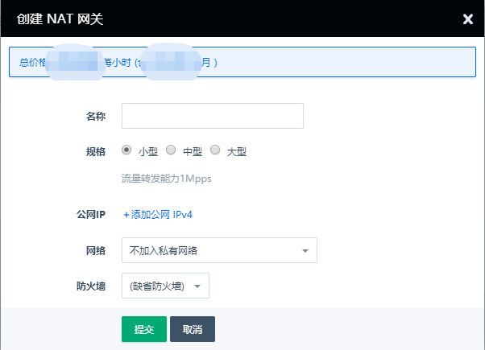
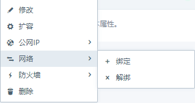
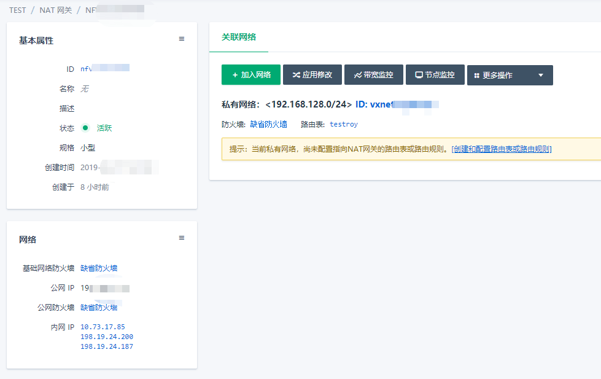
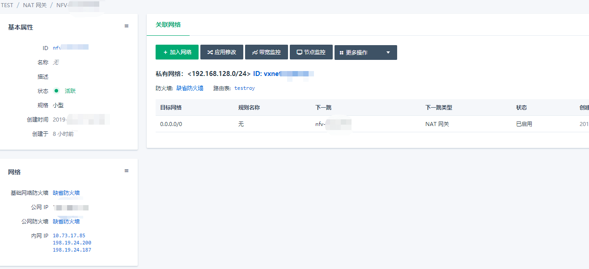
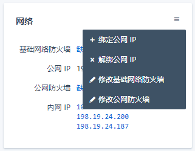

---
---

# NAT 网关

NAT 网关为私有网络的主机提供了复用公网 IP 的能力，目前支持[源 NAT ](https://zh.wikipedia.org/wiki/%E7%BD%91%E7%BB%9C%E5%9C%B0%E5%9D%80%E8%BD%AC%E6%8D%A2#%E7%BD%91%E7%BB%9C%E5%9C%B0%E5%9D%80%E7%AB%AF%E5%8F%A3%E8%BD%AC%E6%8D%A2%EF%BC%88NAPT%EF%BC%89)功能，主机可以共用 NAT 网关绑定的公网 IP 地址`访问互联网`。NAT网关的SNAT功能还可以作为防火墙使用，因为私有网络的主机可以主动通过 NAT 网关访问互联网，但是互联网的主机不可以主动访问私有网络内的主机。
NAT 网关具备高达 10 Gbps 的转发能力以及 Region 级别的多活容灾能力。

在案例中，我们假设已经存在 2 台主机，位于私有网络“办公网络”中，我们通过配置实现主机共用 NAT 网关的公网 IP 访问互联网。

## 创建和配置 NAT 网关

### 创建 NAT 网关

点击进入 VPC 网络--NAT网关页面，点击创建按钮。

您可以选择对性能的需求选择相应规格的 NAT 网关，并且可以在创建的时候选择需要绑定的公网 IP 和私有网络。

### 配置 NAT 网关

创建NAT网关后，您还可以`右键`点击 NAT 网关，将 NAT 网关绑定到新的公网 IP 和私有网络。

### 查看 NAT 网关配置

点击 NAT 网关详情页面，可以看到 NAT 网关的详细信息。左侧为 NAT 网关的基本信息和网络信息，右侧主要显示与 NAT 网关绑定的私有网络和相关的路由表项，及防火墙信息和监控图表。

NAT 网关中的配置的私有网络主机可以共用 NAT 网关，`路由规则`决定私有网络利用NAT网关可以去访问哪些 IP 地址。例如：下图中包含了私有网络 192.168.128.0/24 和`路由规则`-目标网络 0.0.0.0/0 下一跳 nat-00001，代表私有网络中的主机可以访问所有 IP 地址。

### 修改 NAT 防火墙

由于 NAT 网关与多个网络连接，所以在各个方向均可以设置单独的防火墙，可以对网络流量进行更细粒度的安全管理。

左下角网络处可以修改基础网络和公网防火墙

在更多操作中，可以修改 NAT 网关与单个私有网络之间的防火墙

## 配置私有网络和路由规则

在配置完成私有网络以后，需要在私有网路的路由表中添加规则，决定私有网络内的主机可以访问哪些 IP 地址。

点击查看[私有网络路由配置详情](https://docs.qingcloud.com/product/network/route_table)

配置完路由规则并应用修改后，既可以测试主机与互联网的连通情况。

