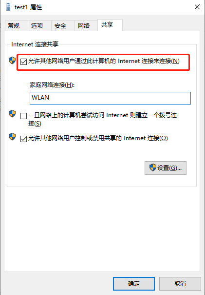

---
---

# FAQ

## 专有网络与经典网络的区别是什么？

专有网络与经典网络的区别如下：

- 经典网络类型的云产品，统一部署在公共基础网络内，由IDC统一规划和管理，更适合对网络易用性要求比较高的用户。
- 专有网络是指用户在青云云的基础网络内建立一个可以自定义的专有隔离网络。与经典网络相比，专有网络比较适合有网络管理能力和需求的用户。

## pptp的vpn如果获取不到ip地址，或者找不到ppp0的设备

需要查看日志来排查，使用命令

pppd call vpn debug dump logfd 2 nodetach  可以通过debug来跟踪详细的连接过程，包括报错都可以查看

如以下demo

[root@i-you5x08u ppp]# pppd call vpn debug dump logfd 2 nodetach

pppd options in effect:

debug  # (from command line)

nodetach  # (from command line)

logfd 2  # (from command line)

dump  # (from command line)

noauth  # (from /etc/ppp/options.pptp)

refuse-pap  # (from /etc/ppp/options.pptp)

refuse-chap  # (from /etc/ppp/options.pptp)

refuse-mschap  # (from /etc/ppp/options.pptp)

refuse-eap  # (from /etc/ppp/options.pptp)

name test  # (from /etc/ppp/peers/vpn)

remotename PPTP  # (from /etc/ppp/peers/vpn)

\# (from /etc/ppp/options.pptp)

pty pptp 139.198.120.85 --nolaunchpppd --loglevel 0  # (from /etc/ppp/peers/vpn)

ipparam vpn  # (from /etc/ppp/peers/vpn)

nobsdcomp  # (from /etc/ppp/options.pptp)

nodeflate  # (from /etc/ppp/options.pptp)

require-mppe  # (from /etc/ppp/peers/vpn)

using channel 6

Using interface ppp0

Connect: ppp0 <--> /dev/pts/1

sent [LCP ConfReq id=0x1 <asyncmap 0x0> <magic 0xf857324d> <pcomp> <accomp>]

sent [LCP ConfReq id=0x1 <asyncmap 0x0> <magic 0xf857324d> <pcomp> <accomp>]

sent [LCP ConfReq id=0x1 <asyncmap 0x0> <magic 0xf857324d> <pcomp> <accomp>]

sent [LCP ConfReq id=0x1 <asyncmap 0x0> <magic 0xf857324d> <pcomp> <accomp>]

sent [LCP ConfReq id=0x1 <asyncmap 0x0> <magic 0xf857324d> <pcomp> <accomp>]

sent [LCP ConfReq id=0x1 <asyncmap 0x0> <magic 0xf857324d> <pcomp> <accomp>]

sent [LCP ConfReq id=0x1 <asyncmap 0x0> <magic 0xf857324d> <pcomp> <accomp>]

sent [LCP ConfReq id=0x1 <asyncmap 0x0> <magic 0xf857324d> <pcomp> <accomp>]

sent [LCP ConfReq id=0x1 <asyncmap 0x0> <magic 0xf857324d> <pcomp> <accomp>]

sent [LCP ConfReq id=0x1 <asyncmap 0x0> <magic 0xf857324d> <pcomp> <accomp>]

LCP: timeout sending Config-Requests

Connection terminated.

Modem hangup

Waiting for 1 child processes...

  script pptp 139.198.120.85 --nolaunchpppd --loglevel 0, pid 25402

Script pptp 139.198.120.85 --nolaunchpppd --loglevel 0 finished (pid 25402), status = 0x0

通过debug模式可以定位到，可能是系统没有加载必要的模块导致这个问题

nf_conntrack_pptp

nf_conntrack_proto_gre

解决办法就是手动去加载模块

sudo modprobe nf_conntrack_pptp

## pptp的vpn多人使用出现无法访问内网的情况

PPTP有以下限制:

1、同一个账号不能在多处登录,

2、同一个PPTP服务不能在一个局域网环境(NAT环境)被多处使用.

如果有多人会同时连接 VPN，建议使用 OpenVPN，这个协议更成熟。PPTP 主要是支持移动设备，而且他的协议会用到 GRE 和 TCP，如果多人在 NAT 之后同时连接的话，是有问题的。

3、一个人对应一个vpn账户

4、新版本的iphone客户端/mac将不再支持pptp协议

## pptp的vpn拨入成功以后无法访问内网

1、检查一下vpn虚拟网卡(tun)是否获取到了ip地址

2、检查一下路由是否正常，比如路由缺失，路由冲突等

## windows10拨入pptp以后无法访问互联网

windows连接 VPN 之后，默认情况下本地默认网关会指向 VPN 服务器，即所有流量都会通过 VPN 服务器，如果网卡禁用了internet连接共享，将会导致这个问题，通过以下步骤恢复

- 第一步：打开网络和Internet设置

- 第二步：以太网---更改适配器选项---找到vpn连接的网卡---属性

- 第三步：在常规项中点击 “共享”，将 “允许其他网络用户通过此计算机的Internet连接来连接” 前面的勾选，点击 “确定”

- 第四步：断开并重新连接 VPN.

## 使用windows主机如何拨入L2tp-ipsec vpn

**配置路径**

开始---网络连接---vpn---添加vpn连接---配置vpn连接信息---保存

**vpn提供商**：windows内置

**连接名称**：自定义

**服务器名称或者地址**：填写vpc的eip地址

**vpn类型**：使用预共享密钥的L2TP/IPsec

**预共享密钥**:自己设置的秘钥字符串

**用户名**：填写自己配置的用户名

**密码**：填写自己设置的密码

**由于大部分windows主机都是采用nat方式上网，另外需要单独开启ipsec服务才能连接，所以可能会遇到连接不上的问题，比如**

 

**可以使用云平台的主机单独绑定eip来测试连接，使用以下步骤**

1、开始 -> 运行 -> regedit -> 确定

2、找到如下路径：HKEY_LOCAL_MACHINE\System\CurrentControlSet\Services\Rasman\Parameters

3、 在“编辑”菜单上，单击“新建”->“DWORD值32位”

4.、在“名称”框中，键入“ProhibitIpSec”

5、在“数值数据”框中，键入“1”，然后单击“确定”

6、找到 AllowL2TPWeakCrypto 键，将其值修改为 1

7、HKEY_LOCAL_MACHINE\SYSTEM\CurrentControlSet\Services\PolicyAgent

8、"AssumeUDPEncapsulationContextOnSendRule"=dword:00000002

9、重启电脑就OK了。

10、然后再尝试连接就可以

## linux客户端无法拨入openvpn

**建议开启debug模式**

openvpn --daemon --cd /etc/openvpn/client --config rtr-rwzf1gk9.ovpn --log-append /var/log/openvpn.log

tail -f  /var/log/openvpn.log  通过日志来定位问题

## 主机在同一个区的网络延迟是多少？跨可用区的网络延迟是多少？

同一个可用区网络延时0.3ms，跨可用区是1.5ms

## 同城可用区之间走的是专线吗？在网络上有什么保障措施？

同城可用区之间走的是专线，可用区之间物理线路做了链路冗余