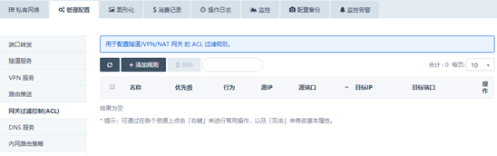
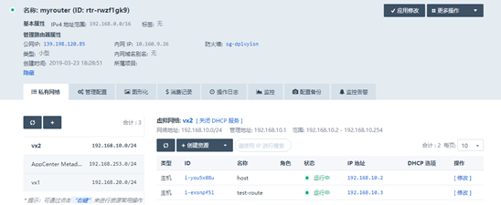
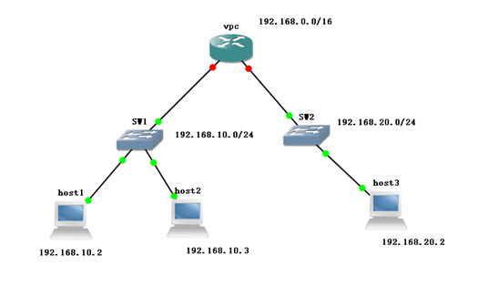
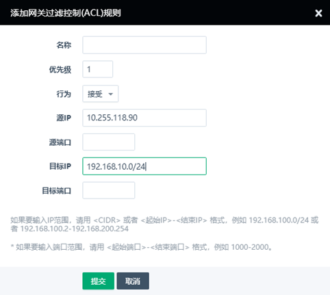
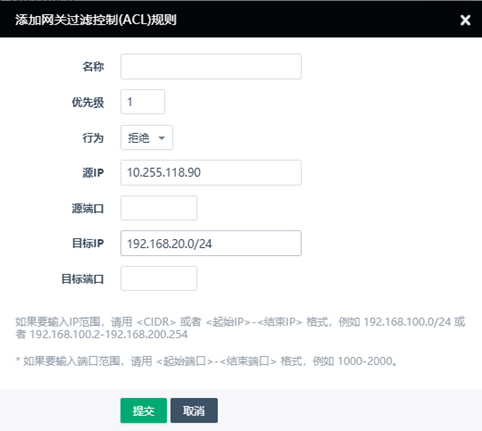
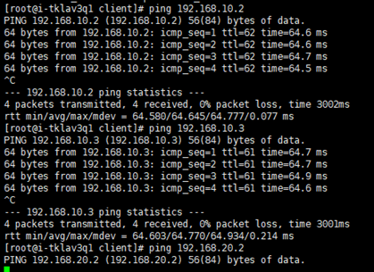
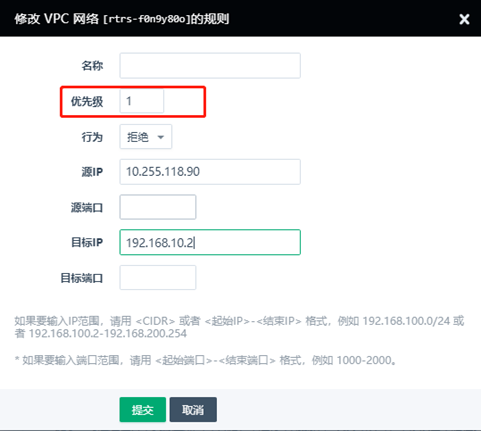
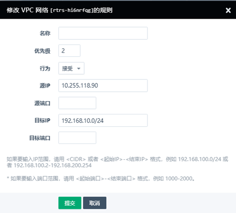
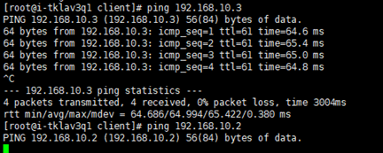
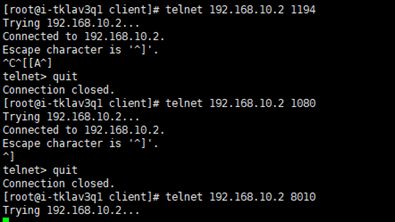

---
---

# 网关过滤控制(ACL) 功能介绍

请注意，是用于配置隧道/VPN/NAT 网关 的 ACL 过滤规则，设置路径如下

通过控制台---网络与CDN---vpc网络---详情---管理配置---网关过滤控制台acl

vpc的架构图如下，这个vpc已经部署了openvpn服务

**模拟拓扑图如下**

## 场景一  限制访问指定ip段

如何实现客户端拨入vpn以后，只能访问192.168.10.0/24这个网段的主机，不能访问192.168.20.0/24的主机

**1、假如客户端拨入vpn以后，获取到的ip地址为10.255.118.90**

[root@i-tklav3q1 client]# ip addr

3: tun0: <POINTOPOINT,MULTICAST,NOARP,UP,LOWER_UP> mtu 1500 qdisc pfifo_fast state UNKNOWN group default qlen 100

​    link/none 

​    inet 10.255.118.90 peer 10.255.118.89/32 scope global tun0

​       valid_lft forever preferred_lft forever

​    inet6 fe80::6b4f:ba76:8b64:d9ef/64 scope link flags 800 

​       valid_lft forever preferred_lft forever

**2、我们只需要限制这个ip地址的访问规则即可，配置acl规则如下**

添加这个ip允许访问192.168.10.0/24

**3、另外添加一条这个ip拒绝访问192.168.20.0/24**

**4、规则设置成功以后，效果如下**

## 场景二  限制访问一个私有网络的个别主机

如何实现客户端拨入vpn以后，只能访问192.168.10.0/24这个网段除192.168.10.2以外的所有主机

设置完效果如下

## 场景三 限制访问指定内网ip的指定端口

如何实现客户端拨入vpn以后，不能访问192.168.10.2的8010端口

实现效果如下，其他端口均是通的，唯独8010不通

## 场景四  SDN1.0架构（老区），通过acl控制子网之间的访问

路由器连接了两个私有网路，分别是192.168.10.0/24以及192.168.20.0/24

缺省情况下，路由器所管理的私有网络之间是相互连通的。如果添加了过滤控制规则，那么这些规则就会起作用，可以控制两个私有网络之间通还是不通。

例如192.168.10.2和192.168.20.2的80端口都是提供http服务，现在只希望192.168.10.2的80端口提供服务，其他的任何端口服务都隔离

可以这么配置

| 名称 | 优先级 | 行为 | 源IP            | 源端口 | 目标IP          | 目标端口 |
| ---- | ------ | ---- | --------------- | ------ | --------------- | -------- |
|      | 1      | 接受 | 192.168.20.0/24 |        | 192.168.10.2    | 80       |
|      | 2      | 接受 | 192.168.10.2    | 80     | 192.168.20.0/24 |          |
|      | 3      | 拒绝 | 192.168.10.0/24 |        | 192.168.20.0/24 |          |
|      | 4      | 拒绝 | 192.168.20.0/24 |        | 192.168.10.0/24 |          |

例如192.168.10.0/24和192.168.20.0/24两个网段完全隔离，那就这么配置

| 名称 | 优先级 | 行为 | 源IP            | 源端口 | 目标IP          | 目标端口 |
| ---- | ------ | ---- | --------------- | ------ | --------------- | -------- |
|      | 1      | 拒绝 | 192.168.10.0/24 |        | 192.168.20.0/24 |          |
|      | 2      | 拒绝 | 192.168.20.0/24 |        | 192.168.10.0/24 |          |

