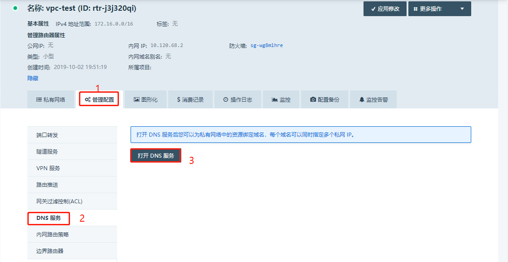
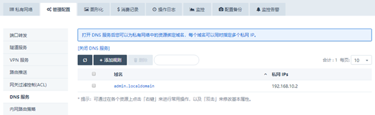
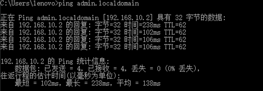

---
---

# 内网DNS服务

内网dns功能是给私有网络的主机提供内网域名解析的服务，通过

控制台---网络与CDN---vpc网络---详情---管理配置---dns服务开启

请注意：

开启/关闭 DNS 功能, 都需要让主机重新获取 DHCP 解析, 更新本地 DNS 地址后才能生效。比如使用

systemctl restart network

## 场景一、给一个主机绑定一个内网域名

[root@i-you5x08u ~]# ping admin.localdomain

PING admin.localdomain (192.168.10.2) 56(84) bytes of data.

64 bytes from admin.localdomain (192.168.10.2): icmp_seq=1 ttl=64 time=0.056 ms

64 bytes from admin.localdomain (192.168.10.2): icmp_seq=2 ttl=64 time=0.038 ms

64 bytes from admin.localdomain (192.168.10.2): icmp_seq=3 ttl=64 time=0.035 ms

64 bytes from admin.localdomain (192.168.10.2): icmp_seq=4 ttl=64 time=0.059 ms

^C

--- admin.localdomain ping statistics ---

4 packets transmitted, 4 received, 0% packet loss, time 2999ms

rtt min/avg/max/mdev = 0.035/0.047/0.059/0.010 ms

[root@i-you5x08u ~]# cat /etc/resolv.conf

\# Generated by NetworkManager

search localdomain ap2a.qingcloud.com

nameserver 192.168.255.254

[root@i-you5x08u ~]# 

## 场景二、给多个主机绑定同一个内网域名

[root@i-you5x08u ~]# nslookup admin.localdomain

Server: 192.168.255.254

Address: 192.168.255.254#53

Name: admin.localdomain

Address: 192.168.10.2

Name: admin.localdomain

Address: 192.168.20.2

Name: admin.localdomain

Address: 192.168.10.3

这个不具备负载均衡的功能，解析到的ip是随机的，如果客户有负载均衡的需求，建议使用内网负载均衡器

## 场景三、本地通过拨入vpn以后，通过内网域名访问主机的服务

1、首先需要本地拨入vpn服务

2、修改C:\Windows\System32\drivers\etc 目录下面的hosts文件，添加一行

192.168.10.2 admin.localdmomain

3、通过域名就可以访问主机的服务，比如

