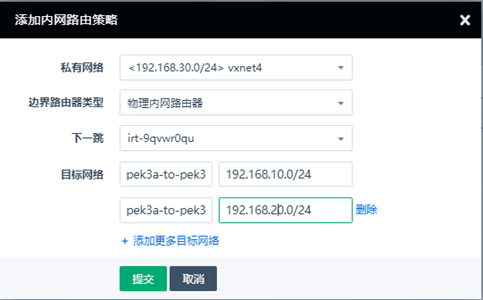

---
---

# 内网路由策略功能

配置内网路由策略，可以实现指定网段与目标网段互通的目的，需要配合内网路由器或者边界路由器一起使用

## 场景一、同区域，不同vpc可以通过边界路由器打通访问

**vpc1基本信息**                                                          

资源id:rtr-2x1n7oaw

子网：192.168.10.0/24

子网：192.168.20.0/24

区域：pek3

**vpc2基本信息**

资源id:rtr-dai5nyzc

子网：172.16.10.0/24

区域:pek3

拓扑图如下

**1、控制台---网络与CDN---边界路由器---创建---提交**

**2、控制台---网络与CDN---边界路由器---关联私有网络**

**3、关联vxnet1、vxnet2、vxnet3三个私有网络**

**4、控制台---网络与CDN---vpc网络---配置管理---内网路由策略---添加规则**

从图中可以看到，需要从vpc1中添加两条路由策略

192.168.10.0/24----->172.16.10.0/24

192.168.20.0/24----->172.16.10.0/24

另外需要从vpc2中添加两条路由策略

172.16.10.0/24---->192.168.10.0/24

172.16.10.0/24---->192.168.20.0/24

 

**4、测试网络连通性**

## 场景二、不同区域，vpc之间可以通过边界路由器+sd-wan打通访问

**vpc1基本信息**                                                          

资源id:rtr-2x1n7oaw

子网：192.168.10.0/24

子网：192.168.20.0/24

区域：pek3

**vpc3基本信息**

资源id:rtr-wpuq0t2l

子网：192.168.30.0/24

区域:pek3a

拓扑图如下

**1、控制台---网络与CDN---边界路由器---创建---提交**

**2、切换到pek3a，控制台---网络与CDN---边界路由器---关联私有网络**

**2、控制台---SD-Wan---网关---创建接入点---提交**

**3、控制台---网络与CDN---内网路由器---路由设置---内网路由策略---添加规则**

**4、切换到pek3，控制台---网络与CDN---内网路由器---关联私有网络**

**5、控制台---SD-Wan---网关---创建接入点---提交**

**6、控制台---网络与CDN---vpc网络---配置管理---内网路由策略---添加规则**

 

**7、测试连通性，使用192.168.10.2去ping172.16.10.2以及使用172.16.10.2分别去ping**

**192.168.10.2、192.168.20.2**

##  场景三、通过边界路由器实现物理主机与虚拟主机之间互通

**1、通过控制台---网络与CDN---vpc网络---管理配置---边界路由器---创建**

**2、通过vpc网络---私有网络---创建/连接私有网络---工作模式---物理机**

**3、通过vpc网络---私有网络---to--物理主机---创建资源---物理主机**

**4、测试物理主机与虚拟主机之间的连通性**

 
