---
---

# VPN

## 配置pptp vpn服务(windows)

**1、设置pptp**

通过控制台---网络与CDN---vpc网络---详情---管理配置---vpn服务---pptp服务---开启

备注：可以设置最大连接数、自定义vpn网络地址，如图

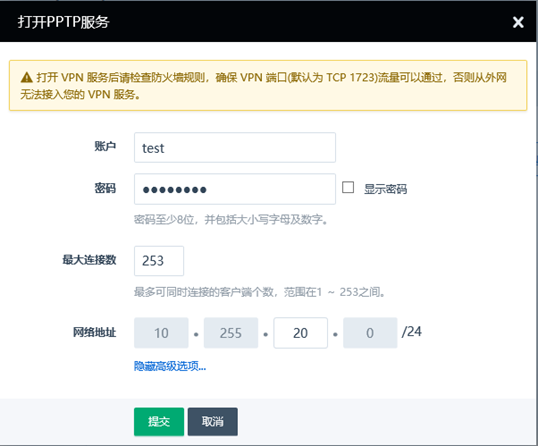

**2、放行防火墙下行gre协议以及tcp 1723端口协议，并应用修改防火墙**

**3、windows10客户端连接测试**

开始---网络连接---vpn---添加vpn连接---配置vpn连接信息---保存

**vpn提供商**：windows内置

**连接名称**：自定义

**服务器名称或者地址**：填写vpc的eip地址

**vpn类型**：点对点隧道协议（PPTP）

**用户名**：填写自己配置的用户名

**密码**：填写自己设置的密码

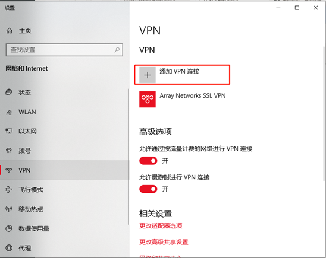

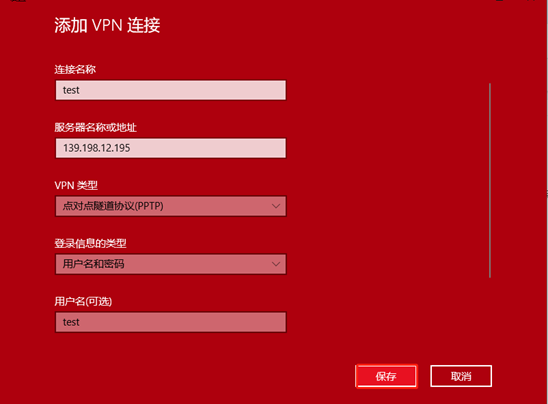

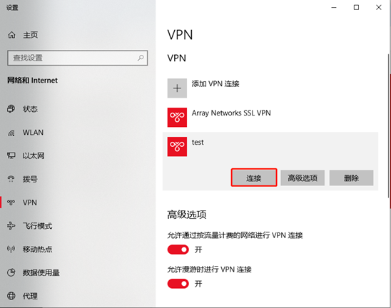

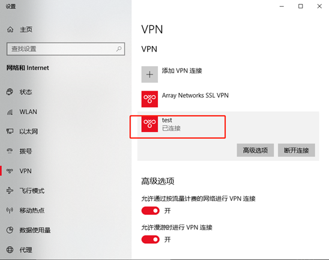

 

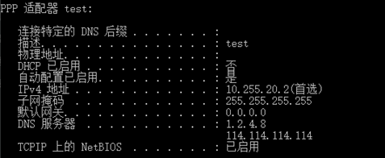

 

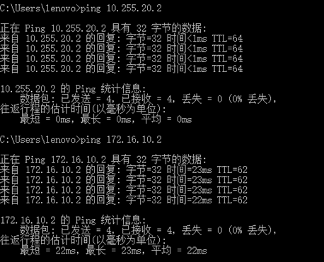

## 配置pptp vpn服务(linux)

**centos7客户端连接测试**

**1、使用以下命令安装pptp客户端**

\# yum install pptp

**2、修改 /etc/ppp/chap-secrets 文件**

配置验证所需的用户名和密码，用户名和密码就是vpc的pptp vpn服务端配置的账户及密码

\#vi /etc/ppp/chap-secrets

增加一行内容 test            pptpd   As123456                  *

结果如下

root@i-bzqgxr7l:~# cat /etc/ppp/chap-secrets

\# Secrets for authentication using CHAP

\# client server secret   IP addresses

test            PPTP   As123456                  *

**3、新建 /etc/ppp/peers/<tunnel> 文件**

是由你定义的一个隧道名称， 例如我们可以叫做 vpn

**vi  /etc/ppp/peers/vpn**

增加以下内容

pty "pptp 139.198.120.85 --nolaunchpppd --nobuffer --loglevel 0"

lock

noauth

nobsdcomp

nodeflate

name test

remotename PPTP

require-mppe-128

file /etc/ppp/options.pptp

ipparam vpn

**请特别注意**：第一行的ip一般是路由器绑定的公网ip，第六行 name 后面的内容是您添加vpn账户的账户名称，第七行remotename 后面的内容是 chap-secrets文件里的server对应的内容，第八行内容如果添加了，是代表支持128位加密，安全性会更高，务必确保系统加载了这个模块，如果没有加载，请注释掉

**手动加载这个模块的步骤**

modprobe ppp-compress-18

输入以下命令测试是否加载成功

modprobe ppp-compress-18 && echo ok

输出ok，就说明成功

**4、开始连接**

pppd call vpn

**5、测试是否连接成功**

ip addr命令查看一下是否有ppp0的网卡信息，是否获取到了ip地址

root@i-bzqgxr7l:/etc/ppp/peers# ip addr

1: lo: <LOOPBACK,UP,LOWER_UP> mtu 65536 qdisc noqueue state UNKNOWN group default qlen 1

​    link/loopback 00:00:00:00:00:00 brd 00:00:00:00:00:00

​    inet 127.0.0.1/8 scope host lo

​       valid_lft forever preferred_lft forever

​    inet6 ::1/128 scope host 

​       valid_lft forever preferred_lft forever

2: eth0: <BROADCAST,MULTICAST,UP,LOWER_UP> mtu 1500 qdisc pfifo_fast state UP group default qlen 1000

​    link/ether 52:54:6d:85:2d:29 brd ff:ff:ff:ff:ff:ff

​    inet 192.168.10.3/24 brd 192.168.10.255 scope global eth0

​       valid_lft forever preferred_lft forever

​    inet6 fe80::5054:6dff:fe85:2d29/64 scope link 

​       valid_lft forever preferred_lft forever

23: **ppp0**: <POINTOPOINT,MULTICAST,NOARP,UP,LOWER_UP> mtu 1496 qdisc pfifo_fast state UNKNOWN group default qlen 3

​    link/ppp 

​    inet 10.255.224.2 peer 10.255.224.1/32 scope global ppp0

​       valid_lft forever preferred_lft forever

**6、手动添加路由规则**

如果您希望通过 VPN 来访问路由器内部私有网络里的机器，您还需要手动配置路由规则， 假设你需要访问的私有网络的网络地址为 192.168.10.0/24，相应的路由配置为

ip route add 192.168.10.0/24 dev ppp0

命令中的 ppp0 为客户端连接的设备名，如果你只有一个 VPN 客户端正在运行，那默认设备一般都是 ppp0， 如果不是，你可以通过 ifconfig -a命令来进行查看。

## 配置l2tp vpn服务（linux）

**1、设置l2tp vpn**

通过控制台---网络与CDN---vpc网络---详情---管理配置---vpn服务---l2tp服务---开启

备注：需要设置psk、可以自定义vpn网络地址避免出现ip冲突，如图

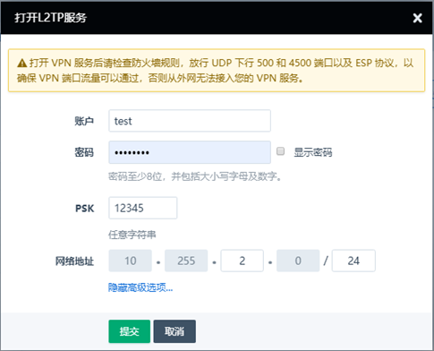

**2、配置vpc防火墙策略**

 如果您使用的是 L2TP-IPsec 连接方式（IPhone 默认名字为 L2TP），请放行 UDP 下行 500 和 4500 端口以及 ESP 协议。 如果您使用的是 L2TP 连接方式，请放行 UDP 下行 1701 端口 并记得应用更改防火墙 。

**3、配置客户端并连接，以centos为例**

- 先看看你的主机是否支持pptp，返回结果为yes就表示通过

​       modprobe ppp-compress-18 && echo yes

- 是否开启了TUN

​      cat /dev/net/tun，返回结果为cat: /dev/net/tun: File descriptor in bad state。就表示通过。

- 更新一下再安装

​      yum install update 

​      yum update -y

- 安装EPEL源

​      yum install -y epel-release 

- 安装xl2tpd和libreswan

​       yum install -y xl2tpd libreswan lsof

**4、配置ipsec.conf**

cp /etc/ipsec.conf /etc/ipsec.conf.bak     -----备份一下配置文件

vi  /etc/ipsec.conf  里面配置内容如下

[root@i-tklav3q1 ~]# cat /etc/ipsec.conf 

version 2.0

config setup

​     virtual_private=%v4:10.0.0.0/8,%v4:192.168.0.0/16,%v4:172.16.0.0/12

​     nat_traversal=yes

​     protostack=netkey

​     oe=no

​     plutoopts="--interface=eth0"

conn L2TP-PSK

​     authby=secret

​     pfs=no

​     auto=start

​     keyingtries=3

​     dpddelay=30

​     dpdtimeout=120

​     dpdaction=clear

​     rekey=yes

​     ikelifetime=8h

​     keylife=1h

​     type=transport

​     left=%defaultroute

​     leftprotoport=17/1701

​     right=139.198.120.85

​     rightprotoport=17/1701

备注：

**conn** L2TP-PSK  conn项定义了一个IPsec连接的规范，名字可以随意定义

**type**

连接类型，参数如下：

​        tunnel（缺省）表示 host-to-host，host-to-subnet，subnet-to-subnet 隧道模式；

​        transport，表示 host-to-host传输模式；

​        passthrough，表示不使用IPsec；

​        drop，表示丢弃数据；

​        reject，表示丢弃数据并返回ICMP诊断包

**left**

​    [必选项] 左侧设备公网接口IP地址，当前支持IPv4和IPv6。

​    如果其参数为 %defaultroute，同时 config setup 项中的 interfaces 包含 %defaultroute，那么left将自动由本地的缺省路由接口地址填充；leftnexthop也支持。

​    %any 表示在协商时填充。

​    %opportunistic 表示 left 和 lefnexthop 的参数从 left 侧客户端的DNS数据中获取

**auto**

​    IPsec启动时自动执行；现在支持的参数有 

​        add （ipsec auto --add）

​        route（ipsec auto --route）

​        start（ipsec auto --up）

​        manual（ipsec manual --up）

​        ignore 表示不自动启动

  **authby**

​    2个安全网关之间的认证方法；

​    secret 表示共享密钥

​    rsasig 表示RSA数据签名（缺省）

| secret | rsasig 同时使用 |
| ------ | --------------- |
| 共享密钥 | RSA数据签名（缺省）|

**dpddelay**

​    主机探测延迟时间，缺省为30秒。如果此选项被设置，dpdtimeout也应该设置

**dpdtimeout**

   主机探测超时时间（以秒为单位），缺省为120秒。如果超时，将删除SA

**pfs**

​    参数为 yes 或 no （缺省为yes）开启了安全性更好

**keyingtries**

​    协商尝试次数。 %forever 表示从不放弃，一直进行协商

**keylife**

SA存活时间，参数为数字 + s/m/h/d （缺省为8h，最大24h）

**dpdaction**

​    当PDP探测到主机死亡时要执行的动作

​    hold （缺省）表示eroute将进入 %hold 状态

​    clear 表示eroute和SA都要清除

​    restart 表示SA将立即从协商

​    restart_by_peer 表示所有死亡主机的SA将进行从协商

**right**

right=139.198.120.85   后面指定的是vpn server的公网ip地址

<6.配置/etc/ipsec.secrets

cp /etc/ipsec.secrets /etc/ipsec.secrets.bak

请参考以下格式填

[root@i-tklav3q1 ~]# cat /etc/ipsec.secrets

include /etc/ipsec.d/*.secrets

%any 139.198.120.85 : PSK "12345"

备注：psk是l2tp设置的psk

**5、配置/etc/xl2tpd/xl2tpd.conf**

cp /etc/xl2tpd/xl2tpd.conf /etc/xl2tpd/xl2tpd.conf.bak

请参考以下格式填

[root@i-tklav3q1 ~]# cat /etc/xl2tpd/xl2tpd.conf

[lac vpn]

lns = 139.198.120.85

ppp debug = yes

pppoptfile = /etc/ppp/options.l2tpd.client

length bit = yes

备注：lac后面是l2tp的连接名   lns是vpc的公网ip

**6、配置/etc/ppp/options.l2tpd.client**

cp /etc/ppp/options.l2tpd.client /etc/ppp/options.l2tpd.client.bak

请参考以下格式填

[root@i-tklav3q1 ~]# cat /etc/ppp/options.l2tpd.client

ipcp-accept-local

ipcp-accept-remote

refuse-eap

require-mschap-v2

noccp

noauth

idle 1800

mtu 1410

mru 1410

defaultroute

usepeerdns

debug

connect-delay 5000

name test

password As123456

备注：name后面是配置的vpn服务的用户名，password为配置vpn的密码

**7、为l2tpd创建control，为连接ppp做准备**

\#mkdir -p /var/run/xl2tpd

\#touch /var/run/xl2tpd/l2tp-control

**8、连接l2tp-ipsec vpn服务**

systemctl start ipsec

systemctl start xl2tpd

ipsec auto --up L2TP-PSK

echo "c vpn" > /var/run/xl2tpd/l2tp-control

**9、连接l2tp-ipsec vpn服务成功以后，状态如下**

[root@i-tklav3q1 ~]# ipsec auto --up L2TP-PSK

002 "L2TP-PSK" #8: initiating Quick Mode PSK+ENCRYPT+UP+IKEV1_ALLOW+IKEV2_ALLOW+SAREF_TRACK+IKE_FRAG_ALLOW+ESN_NO {using isakmp#3 msgid:79d263a4 proposal=defaults pfsgroup=no-pfs}

117 "L2TP-PSK" #8: STATE_QUICK_I1: initiate

004 "L2TP-PSK" #8: STATE_QUICK_I2: sent QI2, IPsec SA established transport mode {ESP/NAT=>0x9a951748 <0xa5b4bb67 xfrm=AES_CBC_128-HMAC_SHA1_96 NATOA=none NATD=139.198.120.85:4500 DPD=active}

[root@i-tklav3q1 ~]# echo "c vpn" > /var/run/xl2tpd/l2tp-control

[root@i-tklav3q1 ~]# ip addr

1: lo: <LOOPBACK,UP,LOWER_UP> mtu 65536 qdisc noqueue state UNKNOWN group default qlen 1000

​    link/loopback 00:00:00:00:00:00 brd 00:00:00:00:00:00

​    inet 127.0.0.1/8 scope host lo

​       valid_lft forever preferred_lft forever

​    inet6 ::1/128 scope host 

​       valid_lft forever preferred_lft forever

2: eth0: <BROADCAST,MULTICAST,UP,LOWER_UP> mtu 1500 qdisc pfifo_fast state UP group default qlen 1000

​    link/ether 52:54:61:06:6f:ac brd ff:ff:ff:ff:ff:ff

​    inet 10.140.11.24/24 brd 10.140.11.255 scope global noprefixroute dynamic eth0

​       valid_lft 81881sec preferred_lft 81881sec

​    inet6 fe80::5054:61ff:fe06:6fac/64 scope link 

​       valid_lft forever preferred_lft forever

3: ip_vti0@NONE: <NOARP> mtu 1480 qdisc noop state DOWN group default qlen 1000

​    link/ipip 0.0.0.0 brd 0.0.0.0

5: ppp0: <POINTOPOINT,MULTICAST,NOARP,UP,LOWER_UP> mtu 1356 qdisc pfifo_fast state UNKNOWN group default qlen 3

​    link/ppp 

​    inet 10.255.28.2 peer 10.255.28.1/32 scope global ppp0

​       valid_lft forever preferred_lft forever

**10、添加路由策略，格式如下**

 ip route add <ip_network> dev <link_name>

比如vpc的私有网络为192.168.10.0/24，设备名称为ppp0  via即 peer ip

ip route add 192.168.10.0/24 via 10.255.28.1 dev ppp0

**11、测试连通性，去ping一下vpc私网的主机**

[root@i-tklav3q1 ~]# ping 192.168.10.2

PING 192.168.10.2 (192.168.10.2) 56(84) bytes of data.

64 bytes from 192.168.10.2: icmp_seq=1 ttl=62 time=63.8 ms

64 bytes from 192.168.10.2: icmp_seq=2 ttl=62 time=63.7 ms

64 bytes from 192.168.10.2: icmp_seq=3 ttl=62 time=63.6 ms

64 bytes from 192.168.10.2: icmp_seq=4 ttl=62 time=63.5 ms

64 bytes from 192.168.10.2: icmp_seq=5 ttl=62 time=63.8 ms

 

[root@i-tklav3q1 ~]# traceroute 192.168.10.2

traceroute to 192.168.10.2 (192.168.10.2), 30 hops max, 60 byte packets

 1  10.255.28.1 (10.255.28.1)  63.924 ms  63.727 ms  63.755 ms

 2  * * *

 3  localhost (192.168.10.2)  63.849 ms !X  63.813 ms !X  63.738 ms !X

## 配置openvpn（windows）

**1、控制台配置操作**

通过控制台---网络与CDN---vpc网络---详情---管理配置---vpn服务---openvpn服务---开启

备注：可以自定义设置vpn服务端口、自定义vpn网络地址以及验证方式，如图

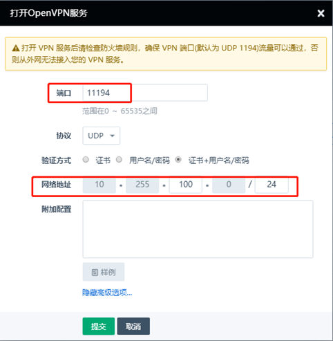

**2、放行vpc防火墙下行udp 11194端口，并应用修改防火墙**

**3、下载openvpn客户端安装包**

https://yunify.anybox.qingcloud.com/s/4ByBAb6cXdlRQsxDZ5znlwdhTs0ETv3Z

**4、按照默认路径按照即可，一般默认路径是**

C:\Program Files\OpenVPN

**5、下载证书配置文件，如图**

**6、添加vpn账户**

如果使用证书的方式验证就不需要添加账户，如果采用证书+用户名/密码就需要添加账户

通过控制台---网络与CDN---vpc网络---详情---管理配置---vpn服务---openvpn服务---添加账户

备注：添加账户的时候可以指定ip地址

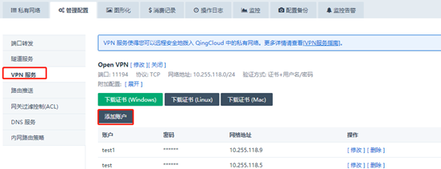

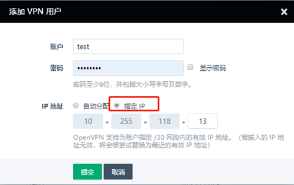

**7、创建一个pass.txt文本，里面写入账户/密码的内容**

**8、将vpn证书及密码导入客户端**

把下载的证书解压以后的文件以及pass.txt一起放到C:\Program Files\OpenVPN\config 这个目录，如果vpn服务比较多，也可以在这个目录下面自己单独创建一个目录

**9、以管理员的身份运行OpenVPN GUI ，就可以连接，需要输入账户密码**

**10、如果需要配置自动验证账户密码，在xxxx.ovpn的配置文件加入**

auth-user-pass pass.txt

如以下内容

\# openvpn client windows configuration sample

client

dev tun

proto tcp

remote 139.198.120.85 11194

resolv-retry infinite

nobind

persist-key

persist-tun

ca yunify-ca.crt

cert rtr-rwzf1gk9.crt

key rtr-rwzf1gk9.key

tls-auth rtr-rwzf1gk9.takey 1

auth-user-pass pass.txt

cipher AES-256-CBC

comp-lzo

mssfix 1400

**11、客户端拨入vpn服务**

成功以后会获取一个ip地址，需要在客户端ping一下这个ip是否可以通，如果ping不通，可以通过网络和internet设置---以太网---更改适配器选项---找到虚拟网卡设备，可以右键禁用，再重启一次，一般都可以解决

## 配置openvpn（linux）

**1、下载epel源**

yum -y install epel-release

**2、安装openvpn客户端**

yum -y install openvpn

**3、下载windows证书文件，并解压**

备注：证书文件linux和windows都可以通用

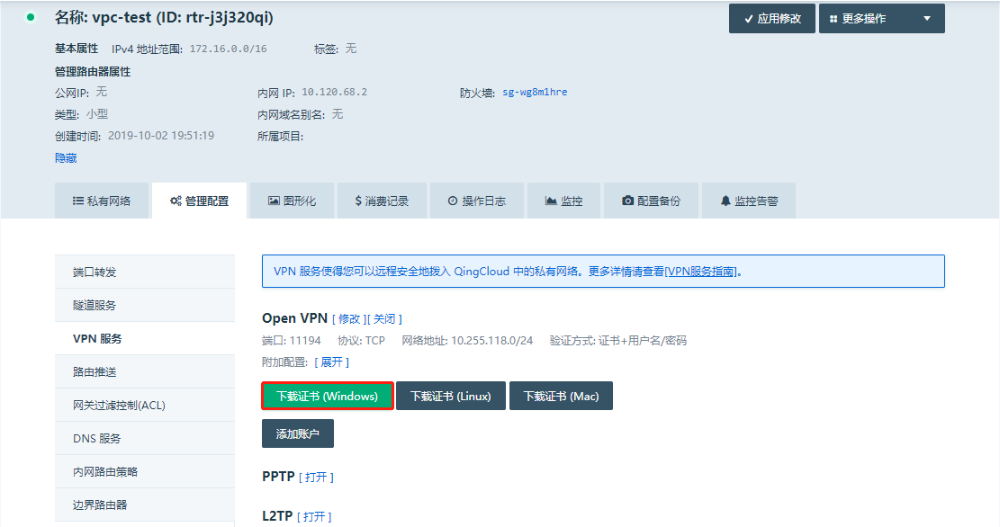

**4、把解压好的文件连同pass.txt文件一起上传到/etc/openvpn/client/目录**

tips:最简单的办法是安装一个rz工具

yum -y install lrzsz

切换到/etc/openvpn/

cd /etc/openvpn/

然后使用rz -r将上面的文件上传到此目录，另外需要配置一下自动验证密码，参考上面

[root@i-tklav3q1 openvpn]# cd client/

[root@i-tklav3q1 client]# ls

ap2a.ovpn  pass.txt  rtr-rwzf1gk9.crt  rtr-rwzf1gk9.key  rtr-rwzf1gk9.takey  yunify-ca.crt

 

**5、使用以下命令连接vpn**

openvpn --daemon --cd /etc/openvpn/client --config rtr-rwzf1gk9.ovpn

连接成功以后使用ip addr查看一下是否获取到了ip，一般网卡名称为tun0

[root@i-tklav3q1 client]# ip addr

1: lo: <LOOPBACK,UP,LOWER_UP> mtu 65536 qdisc noqueue state UNKNOWN group default qlen 1000

​    link/loopback 00:00:00:00:00:00 brd 00:00:00:00:00:00

​    inet 127.0.0.1/8 scope host lo

​       valid_lft forever preferred_lft forever

​    inet6 ::1/128 scope host 

​       valid_lft forever preferred_lft forever

2: eth0: <BROADCAST,MULTICAST,UP,LOWER_UP> mtu 1500 qdisc pfifo_fast state UP group default qlen 1000

​    link/ether 52:54:61:06:6f:ac brd ff:ff:ff:ff:ff:ff

​    inet 10.140.11.24/24 brd 10.140.11.255 scope global noprefixroute dynamic eth0

​       valid_lft 73380sec preferred_lft 73380sec

​    inet6 fe80::5054:61ff:fe06:6fac/64 scope link 

​       valid_lft forever preferred_lft forever

3: ip_vti0@NONE: <NOARP> mtu 1480 qdisc noop state DOWN group default qlen 1000

​    link/ipip 0.0.0.0 brd 0.0.0.0

6: tun0: <POINTOPOINT,MULTICAST,NOARP,UP,LOWER_UP> mtu 1500 qdisc pfifo_fast state UNKNOWN group default qlen 100

​    link/none 

​    inet 10.255.118.5 peer 10.255.118.6/32 scope global tun0

​       valid_lft forever preferred_lft forever

​    inet6 fe80::ee41:df82:e2ff:df4a/64 scope link flags 800 

​       valid_lft forever preferred_lft forever

**6、测试一下是否可以ping通**

备注：拨入成功以后系统会自动添加路由，无需配置路由，如

[root@i-tklav3q1 client]# ip route

default via 10.140.11.1 dev eth0 proto dhcp metric 100 

10.140.11.0/24 dev eth0 proto kernel scope link src 10.140.11.24 metric 100 

10.255.118.0/24 via 10.255.118.6 dev tun0 

10.255.118.6 dev tun0 proto kernel scope link src 10.255.118.5 

192.168.10.0/24 via 10.255.118.6 dev tun0 

192.168.253.0/24 via 10.255.118.6 dev tun0 