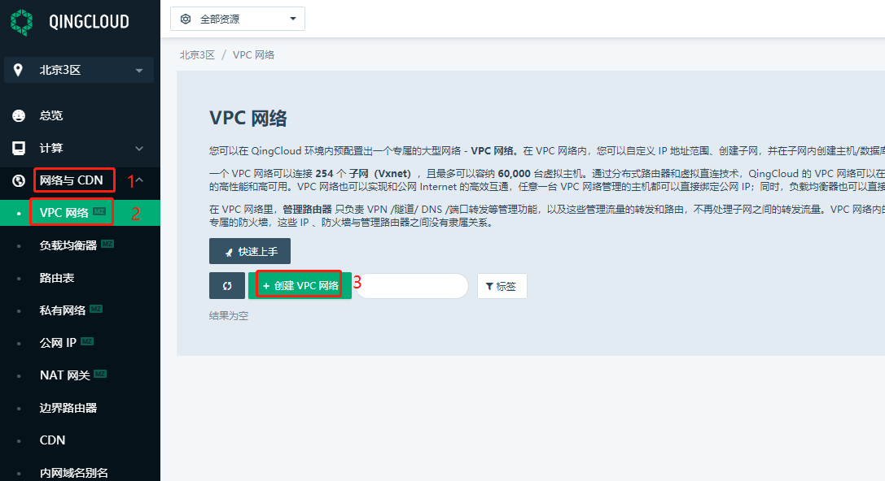
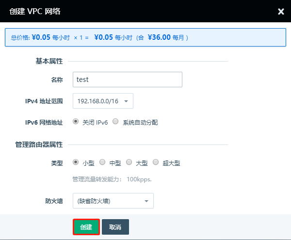
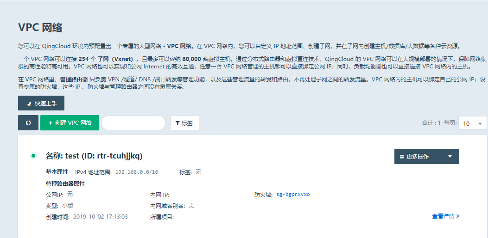
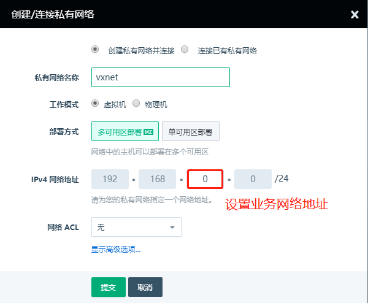
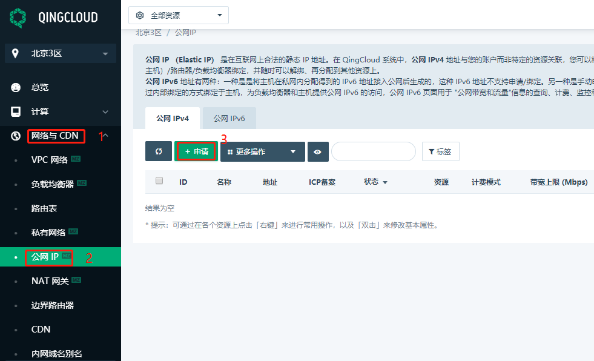
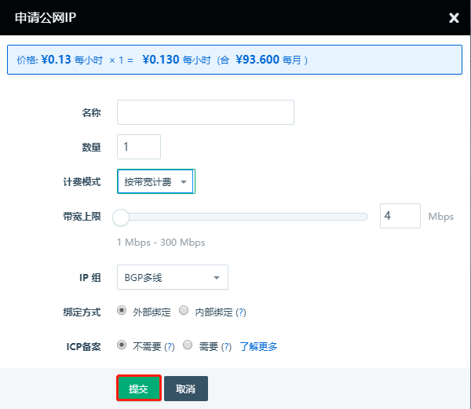
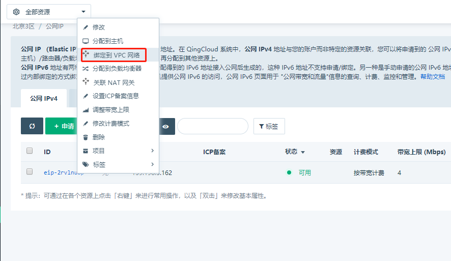
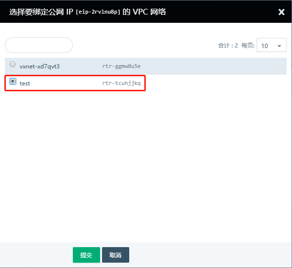

---
---

# 创建步骤

1、登录到青云控制台，在网络与CDN找到vpc网络，然后创建vpc网络即可，如图

**名称：**就是vpc的命名

**IPv4 地址范围：**根据业务网络地址规划来选择合适的地址范围，可选择192.168.0.0/16以及172.16.0/16--172.31.0.0/16这个区间的B段地址

**IPv6网络地址：**如果业务需要支持IPv4/IPv6双栈网络，可以开启此选项

**类型：**根据业务选择来选择vpc的规格，不同规格的vpc网络，管理流量转发能力不一样

**防火墙：**可以选择缺省值防火墙，也可以选择自定义防火墙

## 创建私有网络并绑定vpc网络

点击vpc网络的资源ID---创建私有网络并连接---设置IPv4 网络地址

## 创建公网ip并绑定vpc网络

