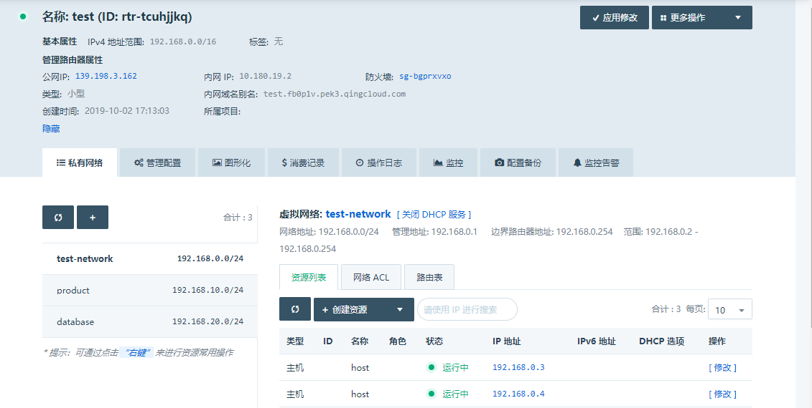
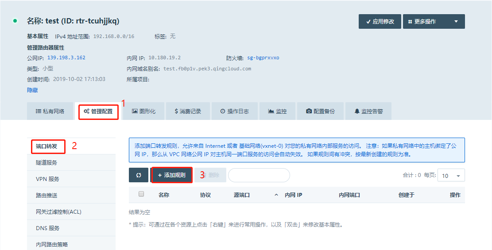
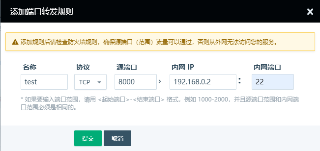
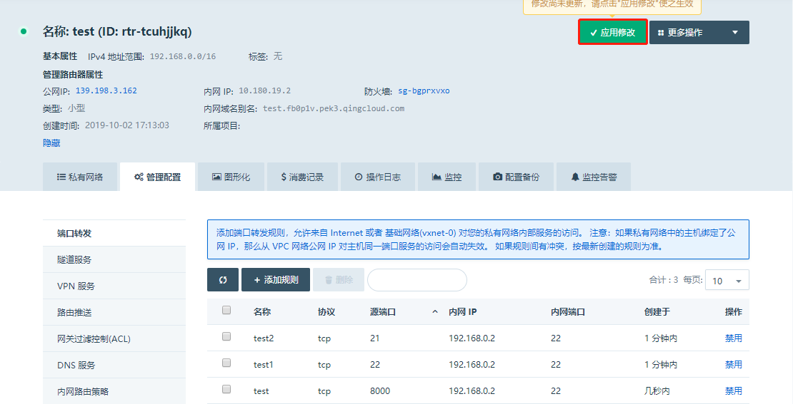
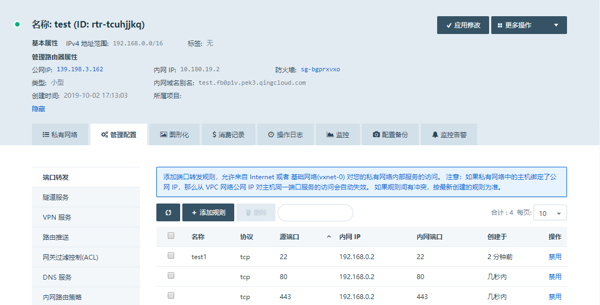
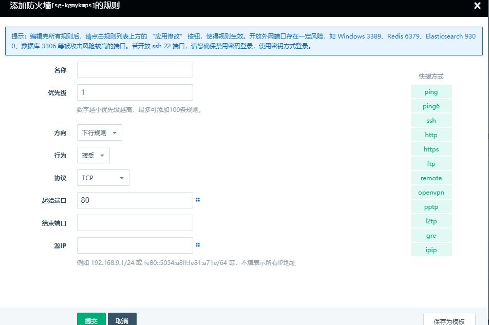
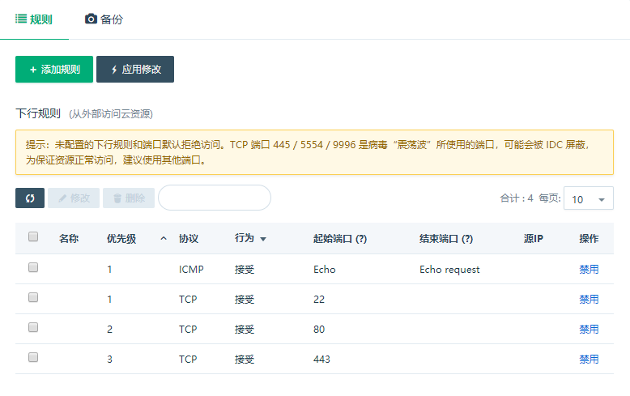
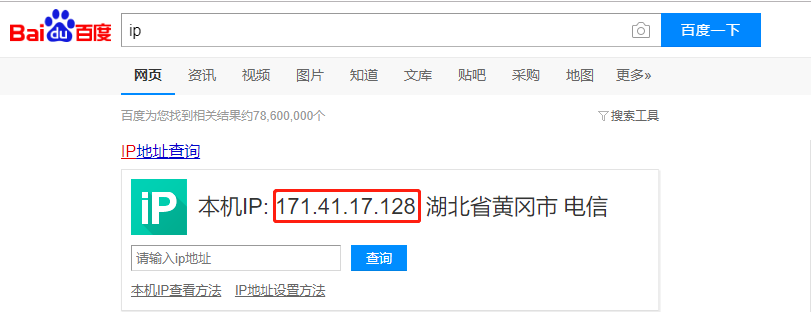
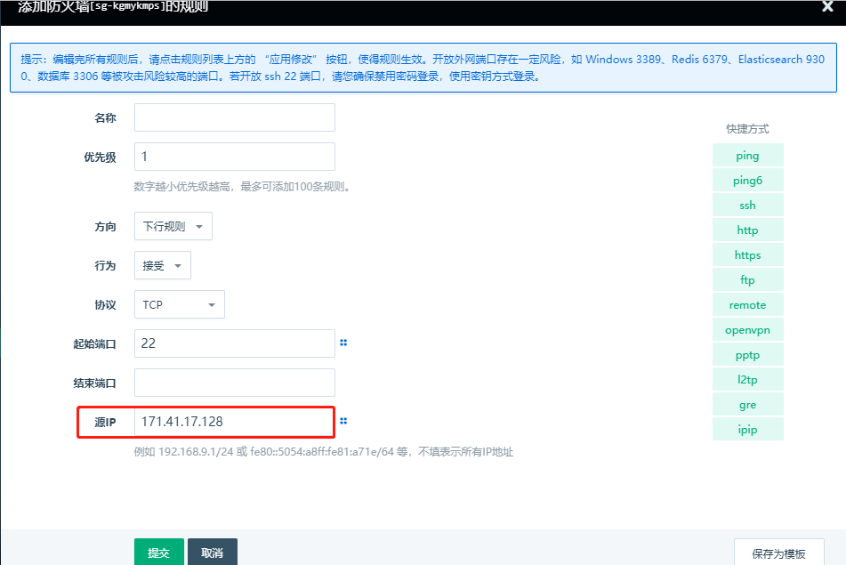
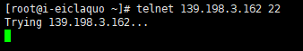

---
---

# 功能配置

**功能**

点击创建好的 VPC 网络进入其详情页面，在此可以对 VPC 网络的私有网络和管理配置做进一步修改和调整。

**私有网络**

VPC 网络的私有网络指的是一个二层子网网段，通常是一个 C 段地址；你可以根据需要将一个 VPC 网络划分成多个子网，主机必须加入到子网里面使用。

在私有网络的资源列表中可以直接添加主机、数据库和大数据资源。

**以端口转发为例**

vpc网络提供端口转发（DNAT）功能，将NAT网关上的公网IP映射给私有网络的云主机使用，使云主机可以面向互联网提供服务，比如http/https等

**配置路径**

vpc网络---管理配置---端口转发---添加规则

**名称：**自定义的名称，便于区分转发规则

**协议：**可以设置tpc/udp两种类型的协议

**源端口：**NAT网关会将以指定协议和端口访问该公网IP的请求转发到目标主机的内网端口上

**内网 IP：**主机获取的私有网络ip地址

**内网端口：**主机需要对公网暴露的端口服务，比如http/https/ssh等

比如以下的配置就可以将公网8000端口的请求转发到192.168.10.2这个主机的22号端口

请注意

1、可以针对同一个内网主机的内网端口添加多条转发规则，只要采用不同的源端口即可，添加完需要应用修改，如图

 

2、源端口可以与内网端口填写的不一致

3、可以针对同一个内网主机的多个内网服务添加多条转发规则，如

4、需要放行vpc所在防火墙源端口对应的下行规则，并应用修改防火墙，如图

5、如果想实现指定ip或者ip段访问源端口的服务，可以配置防火墙的源ip（相当于白名单）

测试端口连通性

可以使用telnet命令，比如使用非本机测试22号端口是否联通

