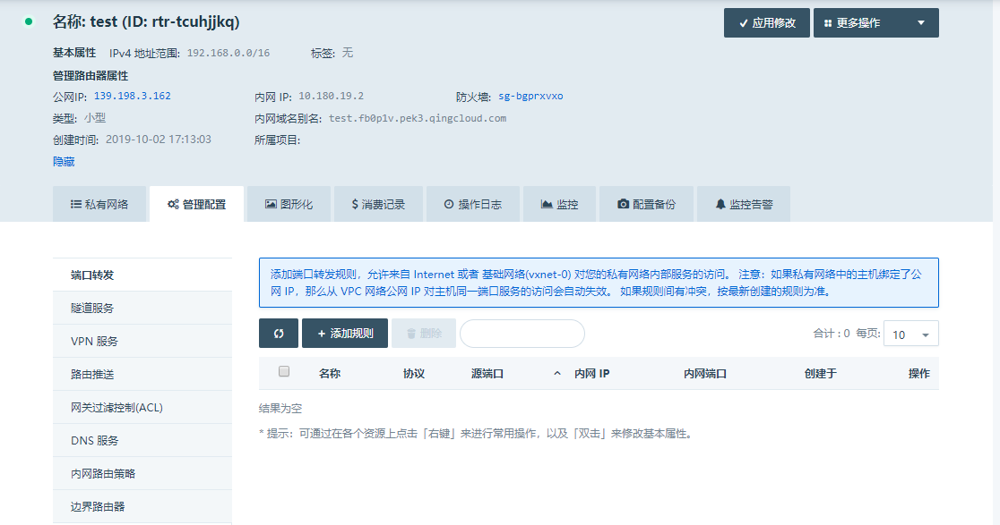

---
---

# 管理路由器

除在创建时指定的管理路由器类型及防火墙之外，管理路由器还包含以下几个属性，分别是：

**公网IP**: 管理路由器的公网 IP 地址，用于从公网访问端口转发、隧道服务( [GRE 隧道](gre.html#guide-gre) 、[IPSec 隧道](ipsec.html#guide-ipsec) )、[VPN 服务](vpn.html#guide-vpn) 等管理服务。

**内网IP**: 管理路由器的内网 IP 地址，用于从青云内网访问管理服务。

**内网域名别名**: 管理路由器的内网域名别名。

可以通过点击每个属性旁边的图标进行添加、修改、删除等操作。针对 VPC 网络本身的基本操作，比如修改、开启、关闭、扩容和删除等则在“更多操作”的下拉菜单中可以找到。