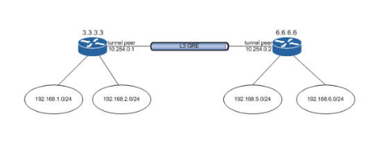
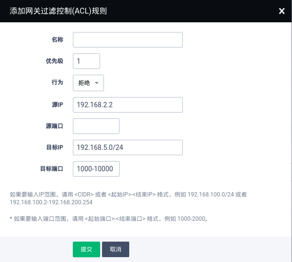

---
---

# 更多功能

VPC 网络所管理的主机具有以下几点功能：

1. 可以直接绑定公网 IP。(**注意** ：当主机绑定公网 IP 时, VPC 网络上到此主机的端口转发规则自动失效。)
2. 可以直接绑定基础网络 IP。
3. 可以绑定/解绑防火墙规则。
4. 可以作为负载均衡器的后端服务器。 详情请参看 [负载均衡器使用指南](loadbalancer.html#guide-loadbalancer) 。

以GRE隧道为例，假设现有两个VPC 网络的GRE隧道配置如下：

添加网关过滤控制规则：

通过上述配置，可实现拒绝192.168.2.2这个IP地址对192.168.5.0/24这个子网内IP，1000-10000端口范围的访问。

您可以在控制台上任意一个VPC 网络的详情页面，管理配置页签中，找到“网关过滤控制（ACL）”功能。