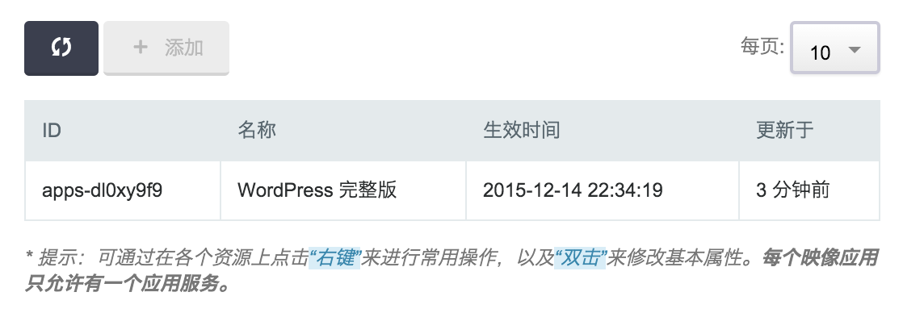
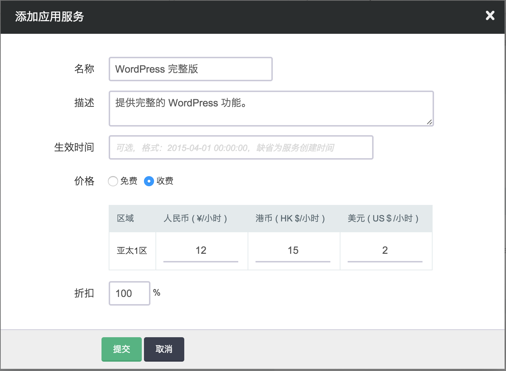

---
---

# 计费[¶](#common-billing "永久链接至标题")

上一节讲了如何创建一个最基础的映像应用，这一节介绍如何加入计费功能。

## 计费原则[¶](#id2 "永久链接至标题")

*   **每个映像应用只能创建一个服务(app_service)**
    *   服务在每个区(zone)和每种货币(cny,usd,hkd)都有对应的价格
    *   应用可以指定价格生效时间和折扣，价格未生效前，按当前价格计算。
*   每个基于市场映像创建的主机在“运行”状态下，都需要向开发者付费，由青云代为收费。
*   跟青云的其它资源一样，都是按小时扣费，按秒计费。
*   开发者基于自己提供的市场映像创建的主机只会收取 iaas 资源的费用。

## 创建应用服务[¶](#service-id "永久链接至标题")

进入青云控制台，开发者视图。点击上一篇教程创建的应用，可以进入应用详情视图，找到“应用服务”-“添加”按钮。

在创建应用服务对话框中，除了名称，描述，还可以填生效时间，不填的话就是当前时间。 然后为每个区域的每种货币定义好价格。 还可以对所有价格有个统一的折扣可以填。实际的价格 = 价格 * 折扣 %。

