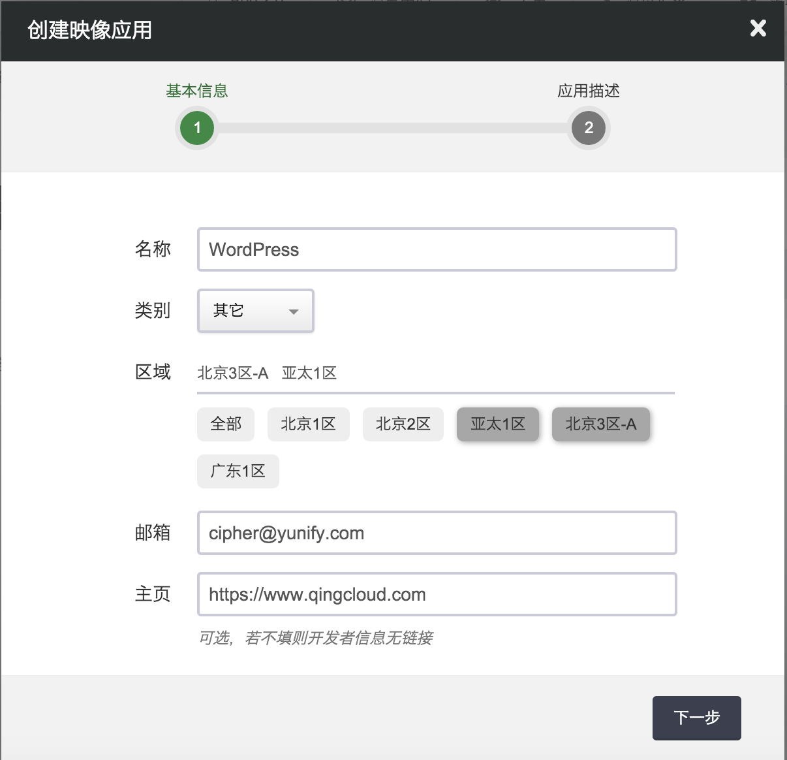
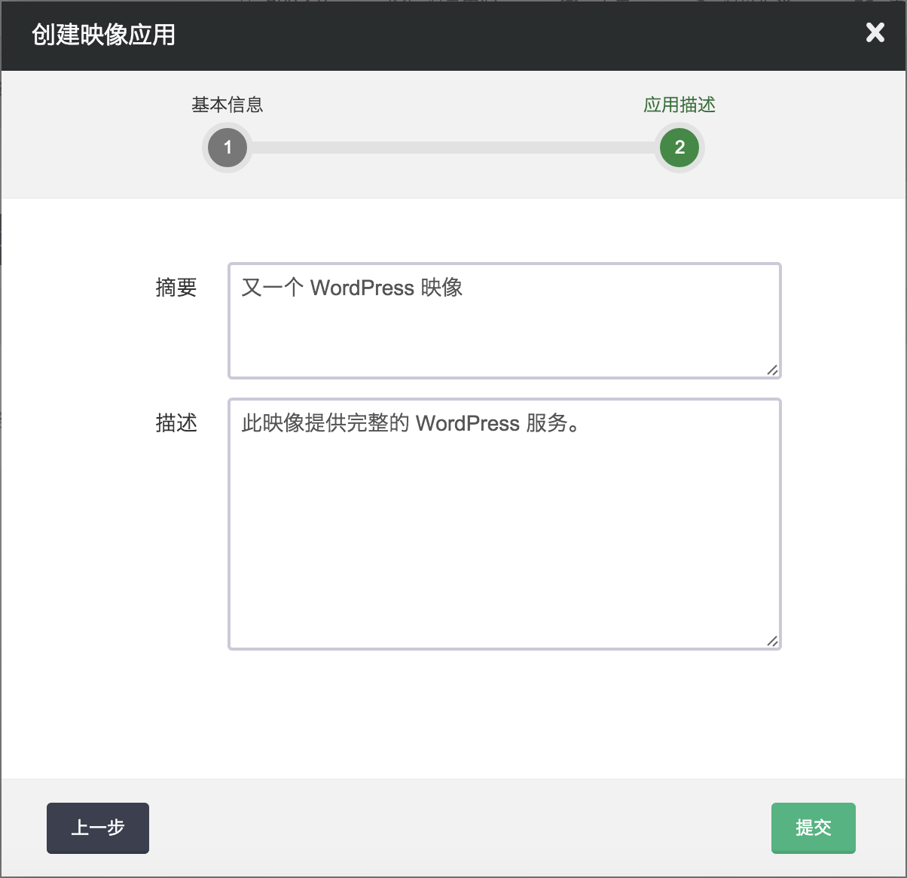
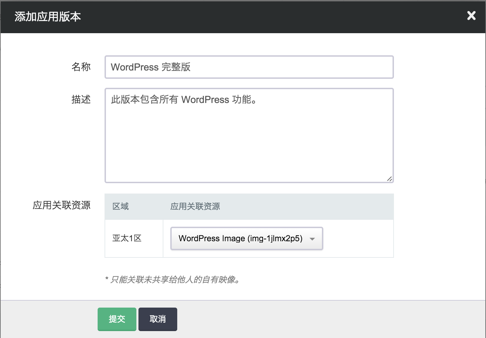

---
---

# 映像开发教程[¶](#common-tutorial "永久链接至标题")

市场映像基于开发者的自有映像创建，提交到映像市场后开放给所有用户提供更多地选择。

## 应用[¶](#id2 "永久链接至标题")

进入“开发者”视图，选择“开发映像应用”，点击“创建映像应用”：

注解

后文中会提到，映像一旦绑定，无法修改绑定关系。 因此，我们先选择开放一个区，如“亚太一区”，绑定该区的映像。 并在提交完审核通过后，在其它区重新部署或迁移该映像到其它区，再重新提交并开放到其它区。

填写更具体的信息：

## 应用版本[¶](#id3 "永久链接至标题")

“应用版本”类似于操作系统版本的概念。 对于同一个应用版本中，开放的每个区关联的映像功能应尽量保持一致。

添加“应用版本”，并绑定该区中的某一自有映像。

注解

需要注意的是，只有自有映像（不包括已共享给他人的映像）才能够提交到映像市场； 并且一旦该应用版本审核通过后，就不能修改绑定的映像资源。

如果需要提供新的版本，需要新创建一个“应用版本”。

