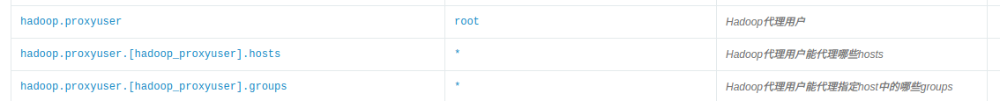
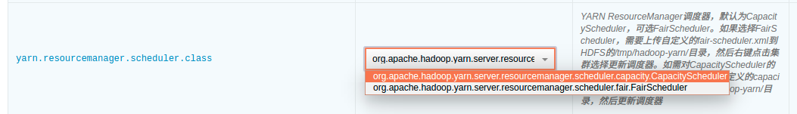
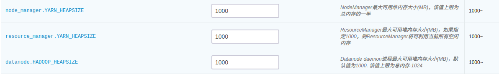
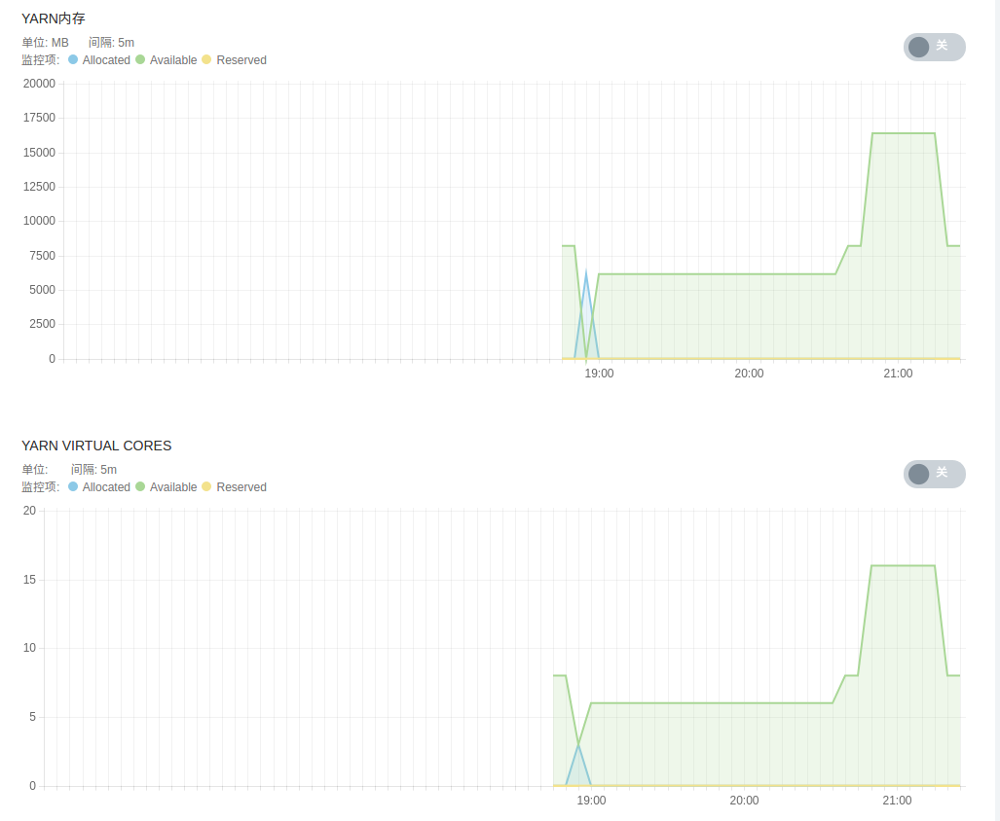
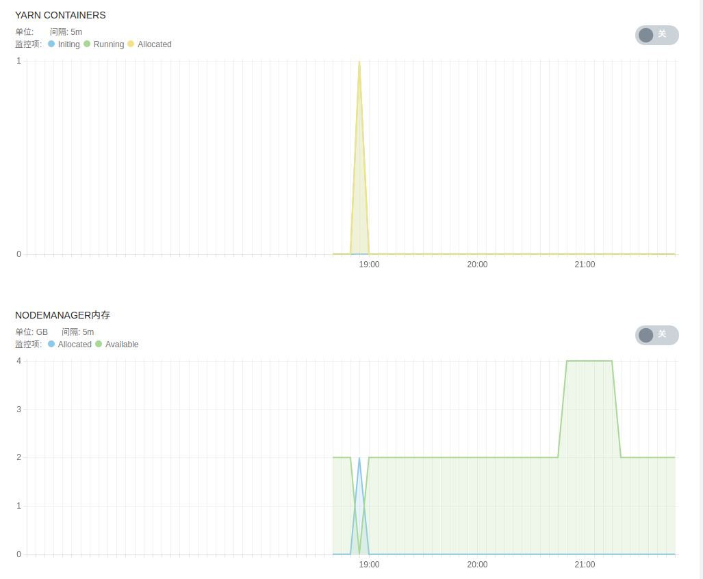

---
---

# QingMR 用户指南


## 简介

青云 QingCloud 大数据相关服务将会统一在 *QingMR* 下。 *QingMR* 目前已经集成了:

- 分布式文件系统 *HDFS* 

- 集群资源管理系统 *YARN*

- 数据处理框架 *Hadoop MapReduce*、*Spark* 和 *Flink*

- 数据仓库工具 *Hive* 

- 极速海量数据 OLAP 分析引擎 *Kylin*

陆续会有更多的基于 *HDFS* 的大数据应用被纳入到 *QingMR* 中。其他的大数据服务如 *Storm* ，*Kafka* ， *ZooKeeper* 等也将统一在 *QingMR* 品牌下。

此外 *QingMR* 中的 *Hadoop MapReduce* ，*Spark* 和 *Hive* 都与 *QingStor* 对象存储服务进行了有效的集成，使得用户可以高效地进行海量数据的低成本存储。

当前支持的组件及版本如下：

| | Hadoop | Spark | Hive | Flink |
| :------: | ------: | ------: | ------: | ------: |
| QingMR - Core 1.2.1 | 2.7.3 | 2.2.0 | 1.2.2 | - |
| QingMR - Core 1.3.0 | 2.7.3 | 2.2.0 | 2.3.4 | - |
| QingMR - Core 2.0.0 | 2.9.2 | 2.2.3 | 2.3.5 | - |
| QingMR - Core 2.5.2 | 2.9.2 | 2.2.3 | 2.3.5 | 1.9.0 |

 备注：*Kyligence Enterprise* 作为 *Kylin* 的企业版也是构建在 *QingMR* 之上，如需使用可以[点击这里](https://appcenter.qingcloud.com/apps/app-66xhycwj/Kyligence%20Enterprise%20%20-%20Apache%20Kylin%20%E4%BC%81%E4%B8%9A%E7%89%88)获取。

  > 更多组件，敬请期待


### *QingMR* 功能概览

#### *Hadoop* 服务简介

提供 *Hadoop*  的 MapReduce、YARN、HDFS 等服务，其他特色功能包括：
- 支持用户自定义 Hadoop 代理用户及其能够代理哪些 hosts 和这些 hosts 中的哪些 groups
- 支持上传自定义的 YARN 调度器 CapacityScheduler 和 FairScheduler，并支持在 CapacityScheduler 和 FairScheduler 之间进行切换

#### *Spark* 服务简介
提供 *Spark* 的 Spark streaming、Spark SQL、DataFrame and DataSet、Structed Streaming、MLlib、GraphX、SparkR 等服务，其他特色功能包括：
- 同时支持 Spark Standalone 和 Spark on YARN 两种模式
- 为了方便用户提交 Python Spark 应用，提供了 Anaconda 发行版的 Python 2.7.13 和 Python 3.6.1 。用户可以选择 Python Spark 应用的运行环境，支持在 Python2 和 Python3 之间进行切换
- 为了方便用户开发 Python Spark 机器学习类的应用， 分别在 Anaconda 发行版的 Python2 和 Python3 内提供了 Anaconda 发行版的数据科学包 numpy, scikit-learn, scipy, Pandas, NLTK and Matplotlib
- 为了方便用户开发 Spark R 应用，提供了R语言运行时。
- 支持上传自定义的 Spark 应用内调度器 Fair Schudeler，并支持 spark 应用内调度模式在 FIFO 和 FAIR 切换
- 支持基于 Spark 的分布式深度学习框架 BigDL （从 QingMR 2.0.0 开始支持）

#### *Hive* 服务简介
提供 *Hive*  的以 SQL 语法读、写和管理分布式大规模数据集的 SQL on Hadoop 数据仓库服务，其他特色功能包括：
- 同时支持 Hive on MapReduce 和 Hive on Spark 两种模式并可进行切换 (其中 Hive on Spark 从 QingMR 1.3.0 开始支持)

#### *Flink* 服务简介
提供 *Flink* 的 DataStream and DataSet、CEP、Table、FlinkML、Gelly 等服务，其他特色功能包括：
- 支持 Flink on YARN 模式

#### 各组件公共服务简介
- 配置参数增加到 80 多个，定制服务更方便
- 针对 HDFS, YARN, Spark 和 Flink 服务级别的监控告警、健康检查与服务自动恢复
- Hadoop, Spark 和 Hive 均可通过 S3 协议与 QingStor 对象存储集成
- 支持水平与垂直扩容
- 可选 Client 节点（为了使用上述全部功能，建议 Client 节点为必选），全自动配置无需任何手动操作
- 指定依赖服务，自动添加依赖服务中的所有节点到 QingMR 所有节点的 hosts 文件中

## 部署 QingMR 服务

### 第 1 步：基本设置


填写服务`名称`和`描述`，选择版本 
> QingMR 版本越高，其包含的 Hadoop, Spark, Hive, Flink 等组件的版本也越高 (详见简介部分)，请根据业务需求选择相应版本。
> QingMR 包含众多角色的节点，区分`基础型`及`增强型`两种资源配置类型是为了方便用户快速创建 QingMR 服务，两种资源配置类型的区别是各角色节点的 CPU, 内存等规格不同，用户也可以选择自定义各节点的规格。以下第 2 ~ 5 步均为用户选择`自定义`配置时生效，选择`基础型`或`增强型`请直接从第 6 步开始。

### 第 2 步：HDFS 主节点设置


填写 HDFS 主节点 CPU、内存、节点类型、数据盘类型及大小等配置信息。

### 第 3 步：主节点设置


填写主节点 CPU、内存、节点类型、数据盘类型及大小等配置信息。

### 第 4 步：从节点设置


填写 从节点 CPU、内存、节点类型、数据盘类型及大小等配置信息。

### 第 5 步：Client 节点设置


填写 Client 节点 CPU、内存、节点类型、数据盘类型及大小等配置信息。 Client 节点为可选，如不需要可设置`节点数量`为0。建议选配 Client 节点，否则某些功能无法使用（除非手动下载相关软件包并配置好）。
> Client 节点为用户可访问的节点，可以用它来访问 HDFS ，和集群交互如提交 job 等。该节点用户名为 ubuntu ，初始密码为 p12cHANgepwD

### 第 6 步：网络设置


出于安全考虑，所有的集群都需要部署在私有网络中，选择自己创建的已连接路由器的私有网络中

### 第 7 步：依赖服务设置


依赖服务 External Service , 选择所依赖的服务可以将其中所有节点加入本服务所有节点的 hosts 文件中。 HBase 与 Hadoop 或者 Spark 集成的场景经常会有这种需求，选定依赖 HBase 集群即可自动添加 hosts ，无需由工程师在后台手动添加。

### 第 8 步：服务环境参数设置


提供了 80 多个服务环境参数可以配置，默认仅显示其中 3 个。可以点击`展开配置`对所有配置项进行修改，也可使用默认值并在集群创建后弹性进行修改。

### 第 9 步：用户协议

阅读并同意青云 APP Center 用户协议之后即可开始部署应用。


## QingMR 使用指南

### 查看服务详情


创建成功后，点击集群列表页面相应集群可查看集群详情。可以看到集群分为 HDFS 主节点、主节点、从节点和 Client 节点四种角色。其中主节点上运行着诸多服务如 YARN Resource Manager ，Spark Standalone 模式下的 Spark Master（从1.1.0开始默认关闭），Hive Metastore（默认关闭），HiveServer2（默认关闭）；用户可以直接访问 client 节点，并通过该节点与集群交互如提交 Hadoop/Spark/Hive job 、查看/上传/下载 HDFS 文件、运行 Hive 查询等。

- 进入集群详情页面后，点击`服务详情`即可查看各节点的运行服务：


> 以下场景均在 root 用户下测试通过

> 如以非 root 用户比如用户 ubuntu 运行 Spark on YARN job 或 Hive on Spark job，需要首先运行如下命令：

> `/opt/hadoop/bin/hdfs dfs -mkdir -p /user/ubuntu/`

> `/opt/hadoop/bin/hdfs dfs -chown -R ubuntu:ubuntu  /user/ubuntu/`

> 如以非 root 用户运行 MapReduce job 或者上传文件到 HDFS ，也需要具有相应目录的读写权限


### 1. Spark 使用指南

#### 1.1 开启/关闭 Spark Standalone 模式

用户可以选择是否开启 Spark Standalone 模式（从 1.1.0 开始默认关闭）。

- 开启后用户可以以 Spark Standalone 模式提交 Spark 应用
- 关闭后用户可以以 Spark on YARN 模式提交 Spark 应用
- 如仅以 Spark on YARN 模式提交 Spark 应用或者仅使用 Hadoop 相关功能，则可以选择关闭 Spark Standalone 模式以释放资源。
- 此选项最好不要和其他配置参数项一起改，单独改动此项然后保存设置是推荐的作法。


#### 1.2 以 Spark-shell 模式运行 Spark job

> enable_spark_standalone 设置为 true 时，以下测试代码可以直接运行；设置为 false 时，需将 master 参数指定为 yarn，然后将测试文件上传到 hdfs，并修改代码中文件路径为 hdfs 上的文件路径，例如 hdfs:///user/ubuntu/README.md。

- Scala

```shell
cd /opt/spark
bin/spark-shell --master spark://<主节点IP>:7077

val textFile = spark.read.textFile("file:///opt/spark/README.md")
textFile.count()
textFile.filter(line => line.contains("Spark")).count()
```

- Python

```shell
cd /opt/spark
bin/pyspark --master spark://<主节点IP>:7077

textFile = spark.read.text("file:///opt/spark/README.md")
textFile.count()
textFile.filter(textFile.value.contains("Spark")).count()
```

- R

```shell
cd /opt/spark
bin/sparkR --master spark://<主节点IP>:7077

df <- as.DataFrame(faithful)
head(df)
people <- read.df("file:///opt/spark/examples/src/main/resources/people.json", "json")
printSchema(people)
```

#### 1.3 以 Spark Standalone 模式运行 Spark job

> 需设置 `enable_spark_standalone` 为 true

- Scala

```shell
cd /opt/spark

bin/spark-submit --class org.apache.spark.examples.SparkPi --master spark://<主节点IP>:7077 examples/jars/spark-examples_2.11-<spark_version>.jar 100
```

- Python

```shell
cd /opt/spark

bin/spark-submit --master spark://<主节点IP>:7077 examples/src/main/python/pi.py 100
```

可以在配置参数页面切换 Python 版本  


- R

```shell
cd /opt/spark

bin/spark-submit --master spark://<主节点IP>:7077 examples/src/main/r/data-manipulation.R examples/src/main/resources/people.txt
```

#### 1.4 以 Spark on YARN 模式运行 Spark job

> 需设置 `enable_spark_standalone` 为 false

- Scala

```shell
cd /opt/spark

bin/spark-submit --class org.apache.spark.examples.SparkPi --master yarn --deploy-mode cluster --num-executors 3 --executor-cores 1 --executor-memory 1g examples/jars/spark-examples_2.11-<spark_version>.jar 100
```

- Python

```shell
cd /opt/spark

bin/spark-submit --master yarn --deploy-mode client examples/src/main/python/pi.py 100
```

- R

```shell
cd /opt/spark

bin/spark-submit --master yarn --deploy-mode cluster /opt/spark/examples/src/main/r/ml/kmeans.R
```

#### 1.5 更新自定义 Spark 应用内调度器

Spark 支持两种应用内调度器 FIFO（默认）和 FAIR。
为了支持用户自定义 Spark 应用内 FAIR 调度器的需求，QingMR 支持用户上传自定义的 FAIR 调度器，步骤如下：

1. 自定义 Spark 应用内 FAIR 调度器 spark-fair-scheduler.xml（文件名必须为 spark-fair-scheduler.xml）
2. 将这两个自定义调度器上传至 HDFS 的 /tmp/hadoop-yarn/ 目录
3. 右键点击集群，选择`自定义服务`，点击`更新调度器`，选择`主节点`，点击`提交`
4. 在配置参数页面切换到相应调度器


#### 1.6 Spark log 清理

可通过如下配置参数控制 Spark Standalone 模式下 Spark worker 节点的 log 清理设置：


#### 1.7 控制 Spark 占用的内存

- Spark Standalone 模式的 Spark master 进程运行在主节点上
- Spark Standalone 模式的 Spark worker 进程运行在从节点上
- 可通过如下参数配置各个进程最大占用的内存：

Spark 进程最大占用内存


#### 1.8 Spark 中使用 LZO 压缩

```shell
scala > import com.hadoop.compression.lzo.LzopCodec
scala > val lzoTest = sc.parallelize(1 to 10)
scala > lzoTest.saveAsTextFile("/test_lzo", classOf[LzopCodec])
```

#### 1.9 在 Spark 上使用 BigDL

从 QingMR 2.0.0 开始支持基于 Spark 的分布式深度学习框架 BigDL 。以下以训练经典卷积神经网络模型 LeNet5 进行示例：
- scala  

```shell
# 准备数据
mkdir ~/lenet5_data
wget http://yann.lecun.com/exdb/mnist/train-images-idx3-ubyte.gz http://yann.lecun.com/exdb/mnist/train-labels-idx1-ubyte.gz http://yann.lecun.com/exdb/mnist/t10k-images-idx3-ubyte.gz http://yann.lecun.com/exdb/mnist/t10k-labels-idx1-ubyte.gz -P ~/lenet5_data/
gunzip ~/lenet5_data/*
hdfs dfs -copyFromLocal ~/lenet5_data /

# 训练模型 (spark standalone 模式下请自行修改 master 参数)
mkdir ~/model
/opt/spark/bin/spark-submit --master yarn --deploy-mode client --driver-memory 2g --executor-memory 2g --executor-cores 2 --num-executors 2  --class com.intel.analytics.bigdl.models.lenet.Train $BIGDL_HOME/lib/bigdl-0.8.0-jar-with-dependencies.jar -f hdfs://<主节点ip>:9000/lenet5_data -b 16 --checkpoint ~/model
```

- python  

```shell
unzip $BIGDL_HOME/lib/bigdl-0.8.0-python-api.zip -d $BIGDL_HOME/lib/bigdl-0.8.0-python-api

# 训练模型 (spark on yarn)
$BIGDL_HOME/bin/spark-submit-with-bigdl.sh --master yarn --deploy-mode client --driver-memory 2g --executor-memory 2g --executor-cores 2 --num-executors 2 $BIGDL_HOME/lib/bigdl-0.8.0-python-api/bigdl/models/lenet/lenet5.py

# 训练模型 (spark standalone)
$BIGDL_HOME/bin/spark-submit-with-bigdl.sh --master spark://<主节点ip>:7077 --deploy-mode client --driver-memory 2g --executor-memory 2g --executor-cores 2 --num-executors 2 --total-executor-cores 4 $BIGDL_HOME/lib/bigdl-0.8.0-python-api/bigdl/models/lenet/lenet5.py
```

### 2. Hadoop 使用指南

#### 2.1 运行 Hadoop 测试程序，统计文件中单词出现的次数

```shell
cd /opt/hadoop
bin/hdfs dfs -mkdir /input
bin/hdfs dfs -put etc/hadoop/* /input
bin/hdfs dfs -ls /input

bin/hadoop jar share/hadoop/mapreduce/hadoop-mapreduce-examples-<hadoop_version>.jar wordcount /input /output
bin/hdfs dfs -cat /output/part-r-00000
```

#### 2.2 Hadoop 官方的 Benchmark 性能基准测试，测试的是 HDFS 分布式 I/O 读写的速度/吞吐率，依次执行下列命令

```shell
cd /opt/hadoop

# 使用6个 Map 任务并行向 HDFS 里6个文件里分别写入 1GB 的数据
bin/hadoop jar share/hadoop/mapreduce/hadoop-mapreduce-client-jobclient-<hadoop_version>-tests.jar TestDFSIO -write -nrFiles 6 -size 1GB

# 使用6个 Map 任务并行从 HDFS 里6个文件里分别读取 1GB 的数据
bin/hadoop jar share/hadoop/mapreduce/hadoop-mapreduce-client-jobclient-<hadoop_version>-tests.jar TestDFSIO -read -nrFiles 6 -size 1GB

# 清除以上生成的数据
bin/hadoop jar share/hadoop/mapreduce/hadoop-mapreduce-client-jobclient-<hadoop_version>-tests.jar TestDFSIO -clean

您能看到 HDFS 每秒读写文件速度，以及吞吐量的具体数值。
```

#### 2.3 Hadoop 官方的 Benchmark 性能基准测试，测试的是大文件内容的排序，依次执行下列命令：

```shell
cd /opt/hadoop

# 生成1000万行数据到 /teraInput 路径中
bin/hadoop jar share/hadoop/mapreduce/hadoop-mapreduce-examples-<hadoop_version>.jar teragen 10000000 /teraInput

# 将/teraInput 中生成的1000万行数据排序后存入到 /teraOutput 路径中
bin/hadoop jar share/hadoop/mapreduce/hadoop-mapreduce-examples-<hadoop_version>.jar terasort /teraInput /teraOutput

# 针对已排序的 /teraOutput 中的数据，验证每一行的数值要小于下一行
bin/hadoop jar share/hadoop/mapreduce/hadoop-mapreduce-examples-<hadoop_version>.jar teravalidate -D mapred.reduce.tasks=8 /teraOutput /teraValidate

# 查看验证的结果
bin/hdfs dfs -cat /teraValidate/part-r-00000
```

#### 2.4 以 Hadoop 代理用户运行 MapReduce 和 Spark on YARN job

本场景将 root 设置为代理用户，并在 root 用户下模拟用户 ubuntu 提交 job ：

- 第一步：可通过如下配置参数配置 Hadoop 代理用户及其所能代理的 hosts 和 groups ，配置 root 为 proxyuser，该用户能代理任意 host 中任意 group 内的用户：



> hosts 或 groups 中填写* 代表任意 host 或任意 group 。 hosts 和 groups 中也可以填写以逗号分割的 host name/ip 或者 group 名。详见 hadoop 官方文档[Proxy user setting](http://hadoop.apache.org/docs/r2.7.3/hadoop-project-dist/hadoop-common/Superusers.html)

- 第二步： root 用户下创建以 ubuntu 用户运行 job 所需的 HDFS 目录及权限

```shell
/opt/hadoop/bin/hdfs dfs -mkdir -p /user/ubuntu/
/opt/hadoop/bin/hdfs dfs -chown -R ubuntu:ubuntu /user/ubuntu/
```

- 第三步：设置要代理的是哪个用户，此处是 root 用户要代理 ubuntu ，所以设为 ubuntu

`export HADOOP_PROXY_USER=ubuntu`

- 第四步：运行 MapReduce job

```shell
cd /opt/hadoop
bin/yarn jar share/hadoop/mapreduce/hadoop-mapreduce-examples-<hadoop_version>.jar pi 16 10000
```

- 第五步：运行 Spark on YARN job

```shell
cd /opt/spark
bin/spark-submit --master yarn --deploy-mode client examples/src/main/python/pi.py 100
```

- 第六步：查看 YARN applications UI 页面，可以看到虽然是在 root 用户下提交的 job ，但是 user 都显示为 ubuntu


#### 2.5 更新自定义 YARN 调度器

YARN 支持两种调度器 CapacityScheduler（默认）和 FairScheduler。
为了支持用户更多自定义调度器的需求，QingMR 支持用户上传自定义调度器，步骤如下：

- 第一步：自定义 CapacityScheduler capacity-scheduler.xml 或者 FairScheduler fair-scheduler.xml（文件名必须为 capacity-scheduler.xml 或者 fair-scheduler.xml）
- 第二步：将这两个自定义调度器上传至 HDFS 的 /tmp/hadoop-yarn/ 目录
- 第三步：右键点击集群，选择`自定义服务`，点击`更新调度器`，选择`主节点`，点击`提交`


- 第四步：在配置参数页面切换到相应调度器



> 注：如果更新的自定义调度器和配置参数里 yarn.resourcemanager.scheduler.class 类型一致，则需要切换到另一种类型的调度器，保存设置后，再切换回来重新保存以达到重启集群使新的自定义调度器生效的目的。
> 例如：自定义的调度器为 capacity-scheduler.xml ，上传这个文件到 HDFS 并更新调度器后，因 yarn.resourcemanager.scheduler.class 也是 CapacityScheduler ，为了使得新的 capacity-scheduler.xml 生效，需要在配置参数页面切换 yarn.resourcemanager.scheduler.class 到 FairScheduler ，保存设置后再切换到 CapacityScheduler ，然后再次保存设置。

#### 2.6 YARN log 收集

QingMR 支持将 YARN log 收集到 HDFS 指定目录，并可指定保持时间、保持目录等，可在配置参数页面配置：


#### 2.7 控制 HDFS、YARN 占用的内存

- YARN Resource Manager 进程运行在主节点上
- HDFS datanode 以及 YARN NodeManager 进程都运行在从节点上
- 可通过如下参数配置各个进程最大占用的内存：

YARN 及 HDFS 进程最大占用内存


#### 2.8 MapReduce 中使用 LZO 压缩

Hadoop 从 QingMR 2.0.0 开始支持 lzo 压缩，使用时请注意以下事项：

- lzo 文件默认不支持分片，需为其添加索引文件，才能支持多个 map 并行地对 lzo 文件进行处理。  
- 作业的输入格式需设置为 `job.setInputFormatClass(LzoTextInputFormat.class)` ，该类在 `${HADOOP_HOME}/share/hadoop/common/lib/hadoop-lzo-0.4.20.jar` 中。

### 3. Hive 使用指南

Hive 的 Hive Metastore 和 HiveServer2 服务已经在主节点配置完成（默认关闭），用户不需要手动配置。只需设置配置参数 `开启 Hive` 为 true 就可以启动这两个服务，然后即可在 Client 节点运行 Hive 命令行使用 Hive。

主节点上同时运行了 mysql 数据库服务，用于存储 Hive 的元数据（ 默认用户名和密码： hive/hive ）。

Hive 元数据可靠性要求较高时，用户可以选择使用集群外远程 mysql 数据库，只需按下述步骤创建具有相应权限的用户，然后正确设置 `使用远程 mysql 数据库`，`远程 mysql 数据库 ip`，`Hive Metastore 用户名`，`Hive Metastore 密码` 等几个配置参数即可。 ( mysql 默认只允许本地登录，请注意开启远程访问权限，一般修改配置文件 /etc/mysql/my.conf 中的 bind-address 为 0.0.0.0 或远程访问 IP 并重启 mysql 服务即可)
```shell
# 以下命令需要使用任意 mysql 客户端连接远程 mysql 数据库执行
# 创建用户：
mysql> create user '<username>'@'%' identified by '<password>';
# 授权：
mysql> grant all privileges on hive.* to '<username>'@'%';
# 刷写权限：
mysql> flush privileges;
```
如果以 spark 作为 Hive 的执行引擎 (从 QingMR 1.3.0 开始支持，且作为默认执行引擎)，在操作 Hive 之前请先在 hdfs 上创建相应的用户目录。例如若以用户 ubuntu 操作 Hive，需首先以 root 用户运行以下命令：
```
# 切换 root 用户请使用命令 sudo su , 密码 p12cHANgepwD
/opt/hadoop/bin/hdfs dfs -mkdir -p /user/ubuntu/
/opt/hadoop/bin/hdfs dfs -chown -R ubuntu:ubuntu /user/ubuntu/
```

#### 3.1 在 Hive 数据仓库中创建一个数据库

在Hive中创建数据库需要以 root 用户身份进行操作，而在实际生产环境中，我们建议您尽量避免以 root 用户执行 Hive 语句。 因此，通过 root 身份创建数据库后，需要更改数据库的所有者。

```shell
# 在 root 下创建一个名为 test 的数据库：
/opt/hive/bin/hive -e "create database test;"

# 在 root 用户下执行下面命令将数据库 test 的拥有者更改为 ubuntu 后，即可以 ubuntu 用户执行后续操作：
/opt/hadoop/bin/hdfs dfs -chown -R ubuntu /user/hive/warehouse/test.db
```

Hive创建数据库执行成功后会显示执行时间，您也可以通过下面即将提到的命令查看已创建的数据库

#### 3.2 在 Hive 的数据库中创建一张表

```shell
# 这里以默认配置下，CLI 操作为例。首先，启动 CLI ，执行( CLI 中的用户身份是启动 CLI 时 Linux 所用的用户身份)：
/opt/hive/bin/hive

# 启动之后，查看刚刚创建的数据库：
hive> SHOW DATABASES;

# 可以看到目前 Hive 数据仓库中的数据库名。切换到 test 数据库，执行：
hive> USE test;

# 在 test 数据库下创建一个 invites 表，包含两个普通列和一个分区列：
hive> CREATE TABLE invites (foo INT, bar STRING) PARTITIONED BY (ds STRING);

# 查看创建的 invites 表：
hive> SHOW TABLES;
```

#### 3.3 向 Hive 中的表载入数据

```shell
# 向刚刚创建的invites表载入数据，数据源使用本地文件。
hive> LOAD DATA LOCAL INPATH '/opt/hive/examples/files/kv2.txt' OVERWRITE INTO TABLE invites PARTITION (ds='2008-08-15');
hive> LOAD DATA LOCAL INPATH '/opt/hive/examples/files/kv3.txt' OVERWRITE INTO TABLE invites PARTITION (ds='2008-08-08');
```

#### 3.4 执行 HQL 查询语句

```shell
# 查找invites表中 ‘ds=2008-08-08’ 的 ‘foo’ 列的所有内容：
# 这里并没有执行结果导出语句，因此查询的结果不会保存在任何地方，只是从CLI中显示出来。
hive> SELECT a.foo FROM invites a WHERE a.ds='2008-08-08';

# 执行运算，计算invites表中，’ds=2008-08-15’的‘foo’列的平均值：
# Hive服务将自动把HQL查询语句转换为MapReduce运算，并调用Hadoop集群进行计算。您也可以在yarn监控中查看该语句的执行进度。
hive> SELECT AVG(a.foo) FROM invites a WHERE a.ds='2008-08-15';
```

#### 3.5 Hive 执行引擎
支持 mr 和 spark 两种执行引擎(其中 spark 引擎从 QingMR 1.3.0 开始支持，并且作为默认执行引擎)，可以通过以下方式进行切换：
- 集群级别的切换  
在整个集群生效，具体请在配置参数页面进行切换：


- 会话级别的切换  
切换到 mr 执行引擎：
```shell
# 只在当前 session 下有效
hive> set hive.execution.engine=mr;
```
切换到 spark 执行引擎：
```shell
# 只在当前 session 下有效
hive> set hive.execution.engine=spark;
```
>以 spark 作为 hive 的执行引擎时，对 cpu 、内存等硬件资源的要求较高，请注意根据业务情况对集群进行扩容。

#### 3.6 Hive 中使用 LZO 压缩
Hive 从 QingMR 2.0.0 开始支持 lzo 压缩：
```shell
# 创建支持 lzo 压缩的表
hive> use test;
hive> create table invites_lzo (foo int, bar string) partitioned by (ds string) 
    > row format delimited fields terminated by '\t' 
    > stored as inputformat "com.hadoop.mapred.DeprecatedLzoTextInputFormat" 
    > outputformat "org.apache.hadoop.hive.ql.io.HiveIgnoreKeyTextOutputFormat";

# 写入数据 (请先参考 3.3 向 invites 表写入数据)
hive> set hive.exec.dynamic.partition=true;
hive> set hive.exec.dynamic.partition.mode=nonstrict;
hive> set hive.exec.compress.output=true;
hive> set mapreduce.output.fileoutputformat.compress.codec=com.hadoop.compression.lzo.LzopCodec;
hive> set mapreduce.output.fileoutputformat.compress=true;
hive> insert overwrite table invites_lzo partition(ds) select foo, bar, ds from invites;
```

#### 3.7 通过 beeline 执行 HQL
beeline 是 Hive 的另一命令行客户端工具，后续将替代 Hive Cli 。 beeline 支持远程模式和嵌入模式：嵌入模式下，运行嵌入式的 Hive (类似于 Hive Cli)，直接编译 HQL，然后访问 MetaStore 、 提交作业；远程模式下，通过 Thrift 提交 HQL 到 HiveServer2 服务，由 HiveServer2 编译 HQL、 访问 MetaStore 和提交作业。 推荐使用远程模式，该模式下不需要直接访问 hdfs 和 MetaStore ，更为安全。
- 远程模式  
```shell
# 以远程模式启动，将连接到 hiveserver2 服务，请在 Linux 命令行下执行下面命令（非 Hive 命令行）
beeline -u jdbc:hive2://<主节点IP>:10000 -n ubuntu
# 启动之后可以执行 hql
0: jdbc:hive2://<主节点IP>:10000> show databases;
```
- 嵌入模式  
```shell
# 以嵌入模式启动，类似 Hive Cli, 请在 Linux 命令行下执行下面命令（非 Hive 命令行）
beeline -u jdbc:hive2:///
# 启动之后可以执行 hql
0: jdbc:hive2:///> show databases;
```
>以 beeline 远程模式提交到 HiveServer2 服务的 hql 任务，可在 HiveServer2 WEB UI (http://<主节点IP\>:10002) 界面上看到相应的运行信息。
>退出 beeline 请使用命令 `!quit`, 输入 `!help` 查看更多 beeline 命令

### 4. 与 QingStor 对象存储集成

QingStor 对象存储为用户提供可无限扩展的通用数据存储服务，具有安全可靠、简单易用、高性能、低成本等特点。用户可将数据上传至 QingStor 对象存储中，以供数据分析。由于 QingStor 对象存储兼容 AWS S3 API，因此 Spark 与 Hadoop 都可以通过 AWS S3 API 与 QingStor 对象存储高效集成，以满足更多的大数据计算和存储场景。有关 QingStor 的更多内容，请参考 [QingStor 对象存储用户指南](https://docs.qingcloud.com/qingstor/guide/index.html)
>目前 QingStor 对象存储的开放了 pek3b、pek3c、pek3d、sh1a、gd2a、gd2b 区，后续还将开发其他区域。

如需与QingStor对象存储集成，需要首先在配置参数页面填写如下信息：  


#### 4.1 Spark 与 QingStor 对象存储集成

>有两种方式可以启动 Spark job： 通过 spark-shell 交互式运行和通过 spark-submit 提交 job 到 Spark 集群运行，这两种方式都需要通过选项 "--jars $SPARK_S3" 来指定使用 S3 API相关的 jar 包。

假设您在 QingStor 上的 bucket 为 my-bucket, 下面以 spark-shell 为例， 列出常见的 Spark 与 QingStor 集成场景。

- 在 Spark 中读取到 HDFS 上的文件后将其存储到 QingStor 中

```shell
# 首先需要将本地的一个测试文件上传到 QingMR 集群的 HDFS 存储节点上：
cd /opt/hadoop
bin/hdfs dfs -mkdir /input
bin/hdfs dfs -put /opt/spark/README.md /input/

# 然后启动 spark-shell, 输入并执行如下代码将会读取 HDFS 上的 README.md 文件, 然后将其存为 QingStor 中 "my-bucket" 下的 test 文件：
cd /opt/spark
bin/spark-shell --master spark://< 主节点IP >:7077 --jars $SPARK_S3

val qs_file = sc.textFile("hdfs://<hdfs-master-ip>:9000/input/README.md")
qs_file.saveAsTextFile("s3a://my-bucket/test")
```

- 在 Spark 中读取 QingStor 上的文件，处理过后再存储到 HDFS 文件系统中

```shell
val qs_file = sc.textFile("s3a://my-bucket/test")
qs_file.count()
qs_file.saveAsTextFile("hdfs://<hdfs-master-ip>:9000/output/")
```

- 在 Spark 中读取 QingStor 上的文件， 经过处理后将结果存回 QingStor

```shell
#如下代码将会读取 QingStor 中 my-bucket 下的 test 文件， 从中选出包含字符串 "Spark" 的行， 最后将结果存储到 my-bucket 下的 qingstor-output 文件中
val qs_file = sc.textFile("s3a://my-bucket/test").filter(line => line.contains("Spark"))
qs_file.saveAsTextFile("s3a://my-bucket/output1")
```

- 在 Spark 中创建元素值为 1 到 1000 的数组， 找出其中的奇数并对其求平方， 最后将结果存储到 QingStor 上的文件中

```shell
val data = for (i <- 1 to 1000) yield i
sc.parallelize(data).filter(_%2 != 0).map(x=>x*x).saveAsTextFile("s3a://my-bucket/output2")
```


#### 4.2 Hadoop 与 QingStor 对象存储集成

- 本地文件和对象存储之间的上传下载

```shell
cd /opt/hadoop
# 从Client 主机本地上传文件到 QingStor 对象存储
bin/hdfs dfs -mkdir s3a://{{bucket_name}}/${dir}
bin/hdfs dfs -put LICENSE.txt s3a://{{bucket_name}}/${dir}/

# 将文件从 QingStor 对象存储下载到Client 主机本地
bin/hdfs dfs -get s3a://{{bucket_name}}/${dir}/LICENSE.txt
```

- HDFS文件系统和对象存储之间的数据传输

```shell
cd /opt/hadoop
# 将文件从 QingStor 对象存储拷贝到 HDFS 文件系统
bin/hadoop distcp -libjars $HADOOP_S3 s3a://{{bucket_name}}/${dir}/LICENSE.txt /LICENSE.txt

# 将文件从 HDFS 文件系统拷贝到 QingStor 对象存储存储空间中
bin/hadoop distcp -libjars $HADOOP_S3 /LICENSE.txt s3a://{{bucket_name}}/${dir}/
```

- 将对象存储作为 MapReduce job 的输入/输出

```shell
cd /opt/hadoop

# 将 QingStor 对象存储中的文件作为 MapReduce 的输入，计算结果输出到 HDFS 文件系统中
bin/hadoop jar share/hadoop/mapreduce/hadoop-mapreduce-examples-<hadoop_version>.jar wordcount -libjars $HADOOP_S3 s3a://your_bucket/LICENSE.txt /test_output

# 将 QingStor 对象存储中的文件作为 MapReduce 的输入，计算结果依然输出到 QingStor 对象存储的存储空间中
bin/hadoop jar share/hadoop/mapreduce/hadoop-mapreduce-examples-<hadoop_version>.jar wordcount -libjars $HADOOP_S3 s3a://your_bucket/LICENSE.txt s3a://your_bucket/your_folder/

# 将 HDFS 中的文件作为 MapReduce 的输入，计算结果输出到 QingStor 对象存储的存储空间中
bin/hadoop jar share/hadoop/mapreduce/hadoop-mapreduce-examples-<hadoop_version>.jar wordcount -libjars $HADOOP_S3 /LICENSE.txt s3a://your_bucket/

```


#### 4.3 Hive 与 QingStor 对象存储集成

- 创建以 QingStor 为默认存储引擎的 Database

```shell
# 首先在 QingStor 的 bucket 中创建一个目录，这里命名为 test_s3 ，然后创建 Database
hive> create database test_s3 location 's3a://<your_bucket_name>/test_s3';
```

- 在以 QingStor 为默认存储引擎的 Database 中创建 Table ，并执行查询

```shell
# 创建table，并载入测试数据
hive> use test_s3;
hive> CREATE TABLE invites (foo INT, bar STRING) PARTITIONED BY (ds STRING);
hive> LOAD DATA LOCAL INPATH '/opt/hive/examples/files/kv2.txt' OVERWRITE INTO TABLE invites PARTITION (ds='2008-08-15');
hive> LOAD DATA LOCAL INPATH '/opt/hive/examples/files/kv3.txt' OVERWRITE INTO TABLE invites PARTITION (ds='2008-08-08');

# 执行查询
hive> SELECT * FROM invites LIMIT 10;
hive> SELECT avg(a.foo) FROM invites a WHERE a.ds='2008-08-15';
```

- 创建以 HDFS 为默认存储引擎的 Database ，并创建基于 QingStor 的外部表（使用示例 2 通过 Hive 导入 QingStor 的数据）

```shell
# 在 root 下创建一个名为 test 的数据库：
/opt/hive/bin/hive -e "create database test_hdfs;"
# 在 root 用户下执行下面命令将数据库 test_hdfs 的拥有者更改为 ubuntu 后，即可以 ubuntu 用户执行后续操作：
/opt/hadoop/bin/hdfs dfs -chown -R ubuntu /user/hive/warehouse/test_hdfs.db

# 创建基于QingStor的外部表，并加入已有partition
hive> use test_hdfs;
hive> CREATE EXTERNAL TABLE IF NOT EXISTS invites_s3 (foo INT, bar STRING) PARTITIONED BY (ds STRING) Location 's3a://<your_bucket_name>/test_s3/invites';
hive> ALTER TABLE invites_s3 ADD PARTITION (ds='2008-08-15');
hive> ALTER TABLE invites_s3 ADD PARTITION (ds='2008-08-08');
```

- 将 QingStor 中的数据导入以 HDFS 为存储的 Hive 表

```shell
# 创建以HDFS为存储的Hive表
hive> CREATE TABLE IF NOT EXISTS invites (foo INT, bar STRING) PARTITIONED BY (ds STRING);

# 这里在做数据导入时，为了动态创建分区，设置hive.exec.dynamic.partition.mode=nonstrict。
# 为了防止误操作导致动态创建大量分区，一般情况下应使用默认配置hive.exec.dynamic.partition.mode=strict
hive> set hive.exec.dynamic.partition.mode=nonstrict;
# 将QingStor中的数据导入
hive> INSERT OVERWRITE table invites partition (ds) select se.foo,se.bar,se.ds from invites_s3 se;
```

### 5. Flink 使用指南

QingMR 中的 Flink 以 Flink on YARN 模式运行，支持创建 Flink YARN Session ( Flink Cluster on YARN )，以及在  YARN 上运行 Standalone Flink job。

#### 5.1 Flink YARN Session ( Flink Cluster on YARN )

创建 Flink YARN Session 会在 YARN 中创建一个常驻的 Flink 集群，用户可以向此 Flink 集群提交 job。 此 Flink 集群占用的资源不会被其他  Flink 集群或者 YARN 管理的其他组件占用。 Flink YARN Session 模式适合运行小规模短时间的 job。
<span id="511"></span>

##### 5.1.1 创建 Flink YARN Session

```shell
cd /opt/flink/
./bin/yarn-session.sh
```

yarn-session 常用参数：

| 参数 | 描述 |
| :------ | :------ |
| -n,--container <arg> | taskmanager 的个数 |
| -d,--detached | 以 detached 模式运行，Flink YARN client 会在 Flink Session 创建完成后退出 |
| -jm,--jobManagerMemory <arg> | JobManager 内存大小 |
| -s,--slots <arg> | TaskManager 的 slots 个数，建议与从节点CPU核数相同 |
| -tm,--taskManagerMemory <arg> | TaskManager 内存大小 |


示例，创建一个有拥有 3 个 TaskManager 的 Session，每个 TaskManager 分配 1,024M 内存，每个 TaskManager 有 1 个 slots，Session 以 detached 模式运行。
```shell
cd /opt/flink/
./bin/yarn-session.sh -n 3 -tm 1024 -s 1 -d
```

Flink YARN Session 启动成功后，会打印 JobManager 地址，如下所示。
```shell
JobManager Web Interface: http://i-0niswdgh:44000
```

##### 5.1.2 向 Flink YARN Session 提交 job

```shell
cd /opt/flink/
./bin/flink run <jar-file> <arguments>
```
flink run 常用参数：

| 参数 | 描述 |
| :------ | :------ |
| -c,--class <classname> | 带有程序入口点的类 |
| -m,--jobmanager <arg> | JobManager 地址 |


示例，运行 Wordcount。
```shell
cd /opt/flink/
./bin/flink run -m i-0niswdgh:44000 /opt/flink/examples/batch/WordCount.jar --input /
```

##### 5.1.3 停止 Flink YARN Session

执行以下命令，即可停止 Flink YARN Session。

```shell
yarn application -kill Application-Id
```

以 detached 模式运行的 Flink YARN Session 启动成功后，会打印 Application-Id：
```shell
The Flink YARN client has been started in detached mode. In order to stop Flink on YARN, use the following command or a YARN web interface to stop it:
yarn application -kill application_1571901640946_0004
```

>`application_1571901640946_0004` 即为 Application-Id。

也可以通过 YARN 命令查找 Flink YARN Session 的 Application-Id。

```shell
yarn application -list
```

#### 5.2 Standalone Flink job

用户可以直接在 YARN 上运行 Standalone Flink job，不需要提前启动 Flink 集群。 多个 Flink job 共同运行时不会相互影响。 此模式适合运行大规模长时间的 job。

```shell
cd /opt/flink/
./bin/flink run -m yarn-cluster ./examples/batch/WordCount.jar
```

#### 5.3 Flink historyserver

Flink 已完成的job存放在 hdfs:///flink/completed-jobs 目录下，默认保存时间 30 天，可以通过以下参数修改。


FLink historyserver 提供了对已完成的 job 的查看功能，historyserver部署在 HDFS 主节点上，您可以打开 web 浏览器，访问 http://host_name:8082/ 。请将其中 host_name 替换为具体的 HDFS 主节点 IP 地址或主机名。

#### 5.4 Flink日志

Flink 日志存放在 /data/flink/log 目录下，默认保存 30 个文件，可以通过以下参数修改。


## 在线伸缩

### 增加节点

可以在 QingMR 详情页点击 `新增节点` 按钮增加 `从节点` 或 `Client 节点`，可以对每个新增节点指定 IP 或选择自动分配。


### 删除节点

可以在 QingMR 详情页选中需要删除的节点，然后点击 `删除` 按钮，只能一次删除一个，并且必须等到上个节点删除后且 decommission 结束才能删除下一个节点，否则数据会丢失。删除节点过程中会锁定QingMR集群不让对其进行其它生命周期操作。

- HDFS 的 decommission 状态可以从 HDFS Name Node 的 50070 端口提供的监控信息观察到。 Decommission 是在复制即将删除节点上的数据到别的节点上，如果您的数据量比较大，这个过程会比较长。因为青云的 HDFS 副本因子默认为 2，所以当您的 QingMR 从节点数为 2 的时候就不能再删除节点。同时要预先知道其它节点的总硬盘空间足够拷贝删除节点的内容，才能进行删除。

- YARN 的 decommission 会相对较快，删除节点后会在比较短的时间内在主节点的 8088 端口观察到集群的 CPU 及内存资源的下降

> `主节点` 和 `HDFS 主节点` 不允许删除，一次删除多个 `从节点` 相关操作会失败，右上角会有提示。


### 纵向伸缩

QingMR 允许分别对各种角色的节点进行纵向的扩容及缩容。右键点击集群 ID, 选择`扩容集群`即可出现如下扩容集群界面： 


## 监控告警

### 资源级别的监控与告警

我们对 QingMR 集群的每个节点提供了资源级别的监控和告警服务，包括 CPU 使用率、内存使用率、硬盘使用率等。

### Hadoop、Spark 和 Hive 原生的监控

YARN、HDFS、Spark 和 Hive 提供了丰富的监控信息。如果需要通过公网访问这些信息您需要先申请一个公网 IP 绑定在路由器上，在路由器上设置端口转发，同时打开防火墙相应的下行端口。

`主节点` 中 Resource Manager 默认端口 `8088` ， `HDFS 主节点` 默认端口是 `50070`，Spark 主节点 和主节点是同一个，其默认端口是 `8080`，HiveServer2 WEB UI 默认端口 `10002`。 (其中 HiveServer2 WEB UI 从 QingMR 1.3.0 开始支持)

为方便查看 QingMR UI，请参考 [VPN 隧道指南](https://docs.qingcloud.com/product/network/vpn) 配置 VPN，VPN 建立后可查看下述界面。

- http://< 主节点IP >:8088


- http://< 主节点IP >:8088/ui2  ( yarn 新版 UI，从 QingMR 2.0.0 开始支持)


- http://< HDFS-MASTER-IP >:50070


- http://< 主节点IP >:8080


- http://< 主节点IP >:10002 (从 QingMR 1.3.0 开始支持)

> HiveServer2 WEB UI 展示的 sessions 和 queries 仅包含以 beeline 远程模式或其他方式提交到 HiveServer2 服务的任务

- http://< JobManager-Web-Interface > (从 QingMR 2.5.0 开始支持)

> Flink YARN Session WEB UI 展示的是此 Session 正在运行的 job 和 1 小时内的已完成 job，可以通过此 WEB UI 向 Flink YARN Session 提交 job。 `JobManager-Web-Interface` 为 JobManager 地址，详见 [创建 Flink YARN Session](#511)。

- http://< HDFS-MASTER-IP >:8082 (从 QingMR 2.5.0 开始支持)

> Flink historyserver WEB UI 展示的是已完成 job 信息，包括向 Flink YARN Session 提交的 job，和 Standalone Flink job。

### 服务级别分角色的监控与告警

为了帮助用户更好的管理和维护 QingMR 集群，我们提供了部分针对 YARN、 HDFS 以及 Spark 服务级别分角色的监控：

- YARN 服务监控，包括 YARN 管理的各 NodeManager 节点状态、运行中的 YARN 应用、 YARN 应用状态、 YARN 集群总内存、 YARN 集群 virtual cores、YARN containers、NodeManger 节点内存等。






- HDFS 服务监控，包括 DFS 文件状态、 DFS 空间占比、 DFS 容量、各 DataNode 状态、 HDFS 存储空间、 DFS 块及垃圾回收信息等。


- Spark 服务监控，包括 Spark Standalone 模式下 worker 节点状态、 spark applications 状态、各 worker 节点计算及存储资源等。


## 配置参数

QingMR 提供了 80 多个配置参数，可以通过 `配置参数` 来定制个性化的 QingMR 服务并进行调优。

### 修改配置参数

在 QingMR 详情页，点击 `配置参数` Tab 页，点击 `修改属性`，修改完后，需要进行 "保存"。如图所示：


### 常用配置项

- **开启 Hive**: 开启/关闭 Hive Metastore 和 HiveServer2 服务。
- **使用远程 mysql 数据库**: true 为使用远程 mysql 数据库，false 为使用本地 mysql 数据库。
- **远程 mysql 数据库 ip**: 仅当使用远程 mysql 数据库时需填此项。
- **Hive Metastore 用户名**: 本地 mysql 数据库默认为 hive 。
- **Hive Metastore 密码**: 本地 mysql 数据库默认为 hive 。
- **hive.execution.engine**： 指定 hive 执行引擎。	
- **hive.exec.parallel**：是否并行执行 hive 作业。
- **hive.exec.parallel.thread.number**： hive 并行执行作业数。
- **hive.merge.mapredfiles**： hive on mr 作业结束时是否合并小文件。
- **hive.merge.size.per.task**： hive 作业结束时合并文件的大小( byte )。
- **hive.merge.smallfiles.avgsize**：作业的输出文件平均大小( byte )小于该值时，hive 将启动 MapReduce 作业将输出文件合并成大文件。如果 hive.merge.mapfiles=true 时只对仅包含 map 任务的作业生效，如果 hive.merge.mapredfiles=true 时对所有 MapReduce 作业生效。
- **hive.merge.sparkfiles**： hive on spark 作业结束后是否合并小文件。	
- **hive.spark.executor.memory**： hive on spark 作业中每个 executor 的分配内存。	
- **hive.spark.executor.cores**： hive on spark 作业中每个 executor 的分配核心数。
- **hive.spark.executor.instances**: hive on spark 作业中每个作业分配的 executor 个数。
- **hive.server2.idle.session.timeout**: hiveserver2 的 session 闲置超过该时间时将被关闭，置零或负值时将禁用。需填入时间值，单位( d/day, h/hour, m/min, s/sec, ms/msec, us/usec, ns/nsec )，不指定时默认 msec。
- **hive.server2.idle.operation.timeout**: hiveserver2 的 session 中 operation 超过该时间时将被取消，置零或负值时将禁用。需填入时间值，单位( d/day, h/hour, m/min, s/sec, ms/msec, us/usec, ns/nsec )，不指定时默认 msec。
- **hive.server2.session.check.interval**： hiveserver2 中检查 session 和 operation 超时的间隔时间，该值应该大于等于 3000msec ，置零或负值时将禁用。需填入时间值，单位( d/day, h/hour, m/min, s/sec, ms/msec, us/usec, ns/nsec )，不指定时默认 msec。
- **QingStor**: 是否将 QingStor 与 Hadoop , Spark 和 Hive 集成，如需集成则必须输入相应的 access_key 及 secret_key 。
- **QingStor_zone**: 指定 QingStor 的分区，目前开放了 pek3a 和 sh1a 。 其他分区何时开放请关注 QingMR 用户指南。
- **s3.endpoint**: 兼容 S3 的对象存储的 endpoint, 如果指定了该值 QingStor_zone 将被忽略，常用于私有云中无法访问公有云对象存储的场景。通常公有云不用指定该值，如果指定须以 s3.<zone>.qingstor.com 格式
- **access_key**: 指定 QingStor 的 access_key 。
- **secret_key**: 指定 QingStor 的 secret_key 。
- **enable_spark_standalone**: 是否开启 Spark Standalone 模式。开启后将可以以 Spark Standalone 模式提交 Spark 应用；关闭后可以以 Spark on YARN 模式提交 Spark 应用。如仅以 Spark on YARN 模式提交 Spark 应用或者仅使用 hadoop 相关功能，则可以选择关闭 Spark Standalone 模式以释放资源。此选项最好不要和其他配置参数项一起改，单独改动此项然后保存设置是推荐的作法。
- **spark.master.SPARK_DAEMON_MEMORY**: Spark master 进程( Standalone 模式)占用内存( MB )。该值上限定为总内存-1024。
- **spark.worker.SPARK_DAEMON_MEMORY**: Spark worker 进程( Standalone 模式)占用内存( MB )。该值上限定为总内存-1024。
- **PYSPARK_PYTHON**: 指定 Python Spark 程序所用的 Python 版本，目前支持 Anaconda 发行版的 Python 2.7.13 和 3.6.1。两个 Python 版本对应的 Anaconda 发行版数据科学库 numpy, scikit-learn, scipy, Pandas, NLTK 和 Matplotlib 也包含在内。
- **spark.worker.cleanup.enabled**: 定期清理应用 work 目录，运行中的 application 不会被清理。
- **spark.worker.cleanup.interval**: 清理应用 work 目录的时间间隔，以秒为单位，默认为28800秒（ 8 小时）。
- **spark.worker.cleanup.appDataTtl**: 保留 worker 上应用 work 目录的时间，以秒为单位，默认为 86400 秒( 24 小时)。
- **spark.scheduler.mode**: Spark 应用内调度模式，针对 Spark 应用内不同线程提交的可同时运行的任务。
- **hadoop.proxyuser**: Hadoop 代理用户。
- **hadoop.proxyuser.hosts**: Hadoop 代理用户能代理哪些 hosts。
- **hadoop.proxyuser.groups**: Hadoop 代理用户能代理指定 host 中的哪些 groups。
- **resource_manager.YARN_HEAPSIZE**: ResourceManager 最大可用堆内存大小( MB )，如果指定 1000 ，则 ResourceManager 将可利用当前所有空闲内存。
- **node_manager.YARN_HEAPSIZE**: NodeManager 最大可用堆内存大小(MB)，该值上限为总内存的一半。
- **datanode.HADOOP_HEAPSIZE**: Datanode daemon 进程最大可用堆内存大小(MB)，默认值为1000. 该值上限为总内存-1024。
- **dfs.namenode.handler.count**: Name node 节点服务线程数。
- **dfs.datanode.handler.count**: Data node 节点服务线程数。
- **dfs.replication**: HDFS 副本数。
- **fs.trash.interval**: 控制 Trash 检查点目录过多少分钟后被删除。
- **yarn.resourcemanager.scheduler.class**: YARN ResourceManager 调度器，默认为 CapacityScheduler，可选 FairScheduler。如果选择 FairScheduler，需要上传自定义的 fair-scheduler.xml 到 HDFS 的 /tmp/hadoop-yarn/ 目录，然后右键点击集群选择更新调度器。如需对 CapacityScheduler 的默认行为进行更改，同样需要上传自定义的 capacity-scheduler.xml 到 HDFS 的 /tmp/hadoop-yarn/ 目录，然后更新调度器。
- **yarn.resourcemanager.client.thread-count**: 处理 applications manager 请求的线程数。
- **yarn.resourcemanager.amlauncher.thread-count**: 启动/清理 ApplicationMaster 的线程数。
- **yarn.resourcemanager.scheduler.client.thread-count**: 处理 scheduler 接口请求的线程数。
- **yarn.resourcemanager.resource-tracker.client.thread-count**: 处理 resource tracker 请求的线程数。
- **yarn.resourcemanager.admin.client.thread-count**: 处理 ResourceManager 管理接口请求的线程数。
- **yarn.nodemanager.container-manager.thread-count**: 分配给 Container Manager 用的线程数。
- **yarn.nodemanager.delete.thread-count**: 用于清理工作的线程数。
- **yarn.nodemanager.localizer.client.thread-count**: 用于处理 localization 请求的线程数。
- **yarn.nodemanager.localizer.fetch.thread-count**: 用于处理 localization fetching 请求的线程数。
- **yarn.nodemanager.pmem-check-enabled**: 是否需要为 container 检查物理内存限制。
- **yarn.nodemanager.vmem-check-enabled**: 是否需要为 container 检查虚拟内存限制。
- **yarn.nodemanager.vmem-pmem-ratio**: NodeManager 中虚拟内存与物理内存的比率。
- **yarn.scheduler.minimum-allocation-mb**: ResourceManager 中针对每个 container 请求内存的最小分配值(MB). 低于该值的内存请求将会抛出 InvalidResourceRequestException 异常。
- **yarn.scheduler.maximum-allocation-mb**: ResourceManager 中针对每个 container 请求内存的最大分配值(MB). 高于该值的内存请求将会抛出 InvalidResourceRequestException 异常。
- **yarn.scheduler.minimum-allocation-vcores**: ResourceManager 中针对每个 container 请求 virtual CPU cores 的最小分配值。 低于该值的请求将会抛出 InvalidResourceRequestException 异常。
- **yarn.scheduler.maximum-allocation-vcores**: ResourceManager 中针对每个 container 请求 virtual CPU cores 的最大分配值。 高于该值的请求将会抛出 InvalidResourceRequestException 异常。
- **yarn.scheduler.fair.user-as-default-queue**: 以下 yarn.scheduler.fair.* 相关选项只有在 FairScheduler 被使用时才生效。在资源请求中没有指定队列名字的时候，是否使用 username 作为默认的队列名。如果此选项被设置为 false 或者未设置，所有 job 都将共享一个名为 default 的队列。
- **yarn.scheduler.fair.preemption**: 是否应用 preemption。
- **yarn.scheduler.fair.preemption.cluster-utilization-threshold**: 超过指定集群资源利用率后将会激活 preemption . 资源利用率是已用资源与资源容量的比率。
- **yarn.scheduler.fair.sizebasedweight**: 是否根据应用的大小分配资源，而不是对所有应用无视大小分配同样的资源。
- **yarn.scheduler.fair.assignmultiple**: 是否允许在一次心跳中指定多个 container。
- **yarn.scheduler.fair.max.assign**: 如果 assignmultiple 为 true ，在一次心跳中可指定的最大 container 数量。设置为-1表示无限制。
- **yarn.scheduler.fair.locality.threshold.node**: 对于请求某特定节点上 container 的应用，设定该值指定一个可错失的得到别的节点中 container 的机会。错失次数超过该值，该请求将得到别的节点的 container . 以集群大小百分比的形式指定，-1表示不错失任何调度机会。
- **yarn.scheduler.fair.locality.threshold.rack**: 对于请求某特定 rack上container 的应用，设定该值指定一个可错失的得到别的 rack 中 container 的机会。错失次数超过该值，该请求将得到别的 rack 的 container . 以集群大小百分比的形式指定，-1表示不错失任何调度机会。
- **yarn.scheduler.fair.allow-undeclared-pools**: 如果该值设置为 true ,每次应用提交后都会创建一个新的队列。如果设置为 false ，当某应用没有在分配分请求中指定队列的时候，该应用都会被放到 default 队列中。如果在请求中制定了队列分配策略，则该属性将被忽略。
- **yarn.scheduler.fair.update-interval-ms**: 重新锁住调度器重新计算 fair shares 和请求以及检查是否有资源可以被用于 preemption 的时间间隔。
- **yarn.nodemanager.log.retain-seconds**: 保存 YARN 应用日志的时间（以秒为单位）。仅在没有启用日志聚合时生效。
- **yarn.nodemanager.delete.debug-delay-sec**: YARN 应用结束后多长时间删掉应用的本地文件目录及日志目录（以秒为单位）。
- **yarn.log-aggregation-enable**: 是否开启 YARN log 的集中存储。
- **yarn.log-aggregation.retain-seconds**: 集中存储的 log 将被保存多久（秒）。
- **yarn.log-aggregation.retain-check-interval-seconds**: 多长时间（秒）检查一次集中存储的 log 是否到期可以清理。如果设置为0或负数，则该值将会被设置为 yarn.log-aggregation.retain-seconds 的十分之一。如果该值过小可能会导致频繁向 name node 发送请求。
- **yarn.nodemanager.remote-app-log-dir**: 集中存储的 log 将被保存在那，默认为 HDFS 的 /tmp/logs 目录。
- **yarn.nodemanager.remote-app-log-dir-suffix**: 集中存储的 log 将会被放在 {yarn.nodemanager.remote-app-log-dir}/${user}/{本参数}中。  
- **yarn.webapp.ui2.enable**: 是否启用 YARN WEB UI v2 ，默认启用。
- **kap.storage.columnar.spark-conf.spark.executor.cores**: 单个查询Spark Executor所用CPU核数。  
- **kap.storage.columnar.spark-conf.spark.executor.instances**: 查询Spark Executor数。   
- **kap.storage.columnar.spark-conf.spark.driver.memory**: 查询Spark Driver内存大小。   
- **kap.storage.columnar.spark-conf.spark.executor.memory**: 单个查询Spark Executor内存大小。   
- **flink.jobmanager.heap.size**: JobManager 内存大小	
- **flink.taskmanager.heap.size**: Taskmanager 内存大小	
- **flink.parallelism.default**: 任务默认并行度	
- **flink.jobmanager.archive.expiration-time**: 已完成任务保存时间	
- **flink.env.log.max**: 日志最大保存个数

## 版本历史

### v1.0.0

- 初始版本

### v1.0.1

- 缩短集群启动时间 15 秒

### v1.0.2

- 数据盘从能挂 3 块改为 1 块
- 更改数据盘挂载目录为 /data

### v1.1.0

- `YARN 主节点` 改称 `主节点`
- 在 `主节点` 上新增 Hive 服务
- 在 `主节点` 上新增 Mysql 数据库服务
- Spark Standalone 模式由 `默认开启` 改为 `默认关闭`
- 新增 `服务详情` 页面

### v1.2.0

- 名称由 SparkMR 变更为 QingMR
- 支持 *Kyligence Analytics Platform* ( Kylin 的企业级产品 )

### v1.2.1

- 所有节点升级 confd 到 v0.13.12。
- 修改 QingMR 在基础网络环境下 hive 启动错误的问题。
- 修改各个角色中 hosts 文件和 authorized_keys文件用户的修改被覆盖的问题。
- client 节点增加 hdfs-site.xml 模板文件。
- client 节点 spark-env.sh 修改被覆盖的问题。
- 修改启动 Hive 的时候找不到 spark-assembly 相关的 Jar 包的问题。
- client 节点相关服务命令超时时间从 3600s 改为 900s 。

### v1.3.0
- 新增 NeonSAN 超高性能大容量存储的支持，单节点最高容量可达 50 TB。
- Hive 版本升级到 2.3.4。
- 新增 Spark 作为 Hive 的默认执行引擎即 Hive on Spark，同时支持用户切换到传统的 MapReduce 引擎。
- 新增多个 Hive 调优配置参数。
- 新增 Hive 通过 beeline 执行 HQL 使用指南。
- 新增 HiveServer2 WEB UI 使用指南。

### v2.0.0
- Hadoop 版本升级到 2.9.2 , Spark 版本升级到 2.2.3 , Hive 版本升级到 2.3.5 。
- 新增 Hadoop, Spark 和 Hive 对 lzo 压缩的支持。
- 新增对基于 Spark 的分布式深度学习框架 BigDL 的支持。

### v2.5.0
- 新增 对 Flink 1.9.0 的支持。
- HDFS 主节点、主节点和从节点主机类型升级为企业型，新增多种 CPU 和内存规格，单节点最高支持32核 CPU 和 128G 内存。
- HDFS 主节点、主节点数据盘升级为 SSD 企业级，单节点最高容量可达 2 TB。
- 从节点新增 SSD 企业级存储的支持。
- Client 节点主机类型调整为基础型，数据盘调整为基础型。

### v2.5.1
- 新增 YARN 从节点健康检查，YARN 从节点状态变为 unhealthy 或 lost 时会告警
- 增加 YARN 应用日志保存时间配置参数 yarn.nodemanager.log.retain-seconds
- 超过 7 天无变化的 YARN 应用日志不再会被删除

### v2.5.2
- 新增 s3.endpoint 配置参数用于指定兼容 S3 的对象存储的 endpoint , 主要用于私有云不能访问公有云对象存储的场景

## 原大数据平台文档

青云 QingCloud 的大数据平台已经迁移到 AppCenter 上，不建议继续使用原大数据平台下的 Hadoop, Spark, HBase, Elasticsearch, Kafka, ZooKeeper 等服务，原大数据平台老版本组件的相关文档如下：

### 旧版 Hadoop
若要查看旧版 Hadoop 2.6 的相关文档请点击[这里](../hadoop.html)

### 旧版 Hue
若要查看在 Hadoop 上配置 Hue 的相关文档请点击[这里](../hue.html)

### 旧版 Spark
若要查看旧版 Spark 1.4.1 ~ 2.0.1 的相关文档请点击[这里](../spark.html)

### 旧版 Hive
若要查看旧版 Hive 的相关文档请点击[这里](../hive.html)
