---
---

# QingMR 用户指南


## 简介

*QingMR* 将 Hadoop 生态圈重要组件包括 *Apache Hadoop* , *Apache Spark* ， *Apache Hive* 和 *Kylin* 集成到一起，以云端应用的形式交付给用户使用。当前支持的组件及版本如下：

-  *Apache Hadoop 2.7.3*

-  *Apache Spark 2.2.0*

-  *Apache Hive 1.2.2* （ QingMR 1.1.0 开始支持 ）

-  *Kyligence Analytics Platform 2.5.6* （ Kylin 的企业级产品，需单独购买 license，QingMR 1.2.0 开始支持 ）

  > 更多组件，敬请期待


### *QingMR* 功能概览

- *Apache Hadoop*  的 MapReduce、YARN、HDFS 等服务  
- *Apache Spark* 的 Spark streaming、Spark SQL、DataFrame and DataSet、Structed Streaming、MLlib、GraphX、SparkR 等功能  
- *Apache Hive*  的以 SQL 语法读、写和管理分布式大规模数据集的 SQL on Hadoop 数据仓库功能  
- *Kyligence Analytics Platformn* 基于 Apache Kylin 的企业级大数据智能分析平台
- 同时支持 Spark Standalone 和 Spark on YARN 两种模式
- 为了方便用户提交 Python Spark 应用，提供了 Anaconda 发行版的 Python 2.7.13 和 Python 3.6.1 。用户可以选择 Python Spark 应用的运行环境，支持在 Python2 和 Python3 之间进行切换
- 为了方便用户开发 Python Spark 机器学习类的应用， 分别在 Anaconda 发行版的 Python2 和 Python3 内提供了 Anaconda 发行版的数据科学包 numpy, scikit-learn, scipy, Pandas, NLTK and Matplotlib
- 为了方便用户开发 Spark R 应用，提供了R语言运行时。
- 支持上传自定义的 Spark 应用内调度器 Fair Schudeler，并支持 spark 应用内调度模式在 FIFO 和 FAIR 切换
- 支持用户自定义 Hadoop 代理用户及其能够代理哪些 hosts 和这些 hosts 中的哪些 groups
- 支持上传自定义的 YARN 调度器 CapacityScheduler 和 FairScheduler，并支持在 CapacityScheduler 和 FairScheduler 之间进行切换
- 配置参数增加到近60个，定制服务更方便
- 针对 HDFS、YARN 和 Spark 服务级别的监控告警、健康检查与服务自动恢复
- Hadoop, Spark 和 Hive 与 QingStor 集成
- 指定依赖服务，自动添加依赖服务中的所有节点到 QingMR 所有节点的 hosts 文件中
- 支持水平与垂直扩容
- 可选 Client 节点（为了使用上述全部功能，建议 Client 节点为必选），全自动配置无需任何手动操作


## 部署QingMR服务

### 第1步：基本设置

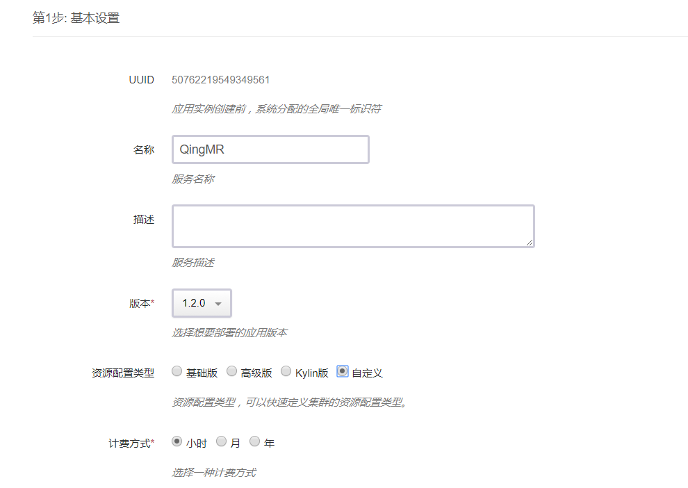

填写服务`名称`和`描述`，选择版本

### 第2步：HDFS主节点设置


填写 HDFS主节点 CPU、内存、节点类型、数据盘类型及大小等配置信息。

### 第3步：主节点设置

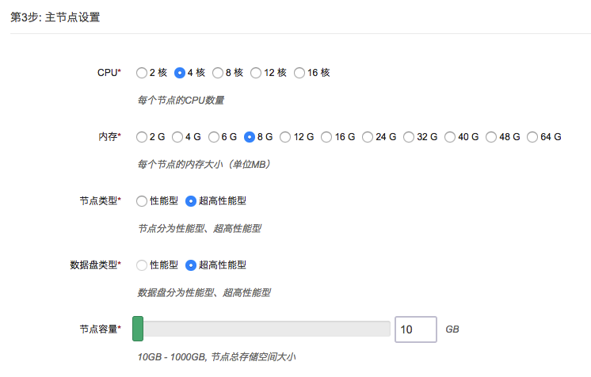

填写主节点 CPU、内存、节点类型、数据盘类型及大小等配置信息。

### 第4步：从节点设置


填写 从节点 CPU、内存、节点类型、数据盘类型及大小等配置信息。

### 第5步：Client 节点设置


填写Client节点 CPU、内存、节点类型、数据盘类型及大小等配置信息。Client节点为可选，如不需要可设置`节点数量`为0。建议选配Client节点，否则某些功能无法使用（除非手动下载相关软件包并配置好）。
> Client节点为用户可访问的节点，可以用它来访问HDFS，和集群交互如提交job等。该节点用户名为ubuntu，初始密码为p12cHANgepwD，如果开启了 kylin 服务，该服务是在 kylin 用户名下启动，密码为Qingmr.2018!。   
Kylin 选项为运行 Kylin 的推荐配置，若选择自定义配置并计划启用 Kylin ，请参考 Kylin 选项进行自定义。

### 第6步：网络设置


出于安全考虑，所有的集群都需要部署在私有网络中，选择自己创建的已连接路由器的私有网络中

### 第7步：依赖服务设置


依赖服务 ZooKeeper 是 Kylin 服务所依赖的 ZooKeeper 服务，注意如果开启kylin时该项为必填。

依赖服务 External Service , 选择所依赖的服务可以将其中所有节点加入本服务所有节点的hosts文件中。HBase与Hadoop或者Spark集成的场景经常会有这种需求，选定依赖HBase集群即可自动添加hosts，无需由工程师在后台手动添加。

### 第8步：服务环境参数设置

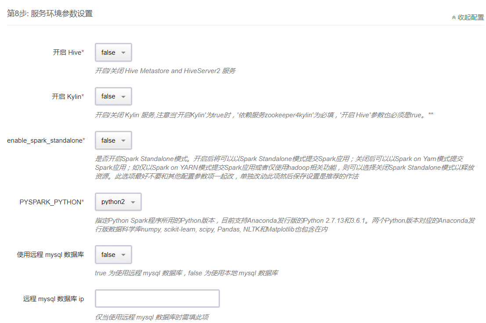

提供了近60个服务环境参数可以配置，默认仅显示其中4个。可以点击`展开配置`对所有配置项进行修改，也可使用默认值并在集群创建后弹性进行修改。

### 第9步: 用户协议

阅读并同意青云 APP Center 用户协议之后即可开始部署应用。


## QingMR 使用指南

### 查看服务详情

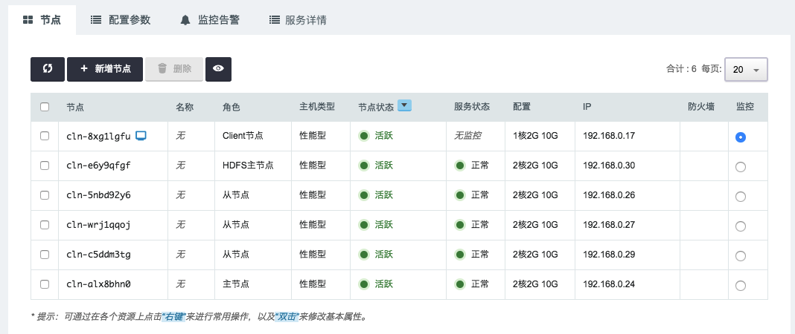

创建成功后，点击集群列表页面相应集群可查看集群详情。可以看到集群分为HDFS主节点、主节点、从节点和Client节点四种角色。其中主节点上运行着诸多服务如 YARN Resource Manager ，Spark Standalone 模式下的 Spark Master（从1.1.0开始默认关闭），Hive Metastore（默认关闭），HiveServer2（默认关闭）；用户可以直接访问client节点，并通过该节点与集群交互如提交Hadoop/Spark/Hive job、查看/上传/下载HDFS文件、运行 Hive 查询等。

- 进入集群详情页面后，点击`服务详情`即可查看各节点的运行服务：


> 以下场景均在 root 用户下测试通过

> 如以非 root 用户比如用户 ubuntu 运行 Spark on YARN job，需要首先运行如下命令：

> `/opt/hadoop/bin/hdfs dfs -mkdir -p /user/ubuntu/`

> `/opt/hadoop/bin/hdfs dfs -chown -R ubuntu:ubuntu  /user/ubuntu/`

> 如以非root用户运行MapReduce job或者上传文件到HDFS，也需要具有相应目录的读写权限


### 1. Spark 使用指南

#### 1.1 开启/关闭 Spark Standalone 模式

用户可以选择是否开启Spark Standalone模式（从1.1.0开始默认关闭）。

- 开启后用户可以以 Spark Standalone 模式提交 Spark 应用
- 关闭后用户可以以 Spark on YARN 模式提交 Spark 应用
- 如仅以 Spark on YARN 模式提交 Spark 应用或者仅使用 Hadoop 相关功能，则可以选择关闭 Spark Standalone 模式以释放资源。
- 此选项最好不要和其他配置参数项一起改，单独改动此项然后保存设置是推荐的作法。


#### 1.2 以 Spark-shell 模式运行 Spark job

> 需设置`enable_spark_standalone`为true

- Scala

```shell
cd /opt/spark
bin/spark-shell --master spark://<主节点IP>:7077

val textFile = spark.read.textFile("/opt/spark/README.md")
textFile.count()
textFile.filter(line => line.contains("Spark")).count()
```

- Python

```shell
cd /opt/spark
bin/pyspark --master spark://<主节点IP>:7077

textFile = spark.read.text("/opt/spark/README.md")
textFile.count()
textFile.filter(textFile.value.contains("Spark")).count()
```

- R

```shell
cd /opt/spark
bin/sparkR --master spark://<主节点IP>:7077

df <- as.DataFrame(faithful)
head(df)
people <- read.df("./examples/src/main/resources/people.json", "json")
printSchema(people)
```

#### 1.3 以 Spark Standalone 模式运行 Spark job

> 需设置`enable_spark_standalone`为true

- Scala

```shell
cd /opt/spark

bin/spark-submit --class org.apache.spark.examples.SparkPi --master spark://<主节点IP>:7077 examples/jars/spark-examples_2.11-2.2.0.jar 100
```

- Python

```shell
cd /opt/spark

bin/spark-submit --master spark://<主节点IP>:7077 examples/src/main/python/pi.py 100
```

可以在配置参数页面切换Python版本  


- R

```shell
cd /opt/spark

bin/spark-submit --master spark://<主节点IP>:7077 examples/src/main/r/data-manipulation.R examples/src/main/resources/people.txt
```

#### 1.4 以 Spark on YARN 模式运行 Spark job

> 需设置`enable_spark_standalone`为false

- Scala

```shell
cd /opt/spark

bin/spark-submit --class org.apache.spark.examples.SparkPi --master yarn --deploy-mode cluster --num-executors 3 --executor-cores 1 --executor-memory 1g examples/jars/spark-examples_2.11-2.2.0.jar 100
```

- Python

```shell
cd /opt/spark

bin/spark-submit --master yarn --deploy-mode client examples/src/main/python/pi.py 100
```

- R

```shell
cd /opt/spark

bin/spark-submit --master yarn --deploy-mode cluster /opt/spark/examples/src/main/r/ml/kmeans.R
```

#### 1.5 更新自定义 Spark 应用内调度器

Spark支持两种应用内调度器FIFO（默认）和FAIR。
为了支持用户自定义Spark应用内FAIR调度器的需求，QingMR支持用户上传自定义的FAIR调度器，步骤如下：

1. 自定义Spark应用内FAIR调度器spark-fair-scheduler.xml（文件名必须为spark-fair-scheduler.xml）
2. 将这两个自定义调度器上传至HDFS的/tmp/hadoop-yarn/目录
3. 右键点击集群，选择`自定义服务`，点击`更新调度器`，选择`主节点`，点击`提交`
4. 在配置参数页面切换到相应调度器


#### 1.6 Spark log 清理

可通过如下配置参数控制Spark Standalone模式下Spark worker节点的log清理设置：


#### 1.7 控制 Spark 占用的内存

- Spark Standalone 模式的 Spark master 进程运行在主节点上
- Spark Standalone 模式的 Spark worker 进程运行在从节点上
- 可通过如下参数配置各个进程最大占用的内存：

Spark进程最大占用内存


### 2. Hadoop 使用指南

#### 2.1 运行 Hadoop 测试程序，统计文件中单词出现的次数

```shell
cd /opt/hadoop
bin/hdfs dfs -mkdir /input
bin/hdfs dfs -put etc/hadoop/* /input
bin/hdfs dfs -ls /input

bin/hadoop jar share/hadoop/mapreduce/hadoop-mapreduce-examples-2.7.3.jar wordcount /input /output
bin/hdfs dfs -cat /output/part-r-00000
```

#### 2.2 Hadoop 官方的 Benchmark 性能基准测试，测试的是 HDFS 分布式I/O读写的速度/吞吐率，依次执行下列命令

```shell
cd /opt/hadoop

# 使用6个 Map 任务并行向 HDFS 里6个文件里分别写入 1GB 的数据
bin/hadoop jar share/hadoop/mapreduce/hadoop-mapreduce-client-jobclient-2.7.3-tests.jar TestDFSIO -write -nrFiles 6 -size 1GB

# 使用6个 Map 任务并行从 HDFS 里6个文件里分别读取 1GB 的数据
bin/hadoop jar share/hadoop/mapreduce/hadoop-mapreduce-client-jobclient-2.7.3-tests.jar TestDFSIO -read -nrFiles 6 -size 1GB

# 清除以上生成的数据
bin/hadoop jar share/hadoop/mapreduce/hadoop-mapreduce-client-jobclient-2.7.3-tests.jar TestDFSIO -clean

您能看到 HDFS 每秒读写文件速度，以及吞吐量的具体数值。
```

#### 2.3 Hadoop 官方的 Benchmark 性能基准测试，测试的是大文件内容的排序，依次执行下列命令：

```shell
cd /opt/hadoop

# 生成1000万行数据到 /teraInput 路径中
bin/hadoop jar share/hadoop/mapreduce/hadoop-mapreduce-examples-2.7.3.jar teragen 10000000 /teraInput

# 将/teraInput 中生成的1000万行数据排序后存入到 /teraOutput 路径中
bin/hadoop jar share/hadoop/mapreduce/hadoop-mapreduce-examples-2.7.3.jar terasort /teraInput /teraOutput

# 针对已排序的 /teraOutput 中的数据，验证每一行的数值要小于下一行
bin/hadoop jar share/hadoop/mapreduce/hadoop-mapreduce-examples-2.7.3.jar teravalidate -D mapred.reduce.tasks=8 /teraOutput /teraValidate

# 查看验证的结果
bin/hdfs dfs -cat /teraValidate/part-r-00000
```

#### 2.4 以 Hadoop 代理用户运行 MapReduce 和 Spark on YARN job

本场景将 root 设置为代理用户，并在root用户下模拟用户ubuntu提交job：

- 第一步：可通过如下配置参数配置Hadoop代理用户及其所能代理的hosts和groups，配置root为proxyuser，该用户能代理任意host中任意group内的用户：


> hosts或groups中填写* 代表任意host或任意group。hosts和groups中也可以填写以逗号分割的host name/ip或者group名。详见hadoop官方文档[Proxy user setting](http://hadoop.apache.org/docs/r2.7.3/hadoop-project-dist/hadoop-common/Superusers.html)

- 第二步：root用户下创建以ubuntu用户运行job所需的HDFS目录及权限

```shell
/opt/hadoop/bin/hdfs dfs -mkdir -p /user/ubuntu/
/opt/hadoop/bin/hdfs dfs -chown -R ubuntu:ubuntu /user/ubuntu/
```

- 第三步：设置要代理的是哪个用户，此处是root用户要代理ubuntu，所以设为ubuntu

`export HADOOP_PROXY_USER=ubuntu`

- 第四步：运行 MapReduce job

```shell
cd /opt/hadoop
bin/yarn jar share/hadoop/mapreduce/hadoop-mapreduce-examples-2.7.3.jar pi 16 10000
```

- 第五步：运行 Spark on YARN job

```shell
cd /opt/spark
bin/spark-submit --master yarn --deploy-mode client examples/src/main/python/pi.py 100
```

- 第六步：查看YARN applications UI页面，可以看到虽然是在root用户下提交的job，但是user都显示为ubuntu

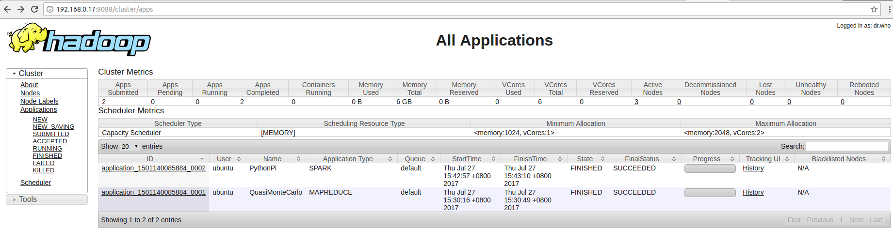

#### 2.5 更新自定义 YARN 调度器

YARN支持两种调度器 CapacityScheduler（默认）和 FairScheduler。
为了支持用户更多自定义调度器的需求，QingMR 支持用户上传自定义调度器，步骤如下：

- 第一步：自定义 CapacityScheduler capacity-scheduler.xml 或者 FairScheduler fair-scheduler.xml（文件名必须为 capacity-scheduler.xml 或者fair-scheduler.xml）
- 第二步：将这两个自定义调度器上传至 HDFS 的/tmp/hadoop-yarn/目录
- 第三步：右键点击集群，选择`自定义服务`，点击`更新调度器`，选择`主节点`，点击`提交`

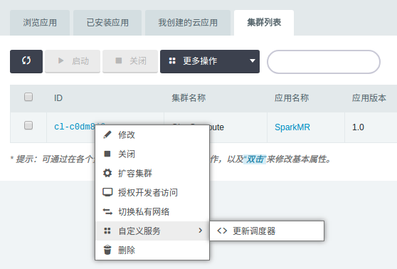


- 第四步：在配置参数页面切换到相应调度器


> 注：如果更新的自定义调度器和配置参数里yarn.resourcemanager.scheduler.class类型一致，则需要切换到另一种类型的调度器，保存设置后，再切换回来重新保存以达到重启集群使新的自定义调度器生效的目的。
> 例如：自定义的调度器为capacity-scheduler.xml，上传这个文件到HDFS并更新调度器后，因yarn.resourcemanager.scheduler.class也是CapacityScheduler，为了使得新的capacity-scheduler.xml生效，需要在配置参数页面切换yarn.resourcemanager.scheduler.class到FairScheduler，保存设置后再切换到CapacityScheduler，然后再次保存设置。

#### 2.6 YARN log收集

QingMR支持将YARN log收集到HDFS指定目录，并可指定保持时间、保持目录等，可在配置参数页面配置：


#### 2.7 控制 HDFS、YARN 占用的内存

- YARN Resource Manager 进程运行在主节点上
- HDFS datanode 以及 YARN NodeManager 进程都运行在从节点上
- 可通过如下参数配置各个进程最大占用的内存：

YARN及HDFS进程最大占用内存


### 3. Hive 使用指南

Hive 的 Hive Metastore 和 HiveServer2 服务已经在主节点配置完成（默认关闭），用户不需要手动配置。只需设置配置参数 `开启 Hive` 为 true 就可以启动这两个服务，然后即可在 Client 节点运行 Hive 命令行使用 Hive。

主节点上同时运行了 mysql 数据库服务，用于存储 Hive 的元数据（ 默认用户名和密码：hive/hive ）。

用户可以选择使用集群外远程 mysql 数据库，只需正确设置 `使用远程 mysql 数据库`，`远程 mysql 数据库 ip`，`Hive Metastore 用户名`，`Hive Metastore 密码` 等几个配置参数即可。

#### 3.1 在 Hive 数据仓库中创建一个数据库

在Hive中创建数据库需要以 root 用户身份进行操作，而在实际生产环境中，我们建议您尽量避免以 root 用户执行 Hive 语句。 因此，通过 root 身份创建数据库后，需要更改数据库的所有者。

```shell
# 在 root 下创建一个名为 test 的数据库：
/opt/hive/bin/hive -e "create database test;"

# 在 root 用户下执行下面命令将数据库 test 的拥有者更改为 ubuntu 后，即可以 ubuntu 用户执行后续操作：
/opt/hadoop/bin/hdfs dfs -chown -R ubuntu /user/hive/warehouse/test.db
```

Hive创建数据库执行成功后会显示执行时间，您也可以通过下面即将提到的命令查看已创建的数据库

#### 3.2 在 Hive 的数据库中创建一张表

```shell
# 这里以默认配置下，CLI 操作为例。首先，启动 CLI ，执行( CLI 中的用户身份是启动 CLI 时 Linux 所用的用户身份)：
/opt/hive/bin/hive

# 启动之后，查看刚刚创建的数据库：
hive> SHOW DATABASES;

# 可以看到目前Hive数据仓库中的数据库名。切换到test数据库，执行：
hive> USE test;

# 在test数据库下创建一个invites表，包含两个普通列和一个分区列：
hive> CREATE TABLE invites (foo INT, bar STRING) PARTITIONED BY (ds STRING);

# 查看创建的invites表：
hive> SHOW TABLES;
```

#### 3.3 向 Hive 中的表载入数据

```shell
# 向刚刚创建的invites表载入数据，数据源使用本地文件。
hive> LOAD DATA LOCAL INPATH '/opt/hive/examples/files/kv2.txt' OVERWRITE INTO TABLE invites PARTITION (ds='2008-08-15');
hive> LOAD DATA LOCAL INPATH '/opt/hive/examples/files/kv3.txt' OVERWRITE INTO TABLE invites PARTITION (ds='2008-08-08');
```

#### 3.4 执行 HQL 查询语句

```shell
# 查找invites表中 ‘ds=2008-08-08’ 的 ‘foo’ 列的所有内容：
# 这里并没有执行结果导出语句，因此查询的结果不会保存在任何地方，只是从CLI中显示出来。
hive> SELECT a.foo FROM invites a WHERE a.ds='2008-08-08';

# 执行运算，计算invites表中，’ds=2008-08-15’的‘foo’列的平均值：
# Hive服务将自动把HQL查询语句转换为MapReduce运算，并调用Hadoop集群进行计算。您也可以在yarn监控中查看该语句的执行进度。
hive> SELECT AVG(a.foo) FROM invites a WHERE a.ds='2008-08-15';
```


### 4. 与 QingStor 对象存储集成

QingStor 对象存储为用户提供可无限扩展的通用数据存储服务，具有安全可靠、简单易用、高性能、低成本等特点。用户可将数据上传至 QingStor 对象存储中，以供数据分析。由于 QingStor 对象存储兼容 AWS S3 API，因此 Spark与Hadoop都可以通过 AWS S3 API 与 QingStor 对象存储高效集成，以满足更多的大数据计算和存储场景。有关 QingStor 的更多内容，请参考[QingStor 对象存储用户指南] (https://docs.qingcloud.com/qingstor/guide/index.html)
>目前QingStor 对象存储的开放了 sh1a 和 pek3a 两个区，后续将开放更多的分区，敬请期待。

如需与QingStor对象存储集成，需要首先在配置参数页面填写如下信息：  


#### 4.1 Spark 与 QingStor 对象存储集成

>有两种方式可以启动 Spark job： 通过 spark-shell 交互式运行和通过 spark-submit 提交 job 到 Spark集群运行，这两种方式都需要通过选项 "--jars $SPARK_S3" 来指定使用 S3 API相关的 jar 包。

假设您在 QingStor 上的 bucket 为 my-bucket, 下面以 spark-shell 为例， 列出常见的 Spark 与 QingStor 集成场景。

- 在 Spark 中读取到 HDFS 上的文件后将其存储到 QingStor 中

```shell
# 首先需要将本地的一个测试文件上传到 QingMR 集群的 HDFS 存储节点上：
cd /opt/hadoop
bin/hdfs dfs -mkdir /input
bin/hdfs dfs -put /opt/spark/README.md /input/

# 然后启动 spark-shell, 输入并执行如下代码将会读取 HDFS 上的 README.md 文件, 然后将其存为QingStor中"my-bucket"下的 test 文件：
cd /opt/spark
bin/spark-shell --master spark://< 主节点IP >:7077 --jars $SPARK_S3

val qs_file = sc.textFile("hdfs://<hdfs-master-ip>:9000/input/README.md")
qs_file.saveAsTextFile("s3a://my-bucket/test")
```

- 在 Spark 中读取 QingStor 上的文件，处理过后再存储到 HDFS 文件系统中

```shell
val qs_file = sc.textFile("s3a://my-bucket/test")
qs_file.count()
qs_file.saveAsTextFile("hdfs://<hdfs-master-ip>:9000/output/")
```

- 在 Spark 中读取 QingStor 上的文件， 经过处理后将结果存回 QingStor

```shell
#如下代码将会读取 QingStor 中 my-bucket 下的 test 文件， 从中选出包含字符串 "Spark" 的行， 最后将结果存储到 my-bucket 下的 qingstor-output 文件中
val qs_file = sc.textFile("s3a://my-bucket/test").filter(line => line.contains("Spark"))
qs_file.saveAsTextFile("s3a://my-bucket/output1")
```

- 在 Spark 中创建元素值为 1 到 1000 的数组， 找出其中的奇数并对其求平方， 最后将结果存储到 QingStor 上的文件中

```shell
val data = for (i <- 1 to 1000) yield i
sc.parallelize(data).filter(_%2 != 0).map(x=>x*x).saveAsTextFile("s3a://my-bucket/output2")
```


#### 4.2 Hadoop 与 QingStor 对象存储集成

- 本地文件和对象存储之间的上传下载

```shell
cd /usr/opt/hadoop
# 从Client 主机本地上传文件到 QingStor 对象存储
bin/hdfs dfs -put LICENSE.txt s3a://your_bucket/

# 将文件从 QingStor 对象存储下载到Client 主机本地
bin/hdfs dfs -get s3a://your_bucket/LICENSE.txt
```

- HDFS文件系统和对象存储之间的数据传输

```shell
cd /usr/opt/hadoop
# 将文件从 QingStor 对象存储拷贝到 HDFS 文件系统
bin/hadoop distcp -libjars $HADOOP_S3 s3a://your_bucket/LICENSE.txt /LICENSE.txt

# 将文件从 HDFS 文件系统拷贝到 QingStor 对象存储存储空间中
bin/hadoop distcp -libjars $HADOOP_S3 /LICENSE.txt s3a://your_bucket/your_folder/
```

- 将对象存储作为MapReduce job的输入/输出

```shell
cd /usr/opt/hadoop

# 将 QingStor 对象存储中的文件作为 MapReduce 的输入，计算结果输出到 HDFS 文件系统中
bin/hadoop jar share/hadoop/mapreduce/hadoop-mapreduce-examples-2.7.3.jar wordcount -libjars $HADOOP_S3 s3a://your_bucket/LICENSE.txt /test_output

# 将 QingStor 对象存储中的文件作为 MapReduce 的输入，计算结果依然输出到 QingStor 对象存储的存储空间中
bin/hadoop jar share/hadoop/mapreduce/hadoop-mapreduce-examples-2.7.3.jar wordcount -libjars $HADOOP_S3 s3a://your_bucket/LICENSE.txt s3a://your_bucket/your_folder/

# 将 HDFS 中的文件作为 MapReduce 的输入，计算结果输出到 QingStor 对象存储的存储空间中
bin/hadoop jar share/hadoop/mapreduce/hadoop-mapreduce-examples-2.7.3.jar wordcount -libjars $HADOOP_S3 /LICENSE.txt s3a://your_bucket/

```


#### 4.3 Hive 与 QingStor 对象存储集成

- 创建以 QingStor 为默认存储引擎的 Database

```shell
# 首先在 QingStor 的 bucket 中创建一个目录，这里命名为 test_s3 ，然后创建 Database
hive> create database test_s3 location 's3a://<your_bucket_name>/test_s3';
```

- 在以QingStor为默认存储引擎的Database中创建Table，并执行查询

```shell
# 创建table，并载入测试数据
hive> use test_s3;
hive> CREATE TABLE invites (foo INT, bar STRING) PARTITIONED BY (ds STRING);
hive> LOAD DATA LOCAL INPATH '/opt/hive/examples/files/kv2.txt' OVERWRITE INTO TABLE invites PARTITION (ds='2008-08-15');
hive> LOAD DATA LOCAL INPATH '/opt/hive/examples/files/kv3.txt' OVERWRITE INTO TABLE invites PARTITION (ds='2008-08-08');

# 执行查询
hive> SELECT * FROM invites LIMIT 10;
hive> SELECT avg(a.foo) FROM invites a WHERE a.ds='2008-08-15';
```

- 创建以HDFS为默认存储引擎的Database，并创建基于QingStor的外部表（使用示例2通过Hive导入QingStor的数据）

```shell
# 在 root 下创建一个名为 test 的数据库：
/opt/hive/bin/hive -e "create database test_hdfs;"
# 在 root 用户下执行下面命令将数据库 test_hdfs 的拥有者更改为 ubuntu 后，即可以 ubuntu 用户执行后续操作：
/opt/hadoop/bin/hdfs dfs -chown -R ubuntu /user/hive/warehouse/test_hdfs.db

# 创建基于QingStor的外部表，并加入已有partition
hive> use test_hdfs;
hive> CREATE EXTERNAL TABLE IF NOT EXISTS invites_s3 (foo INT, bar STRING) PARTITIONED BY (ds STRING) Location 's3a://<your_bucket_name>/test_s3/invites';
hive> ALTER TABLE invites_s3 ADD PARTITION (ds='2008-08-15');
hive> ALTER TABLE invites_s3 ADD PARTITION (ds='2008-08-08');
```

- 将QingStor中的数据导入以HDFS为存储的Hive表

```shell
# 创建以HDFS为存储的Hive表
hive> CREATE TABLE IF NOT EXISTS invites (foo INT, bar STRING) PARTITIONED BY (ds STRING);

# 这里在做数据导入时，为了动态创建分区，设置hive.exec.dynamic.partition.mode=nonstrict。
# 为了防止误操作导致动态创建大量分区，一般情况下应使用默认配置hive.exec.dynamic.partition.mode=strict
hive> set hive.exec.dynamic.partition.mode=nonstrict;
# 将QingStor中的数据导入
hive> INSERT OVERWRITE table invites partition (ds) select se.foo,se.bar,se.ds from invites_s3 se;
```

### 5. Kylin 使用指南

提供 Kylin 服务的 Kyligence Analytics Platform （KAP） 安装在 Client 节点（该服务是在 kylin 用户名下启动，密码为Qingmr.2018!），只需要设置参数 `开启 Kylin` 为 true 就可以启动 KAP 提供的 KAP 和 KyAnalyzer 服务。  
>需要注意的是，KAP 依赖于 ZooKeeper 和 Hive ，因此如果设置 `开启 Kylin` 为 true 时，必须要设置`开启 Hive` 为 true ，依赖服务 ZooKeeper 也必须设置为可用的 ZooKeeper 集群。

#### 参数设置

主节点上同时运行了 mysql 数据库服务，用于存储 Kylin 的元数据（ 默认用户名和密码：kylin/kylin ）。

用户可以选择使用集群外远程 mysql 数据库，只需正确设置 `使用远程 mysql 数据库`，`远程 mysql 数据库 ip`，`Kylin Metadata 用户名`，`Kylin Metadata 密码` 等几个配置参数即可。

除了以上参数之外，还提供了其他几个重要要的 KAP 相关的参数，可以通过展开 `更多服务环境参数` 找到 KAP 相关的参数进行设置。
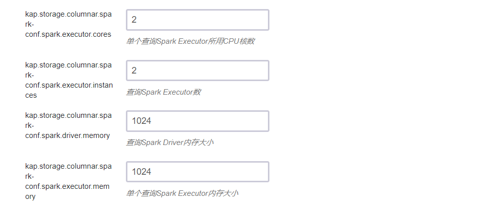

#### 访问 KAP GUI   

当 KAP 顺利启动后，您可以打开 web 浏览器，访问 http://host_name:7070/kylin/ 。请将其中 host_name 替换为具体的
Client 节点 IP 地址或主机名，默认端口值为 7070 。默认用户名和密码分别为 ADMIN 和 KYLIN 。  
>注意: KAP GUI 的界面启动有预热的过程，需要耐心等待几分钟后界面才可以完全打开。

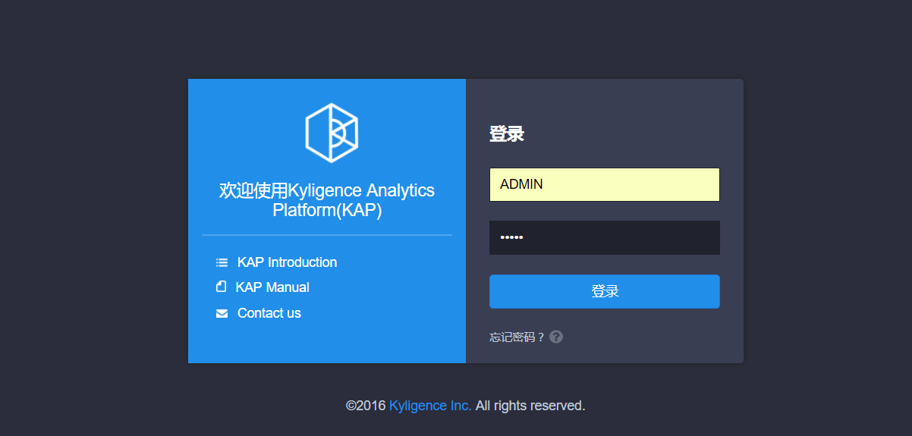

#### 访问 KyAnalyzer 页面   

启动 KAP 同时也启动了 KyAnalyzer 服务，KyAnalyzer 是一款由 Kyligence 研发的敏捷 BI 工具，旨在为用户提供开箱即用的自助多维分析能力。  
它不仅能让用户以熟悉的拖拽方式探索数据源，而且支持下钻、上卷、制作报表及报表分享等功能。       
通过 http://hostname:8080 访问 KyAnalyzer 登录页面。请将其中 host_name 替换为具体的Client 节点 IP 地址或主机名，默认端口值为 8080 。  
KyAnalyzer 的用户认证是通过 KAP 认证进行的，所以只需要输入 KAP 的帐号和密码即可登录。用户的管理也是通过 KAP 进行，KAP 中的系统管理员在 KyAnalyzer 中同样具有 Admin 角色。   
>注意: KyAnalyzer 的界面启动有预热的过程，需要耐心等待几分钟后界面才可以完全打开。

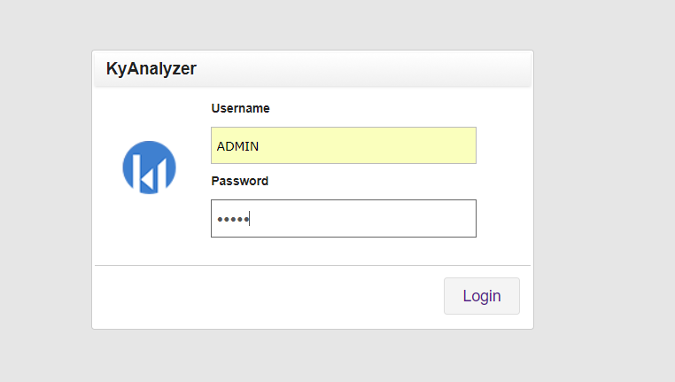

关于 Kylin 以及 KAP 更多的技术细节请参考 KAP 提供的[详细文档](http://docs.kyligence.io/) 。

#### 关于KAP License
KAP 是一款基于 Apache Kylin 的商用软件，如果您需要正式使用KAP，请联系Kyligence (info@kyligence.io)购买正式 license。  
在获得正式 license 文件后通过登录 KAP 界面更新许可证来合法使用 KAP。  
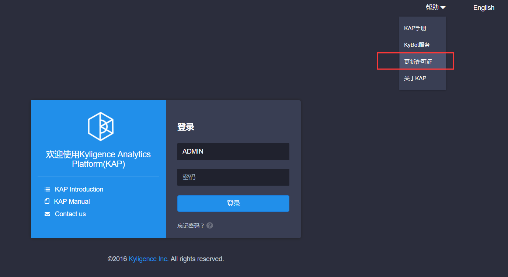

#### 如何提交KAP的工单
在使用 KAP 的过程中遇到任何 KAP 相关的技术问题，可以在 KAP 提供的[技术支持](https://kybot.io)网站上提交相关工单。
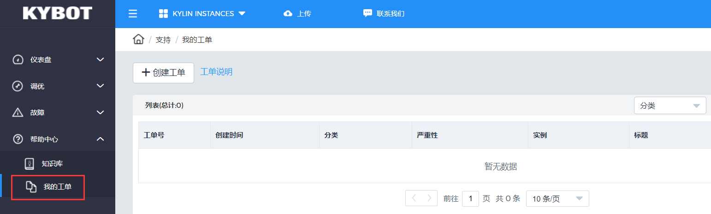

关于 Kylin 以及 KAP 更多的技术信息请访问[ KAP 官网](http://www.kyligence.io/)。

## 在线伸缩

### 增加节点

可以在QingMR详情页点击 `新增节点` 按钮增加 `从节点` 或 `Client节点`，可以对每个新增节点指定 IP 或选择自动分配。


### 删除节点

可以在 QingMR 详情页选中需要删除的节点，然后点击 `删除` 按钮，只能一次删除一个，并且必须等到上个节点删除后且 decommission 结束才能删除下一个节点，否则数据会丢失。删除节点过程中会锁定QingMR集群不让对其进行其它生命周期操作。

- HDFS的decommission状态可以从 HDFS Name Node 的 50070 端口提供的监控信息观察到。Decommission 是在复制即将删除节点上的数据到别的节点上，如果您的数据量比较大，这个过程会比较长。因为青云的 HDFS 副本因子默认为 2，所以当您的QingMR从节点数为2的时候就不能再删除节点。同时要预先知道其它节点的总硬盘空间足够拷贝删除节点的内容，才能进行删除。

- YARN的decommission会相对较快，删除节点后会在比较短的时间内在主节点的8088端口观察到集群的CPU及内存资源的下降

> `主节点` 和 `HDFS 主节点` 不允许删除，一次删除多个 `从节点` 相关操作会失败，右上角会有提示。


### 纵向伸缩

QingMR 允许分别对各种角色的节点进行纵向的扩容及缩容。  
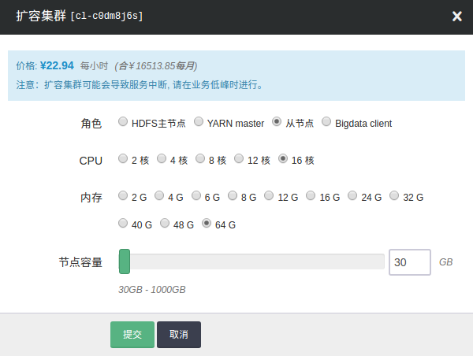


## 监控告警

### 资源级别的监控与告警

我们对QingMR集群的每个节点提供了资源级别的监控和告警服务，包括 CPU 使用率、内存使用率、硬盘使用率等。

### Hadoop和Spark原生的监控

YARN、HDFS 和 Spark 提供了丰富的监控信息。如果需要通过公网访问这些信息您需要先申请一个公网 IP 绑定在路由器上，在路由器上设置端口转发，同时打开防火墙相应的下行端口。

`主节点` 中 Resource Manager 默认端口 `8088` ， `HDFS 主节点` 默认端口是 `50070`，Spark 主节点 和主节点是同一个，其默认端口是`8080` 。

为方便查看 QingMR UI，请参考 [VPN 隧道指南](https://docs.qingcloud.com/product/network/vpn) 配置VPN，VPN 建立后可查看下述界面。

- http://< 主节点IP >:8088


- http://< HDFS-MASTER-IP >:50070

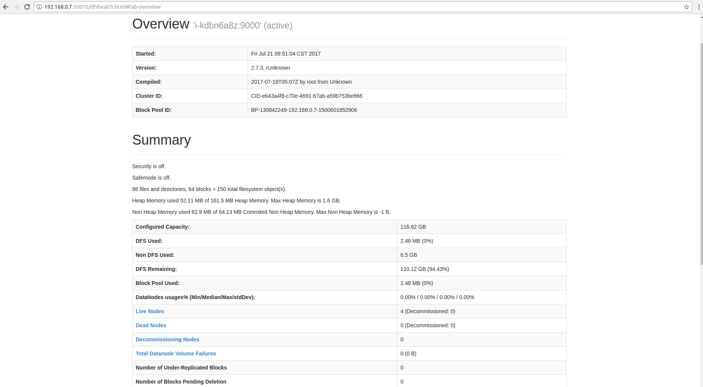

- http://< 主节点IP >:8080

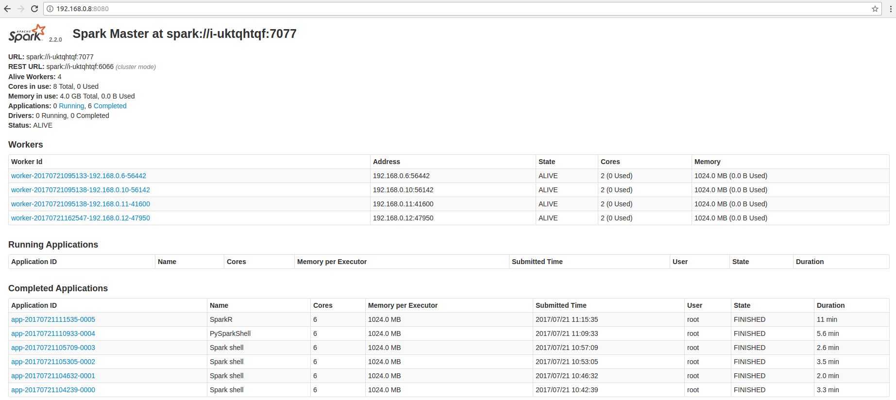

### 服务级别分角色的监控与告警

为了帮助用户更好的管理和维护QingMR集群，我们提供了部分针对 YARN、 HDFS以及Spark服务级别分角色的监控：

- YARN服务监控，包括YARN管理的各NodeManager节点状态、运行中的YARN应用、YARN应用状态、YARN集群总内存、YARN集群virtual cores、YARN containers、NodeManger节点内存等。

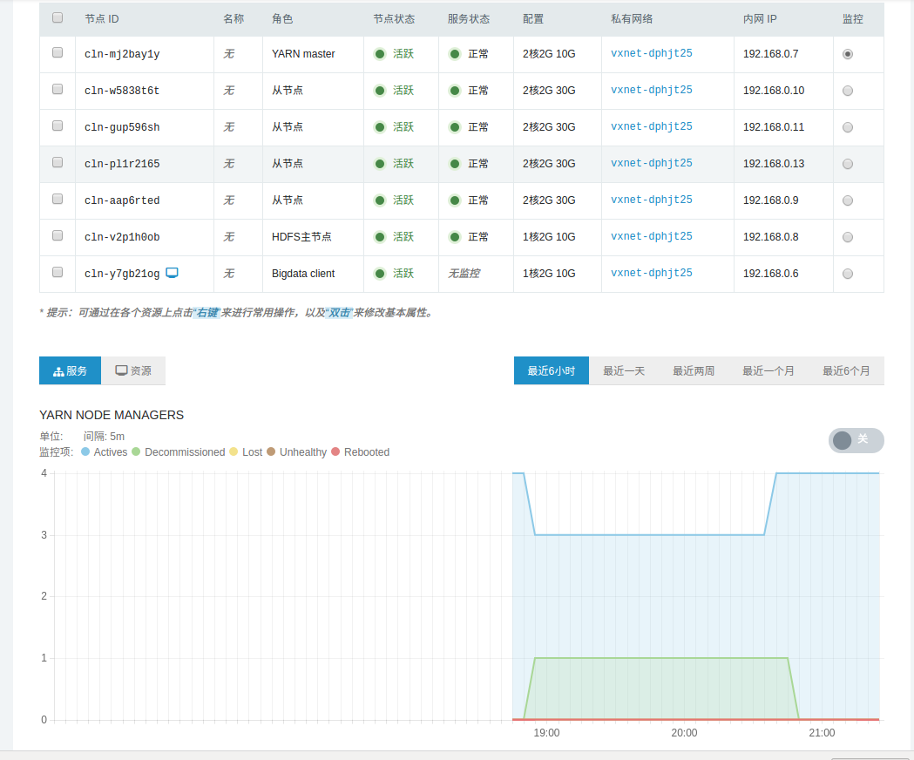

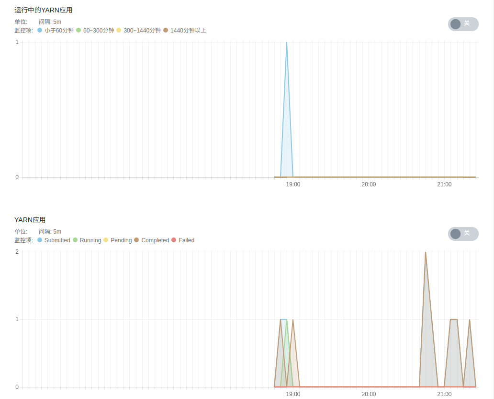


- HDFS服务监控，包括DFS文件状态、DFS空间占比、DFS容量、各DataNode状态、HDFS存储空间、DFS块及垃圾回收信息等。

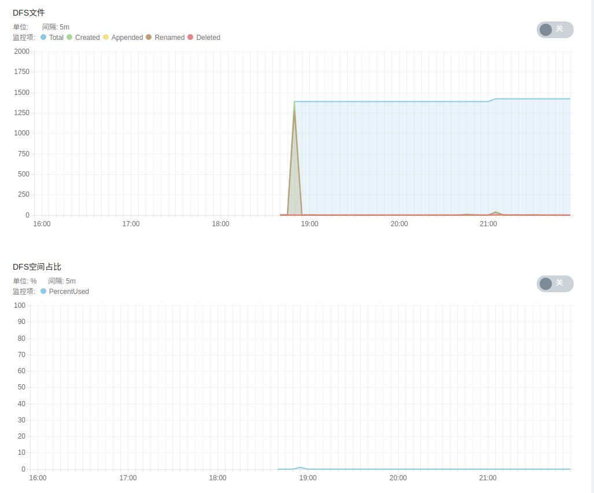

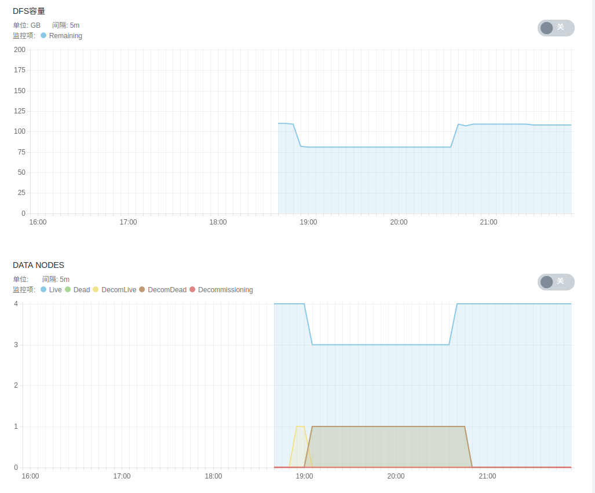

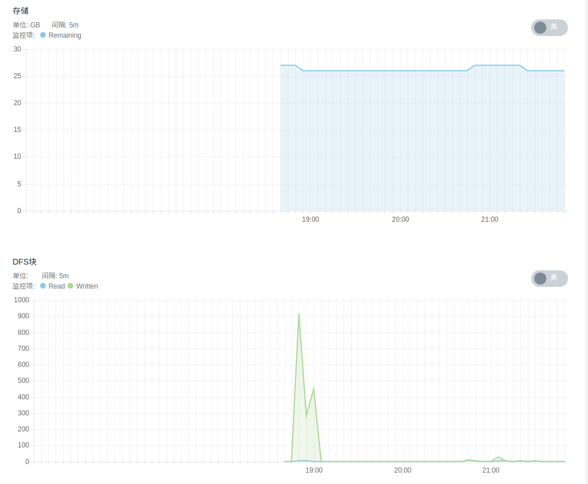

- Spark服务监控，包括Spark Standalone模式下worker节点状态、spark applications状态、各worker节点计算及存储资源等。


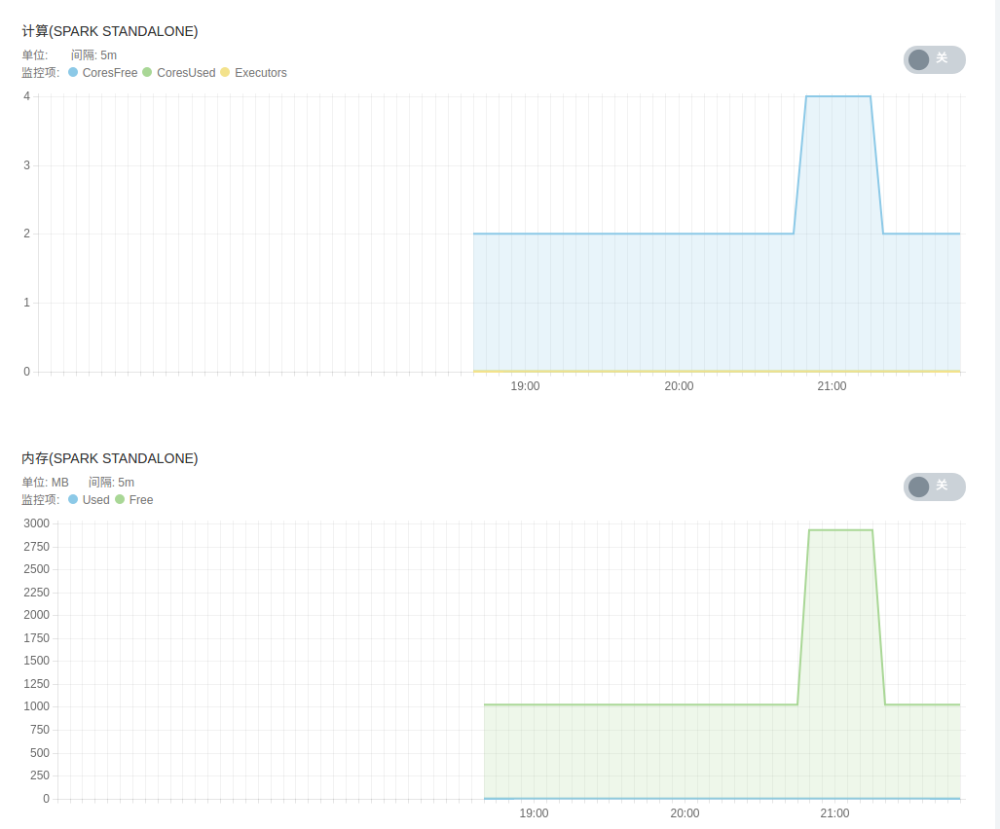


## 配置参数

QingMR提供了60个左右的配置参数，可以通过 `配置参数` 来定制个性化的QingMR服务并进行调优。

### 修改配置参数

在 QingMR 详情页，点击 `配置参数` Tab 页，点击 `修改属性`，修改完后，需要进行 "保存"。如图所示：

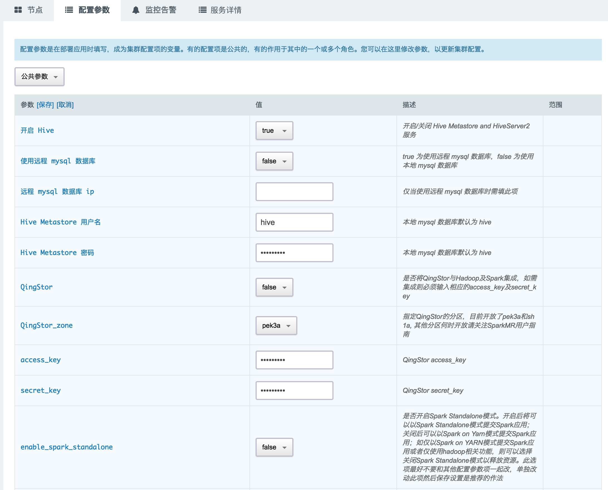

### 常用配置项

- **开启 Hive**: 开启/关闭 Hive Metastore 和 HiveServer2 服务。
- **开启 Kylin**: 开启/关闭 Kylin 服务。
- **使用远程 mysql 数据库**: true 为使用远程 mysql 数据库，false 为使用本地 mysql 数据库。
- **远程 mysql 数据库 ip**: 仅当使用远程 mysql 数据库时需填此项。
- **Hive Metastore 用户名**: 本地 mysql 数据库默认为 hive 。
- **Hive Metastore 密码**: 本地 mysql 数据库默认为 hive 。
- **Kylin Metadata 用户名**: 本地 mysql 数据库默认为 kylin 。
- **Kylin Metadata 密码**: 本地 mysql 数据库默认为 kylin 。
- **QingStor**: 是否将 QingStor 与 Hadoop , Spark 和 Hive 集成，如需集成则必须输入相应的 access_key 及 secret_key 。
- **QingStor_zone**: 指定 QingStor 的分区，目前开放了 pek3a 和 sh1a 。 其他分区何时开放请关注 QingMR 用户指南。
- **access_key**: 指定 QingStor 的 access_key 。
- **secret_key**: 指定 QingStor 的 secret_key 。
- **enable_spark_standalone**: 是否开启 Spark Standalone 模式。开启后将可以以 Spark Standalone 模式提交 Spark 应用；关闭后可以以 Spark on YARN 模式提交 Spark 应用。如仅以 Spark on YARN 模式提交 Spark 应用或者仅使用 hadoop 相关功能，则可以选择关闭 Spark Standalone 模式以释放资源。此选项最好不要和其他配置参数项一起改，单独改动此项然后保存设置是推荐的作法。
- **spark.master.SPARK_DAEMON_MEMORY**: Spark master 进程(Standalone模式)占用内存(MB)。该值上限定为总内存-1024。
- **spark.worker.SPARK_DAEMON_MEMORY**: Spark worker 进程(Standalone模式)占用内存(MB)。该值上限定为总内存-1024。
- **PYSPARK_PYTHON**: 指定 Python Spark 程序所用的 Python 版本，目前支持 Anaconda 发行版的 Python 2.7.13 和 3.6.1。两个 Python 版本对应的 Anaconda 发行版数据科学库 numpy, scikit-learn, scipy, Pandas, NLTK 和 Matplotlib 也包含在内。
- **spark.worker.cleanup.enabled**: 定期清理应用 work 目录，运行中的 application 不会被清理。
- **spark.worker.cleanup.interval**: 清理应用 work 目录的时间间隔，以秒为单位，默认为28800秒（8小时）。
- **spark.worker.cleanup.appDataTtl**: 保留 worker 上应用 work 目录的时间，以秒为单位，默认为86400秒(24 小时)。
- **spark.scheduler.mode**: Spark 应用内调度模式，针对 Spark 应用内不同线程提交的可同时运行的任务。
- **hadoop.proxyuser**: Hadoop 代理用户。
- **hadoop.proxyuser.hosts**: Hadoop 代理用户能代理哪些 hosts。
- **hadoop.proxyuser.groups**: Hadoop 代理用户能代理指定 host 中的哪些 groups。
- **resource_manager.YARN_HEAPSIZE**: ResourceManager 最大可用堆内存大小(MB)，如果指定1000，则 ResourceManager 将可利用当前所有空闲内存。
- **node_manager.YARN_HEAPSIZE**: NodeManager 最大可用堆内存大小(MB)，该值上限为总内存的一半。
- **datanode.HADOOP_HEAPSIZE**: Datanode daemon 进程最大可用堆内存大小(MB)，默认值为1000. 该值上限为总内存-1024。
- **dfs.namenode.handler.count**: Name node 节点服务线程数。
- **dfs.datanode.handler.count**: Data node 节点服务线程数。
- **dfs.replication**: HDFS 副本数。
- **fs.trash.interval**: 控制 Trash 检查点目录过多少分钟后被删除。
- **yarn.resourcemanager.scheduler.class**: YARN ResourceManager 调度器，默认为 CapacityScheduler，可选 FairScheduler。如果选择 FairScheduler，需要上传自定义的 fair-scheduler.xml 到 HDFS 的 /tmp/hadoop-yarn/ 目录，然后右键点击集群选择更新调度器。如需对 CapacityScheduler 的默认行为进行更改，同样需要上传自定义的 capacity-scheduler.xml 到 HDFS 的 /tmp/hadoop-yarn/ 目录，然后更新调度器。
- **yarn.resourcemanager.client.thread-count**: 处理 applications manager 请求的线程数。
- **yarn.resourcemanager.amlauncher.thread-count**: 启动/清理 ApplicationMaster 的线程数。
- **yarn.resourcemanager.scheduler.client.thread-count**: 处理 scheduler 接口请求的线程数。
- **yarn.resourcemanager.resource-tracker.client.thread-count**: 处理 resource tracker 请求的线程数。
- **yarn.resourcemanager.admin.client.thread-count**: 处理 ResourceManager 管理接口请求的线程数。
- **yarn.nodemanager.container-manager.thread-count**: 分配给 Container Manager 用的线程数。
- **yarn.nodemanager.delete.thread-count**: 用于清理工作的线程数。
- **yarn.nodemanager.localizer.client.thread-count**: 用于处理 localization 请求的线程数。
- **yarn.nodemanager.localizer.fetch.thread-count**: 用于处理 localization fetching 请求的线程数。
- **yarn.nodemanager.pmem-check-enabled**: 是否需要为 container 检查物理内存限制。
- **yarn.nodemanager.vmem-check-enabled**: 是否需要为 container 检查虚拟内存限制。
- **yarn.nodemanager.vmem-pmem-ratio**: NodeManager 中虚拟内存与物理内存的比率。
- **yarn.scheduler.minimum-allocation-mb**: ResourceManager 中针对每个 container 请求内存的最小分配值(MB). 低于该值的内存请求将会抛出 InvalidResourceRequestException 异常。
- **yarn.scheduler.maximum-allocation-mb**: ResourceManager 中针对每个 container 请求内存的最大分配值(MB). 高于该值的内存请求将会抛出 InvalidResourceRequestException 异常。
- **yarn.scheduler.minimum-allocation-vcores**: ResourceManager 中针对每个 container 请求 virtual CPU cores 的最小分配值。 低于该值的请求将会抛出 InvalidResourceRequestException 异常。
- **yarn.scheduler.maximum-allocation-vcores**: ResourceManager 中针对每个 container 请求 virtual CPU cores 的最大分配值。 高于该值的请求将会抛出 InvalidResourceRequestException 异常。
- **yarn.scheduler.fair.user-as-default-queue**: 以下 yarn.scheduler.fair.* 相关选项只有在 FairScheduler 被使用时才生效。在资源请求中没有指定队列名字的时候，是否使用 username 作为默认的队列名。如果此选项被设置为 false 或者未设置，所有 job 都将共享一个名为 default 的队列。
- **yarn.scheduler.fair.preemption**: 是否应用 preemption。
- **yarn.scheduler.fair.preemption.cluster-utilization-threshold**: 超过指定集群资源利用率后将会激活 preemption . 资源利用率是已用资源与资源容量的比率。
- **yarn.scheduler.fair.sizebasedweight**: 是否根据应用的大小分配资源，而不是对所有应用无视大小分配同样的资源。
- **yarn.scheduler.fair.assignmultiple**: 是否允许在一次心跳中指定多个 container。
- **yarn.scheduler.fair.max.assign**: 如果 assignmultiple 为 true ，在一次心跳中可指定的最大 container 数量。设置为-1表示无限制。
- **yarn.scheduler.fair.locality.threshold.node**: 对于请求某特定节点上 container 的应用，设定该值指定一个可错失的得到别的节点中 container 的机会。错失次数超过该值，该请求将得到别的节点的 container . 以集群大小百分比的形式指定，-1表示不错失任何调度机会。
- **yarn.scheduler.fair.locality.threshold.rack**: 对于请求某特定 rack上container 的应用，设定该值指定一个可错失的得到别的 rack 中 container 的机会。错失次数超过该值，该请求将得到别的 rack 的 container . 以集群大小百分比的形式指定，-1表示不错失任何调度机会。
- **yarn.scheduler.fair.allow-undeclared-pools**: 如果该值设置为 true ,每次应用提交后都会创建一个新的队列。如果设置为 false ，当某应用没有在分配分请求中指定队列的时候，该应用都会被放到 default 队列中。如果在请求中制定了队列分配策略，则该属性将被忽略。
- **yarn.scheduler.fair.update-interval-ms**: 重新锁住调度器重新计算 fair shares 和请求以及检查是否有资源可以被用于 preemption 的时间间隔。
- **yarn.log-aggregation-enable**: 是否开启 YARN log 的集中存储。
- **yarn.log-aggregation.retain-seconds**: 集中存储的 log 将被保存多久（秒）。
- **yarn.log-aggregation.retain-check-interval-seconds**: 多长时间（秒）检查一次集中存储的log是否到期可以清理。如果设置为0或负数，则该值将会被设置为 yarn.log-aggregation.retain-seconds 的十分之一。如果该值过小可能会导致频繁向 name node 发送请求。
- **yarn.nodemanager.remote-app-log-dir**: 集中存储的 log 将被保存在那，默认为 HDFS 的 /tmp/logs 目录。
- **yarn.nodemanager.remote-app-log-dir-suffix**: 集中存储的 log 将会被放在 {yarn.nodemanager.remote-app-log-dir}/${user}/{本参数}中。  
- **kap.storage.columnar.spark-conf.spark.executor.cores**: 单个查询Spark Executor所用CPU核数。  
- **kap.storage.columnar.spark-conf.spark.executor.instances**: 查询Spark Executor数。   
- **kap.storage.columnar.spark-conf.spark.driver.memory**: 查询Spark Driver内存大小。   
- **kap.storage.columnar.spark-conf.spark.executor.memory**: 单个查询Spark Executor内存大小。   


## 版本历史

### v1.0.0

- 初始版本

### v1.0.1

- 缩短集群启动时间15秒

### v1.0.2

- 数据盘从能挂3块改为1块
- 更改数据盘挂载目录为/data

### v1.1.0

- `YARN 主节点` 改称 `主节点`
- 在 `主节点` 上新增 Hive 服务
- 在 `主节点` 上新增 Mysql 数据库服务
- Spark Standalone 模式由 `默认开启` 改为 `默认关闭`
- 新增 `服务详情` 页面

### v1.2.0

- 名称由 SparkMR 变更为 QingMR
- 支持*Kyligence Analytics Platform* ( Kylin 的企业级产品 )

## 原大数据平台文档

青云 QingCloud 的大数据平台已经迁移到 AppCenter 上，不建议继续使用原大数据平台下的 Hadoop, Spark, HBase, Elasticsearch, Kafka, ZooKeeper 等服务，原大数据平台老版本组件的相关文档如下：

### 旧版 Hadoop
若要查看旧版 Hadoop 2.6 的相关文档请点击[这里](../hadoop.html)

### 旧版 Hue
若要查看在 Hadoop 上配置 Hue 的相关文档请点击[这里](../hue.html)

### 旧版 Spark
若要查看旧版 Spark 1.4.1 ~ 2.0.1 的相关文档请点击[这里](../spark.html)

### 旧版 Hive
若要查看旧版 Hive 的相关文档请点击[这里](../hive.html)
