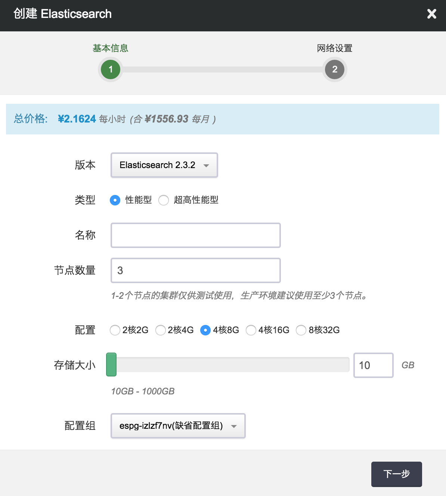
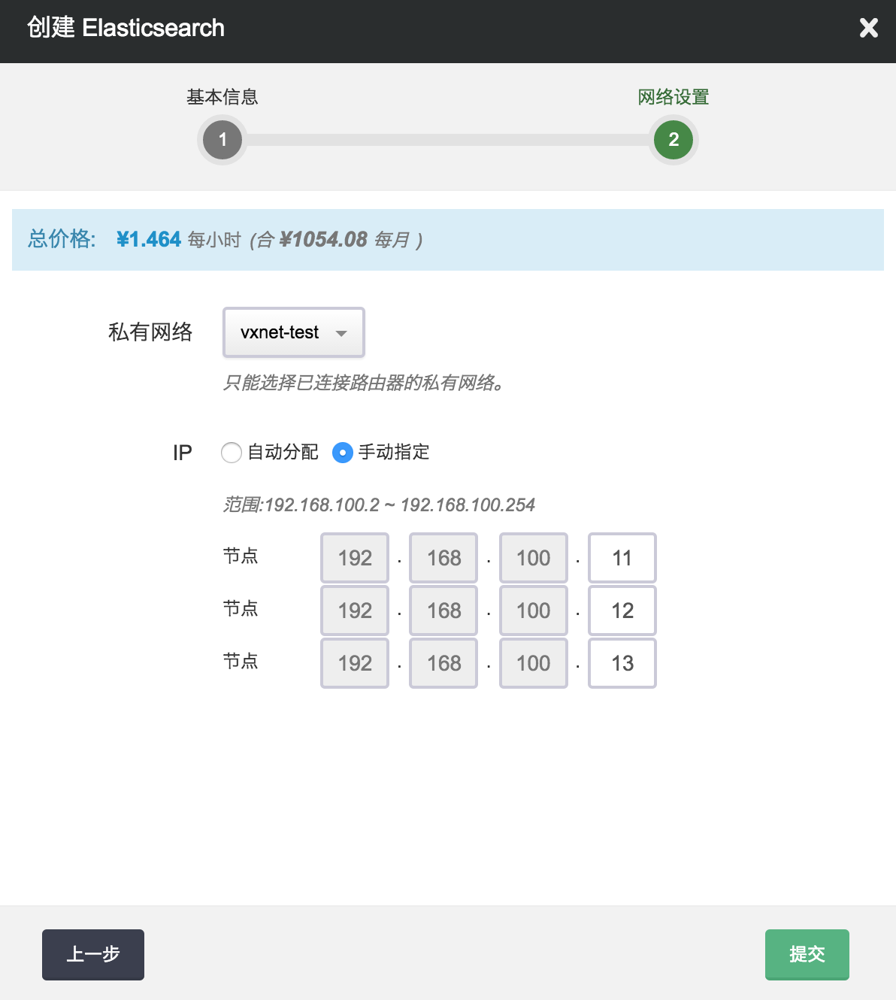
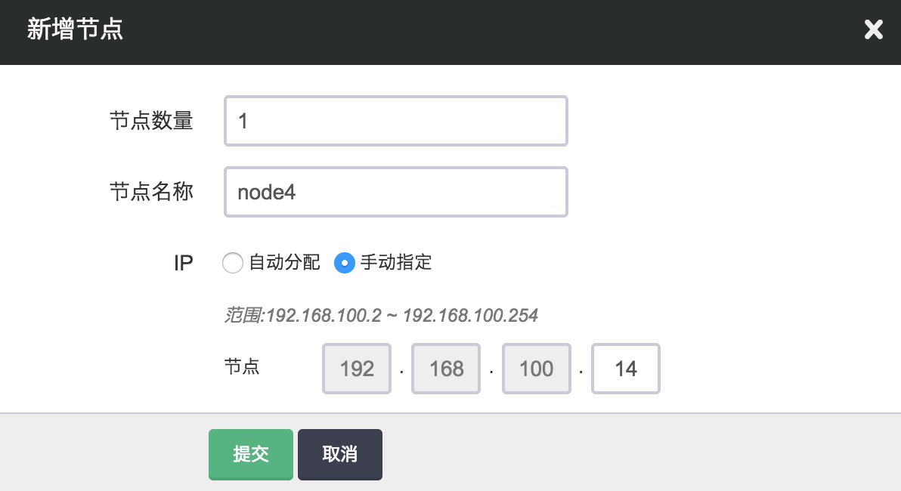
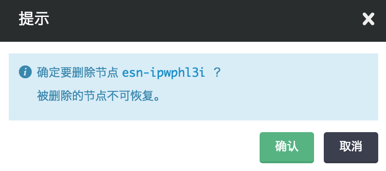
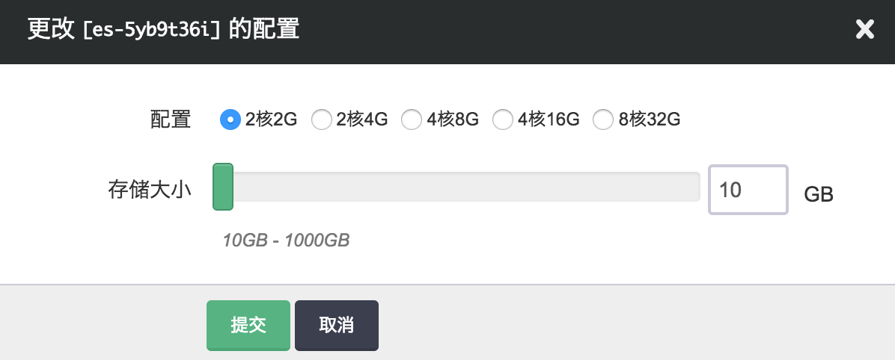

---
---


# Elasticsearch 指南

Elasticsearch 是一个分布式的全文搜索引擎，提供 RESTful 接口，以及近实时的索引、搜索、分析功能，基于 Lucene 构建，主要以 Java 开发，以 Apache License 开源。 更多详细文档请参看 [Elasticsearch 官方网站](https://www.elastic.co/guide/index.html) 。

## 创建 Elasticsearch

在青云QingCloud 上，您可以很方便的创建和管理一个 Elasticsearch 集群。青云QingCloud 的 Elasticsearch 集群支持横向与纵向、完全意义上的在线伸缩，即 Elasticsearch 的在线伸缩对客户端是透明的，用户的业务连续性不会因此而中断。另外我们还提供了监控告警等功能来帮助您更好的管理集群。集群将运行于私有网络内，结合青云QingCloud 提供的高性能硬盘，在保障高性能的同时兼顾您的数据安全。

>注解
为了保障数据安全，Elasticsearch 集群需要运行在受管私有网络中。所以在创建一个 Elasticsearch 集群之前，至少需要一个路由器和一个受管私有网络，受管私有网络需要和路由器连接，并开启 DHCP 服务（默认开启）。

**第一步：选择基本配置**

在创建的对话框中，您需要选择 Elasticsearch 版本号、CPU、内存配置，填写名称（可选）和节点数量以及选择磁盘大小。



>注解
目前集群节点数支持 1-N，其中 3 个节点以下的 Elasticsearch 建议只在测试环境使用，生产环节至少 3 个节点，同时不建议节点数超过 20 个。

**第二步：配置网络**

在配置网络的过程中，首先需要选择 Elasticsearch 要加入的私有网络。然后可以为 Elasticsearch 中的每个节点指定 IP， 也可以选择“自动分配”，让系统自动指定 IP。



**第三步：创建成功**

当 Elasticsearch 创建完成之后，您可以查看每个节点的运行状态。 如图所示，当节点显示为“活跃”状态，表示该节点启动正常。 当每个节点都启动正常后 Elasticsearch 集群显示为“活跃”状态，表示您已经可以正常使用 Elasticsearch 服务了。


**第四步：测试 Elasticsearch**

Elasticsearch 创建完成之后可以进行连接测试。可以通过 curl 调用命令测试，也可以下载 [Elasticsearch client](https://www.elastic.co/guide/en/elasticsearch/client/index.html) ，选择自己熟悉语言的 client。Elasticsearch 的 client 具有智能的服务发现功能，只需要连接 Elasticsearch 集群中的一个节点，即可自动发现其他节点。当增加和删除节点的时候，client 会自动感知，无需重启 client。

但同时，Elasticsearch 的 client 要求必须和 server 在同一个私网内，如果您通过端口转发或者负载均衡器将 Elasticsearch 的服务暴露出去，client 和 server 不在同一个私网内，则不能使用 Elasticsearch 的智能 client ，只能直接调用 Rest API。

现假设客户端和 Elasticsearch 在同一私有网络，Elasticsearch 集群有三个节点，IP 地址分别为192.168.100.10，192.168.100.11，192.168.100.12，您可以通过如下代码连接 Elasticsearch。

python:

```
from elasticsearch import Elasticsearch
es = Elasticsearch(["192.168.100.10:9200","192.168.100.11:9200","192.168.100.12:9200"],
      sniff_on_start=True,
      sniff_on_connection_fail=True,
      sniffer_timeout=60)
es.index(index="my-index", doc_type="test-type", id=1, body={"any": "data", "id": 1})
es.get(index="my-index", doc_type="test-type", id=1)
```

java:

```
Settings settings = Settings.settingsBuilder()
            .put("cluster.name", "es-kievc1d0").put("client.transport.sniff", true).build();

TransportClient client = TransportClient.builder().settings(settings).build()
        .addTransportAddress(new InetSocketTransportAddress(Inet4Address.getByName("192.168.0.10"), 9300))
        .addTransportAddress(new InetSocketTransportAddress(Inet4Address.getByName("192.168.0.11"), 9300))
        .addTransportAddress(new InetSocketTransportAddress(Inet4Address.getByName("192.168.0.12"), 9300));

IndexResponse idxResp = client.prepareIndex().setIndex("my-index").setType("test-type").setId("1").setOpType(IndexRequest.OpType.INDEX).setSource("any","data").setSource("id",1).execute().get();
System.out.println(idxResp.toString());

GetResponse getResp =  client.prepareGet().setIndex("my-index").setType("test-type").setId("1").execute().get();
System.out.println(getResp.getSourceAsString());

client.close()
```

>注解
Elasticsearch 的 client 设置sniff后, 会自动发现集群节点，但还是建议初始化的时候填写多个 host，避免某个 host 节点挂掉后无法建立初始化连接。java 版本的 client 直接通过 elasticsearch 的 rpc 接口请求, 所以用的是 9300 端口, 同时, java 版本的 client 必须指定 cluster.name , 否则无法加入集群, 青云QingCloud 的 elasticsearch 集群的 cluster.name 默认为后台的资源ID (es-xxxxxxxx)。

也可以通过 curl 进行测试

```
curl -XPUT -s 'http://:9200/my-index/' -d '{
    "settings" : {
        "index" : {
            "number_of_shards" : 3,
            "number_of_replicas" : 1
        }
    }
}'

curl -XPUT -s "http://:9200/my-index/test-type/1" -d '{
    "any": "data",
    "id" : 1
}'
curl -XGET -s "http://:9200/my-index/test-type/1?pretty=true"
```

## 在线伸缩

**增加节点**

当 Elasticsearch 需增加节点以应对数据以及客户端逐步增多带来的压力，您可以在 Elasticsearch 详情页点击“新增节点”按钮。 同样，您可以对每个新增节点指定 IP 或选择自动分配。



**删除节点**

如果 Elasticsearch 集群的节点超过需求，您也可以在 Elasticsearch 详请页选中需要删除的节点，然后点“删除”按钮删除节点，以节省资源和费用。 删除节点的时候可能会触发数据迁移，所以一次只能删除一个节点。删除节点不影响集群服务。



**纵向伸缩**

由于 Elasticsearch 会充分利用内存来提升查询效率，所以当业务存放在 Elasticsearch 里的数据量增大到一定程度的时候，不可避免需要纵向扩容每个节点的内存。反之，如果节点的 CPU、内存使用并不大，可以降低配置。同时 Elasticsearch 的数据会落到磁盘上，如果磁盘空间不够也需要扩容，不过磁盘不支持缩小容量。 磁盘扩容的时候无需重启节点，不影响服务，但CPU、内存的伸缩需要重启节点，会逐台重启节点，不影响集群的整体功能，但也可能影响对某个节点的请求。



## 监控和告警

我们提供了监控和告警服务，以帮助用户更好的管理和维护运行中的 Elasticsearch 集群。

**监控服务**

对每个节点提供了资源监控，包括 CPU 使用率、内存使用率、硬盘使用率等。

>注解
暂时尚未提供 Elasticsearch 服务本身的 API 统计数据状态监控。

**告警服务**

我们对每个节点 Elasticsearch 服务是否正常进行监控并设置告警策略，一旦某个节点 Elasticsearch 服务发生异常就进行告警，并发送短信和邮件通知给用户。

虽然单节点出现异常并不影响集群的正常服务，但越早发现问题并及时解决是维护整个集群长期正常运行的最佳实践。

## 插件

Elasticsearch 提供了插件机制，当前我们的 Elasticsearch 服务内置了以下常用插件，暂时不支持用户自己上传安装插件。

*   [IK Analysis](https://github.com/medcl/elasticsearch-analysis-ik/tree/2.x) 是一个比较常用的中文分词插件。青云QingCloud 提供的IK插件，除了该插件自带的词库外，还集成了搜狗的词库以提供更好的中文分词效果。IK插件提供的中文分词仅对新生成并指定IK作为分词器的index有效，对之前创建的index无效。
*   analysis-icu 使用 [ICU](http://site.icu-project.org/) 实现的一个针对亚洲语言的分词器插件。
*   analysis-kuromoji 使用 [Kuromoji](http://www.atilika.org/) 实现的一个日语的分词器插件。
*   analysis-smartcn 针对中文或者中英文混合的文本的分词器插件。
*   mapper-attachments 使用 [Apache Tika](http://lucene.apache.org/tika/) 实现的用来解析 PDF 和 Microsoft Word 文档的插件。
*   elasitcsearch-kopf [kopf](https://github.com/lmenezes/elasticsearch-kopf) 是一个开源的 Elasticsearch web 管理工具。
*   [head](http://mobz.github.io/elasticsearch-head/) 提供一个Elasticsearch cluster的web控制台，用户可以在这个控制台里很方便的查看集群拓扑架构、监控集群状态，进行节点和索引级别的各种操作，以及进行数据的浏览、查询、分析等。在浏览器输入网址 [http:/](http://:9200/_plugin/head/) 即可使用该插件提供的集群控制台。
*   [sql](https://github.com/NLPchina/elasticsearch-sql/wiki) 可以使用户以类SQL语法查询、分析存储在Elasticsearch中的数据，并可以在SQL中使用Elasticsearch特有的functions。在浏览器输入网址 [http:/](http://:9200/_plugin/sql/) 即可使用该插件提供的相关功能。
*   [Delete By Query](https://www.elastic.co/guide/en/elasticsearch/plugins/2.3/plugins-delete-by-query.html) 插件可以让用户很方便的删除满足指定查询条件的所有文档（可能属于多个索引）。使用该插件功能时请仔细阅读相关文档并进行试验（比如先运行相关查询，确认是否是要删的数据），以防止误删有用数据。
*   AWS Cloud Plugin，该插件可以使用户以兼容Amazon S3协议的方式将集群的数据做快照并备份到QingStor，在必要时可以从QingStor恢复。此功能将在本文档之后的部分有更详细的描述，此处不再赘述。

>注解
IK Analysis, head, sql, Delete By Query以及AWS Cloud Plugin等插件都是2017年1月16日正式上线，如果您的Elasticsearch集群在此时间之前就一直运行至今，如要使用这些插件只需重新启动Elasticsearch集群即可。

>注解
使用head, sql等插件需要通过浏览器访问集群内的节点， 出于安全性的考虑建议用户通过VPN的方式而不是端口转发的方式访问集群节点，配置青云QingCloud VPN的方法详见 [用户指南](https://docs.qingcloud.com/guide/vpn.html) 。

## 与 QingStor 对象存储集成

QingStor对象存储为用户提供了云端可无限扩展的通用数据存储服务，具有安全可靠、简单易用、高性能、低成本等特点。 用户可以将数据、日志、静态资源等多种文件类型，通过多种方式上传至QingStor对象存储中，以满足日常数据存储、归档、分析等需求。 为了更好的满足用户的需求，青云QingCloud 提供了Elasticsearch等与QingStor对象存储的集成功能。

Elasticsearch可以通过快照（snapshot）将指定index甚至整个cluster的数据存储到某远端仓库（repository）, 并能从该远端仓库存储的快照中恢复数据。 因Elasticsearch可以指定Amazon S3作为远程仓库，而QingStor又兼容AWS S3 API, 所以青云QingCloud 提供的Elasticsearch服务可以通过AWS Cloud Plugin与QingStor对象存储集成以便生成快照将数据存储到到QingStor中，并可以在必要时从中恢复。

一、要在Elasticsearch中创建snapshot，首先要创建一个repository

```
curl -XPUT 'http://192.168.0.10:9200/_snapshot/my_es_repos/' -d'
{
  "type": "s3",
  "settings": {
    "endpoint": "s3.pek3a.qingstor.com",
    "access_key": "",
    "secret_key": "",
    "bucket": "my_qingstor_bucket"
  }
}
'
```

上述命令必须指定的几个关键参数包括：

```
集群节点地址           192.168.0.10
repository            my_es_repos
endpoint              s3.pek3a.qingstor.com (以北京3区为例，其他区需将pek3a改为相应名称如sh1a，gd2等)
access_key            青云QingCloud 账号关联的access_key
secret_key            青云QingCloud 账号关联的secret_key
bucket                QingStor上bucket名称my_qingstor_bucket（如果不存在将创建出来）
```

二、创建了repository后，可通过如下命令获取、删除repository：

```
获取指定repository信息
curl -XGET 'http://192.168.0.10:9200/_snapshot/my_es_repos/'

获取满足特定条件的repository信息
curl -XGET 'http://192.168.0.10:9200/_snapshot/repo*,*backup*'

获取所有repository信息
curl -XGET 'http://192.168.0.10:9200/_snapshot/_all/'

删除repository
curl -XDELETE 'http://192.168.0.10:9200/_snapshot/my_es_repos'
```

三、创建了repository后，用如下命令即可创建名为snapshot1的快照（该快照将会存放在之前指定的QingStor的bucket my_qingstor_bucket中）：

```
创建包含集群所有index的snapshot
curl -XPUT 'http://192.168.0.10:9200/_snapshot/my_es_repos/snapshot1?wait_for_completion=true'

创建包含集群指定index(此处为index_1,index_2)的snapshot
curl -XPUT 'http://192.168.0.10:9200/_snapshot/s3_repos_es_1/snapshot1?wait_for_completion=true' -d'
{
  "indices": "index_1,index_2",
  "ignore_unavailable": true,
  "include_global_state": false
}
'
wait_for_completion为true，该命令将会在快照创建完成返回
wait_for_completion为false，该命令将会在快照初始化完成就返回
```

四、创建了快照后，可以通过如下命令查看、删除快照

```
查看指定repository中某snapshot信息
curl -XGET 'http://192.168.0.10:9200/_snapshot/my_es_repos/snapshot1'

查看指定repository中所有snapshot信息
curl -XGET 'http://192.168.0.10:9200/_snapshot/my_es_repos/_all'

删除snapshot
curl -XDELETE 'http://192.168.0.10:9200/_snapshot/my_es_repos/snapshot1'
```

五、可以通过如下命令恢复存储的在QingStor的快照到Elasticsearch集群：

```
恢复包含集群所有index的snapshot
curl -XPOST 'http://192.168.0.10:9200/_snapshot/s3_repos_es_1/snapshot1/_restore'

恢复包含集群指定index(此处为index_1,index_2)的snapshot
curl -XPOST 'http://192.168.0.10:9200/_snapshot/s3_repos_es_1/snapshot1/_restore' -d'
{
  "indices": "index_1,index_2",
  "ignore_unavailable": true,
  "include_global_state": false,
  "rename_pattern": "index_(.+)",
  "rename_replacement": "restored_index_$1"
}
'
要恢复的index必须是集群中处于关闭状态的index, 处于打开状态的index将会提示无法恢复
```

六、恢复快照到另一个不同的集群，用户可以用这种方法在不同集群之间通过QingStor导入导出数据：

```
存储在snapshot中的信息不是和某个具体的集群或集群名字绑定的，因此可以把在一个集群中产生的快照恢复到另一个集群中去。

恢复到一个新集群前需要做的是在新的集群中生成和老的集群同样repository（必须使用同样的参数，具体方法请参考第一小节）。 需要注意的是，新集群的版本必须和老集群一致或者更新。

在新的集群创建好与老集群相同的repository后，就可以通过第五节中提到的命令（需要把ip地址192.168.0.10改成新集群里节点的地址）将老集群的数据恢复到新集群上去。
```

>注解
上述Elasticsearch与QingStor集成的功能都是2017年1月16日正式上线的，如果您的Elasticsearch集群在此时间之前就一直运行至今，如要使用该功能只需重新启动Elasticsearch集群即可。

>注解
更详细的有关集群快照的生成和恢复的信息请参考 [Elasticsearch官方文档](https://www.elastic.co/guide/en/elasticsearch/reference/2.3/modules-snapshots.html)

## 注意事项

使用 Elasticsearch 需要注意的一些事项

**安全**

Elasticsearch 本身的 API 没有提供安全机制，同时 Elasticsearch 的 API 的功能非常强大，所以强烈不建议通过公网将 Elasticsearch 直接暴露出去，Elasticsearch 需要在应用或者 API 网关后面。 针对Elasticsearch的攻击频发，因此建议用户通过VPN的方式而不是端口转发的方式访问集群节点，配置青云QingCloud VPN的方法详见 [用户指南](https://docs.qingcloud.com/guide/vpn.html) 。

**脚本**

Elasticsearch 本身提供了查询和索引时使用脚本的功能，该功能强大但也比较危险。青云QingCloud 的 Elasticsearch 服务默认的脚本配置如下：

```
script.inline: sandbox
script.indexed: sandbox
script.file: false
script.update: false
script.mapping: false
```

默认只支持 sandbox 类型的脚本语言，比如 lucene expression，mustache，不支持 groovy，禁止通过脚本更新，用户可以在配置组中更改以上默认设置。

**分片以及副本**

青云QingCloud 的 Elasticsearch 服务的默认分片以及副本配置如下：

```
index.number_of_shards：3
index.number_of_replicas: 1
```

也就是说创建的索引默认有 3 个分片，每个分片 1 个副本。这个可以通过配置组修改默认值，也可以创建每个索引的时候通过 API 参数指定。 索引的分片数和节点的伸缩关系很大，一旦创建索引后不能变更，请创建索引前预先评估好。 比如3个分片的话，节点扩容到3个节点，每个节点一个分片刚合适，如果再继续扩容的话就意义不大了（指对当前索引，Elasticsearch 集群可能包含多个索引）。 更详细的说明请参看 Elasticsearch 官方文档的 [shard-scale 章节](https://www.elastic.co/guide/en/elasticsearch/guide/current/shard-scale.html) 。

**其他配置项说明**

以下是青云QingCloud 的 Elasticsearch 配置组中的可变更配置说明，如果需要其他的配置项目，请在后台提交工单说明。

*   action.auto_create_index 是否自动创建索引，默认为 true，当提交数据的时候，如果该索引不存在则自动创建。如果为了避免误操作，可以关闭此选项。
*   action.destructive_requires_name 删除索引是是否需要明确指定名称， 默认为 true，即不允许通过通配符删除索引。如果是自动按日期创建索引，需要定时通过通配符清理，可以关闭此选项。
*   http.cors.enabled 是否开启cors，默认为 false。如果需要自己部署 Elasticsearch 的web管理界面（已经内置了kopf），则需要打开此设置项。
*   index.mapper.dynamic 是否动态给数据类型创建mapper，默认为 true。详细说明请参看 [Elasticsearch 官方文档 dynamic-mapping](https://www.elastic.co/guide/en/elasticsearch/reference/current/dynamic-mapping.html) 。

**Discovery以及Recovery配置**

Elasticsearch 提供的 Discovery 以及 Recovery 配置我们会自动根据节点数进行计算设置，无需手动设置。

*   discovery.zen.minimum_master_nodes 为 (len(nodes) / 2) + 1。比如3个节点的时候该值是2。但当节点数小于3的时候，该值为1。
*   discovery.zen.ping.unicast.hosts 会设置为除了本机之外的集群内其他所有节点。
*   gateway.recover_after_nodes 为 max(discovery.zen.minimum_master_nodes, len(nodes)-2)。
*   gateway.expected_nodes 为 len(nodes)，和集群内的节点数保持相等。
*   gateway.recover_after_time 保持 Elasticsearch 的默认值5m，未做变更。

以上设置对集群的可用性也有影响。比如5个节点的集群，minimum_master_nodes 为3，如果挂掉2台，集群还能正常运作，但如果挂掉3台，存活节点小于 minimum_master_nodes，集群无法选出 master，于是不能正常运作。

Recovery相关设置只对集群启动有影响（比如 停止整个集群后再启动）。 比如10个节点的集群，按照上面的规则配置，当集群重启后，首先系统等待 minimum_master_nodes（6）个节点加入才会选出 master， recovery 操作是在 master 节点上进行的，由于我们设置了 recover_after_nodes（8），系统会继续等待到 8 个节点加入， 才开始进行recovery。当开始 recovery 的时候，如果发现集群中的节点数小于 expected_nodes，也就是还有部分节点未加入， 于是开始recover_after_time 倒计时 (如果节点数达到expected_nodes则立刻进行 recovery)，5分钟后，如果剩余的2个节点依然没有加入，则会进行数据 recovery。

## Benchmark

详细结果可以参考 Elasticsearch 官方提供的 [benchmark 结果](https://benchmarks.elastic.co/index.html) 。 我们通过 Elasticsearch 官方提供的 benchmark 脚本 [rally](https://github.com/elastic/rally) ，对青云QingCloud QingCloud 北京三区的 Elasticsearch 集群 (版本:2.3.2)进行压测，结果如下：

**2核4G 3个节点**

| Metric | Value |
| --- | --- |
| Min Indexing Throughput [docs/s] | 21893 |
| Median Indexing Throughput [docs/s] | 24953 |
| Max Indexing Throughput [docs/s] | 26112 |
| Indexing time [min] | 30.7988 |
| Merge time [min] | 9.63552 |
| Refresh time [min] | 3.48893 |
| Flush time [min] | 0.0725 |
| Merge throttle time [min] | 1.01427 |
| Query latency expression (90.0 percentile) [ms] | 447.522 |
| Query latency expression (99.0 percentile) [ms] | 476.101 |
| Query latency expression (99.9 percentile) [ms] | 523.865 |
| Query latency expression (100 percentile) [ms] | 527.748 |
| Query latency country_agg_cached (90.0 percentile) [ms] | 3.46748 |
| Query latency country_agg_cached (99.0 percentile) [ms] | 5.39187 |
| Query latency country_agg_cached (99.9 percentile) [ms] | 10.4793 |
| Query latency country_agg_cached (100 percentile) [ms] | 10.556 |
| Query latency scroll (90.0 percentile) [ms] | 23.912 |
| Query latency scroll (99.0 percentile) [ms] | 25.4024 |
| Query latency scroll (99.9 percentile) [ms] | 27.2083 |
| Query latency scroll (100 percentile) [ms] | 29.8818 |
| Query latency country_agg_uncached (90.0 percentile) [ms] | 209.331 |
| Query latency country_agg_uncached (99.0 percentile) [ms] | 304.542 |
| Query latency country_agg_uncached (99.9 percentile) [ms] | 320.223 |
| Query latency country_agg_uncached (100 percentile) [ms] | 328.809 |
| Query latency term (90.0 percentile) [ms] | 3.04082 |
| Query latency term (99.0 percentile) [ms] | 4.45539 |
| Query latency term (99.9 percentile) [ms] | 11.7025 |
| Query latency term (100 percentile) [ms] | 16.4156 |
| Query latency default (90.0 percentile) [ms] | 47.1765 |
| Query latency default (99.0 percentile) [ms] | 63.8806 |
| Query latency default (99.9 percentile) [ms] | 71.2552 |
| Query latency default (100 percentile) [ms] | 78.4954 |
| Query latency phrase (90.0 percentile) [ms] | 4.57735 |
| Query latency phrase (99.0 percentile) [ms] | 10.4325 |
| Query latency phrase (99.9 percentile) [ms] | 11.9768 |
| Query latency phrase (100 percentile) [ms] | 11.9843 |
| Total Young Gen GC [s] | 82.437 |
| Total Old Gen GC [s] | 0.611 |
| Segment count | 102 |
| Indices Stats(90.0 percentile) [ms] | 4.09647 |
| Indices Stats(99.0 percentile) [ms] | 12.9393 |
| Indices Stats(100 percentile) [ms] | 17.7869 |
| Nodes Stats(90.0 percentile) [ms] | 5.9029 |
| Nodes Stats(99.0 percentile) [ms] | 16.1599 |
| Nodes Stats(100 percentile) [ms] | 17.9797 |

**4核8G 3个节点**

| Metric | Value |
| --- | --- |
| Min Indexing Throughput [docs/s] | 42304 |
| Median Indexing Throughput [docs/s] | 43143 |
| Max Indexing Throughput [docs/s] | 48946 |
| Indexing time [min] | 36.4798 |
| Merge time [min] | 10.2791 |
| Refresh time [min] | 1.88903 |
| Flush time [min] | 0.0766333 |
| Merge throttle time [min] | 2.16872 |
| Query latency expression (90.0 percentile) [ms] | 428.509 |
| Query latency expression (99.0 percentile) [ms] | 454.359 |
| Query latency expression (99.9 percentile) [ms] | 475.658 |
| Query latency expression (100 percentile) [ms] | 480.142 |
| Query latency default (90.0 percentile) [ms] | 43.9918 |
| Query latency default (99.0 percentile) [ms] | 66.1001 |
| Query latency default (99.9 percentile) [ms] | 74.9061 |
| Query latency default (100 percentile) [ms] | 74.96 |
| Query latency country_agg_uncached (90.0 percentile) [ms] | 216.993 |
| Query latency country_agg_uncached (99.0 percentile) [ms] | 273.539 |
| Query latency country_agg_uncached (99.9 percentile) [ms] | 318.61 |
| Query latency country_agg_uncached (100 percentile) [ms] | 346.518 |
| Query latency scroll (90.0 percentile) [ms] | 26.2294 |
| Query latency scroll (99.0 percentile) [ms] | 28.0152 |
| Query latency scroll (99.9 percentile) [ms] | 33.0703 |
| Query latency scroll (100 percentile) [ms] | 34.956 |
| Query latency country_agg_cached (90.0 percentile) [ms] | 3.08641 |
| Query latency country_agg_cached (99.0 percentile) [ms] | 3.43788 |
| Query latency country_agg_cached (99.9 percentile) [ms] | 4.70646 |
| Query latency country_agg_cached (100 percentile) [ms] | 16.5074 |
| Query latency term (90.0 percentile) [ms] | 2.75105 |
| Query latency term (99.0 percentile) [ms] | 3.17803 |
| Query latency term (99.9 percentile) [ms] | 14.9365 |
| Query latency term (100 percentile) [ms] | 15.4502 |
| Query latency phrase (90.0 percentile) [ms] | 4.02906 |
| Query latency phrase (99.0 percentile) [ms] | 4.55645 |
| Query latency phrase (99.9 percentile) [ms] | 17.478 |
| Query latency phrase (100 percentile) [ms] | 23.8099 |
| Total Young Gen GC [s] | 96.146 |
| Total Old Gen GC [s] | 1.083 |
| Segment count | 283 |
| Indices Stats(90.0 percentile) [ms] | 7.33927 |
| Indices Stats(99.0 percentile) [ms] | 8.30654 |
| Indices Stats(100 percentile) [ms] | 9.82499 |
| Nodes Stats(90.0 percentile) [ms] | 7.13377 |
| Nodes Stats(99.0 percentile) [ms] | 10.2554 |
| Nodes Stats(100 percentile) [ms] | 14.5499 |
