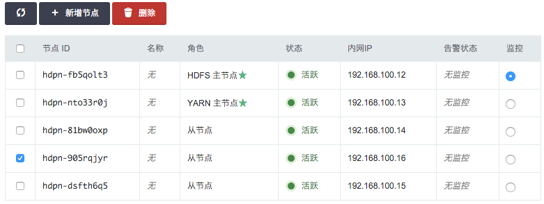

---
---

# Hadoop 指南

## 重要通知

>注解
青云的大数据平台会逐渐迁移到AppCenter上，不建议继续使用原下的Hadoop, Spark, HBase, Kafka, ZooKeeper, Redis, Memcached等服务，请使用新版集成了Hadoop 2.7.3和Spark 2.2.0并支持多模式切换的 [SparkMR服务](https://appcenter.qingcloud.com/apps/app-6iuoe9qs) ， 具体功能及用法详见 [SparkMR用户指南](http://appcenter-docs.qingcloud.com/user-guide/apps/docs/SparkMR/) 。AppCenter中的其他大数据服务可在 [应用中心](https://appcenter.qingcloud.com/apps) 找到，AppCenter中发布的大数据服务都是绿色图标并以xxx on QingCloud命名的，部署后可在  页面下可见。

Hadoop 是一个在大数据领域应用最广泛的、稳定可靠的、可扩展的用于分布式并行计算的开源软件。Hadoop 使用简洁的 MapReduce 编程模型来分布式的处理跨集群的大型数据集，集群规模可以扩展到几千甚至几万。相比于依赖昂贵的 硬件来实现高可用性，Hadoop是在假设每台机器都会出错的情况下，从软件层面来实现错误的检测和处理。青云提供的 Hadoop 集群服务包含：HDFS 分布式文件系统、Yarn 任务调度和集群资源管理系统以及 MapReduce 并行 分析计算系统。关于Hadoop 更多的详细信息，可参阅 [Hadoop 官方网站](http://hadoop.apache.org) 。

## 系统部署架构

Hadoop 集群采用的是 master/slave 架构，青云提供的 Hadoop 集群服务还包括在线伸缩、监控和告警等功能，帮助您更好地管理集群。 如下图所示，青云的 Hadoop 集群分三种节点类型：主节点 (Yarn Resource Manager 和 HDFS Name Node)，从节点 (Yarn Node Manager 和 HDFS Data Node) 和客户端节点 (Hadoop Client Node)。 用户在客户端节点发起Map Reduce 任务，通过与 HDFS 和 Yarn 集群中各节点的交互存取文件和执行 MapReduce 任务，获取结果。详情见下面测试 Hadoop 集群章节。


## 创建 Hadoop 集群

大数据平台包括 Hadoop 的运维是非常繁琐的，而在青云上，您可以在２到３分钟创建一个 Hadoop 集群，集群支持横向与纵向在线伸缩，还提供了监控告警等功能，使得管理集群非常方便。 集群将运行于 100% 二层隔离的私有网络内，结合青云提供的高性能硬盘，在保障高性能的同时兼顾您的数据安全。

>注解
为了保障数据安全, Hadoop 集群需要运行在受管私有网络中，所以在创建一个 Hadoop 集群之前，至少需要一个路由器和一个与路由器连接的受管私有网络，并开启 DHCP 服务（默认开启）。

**第一步：选择基本配置**

在创建的对话框中，您需要选择 Hadoop 版本号、CPU及内存配置，从节点存储大小，填写名称（可选）和从节点数量等。


>注解
主机配置1核2G 仅供测试使用; 至少创建3个从节点。

**第二步：配置网络**

在配置网络的过程中，首先需要选择 Hadoop 要加入的私有网络，然后可以为 Hadoop 中的每个节点指定 IP， 也可以选择“自动分配”，让系统自动指定 IP。


**第三步：创建成功**

当 Hadoop 创建完成之后，您可以查看每个节点的运行状态。 如图所示，当节点显示为“活跃”状态，表示该节点启动正常。 当每个节点都启动正常后 Hadoop 集群显示为“活跃”状态，表示您已经可以正常使用 Hadoop 服务了。


## 测试 Hadoop 集群

Hadoop 创建完成之后可以测试其可用性。

**创建 Hadoop Client 主机**

首先，和创建一个普通主机一样，在您的控制台基于映像市场的 **BigData Client** 创建一个　Ubuntu　主机 (假设主机名为 i-tp5n8o28)， 同时需要将该主机加入 Hadoop集群 同一私有网络。该主机已经安装了 Hadoop, JRE 等软件并且做了一些预定的配置。您可以直接用这个主机进行下面的测试。 Hadoop 集群的主机名是按照不同角色定义的:

*   HDFS master node: -hdfs-master
*   Yarn master node: -yarn-master
*   Hadoop slave node: -slave

假设 HDFS master node的　URL 为 hdfs://hdpn-8ct52oqk-hdfs-master:50070。这个 URL 可以在您控制台 Hadoop 详情页查到，也可以在 Hadoop 提供的监控页查到(请参考下面的监控告警章节)

注解

由于 Ubuntu 主机名对应 IP 127.0.0.1存在 [已知问题](https://wiki.apache.org/hadoop/ConnectionRefused)。所以先要在 /etc/hosts 文件里把127.0.0.1修改成主机的私网 IP (假设为192.168.107.20)，同时还需要加上 HDFS master，Yarn master 和 各个 Hadoop slave 的主机名与私网 IP 的信息，改完后的 /etc/hosts 类似于：

```
192.168.107.20    localhost
192.168.107.20    i-tp5n8o28
192.168.107.55    hdpn-mmqm9blk-hdfs-master
192.168.107.66    hdpn-on161rse-yarn-master
192.168.107.77    hdpn-dflptij8-slave
192.168.107.88    hdpn-dggp37ij-slave
192.168.107.99    hdpn-kjtvfg34-slave
```

其次，您需要根据创建的集群配置来修改``core-site.xml``, ``yarn-site.xml``, ``mapred-site.xml`` 中的相应参数，依次按下列方式修改：

```
cd /usr/local/hadoop

vim etc/hadoop/core-site.xml

#将以下内容写入 core-site.xml 文件来配置 HDFS 的地址

	<property>
		<name>fs.defaultFS</name>
		<value>hdfs://hdpn-mmqm9blk-hdfs-master:9000</value>
	</property> 
```

```
vim etc/hadoop/yarn-site.xml

#将以下内容写入 yarn-site.xml 文件来配置 Yarn 相关参数
	<property>
		<name>yarn.nodemanager.aux-services</name>
		<value>mapreduce_shuffle</value>
	</property>
	
	<property>
		<name>yarn.nodemanager.aux-services.mapreduce_shuffle.class</name>
		<value>org.apache.hadoop.mapred.ShuffleHandler</value>
	</property>

	<property>
		<name>yarn.resourcemanager.address</name>
		<value>hdpn-on161rse-yarn-master:8032</value>
	</property>

	<property>
		<name>yarn.resourcemanager.scheduler.address</name>
		<value>hdpn-on161rse-yarn-master:8030</value>
	</property>

	<property>
		<name>yarn.resourcemanager.resource-tracker.address</name>
		<value>hdpn-on161rse-yarn-master:8031</value>
	</property>

	<property>
		<name>yarn.resourcemanager.admin.address</name>
		<value>hdpn-on161rse-yarn-master:8033</value>
	</property>

	<property>
		<name>yarn.resourcemanager.webapp.address</name>
		<value>hdpn-on161rse-yarn-master:8088</value>
	</property>
```

```
vim etc/hadoop/mapred-site.xml

#将以下内容写入 mapred-site.xml 文件来配置 MapReduce 要使用的资源分配和调度框架
	<property>
		<name>mapreduce.framework.name</name>
		<value>yarn</value>
	</property>
```

**测试一**

这个测试是检查HDFS的通用文件操作, 青云 Hadoop 的HDFS 在创建的时候自动帮您生成了两个用户： /user/root 和 /user/ubuntu。假设 Hadoop HDFS 的 URL 为 hdfs://hdpn-8ct52oqk-hdfs-master:9000，这个 URL 可以在您控制台 Hadoop 详情页查到，也可以在 Hadoop 提供的监控页查到(请参考下面的监控告警章节)。您也需要把这个 host 的 IP　信息写到 /etc/hosts 文件里。然后在客户端主机里先切换成 root 用户(或者每次执行命令前加 sudo -E)，依次执行下列命令:

```
cd /usr/local/hadoop

bin/hdfs dfs -put etc/hadoop/ input

bin/hdfs dfs -ls input
```

>注解
可通过 HDFS Name Node 节点的50070端口浏览 HDFS 文件目录(请参考下面的监控告警章节)。

您能看到本地文件夹etc/hadoop中的文件被上传到 HDFS input文件夹中，并列出了 input 文件夹中的文件。

**测试二**

这个测试是统计文件中每个单词的出现次数，依次执行下列命令：

```
cd /usr/local/hadoop

bin/hadoop jar share/hadoop/mapreduce/hadoop-mapreduce-examples-2.6.0.jar wordcount input output

bin/hdfs dfs -cat output/part-r-00000
```

您能看到 MapReduce 作业的运行进展，以及最终的单词统计结果。

**测试三**

这个测试来自 Hadoop 官方的 Benchmark 性能基准测试，测试的是 HDFS 分布式I/O读写的速度/吞吐率，依次执行下列命令：

```
cd /usr/local/hadoop

# 使用6个 Map 任务并行向 HDFS 里6个文件里分别写入 1GB 的数据
bin/hadoop jar share/hadoop/mapreduce/hadoop-mapreduce-client-jobclient-2.6.0-tests.jar TestDFSIO -write -nrFiles 6 -size 1GB

# 使用6个 Map 任务并行从 HDFS 里6个文件里分别读取 1GB 的数据
bin/hadoop jar share/hadoop/mapreduce/hadoop-mapreduce-client-jobclient-2.6.0-tests.jar TestDFSIO -read -nrFiles 6 -size 1GB

# 清除以上生成的数据
bin/hadoop jar share/hadoop/mapreduce/hadoop-mapreduce-client-jobclient-2.6.0-tests.jar TestDFSIO -clean
```

您能看到 HDFS 每秒读写文件速度，以及吞吐量的具体数值。

**测试四**

这个测试来自 Hadoop 官方的 Benchmark 性能基准测试，测试的是大文件内容的排序，依次执行下列命令：

```
cd /usr/local/hadoop

# 生成1000万行数据到 /teraInput 路径中
bin/hadoop jar share/hadoop/mapreduce/hadoop-mapreduce-examples-2.6.0.jar teragen 10000000 /teraInput

# 将/teraInput 中生成的1000万行数据排序后存入到 /teraOutput 路径中
bin/hadoop jar share/hadoop/mapreduce/hadoop-mapreduce-examples-2.6.0.jar terasort teraInput /teraOutput

# 针对已排序的 /teraOutput 中的数据，验证每一行的数值要小于下一行
bin/hadoop jar share/hadoop/mapreduce/hadoop-mapreduce-examples-2.6.0.jar teravalidate -D mapred.reduce.tasks=8 /teraOutput /teraValidate

# 查看验证的结果
bin/hdfs dfs -cat teraValidate/part-r-00000
```

## 在线伸缩

**增加节点**

您可以在 Hadoop 详细页点击“新增节点”按钮增加从节点，可以对每个新增节点指定 IP 或选择自动分配。


**删除节点**

您可以在 Hadoop 详细页选中需要删除的从节点，然后点击“删除”按钮,但不能一次删除多个从节点，只能一次删除一个， 并且必须等到上个节点删除后且 decommission 结束才能删除下一个节点，否则数据会丢失，青云在此操作时会锁定 Hadoop 集群不让对其进行其它的操作，同时这个 decommission 状态可以从 HDFS Name Node 的 50070 端口提供的监控信息观察到。Decommission 是在复制即将删除节点上的数据到别的节点上，如果您的数据量比较大，这个过程会比较长。 因为青云的 HDFS 副本因子默认为 2，所以当您的 Hadoop 从节点数为 3 的时候就不能再删除节点。如果您修改了 HDFS 的副本因子须记住对应的最少节点数， 同时要预先知道其它节点的总硬盘空间足够拷贝删除节点的内容，才能进行删除。



>注解
对集成 HDFS 的 Hadoop，删除节点是一个比较危险的操作，要仔细阅读上面的指南。

**纵向伸缩**

由于不同类节点压力并不同，所以青云 Hadoop 支持对 Yarn Resource Manager 主节点、HDFS Name Node 主节点 和 Hadoop 从节点分别进行纵向伸缩。通常情况下两个主节点的压力不会太大， 在创建 Hadoop 的时候我们自动给两个主节点分配较低配置，但随着压力增大您可能需要对这些节点扩容。


## 监控和告警

Hadoop HDFS， Yarn 和 MapReduce 提供了丰富的监控信息。如果需要通过公网访问这些信息您需要先在路由器上设置端口转发，同时打开防火墙相应的下行端口。HDFS Name Node 默认端口是50070， Yarn Resource Manager 默认端口8088， MapReduce Job History Server 默认端口19888 提供了集群的信息。因此私网可以访问以下 URL：

*   [http:/](http:/)/:50070
*   [http:/](http:/)/:8088
*   [http:/](http:/)/:19888


同时我们还提供了对每个节点资源的监控和告警服务，包括 CPU 使用率、内存使用率、硬盘使用率等，以帮助用户更好的管理和维护 Hadoop 集群。

## 与 QingStor 对象存储集成

QingStor 对象存储为用户提供可无限扩展的通用数据存储服务，具有安全可靠、简单易用、高性能、低成本等特点。用户可将数据上传至 QingStor 对象存储中，以供数据分析。 由于 QingStor 对象存储兼容 AWS S3 API，因此 Hadoop 平台可以通过 AWS S3 协议与 QingStor 对象存储高效集成，以满足更多的大数据计算和存储场景。

有关 QingStor 的更多内容，请参考 [QingStor 对象存储用户指南](https://docs.qingcloud.com/qingstor/guide/index.html)

>注解
目前 Hadoop 与 QingStor 对象存储的集成仅支持北京3区-A，后续我们将开放更多的分区，敬请期待。

**第一步：在 Hadoop Client 主机中启用 S3 相关配置**

```
# 我们已将 S3 相关的文件包和配置文件准备好，您只需要撤销 S3 属性部分的注释以启用 S3 协议，并将其中 fs.s3a.access.key 和 fs.s3a.secret.key 的属性值修改为您在青云的 access key 和 secret key 的值即可

cd /usr/local/hadoop
vim etc/hadoop/core-site.xml
```

**第二步：测试 Hadoop 与 QingStor 对象存储的集成**

```
# 示例 1：从 Hadoop Client 主机本地上传文件到 QingStor 对象存储
cd /usr/local/hadoop
bin/hadoop fs -put LICENSE.txt s3a://your_bucket/

# 示例 2：将文件从 QingStor 对象存储下载到 Hadoop Client 主机本地
bin/hadoop fs -get s3a://your_bucket/LICENSE.txt

# 示例 3：将文件从 QingStor 对象存储拷贝到 HDFS 文件系统
bin/hadoop distcp -libjars $HADOOP_S3 s3a://your_bucket/LICENSE.txt /LICENSE.txt

# 示例 4：将文件从 HDFS 文件系统拷贝到 QingStor 对象存储存储空间中
bin/hadoop distcp -libjars $HADOOP_S3 /LICENSE.txt s3a://your_bucket/your_folder/

# 示例 5：将 QingStor 对象存储中的文件作为 MapReduce 的输入，计算结果输出到 HDFS 文件系统中
bin/hadoop jar share/hadoop/mapreduce/hadoop-mapreduce-examples-2.6.0.jar wordcount -libjars $HADOOP_S3 s3a://your_bucket/LICENSE.txt /test_output

# 示例 6：将 QingStor 对象存储中的文件作为 MapReduce 的输入，计算结果依然输出到 QingStor 对象存储的存储空间中
bin/hadoop jar share/hadoop/mapreduce/hadoop-mapreduce-examples-2.6.0.jar wordcount -libjars $HADOOP_S3 s3a://your_bucket/LICENSE.txt s3a://your_bucket/your_folder/

# 示例 7：将 HDFS 中的文件作为 MapReduce 的输入，计算结果输出到 QingStor 对象存储的存储空间中
bin/hadoop jar share/hadoop/mapreduce/hadoop-mapreduce-examples-2.6.0.jar wordcount -libjars $HADOOP_S3 /LICENSE.txt s3a://your_bucket/
```
