---
---

# HBase 指南

HBase 是一个开源的、分布式的、数据多版本的，列式存储的nosql数据库。依托 Hadoop 的分布式文件系统 HDFS 作为底层存储, 能够为数十亿行数百万列的海量数据表提供随机、实时的读写访问。 青云提供的 HBase 集群服务包含：HBase 数据库服务、HDFS 分布式文件系统、Phoenix 查询引擎。压缩格式方面支持 GZIP、BZIP2、LZO、SNAPPY，可自行在应用中指定。 关于 HBase 更多的详细信息，可参阅 [HBase 官方文档](http://hbase.apache.org/book.html)，关于 Phoenix 查询引擎的详细信息，可参阅 [Phoenix 官方网站](http://phoenix.apache.org/) 。

## 系统部署架构

与 Hadoop 一样，HBase 集群采用的是 master/slave 架构，青云提供的 HBase 集群服务还包括在线伸缩、监控告警、配置修改等功能，帮助您更好地管理集群。 如下图所示，青云的 HBase 集群分三种节点类型：主节点 (HBase Master 和 HDFS NameNode)，从节点 (HBase RegionServer 和 HDFS DataNode) 和客户端节点 (HBase Client)。 用户在HBase 客户端可通过HBase Shell、Java API（本地或MapReduce）、Rest API 或其他工具来访问HBase。 若需要使用除java外的其他语言时，可在客户端节点 (HBase Client)自行启动 Thrift Server 以供支持。

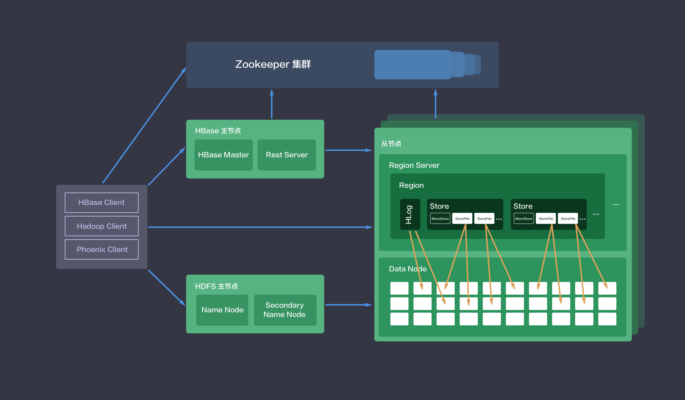

## 创建 HBase 集群

大数据平台包括 HBase 的运维是非常繁琐的，而在青云上，您可以在２到３分钟创建一个 HBase 集群，集群支持横向与纵向在线伸缩，还提供了监控告警等功能，使得管理集群非常方便。 集群将运行于 100% 二层隔离的私有网络内，结合青云提供的高性能硬盘，在保障高性能的同时兼顾您的数据安全。

>注解
为了保障数据安全, HBase 集群需要运行在受管私有网络中，同时由于 HBase 依赖于 ZooKeeper，所以在创建一个 HBase 集群之前，您至少需要一个路由器和一个与路由器连接的受管私有网络以及在该网络中创建一个 ZooKeeper 集群，并开启 DHCP 服务（默认开启）。

**第一步：选择基本配置**

在创建的对话框中，您需要选择 HBase 版本号、CPU及内存配置，从节点存储大小，填写名称（可选）和从节点数量等。

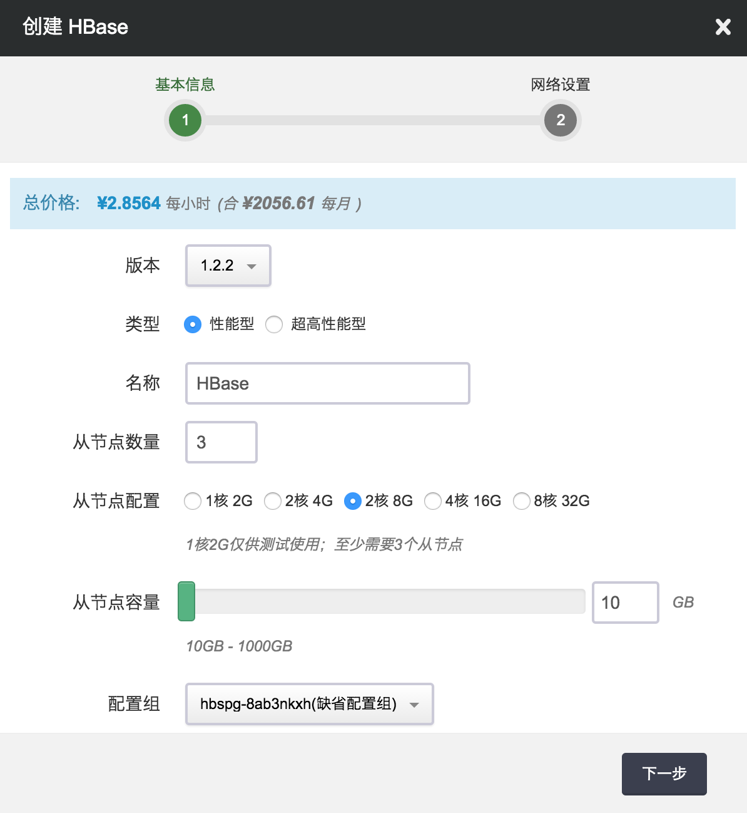

>注解
主机配置1核2G 仅供测试使用; 至少创建3个从节点。

**第二步：配置网络**

在配置网络的过程中，首先需要选择 HBase 所需要的 ZooKeeper 集群，HBase 集群将加入该 ZooKeeper 所在的私有网络中，然后可以为 HBase 中的每个节点指定 IP， 也可以选择“自动分配”，让系统自动指定 IP。

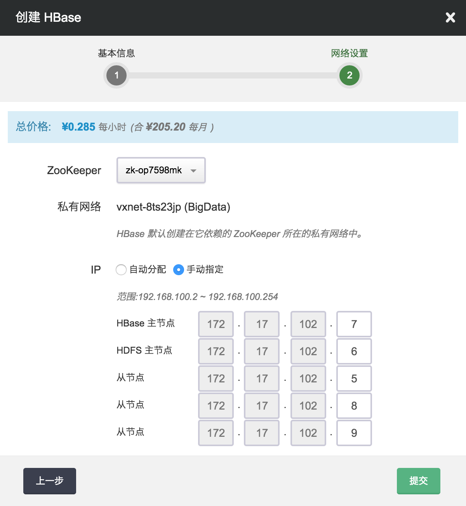

**第三步：创建成功**

当 HBase 创建完成之后，您可以查看每个节点的运行状态。 如图所示，当节点显示为“活跃”状态，表示该节点启动正常。 当每个节点都启动正常后 HBase 集群显示为“活跃”状态，表示您已经可以正常使用 HBase 服务了。

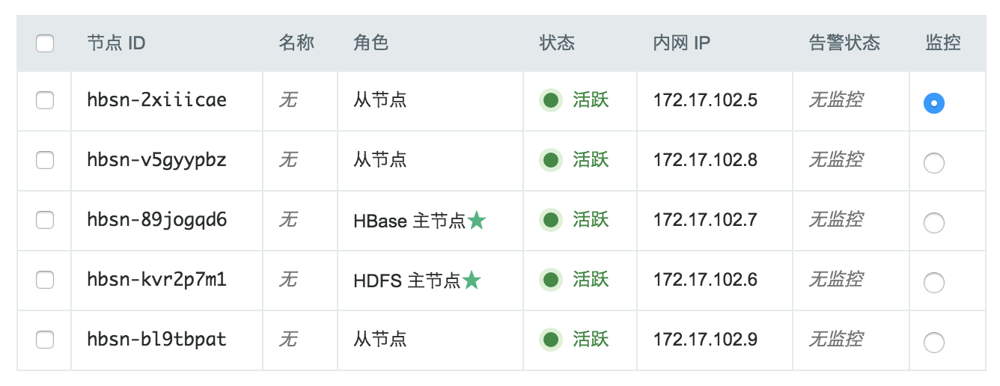

## 测试 HBase 集群

HBase 创建完成之后可以测试其可用性。

**创建 HBase Client 主机**

在青云上创建 HBase Client 节点, 首先打开映像市场，在工具分类中找到 HBase Client，然后点击使用，选择主机类型、CPU、内存，并将该主机加入 HBase 集群同一路由器下的私有网络中。(假设主机名为 i-ahdf2uof )， 该主机已经安装了 HBase、Hadoop、JDK、Phoenix 等软件并且做了一些预定的配置。您可以直接用这个主机进行下面的测试。 HBase 集群的主机名是按照不同角色定义的:

*   HBase Master Node: -hbase-master
*   HDFS Master Node: -hbase-hdfs-master
*   HBase Slave Node: -hbase-slave

>注解
由于 Ubuntu 主机名对应 IP 127.0.0.1存在 [已知问题](https://wiki.apache.org/hadoop/ConnectionRefused)。所以先要在 /etc/hosts 文件里把127.0.0.1修改成主机的私网 IP (假设为172.17.102.8)，同时还需要加上 HBase master node，HDFS master 和 各个 HBase slave node 的主机名与私网 IP 的信息，改完后的 /etc/hosts 类似于：

```
172.17.102.10    localhost
172.17.102.10    i-ahdf2uof
172.17.102.8     hbsn-rpkag3va-hbase-slave
172.17.102.6     hbsn-9ps0gfds-hbase-hdfs-master
172.17.102.5     hbsn-8vh9nij6-hbase-slave
172.17.102.7     hbsn-zoyrcqc7-hbase-master
172.17.102.9     hbsn-ugmpsszk-hbase-slave
```

其次，您需要根据创建的集群配置来修改 core-site.xml, hbase-site.xml 中的相应参数，为方便表述，假设ZooKeeper集群的ip分别是：172.17.102.2,172.17.102.3,172.17.102.4，该信息可通过大数据平台下 ZooKeeper 详情页查询得到。假设创建的 HBase 集群 ID 为 hbs-v7z6ux63，该信息可通过大数据平台下 HBase 详情页查询得到。依次按下列方式修改：

```
$ cd /usr/local/hadoop

$ vim etc/hadoop/core-site.xml

#将以下内容写入 core-site.xml 文件来配置 HDFS 的地址
	<property>
		<name>fs.defaultFS</name>
		<value>hdfs://hbsn-9ps0gfds-hbase-hdfs-master:9000</value>
	</property>

```

```
$ cd /usr/local/hbase

$ vim conf/hbase-site.xml

#将以下内容写入 hbase-site.xml 文件来配置 HBase 保存元数据的 zookeeper 地址
	<property>
		<name>hbase.zookeeper.quorum</name>
		<value>172.17.102.2,172.17.102.3,172.17.102.4</value>
	</property>
	
	<property>
		<name>zookeeper.znode.parent</name>
		<value>/hbase/hbs-v7z6ux63</value>
	</property>
	
	<property>
		<name>hbase.rootdir</name>
		<value>hdfs://hbsn-9ps0gfds-hbase-hdfs-master:9000/hbase</value>
	</property>

```

>注解
如需使用本地 MapReduce 服务，无需操作。如需使用集群式 MapReduce 服务，在同一路由器下的私有网络（可选择新的私有网络，亦可使用当前 HBase 集群所在私有网路）下创建 Hadoop 集群，

Hadoop 集群节点 /etc/hosts 中增加 HBase 集群的 hosts（Hadoop 节点更改可提工单要求帮助），并在该客户端 /etc/hosts 中增加 Hadoop 集群的 hosts。 并修改 /usr/local/hadoop 下 etc/hadoop/yarn-site.xml 和 etc/hadoop/mapred-site.xml 配置文件，流程可参考`Hadoop 指南 `。

**测试一**

这个测试是通过HBase Shell 命令来完成一个 HBase 表的创建、插入、查找、删除操作。

```
$ cd /usr/local/hbase

$ bin/hbase shell

hbase(main):001:0> create 'test', 'cf'
0 row(s) in 1.2130 seconds

=> Hbase::Table - test
hbase(main):002:0> list 'test'
TABLE
test
1 row(s) in 0.0180 seconds

=> ["test"]

hbase(main):003:0> put 'test', 'row1', 'cf:a', 'value1'
0 row(s) in 0.0850 seconds

hbase(main):004:0> put 'test', 'row2', 'cf:b', 'value2'
0 row(s) in 0.0110 seconds

hbase(main):005:0> put 'test', 'row3', 'cf:c', 'value3'
0 row(s) in 0.0100 seconds

hbase(main):006:0> scan 'test'
ROW                                      COLUMN+CELL
 row1                                    column=cf:a, timestamp=1469163844008, value=value1
 row2                                    column=cf:b, timestamp=1469163862005, value=value2
 row3                                    column=cf:c, timestamp=1469163899601, value=value3
3 row(s) in 0.0230 seconds

hbase(main):007:0> get 'test', 'row1'
COLUMN                                   CELL
 cf:a                                    timestamp=1469094709015, value=value1
1 row(s) in 0.0350 seconds

hbase(main):008:0> disable 'test'
0 row(s) in 1.1820 seconds

hbase(main):009:0> drop 'test'
0 row(s) in 0.1370 seconds
```

**测试二**

这个测试是通过 HBase 自带的性能测试工具 PerformanceEvaluation 来测试 HBase 集群的随机写、顺序写、increment、append、随机读、顺序读、scan等操作的性能情况。测试过程中需要先写后读保证测试表中有数据。 测试结果中会有每个线程操作的耗时。

注解

若要使用 MapReduce 测试，可参考上文创建 HBase 客户端使用 MapReduce 服务部分。

```
$ cd /usr/local/hbase

# 测试随机写，预分区10个 region，使用多线程代替 MapReduce 的方式来并发随机写操作，10个线程，每个线程写10000行。
$ bin/hbase pe --nomapred --rows=10000 --presplit=10 randomWrite 10

# 测试顺序写，预分区10个 region，使用多线程代替 MapReduce 的方式来并发顺序写操作，10个线程，每个线程写10000行。
$ bin/hbase pe --nomapred --rows=10000 --presplit=10 sequentialWrite 10

# 测试基于 row    的自增操作，使用多线程代替 MapReduce 的方式来并发自增操作，10个线程，每个线程 increment 10000次。
$ bin/hbase pe --rows=10000 --nomapred increment 10

# 测试基于row的追加操作，使用多线程代替 MapReduce 的方式来并发追加操作，10个线程，每个线程 append 10000次。
$ bin/hbase pe --rows=10000 --nomapred append 10

# 测试随机读，使用多线程代替 MapReduce 的方式来并发随机读操作，10个线程，每个线程读10000行
$ bin/hbase pe --nomapred --rows=10000 randomRead 10

# 测试顺序读，使用多线程代替 MapReduce 的方式来并发顺序读操作，10个线程，每个线程读10000行
$ bin/hbase pe --nomapred --rows=10000 sequentialRead 10

# 测试范围scan操作，使用多线程代替 MapReduce 的方式来并发范围 scan 操作，10个线程，每个线程 scan 10000次，每次范围返回最大100行。
$ bin/hbase pe --rows=10000 --nomapred scanRange100 10
```

**测试三**

这个测试是通过 MapReduce 服务来批量导入 HDFS 中数据到 HBase

注解

已创建 Hadoop 集群并完成上文创建 HBase 客户端中使用 MapReduce 服务配置。

可通过 DistCp 命令来拷贝不同 HDFS 中的数据，关于 DistCp 更多的详细信息，可参阅 [DistCp](http://hadoop.apache.org/docs/r2.7.2/hadoop-distcp/DistCp.html)

使用 MapReduce 导入数据有三种方案：

一、直接书写 MapReduce 使用 HBase 提供的 JAVA API 从 HDFS 导入到 HBase 表。

二、书写 MapReduce 将 HDFS 中数据转化为 HFile 格式，再使用 HBase 的 BulkLoad 工具导入到 HBase 表。

三、使用 HBase ImportTsv 工具将格式化的 HDFS 数据导入到 HBase 表。


>注解
三种方案各有优缺点，方案一只需要一步操作，可自由规整数据，更为简单灵活，但直接写入 HBase 表会对线上服务有一定的性能影响。方案二和方案三则将导入步骤一分为二，耗时工作提前做好，确保对线上服务影响做到最小。

若要导入的数据已经是格式化的数据（有固定的分隔符），不需要自己实现 MapReduce 做进一步数据清洗，直接采用方案三；若数据并未格式化仍需规整则采用方案二。

以下方案中均使用 HBase 表 test_import，包含一个column family：content，可通过 HBase Shell 预先建好表

```
$ cd /usr/local/hbase

$ bin/hbase shell

hbase(main):001:0> create 'test_import', 'content'
0 row(s) in 1.2130 seconds

=> Hbase::Table - test_import
```

项目若使用mvn构建，pom.xml 中增加如下内容：

```

  1.2.2

    org.apache.hbase
    hbase-server
    ${hbase.version}

```

方案一 MapReduce 代码如下，先创建表，在 Map 中完成数据解析，在 Reduce 中完成入库。Reduce的个数相当于入库线程数。

>注解
可自行修改 job.setNumReduceTasks() 中 Reduce 数目

```
package com.qingcloud.hbase

import org.apache.hadoop.conf.Configuration;
import org.apache.hadoop.fs.Path;
import org.apache.hadoop.hbase.HBaseConfiguration;
import org.apache.hadoop.hbase.HColumnDescriptor;
import org.apache.hadoop.hbase.HTableDescriptor;
import org.apache.hadoop.hbase.TableName;
import org.apache.hadoop.hbase.client.*;
import org.apache.hadoop.hbase.mapreduce.TableMapReduceUtil;
import org.apache.hadoop.hbase.mapreduce.TableReducer;
import org.apache.hadoop.io.LongWritable;
import org.apache.hadoop.io.Text;
import org.apache.hadoop.mapreduce.Job;
import org.apache.hadoop.mapreduce.Mapper;
import org.apache.hadoop.mapreduce.lib.input.FileInputFormat;
import org.apache.hadoop.util.GenericOptionsParser;
import org.apache.hadoop.hbase.io.ImmutableBytesWritable;

import java.io.File;
import java.io.FileInputStream;
import java.io.IOException;

public class ImportByMR {

    private static String table = "test_import";

    private static class ImportByMRMapper extends Mapper {

        @Override
        public void map(LongWritable key, Text value, Context context) throws IOException, InterruptedException {
            String[] sp = value.toString().split(" ");
            if (sp.length  {

        @Override
        public void reduce(Text key, Iterable value, Context context) throws IOException, InterruptedException {
            byte[] bRowKey = key.toString().getBytes();
            ImmutableBytesWritable rowKey = new ImmutableBytesWritable(bRowKey);

            for (Text t : value) {
                Put p = new Put(bRowKey);
                p.setDurability(Durability.SKIP_WAL);
                p.addColumn("content".getBytes(), "a".getBytes(), t.toString().getBytes());
                context.write(rowKey, p);
            }
        }
    }

    private static void createTable(Configuration conf) throws IOException {
        TableName tableName = TableName.valueOf(table);
        Connection connection = ConnectionFactory.createConnection(conf);
        Admin admin = connection.getAdmin();
        if (admin.tableExists(tableName)) {
            System.out.println("table exists!recreating.......");
            admin.disableTable(tableName);
            admin.deleteTable(tableName);
        }
        HTableDescriptor htd = new HTableDescriptor(tableName);
        HColumnDescriptor tcd = new HColumnDescriptor("content");
        htd.addFamily(tcd);
        admin.createTable(htd);
    }

    public static void main(String[] argv) throws IOException, ClassNotFoundException, InterruptedException {
        Configuration conf = HBaseConfiguration.create();
        File file = new File("/usr/local/hbase/conf/hbase-site.xml");
        FileInputStream in = new FileInputStream(file);
        conf.addResource(in);
        createTable(conf);
        GenericOptionsParser optionParser = new GenericOptionsParser(conf, argv);
        String[] remainingArgs = optionParser.getRemainingArgs();

        Job job = Job.getInstance(conf, ImportByMR.class.getSimpleName());
        job.setJarByClass(ImportByMR.class);
        job.setMapperClass(ImportByMRMapper.class);
        TableMapReduceUtil.initTableReducerJob(table, ImportByMRReducer.class, job);
        job.setMapOutputKeyClass(Text.class);
        job.setMapOutputValueClass(Text.class);
        job.setOutputKeyClass(ImmutableBytesWritable.class);
        job.setOutputValueClass(Mutation.class);
        job.setNumReduceTasks(1);
        FileInputFormat.addInputPath(job, new Path(remainingArgs[0]));
        System.exit(job.waitForCompletion(true) ? 0 : 1);
    }
}
```

hbase-tools-1.0.0.jar 是将上述代码打成的jar包，APP_HOME 是 jar 包所放置的目录，/user/inputPath 下是需要导入到HBase中的数据。 数据格式为 rowkey value，两列空格分隔。需自行准备后通过 bin/hdfs dfs -put 到 HDFS 的 /user/inputPath 目录。 依次执行下述命令：

```
$ cd /usr/local/hadoop

$ bin/hadoop jar $APP_HOME/hbase-tools-1.0.0.jar com.qingcloud.hbase.ImportByMR /user/inputPath
```

执行成功后可简单通过测试一中的 HBase Shell 来验证数据。

方案二 MapReduce 代码如下，Map 对数据做进一步处理，Reduce 无需指定，会根据 Map 的 outputValue 自动选择实现。

```
package com.qingcloud.hbase

import org.apache.hadoop.conf.Configuration;
import org.apache.hadoop.fs.Path;
import org.apache.hadoop.hbase.*;
import org.apache.hadoop.hbase.client.*;
import org.apache.hadoop.hbase.io.ImmutableBytesWritable;
import org.apache.hadoop.hbase.mapreduce.HFileOutputFormat2;
import org.apache.hadoop.io.LongWritable;
import org.apache.hadoop.io.Text;
import org.apache.hadoop.mapreduce.Job;
import org.apache.hadoop.mapreduce.Mapper;
import org.apache.hadoop.mapreduce.lib.input.FileInputFormat;
import org.apache.hadoop.util.GenericOptionsParser;

import java.io.File;
import java.io.FileInputStream;
import java.io.IOException;

public class ImportByBulkLoad {

    private static String myTable = "test_import";

    private static class ImportByBulkLoadMapper extends Mapper {

        @Override
        public void map(LongWritable key, Text value, Context context) throws IOException, InterruptedException {
            String[] sp = value.toString().split(" ");
            if (sp.length

hbase-tools-1.0.0.jar 是将上述代码打成的 jar 包，APP_HOME 是 jar 包所放置的目录，/user/inputPath 下是需要导入到HBase中的数据。数据格式为 rowkey value，两列空格分隔。 需自行准备后通过 bin/hdfs dfs -put 到 HDFS 的 /user/inputPath 目录。 /user/outputPath 是 MapReduce 生成的 HFile 格式的结果。test_import 是 HBase 表名。依次执行下述命令：

```
```
$ cd /usr/local/hadoop

$ bin/hdfs dfs -rmr /user/outputPath

$ export HADOOP_CLASSPATH=`/usr/local/hbase/bin/hbase classpath`

$ bin/hadoop jar $APP_HOME/hbase-tools-1.0.0.jar com.qingcloud.hbase.ImportByBulkLoad /user/inputPath /user/outputPath

$ bin/hadoop jar /usr/local/hbase/lib/hbase-server-.jar completebulkload /user/outputPath test_import
```
```
执行成功后可简单通过测试一中的 HBase Shell 来验证数据。

方案三无需书写代码，/user/inputPath 下是需要导入到 HBase 中的数据。数据格式为 rowkey value，两列空格分隔。需自行准备后通过 bin/hdfs dfs -put 到 HDFS 的 /user/inputPath 目录。 /user/outputPath 是 HFile 格式的暂存结果。test_import是HBase表名。依次执行下述命令：

```
```
$ cd /usr/local/hadoop

$ bin/hdfs dfs -rmr /user/outputPath

$ export HADOOP_CLASSPATH=`/usr/local/hbase/bin/hbase classpath`

$ bin/hadoop jar /usr/local/hbase/lib/hbase-server-.jar importtsv -Dimporttsv.columns=HBASE_ROW_KEY,content:a -Dimporttsv.bulk.output=/user/outputPath test_import /user/inputPath
```

或

```
$ cd /usr/local/hadoop

$ bin/hdfs dfs -rmr /user/outputPath

$ cd /usr/local/hbase

$ bin/hbase org.apache.hadoop.hbase.mapreduce.ImportTsv -Dimporttsv.columns=HBASE_ROW_KEY,content:a -Dimporttsv.bulk.output=/user/outputPath test_import /user/inputPath
```

执行成功后可简单通过测试一中的 HBase Shell 来验证数据。

**测试四**

测试 Phoenix 查询引擎的支持，包括：sql语句、ACID事务。

>注解
HBase 集群默认不支持 Phoenix 查询引擎，如要使用，请通过修改配置的方式开启，修改：qingcloud.phoenix.on.hbase.enable 为 true。

如要开启 Phoenix 事务支持，修改：phoenix.transactions.enabled 为 true，应用修改。同时在client端修改配置：

```
$ cd /usr/local/hbase

$ vim conf/hbase-site.xml

#将以下内容写入 hbase-site.xml 文件来配置 Phoenix 及 ACID 事务支持

  phoenix.transactions.enabled
  true

  data.tx.snapshot.dir
  /tephra/snapshots

  hbase.regionserver.wal.codec
  org.apache.hadoop.hbase.regionserver.wal.IndexedWALEditCodec

```

测试简单的 sql

```
$ cd /usr/local/phoenix

# 测试时需手动填写 Zookeeper 连接，该地址可通过 HBase 详情页左侧基本属性列表中获得，去掉端口
$ bin/psql.py 192.168.100.4,192.168.100.3,192.168.100.2:/hbase/hbs-r2t3jzjo examples/WEB_STAT.sql examples/WEB_STAT.csv examples/WEB_STAT_QUERIES.sql
```

测试 ACID 事务，该测试需要开启两个终端按时间交互式执行，在commit之前另一终端是无法select得到新修改的数据的：

终端一

```
$ cd /usr/local/phoenix

$ bin/sqlline.py 192.168.100.4,192.168.100.3,192.168.100.2:/hbase/hbs-r2t3jzjo

0: jdbc:phoenix:> CREATE TABLE my_table (k BIGINT PRIMARY KEY, v VARCHAR) TRANSACTIONAL=true;
No rows affected (1.506 seconds)
0: jdbc:phoenix:> UPSERT INTO my_table VALUES (1,'A');
1 row affected (0.099 seconds)
0: jdbc:phoenix:> UPSERT INTO my_table VALUES (2,'B');
1 row affected (0.016 seconds)
0: jdbc:phoenix:> SELECT * FROM my_table;
+----+----+
| K  | V  |
+----+----+
| 1  | A  |
| 2  | B  |
+----+----+
2 rows selected (0.092 seconds)
0: jdbc:phoenix:> !commit
Operation requires that autocommit be turned off.
0: jdbc:phoenix:> !autocommit off
Autocommit status: false
0: jdbc:phoenix:> !commit
Commit complete (0 seconds)
0: jdbc:phoenix:> UPSERT INTO my_table VALUES (2,'C');
1 row affected (0 seconds)
0: jdbc:phoenix:> SELECT * FROM my_table;
+----+----+
| K  | V  |
+----+----+
| 1  | A  |
| 2  | C  |
+----+----+
2 rows selected (0.034 seconds)
```

开启终端二

```
$ cd /usr/local/phoenix

$ bin/sqlline.py

0: jdbc:phoenix:> SELECT * FROM my_table;
+----+----+
| K  | V  |
+----+----+
| 1  | A  |
| 2  | B  |
+----+----+
2 rows selected (1.15 seconds)
0: jdbc:phoenix:> !commit
Operation requires that autocommit be turned off.
0: jdbc:phoenix:> !autocommit off
Autocommit status: false
0: jdbc:phoenix:> !commit
```

终端一内继续执行

```
0: jdbc:phoenix:> !commit
Commit complete (0.006 seconds)
0: jdbc:phoenix:> SELECT * FROM my_table;
+----+----+
| K  | V  |
+----+----+
| 1  | A  |
| 2  | C  |
+----+----+
2 rows selected (0.035 seconds)
0: jdbc:phoenix:> !quit
```

终端二内继续执行

```
0: jdbc:phoenix:> SELECT * FROM my_table;
+----+----+
| K  | V  |
+----+----+
| 1  | A  |
| 2  | C  |
+----+----+
2 rows selected (0.038 seconds)
0: jdbc:phoenix:> drop table my_table;
No rows affected (2.668 seconds)
0: jdbc:phoenix:> !quit
```

## 在线伸缩

**增加节点**

您可以在 HBase 详情页点击“新增节点”按钮增加从节点，可以对每个新增节点指定 IP 或选择自动分配。

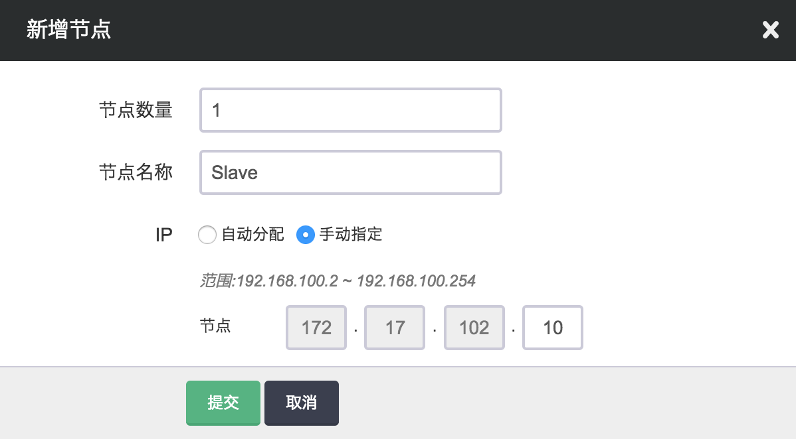

**删除节点**

您可以在 HBase 详情页选中需要删除的从节点，然后点击“删除”按钮，只能一次删除一个，并且必须等到上个节点删除后且 decommission 结束才能删除下一个节点，否则数据会丢失。 青云 HBase 集群在此操作时会先迁移 region 再复制数据，确保用户业务不受影响。删除节点过程中会锁定 HBase 集群不让对其进行其它的操作，同时这个 decommission 状态可以从 HDFS Name Node 的 50070 端口提供的监控信息观察到。Decommission 是在复制即将删除节点上的数据到别的节点上，如果您的数据量比较大，这个过程会比较长。 因为青云的 HDFS 副本因子默认为 2，所以当您 HBase 的从节点数为 3 的时候就不能再删除节点。同时要预先知道其它节点的总硬盘空间足够拷贝删除节点的内容，才能进行删除。

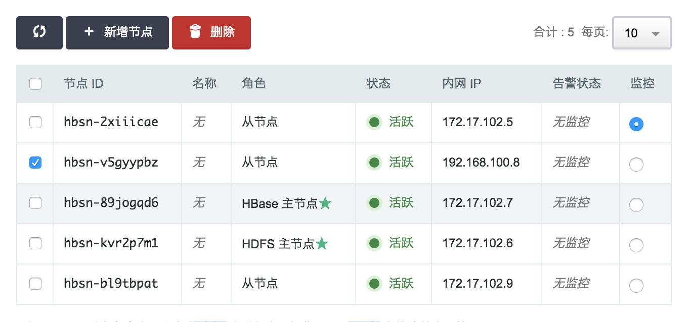

>注解
对集成 HDFS 的 HBase，删除节点是一个比较危险的操作，要仔细阅读上面的指南。

**纵向伸缩**

由于不同类节点压力并不同，所以青云 HBase 支持对 HBase Master Node 主节点、HDFS Name Node 主节点 和 HBase 从节点分别进行纵向伸缩。通常情况下两个主节点的压力不会太大， 在创建 HBase 的时候我们自动给两个主节点分配较低配置，但随着压力增大您可能需要对这些节点扩容。

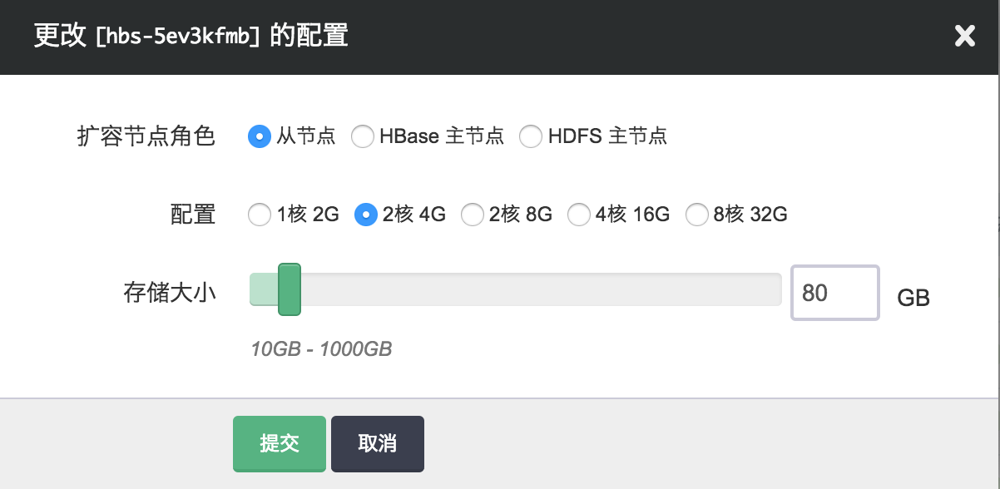

## 监控和告警

我们对 HBase 集群的每个节点提供了资源的监控和告警服务，包括 CPU 使用率、内存使用率、硬盘使用率等。 同时，HBase 和 HDFS 提供了丰富的监控信息。如果需要通过公网访问这些信息您需要先申请一个公网 IP 绑定在路由器上，在路由器上设置端口转发，同时打开防火墙相应的下行端口。 HBase Master 默认端口16010，HDFS Name Node 默认端口是50070。为方便查看HBase UI，请参考 [VPN 隧道指南](https://docs.qingcloud.com/product/network/vpn) 配置VPN，VPN 建立后可查看下述界面。

*   [http:/](http:/)/:16010
*   [http:/](http:/)/:50070

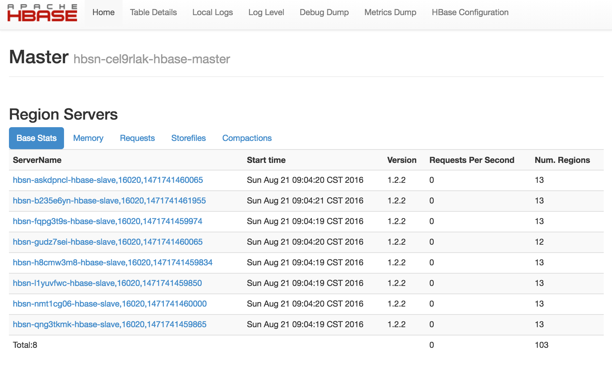

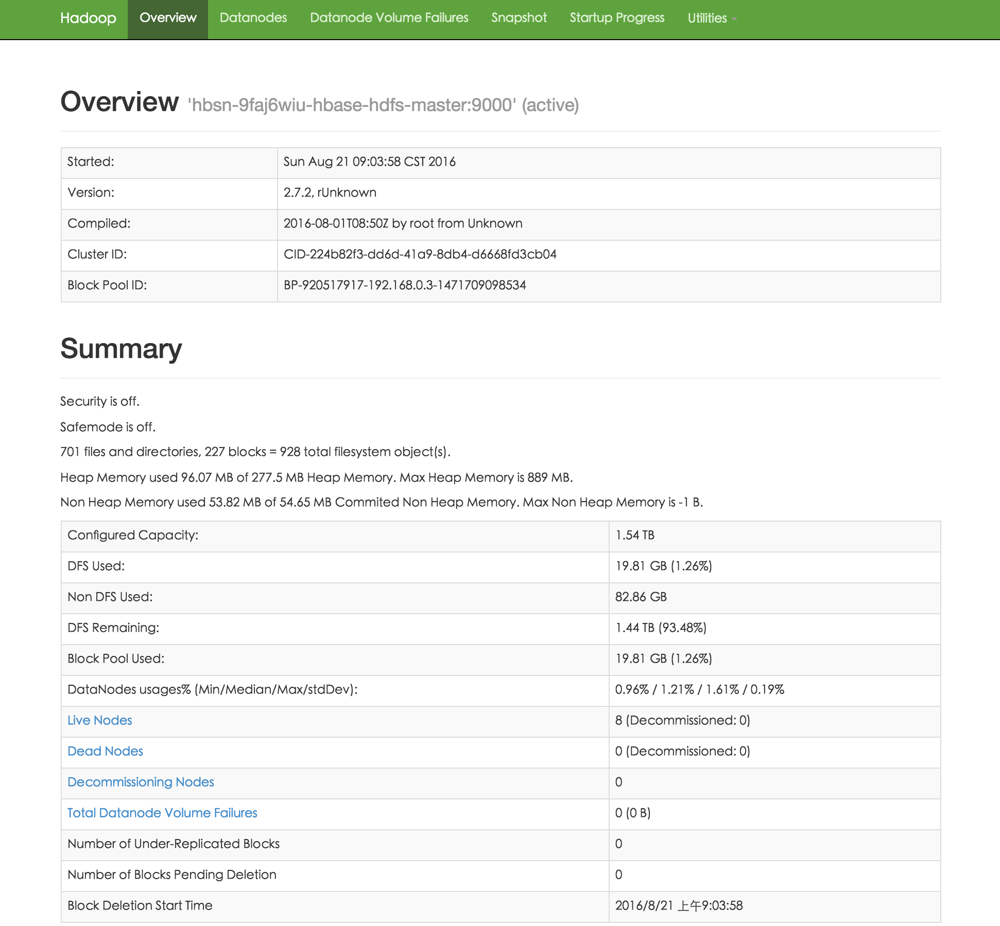

为了帮助用户更好的管理和维护 HBase 集群，我们提供了部分针对 HBase 服务的监控，包括：

*   **集群Region 迁移监控**： 集群中 Region 处于迁移状态的数量
*   **RegionServer 读、写QPS监控**： RegionServer 每秒读、写操作数
*   **RegionServer BlockCache 命中数监控**： RegionServer BlockCache 命中数
*   **RegionServer BlockCache 命中率监控**： RegionServer BlockCache 命中率
*   **RegionServer 慢操作数监控**： RegionSever 慢 Delete,Increment,Get,Append,Put 数量
*   **RegionServer CMS GC 时间监控**： RegionSever CMS GC 消耗 ms 数

## 配置

我们通过 HBase 配置组来管理 HBase 服务的配置。HBase 服务和 HBase 配置组是解耦的，您可以创建多个独立的配置组，并应用到不同的 HBase 服务。


>注解
 HBase 服务在运行过程中，也可以随时变更配置组。


**创建新的 HBase 配置组**

默认情况下，我们会为每个用户创建一个缺省配置组。用户也可以创建新的配置组，如图所示：

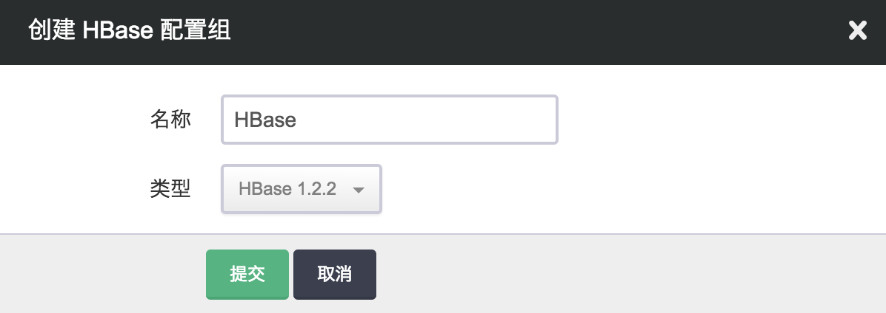

> 注解
缺省配置组不可以被删除。


**修改配置项**

点击该新建的 HBase 配置组，我们可以对每项配置项进行修改，如图所示：

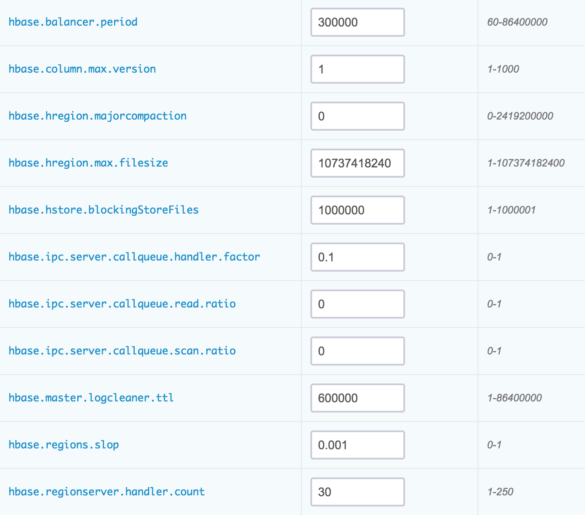

修改完后，我们需要进行 “保存”，并点击 “应用” 让新的配置生效。

> 注解
当配置发生变化时，将会重启对应的 HBase 服务。由于在线滚动重启耗时较长，目前版本尚未支持在线滚动重启。


**常用配置项**

*   **hbase.regionserver.handler.count**: RegionSever 处理 RPC 请求的线程数。
*   **zookeeper.session.timeout**: HBase 连接 Zookeeper 的 session timeout 时间。
*   **hbase.hregion.majorcompaction**: 两次自动 Major Compaction 的时间间隔，设为0则取消自动 Compaction。
*   **qingcloud.hbase.major.compact.hour**: 设置每天手动 Major Compaction 的整点时间，设为-1则取消手动 Compaction。
*   **hbase.hstore.blockingStoreFiles**: 当一个 Store 中的 StoreFiles 达到该值时，会 block 写入，进行 Compaction。
*   **hbase.regionserver.optionalcacheflushinterval**: 一个 edit 版本在内存中 cache 的最长时间，超过该时间则自动 flush 到磁盘，设为0则禁用自动 flush。
*   **hfile.block.cache.size**: BlockCache 占用的堆内存比例，读多于写可适当增大该值。
*   **hfile.index.block.max.size**: HFile 索引块大小。索引块越小，需要的索引块越多，索引的层级越深；索引块过大，对索引块本身的扫描时间会显著的增加。
*   **hbase.hregion.max.filesize**: region split 触发阈值。当一个 region 里的所有 HFile 大小超过该值，region 自动 split。
*   **hbase.ipc.server.callqueue.handler.factor**: 调用队列个数因子，设为0表示所有的handler共用一个队列，设为1表示每个handler拥有自己的队列。
*   **hbase.ipc.server.callqueue.read.ratio**: 调用 read 请求队列个数因子，设为0表示不去分读写请求的队列，小于0.5表示读请求队列少于写请求队列，设为1表示只有1个写请求队列,其他都是读请求。
*   **hbase.ipc.server.callqueue.scan.ratio**: 调用 scan 请求队列个数因子，设为0和1表示在读请求队列中不区分long-read和small-read, 小于0.5表示long-read数小于small-read数。
*   **hbase.regionserver.msginterval**: resionserver 给 master 发送消息的时间间隔，心跳间隔。
*   **hbase.regionserver.logroll.period**: hbase 预写log（WAL） roll 的时间间隔，便于后期删除过期 log。
*   **hbase.master.logcleaner.ttl**: 预写log（WAL）过期时间，超过这个时间 Master 会将该 WAL 删除。
*   **hbase.regionserver.regionSplitLimit**: 一个 regionserver 上的 region 数达到这个 limit 后不再 split。
*   **hbase.balancer.period**: master 每隔多久做一次 balance 操作
*   **hbase.regions.slop**: balance 操作的前提条件，如果有 regionserver 上的 region 数超过 average + (average * slop) 则进行 balance
*   **io.storefile.bloom.block.size**: 布隆过滤器块大小
*   **hbase.rpc.timeout**: HBase client 应用 rpc 超时时间
*   **hbase.column.max.version**: 默认 version 大小
*   **hbase.security.authorization**: 是否开启安全认证机制
*   **qingcloud.phoenix.on.hbase.enable**: 是否开启 Phoenix 查询引擎功能
*   **phoenix.functions.allowUserDefinedFunctions**: 是否开启允许 Phoenix UDF
*   **phoenix.transactions.enabled**: 是否开启 Phoenix ACID 事务

配置项的详细解释请参见 [HBase 官方配置文档](http://hbase.apache.org/book.html#config.files)。

## 迁移

当需要迁移 HBase 数据到新的 HBase 集群时, 可按照以下步骤操作:

**第一步：**
两个 HBase 集群所在路由器间建立 GRE 隧道, 可参考[GRE 隧道文档](https://docs.qingcloud.com/product/network/gre)。

> 注解
当两个 HBase 在同一 VPC 下时, 无需建立隧道。

**第二步：**
对要迁移的 table 建立 snapshot, 同时记录当前时间为 $start_time (可以提前一些), 格式为unix时间戳毫秒单位, 类似: 1524618000000, 原集群上执行。
```
echo "snapshot '${table}', '${table}_snapshot'" | ${HBASE_HOME}/bin/hbase shell
```

**第三步：**
将 snapshot 迁移到目标 HBase 集群, ${src_hdfs_path} 和 ${dist_hdfs_path} 类似: 192.168.0.4:9000, 原集群和目标集群上执行均可, 建议目标集群上执行。
```
${HBASE_HOME}/bin/hbase org.apache.hadoop.hbase.snapshot.ExportSnapshot -snapshot ${table}_snapshot -copy-from hdfs://${src_hdfs_path}/hbase -copy-to hdfs://${dist_hdfs_path}/hbase -mappers 20
```

**第四步：**
在目标 HBase 集群用 snapshot 恢复成 table, 目标集群上执行。
```
echo "clone_snapshot '${table}_snapshot', '${table}'" | ${HBASE_HOME}/bin/hbase shell
```

**第五步：**
应用需要开启双写, 同时记录当前时间 $end_time (可以延后一些), 格式为 unix 时间戳毫秒单位, 类似: 1524618000000。

**第六步：**
导出第一次迁移与开启双写中间时间的表数据到 hdfs 目录, 原集群上执行。
```
${HBASE_HOME}/bin/hbase org.apache.hadoop.hbase.mapreduce.Export ${table} ${src_hdfs_path} 1 $start_time $end_time
```

**第七步：**
拷贝到目标 hdfs, 原集群和目标集群上执行均可, 建议目标集群上执行。
```
${HADOOP_HOME}/bin/hadoop distcp ${src_hdfs_path} ${dest_hdfs_path} 
```

**第八步：**
从目标 hdfs 将表导入到 HBase 集群中, 目标集群上执行。
```
${HBASE_HOME}/bin/hbase org.apache.hadoop.hbase.mapreduce.Import ${table} ${dist_hdfs_path}
```
