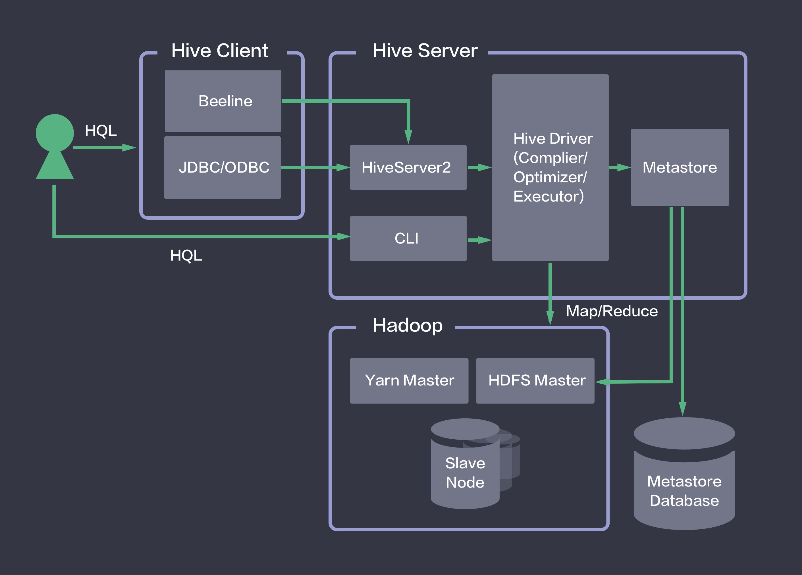
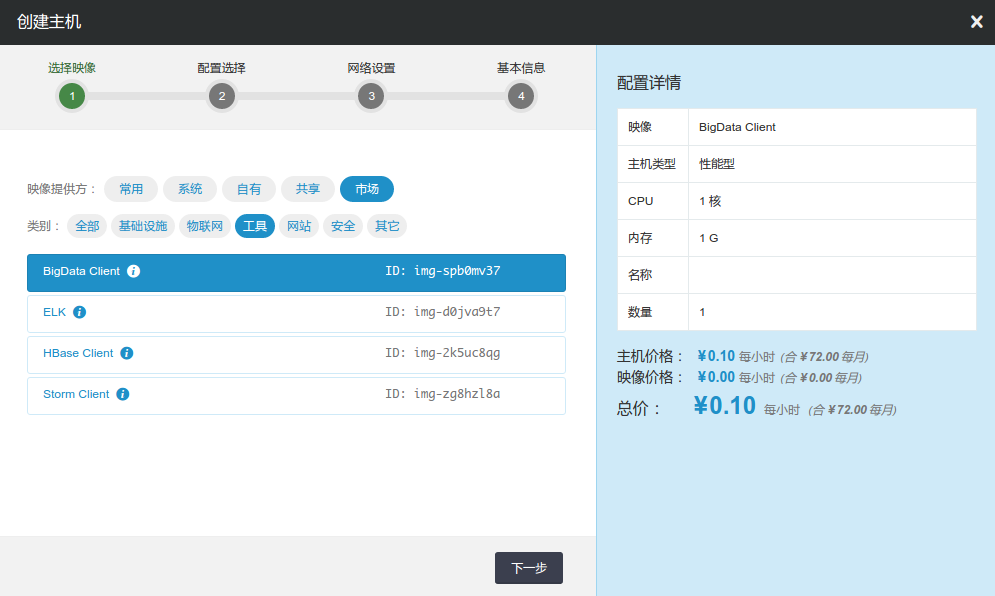

---
---

# Hive 指南

Hive是基于Hadoop的一个数据仓库工具，可以将结构化的数据文件映射为一张数据库表，并提供简单的类SQL(称为HQL)查询功能，可以将HQL语句转换为MapReduce任务进行运行。 其优点是学习成本低，可以通过HQL语句快速实现简单的MapReduce统计，不必开发专门的MapReduce应用，十分适合数据仓库的统计分析。 青云提供的Hive服务包含了Hive的所有功能，包括Hive Client包含的所有接口与Hive Server包含的所有服务。关于Hive更多的详情信息， 可参阅 [Hive 官方网站](http://hive.apache.org) 。

## 系统部署架构

简单来说，Hive就是在Hadoop上架了一层HQL接口，可以将HQL语句翻译成MapReduce去Hadoop上执行。同时，Hive将元数据存储在关系数据库中，用Metastore服务实现元数据管理。 如下图所示，青云提供的Hive映像包含了Hive Client和Hive Server的所有功能。用户在Hive Client端发起HQL任务，通过Hive Server实现HQL到Map Reduce任务的转换，然后调用Hadoop集群执行。 详情请参见下面的配置章节。



## 使用映像创建 Hive

大数据平台包括 Hive 的运维是非常繁琐的，而在青云上，您可以在２到３分钟创建一个 Hive 服务，并完成与其他大数据集群连接的配置。Hive 服务支持纵向在线伸缩， 还提供了监控告警等功能，使得服务管理非常方便。

**第一步：创建Hadoop集群**

在使用映像创建Hive之前，您需要创建一个Hadoop集群。关于如何在青云上创建Hadoop集群， 请参考 [Hadoop指南——创建Hadoop集群](https://docs.qingcloud.com/guide/hadoop.html#id3) 。

**第二步：创建Hive主机**

首先，您需要使用映像市场的 **BigData Client** 创建一个主机，如下图所示。同时，将该主机加入Hadoop集群同一私有网络。该主机已经安装了Hadoop，JRE，Hive等软件。



>注解
目前，映像市场仅支持北京2区、北京3区-A、广东1区、上海1区-A，后续我们将开放更多的分区，敬请期待;

**第三步：配置Hadoop环境**

首先，您需要根据您所使用的Hadoop集群配置，来修改Hive所在主机的相关配置，将Hive主机配置为Hadoop集群的Client。 关于如何在青云上配置Hadoop Client，请参考 [Hadoop指南——创建Hadoop Client主机](https://docs.qingcloud.com/guide/hadoop.html#id4) 。

接着，您需要修改HDFS的/tmp目录权限。Hive在使用过程中需要使用HDFS的/tmp目录，因此需要修改HDFS的/tmp目录的权限，执行：

```
$ sudo $HADOOP_HOME/bin/hdfs dfs -chmod -R 777 /tmp
```

**第四步：配置Hive环境**

该映像已默认配置Hive的Metastore服务为Local模式，并使用本地已安装配置的MySQL作为Metastore Database。其中，Metastore使用的MySQL用户名为ubuntu，Database名为hive。如果您想使用 **默认配置** ，可以 **跳过此第四步。**

>注解
本地MySQL数据库的root密码详见映像描述。本地MySQL数据库的ubuntu用户密码可在hive-site.xml中查询。实际使用中请修改密码！

在 **默认配置** 下，Hive服务的各个组件都运行在同一台机器中，包括 **Hive Server2**, **Hive Metastore**, **Hive Metastore Database**。

默认配置只能适用于小规模数据仓库，单一客户端访问的情形。在实际的生产环境中，您需要根据规模将这些组件分离，还可以根据需求横向扩展组件的数量，以达到性能需求。关于Hive组件的推荐配置，详见下表：

| 并发连接数 | HiveServer2 堆内存建议最小值 | HiveMetastore 堆内存建议最小值 |
| --- | --- | --- |
| 大于40 | 多机HiveServer2 | 多机HiveMetastore |
| 小于等于40 | 12GB | 12GB |
| 小于等于20 | 6GB | 10GB |
| 小于等于10 | 4GB | 8GB |
| 单连接 | 2GB | 4GB |

>注解
上表是通常情况下的配置建议。实际过程将受到表列的数量、分区数量、复杂join数量等因素的影响。

**一、分离Hive Metastore Database，配置为Remote Database模式**。

1.  创建并启动一个MySQL Server。参见 [_青云的MySQL服务_](https://docs.qingcloud.com/product/database_cache/rdbs_mysql.html)。
2.  在MySQL中为Hive创建一个用户并设置密码。同时，在MySQL中为Hive创建一个数据库，并将数据库的所有权限赋予该用户。具体的执行过程为：以MySQL的root用户登陆，执行

 ```
mysql> create database ;
mysql> grant all on .* to @'%' identified by '';
mysql> grant all on .* to @'localhost' identified by '';
mysql> flush privileges;
```


3.  修改Hive Metastore所在机器的配置文件 **hive-site.xml** 中相应的字段，字段名称所对应的值描述如下表所示。配置文件存放的位置为 **$HIVE_HOME/conf/** 。


| Name | Value Description | Example |
| --- | --- | --- |
| javax.jdo.option.ConnectionURL | 创建的MySQL数据库的链接字符串 | [jdbc:mysql://192.168.105.254:3306/hive?characterEncoding=UTF-8](jdbc:mysql://192.168.105.254:3306/hive?characterEncoding=UTF-8) |
| javax.jdo.option.ConnectionUserName | 创建的MySQL用户名 |   |
| javax.jdo.option.ConnectionPassword | 创建的MySQL用户的密码 |   |


**二、分离Hive Metastore，配置为Remote Metastore模式。**

1.  对于 **Hive Metastore** 所在机器，完成Hive Metastore Database配置。
2.  对于 **Hive Server2** 所在机器，无需Hive Metastore Database配置，而需要在配置文件 **hive-site.xml** 中加入下表所描述的字段。配置文件存放的位置为 **$HIVE_HOME/conf/** 。


| Name | Value Description | Example |
| --- | --- | --- |
| hive.metastore.uris | Metastore Server的访问地址，默认端口为9083 | thrift://192.168.105.7:9083 |

>注解
Metastore Server的访问端口，由Metastore Server的启动参数决定，详见后文中，启动Hive服务的第二步。

> 注解
您需要根据第三步，将 **Hive Server2** 所在机器， **Hive Metastore** 所在机器均配置为Hadoop Client。


更多关于Hive配置文件的说明，参见 [Hive官方网站 Configuration Properties](https://cwiki.apache.org/confluence/display/Hive/Configuration+Properties) .

## 启动 Hive 服务

**第一步：启动 Metastore Database服务**

启动Hive以前，您需要启动Metastore的Database服务，即启动您所配置的MySQL Server。本机的MySQL Server启动请依次执行以下命令：

```
$ sudo -u ubuntu service mysql.server start
```

对于本机的MySQL Server，您也可以通过以下命令查询状态：

```
$ service mysql.server status
```

注解

本机的MySQL Server请务必使用linux的ubuntu用户启动。如果误操作导致启动失败，请执行chown -R ubuntu:ubuntu /usr/local/mysql/data

**第二步：启动 Metastore服务**

对于 **默认配置**，即Metastore Local模式，可以跳过此第二步。对于Metastore Remote模式，执行：

```
$ $HIVE_HOME/bin/hive --service metastore -p &
```

**第三步：启动 Hive**

**启动CLI：**

如果您需要直接使用Hive命令行接口(CLI)，则执行以下命令：

```
$ $HIVE_HOME/bin/hive
```

>注解
CLI中的用户身份是启动CLI时Linux所用的用户身份

**启动HiveServer2：**

如果您需要远程调用接口执行Hive语句并取回结果，则需要首先启动HiveServer2。执行以下命令：

```
$ $HIVE_HOME/bin/hive --service hiveserver2 &
```

HiveServer2的默认端口为10000，关于HiveServer2的配置，参见 [Hive官方网站 Configuration Properties](https://cwiki.apache.org/confluence/display/Hive/Setting+Up+HiveServer2#SettingUpHiveServer2-ConfigurationPropertiesinthehive-site.xmlFile) .

## 测试 Hive 服务[¶](#id6 "永久链接至标题")

**测试一 在Hive数据仓库中创建一个数据库**

在Hive中创建数据库需要以root用户身份进行操作，而在实际生产环境中，我们建议您尽量避免以root用户执行Hive语句。 因此，通过root身份创建数据库后，需要更改数据库的所有者。这里以默认配置下，用户ubuntu为例，创建一个名为test的数据库，并将数据库test的拥有者更改为ubuntu：

```
$ sudo $HIVE_HOME/bin/hive -e "create database test;"
$ sudo $HADOOP_HOME/bin/hdfs dfs -chown -R ubuntu /user/hive/warehouse/test.db
```

Hive创建数据库执行成功后会显示执行时间，您也可以通过测试二的命令查看已创建的数据库

**测试二 在Hive的数据库中创建一张表**

这里以默认配置下，CLI操作为例。首先，启动CLI，执行：

```
$ $HIVE_HOME/bin/hive
```

>注解
CLI中的用户身份是启动CLI时Linux所用的用户身份

启动之后，查看刚刚创建的数据库：

```
hive> SHOW DATABASES;
```

可以看到目前Hive数据仓库中的数据库名。切换到test数据库，执行：

```
hive> USE test;
```

在test数据库下创建一个invites表，包含两个普通列和一个分区列：

```
hive> CREATE TABLE invites (foo INT, bar STRING) PARTITIONED BY (ds STRING);
```

查看创建的invites表：

```
hive> SHOW TABLES;
```

**测试三 向Hive中的表载入数据**

向刚刚创建的invites表载入数据，数据源使用本地文件。

```
hive> LOAD DATA LOCAL INPATH '/usr/local/hive/examples/files/kv2.txt' OVERWRITE INTO TABLE invites PARTITION (ds='2008-08-15');
hive> LOAD DATA LOCAL INPATH '/usr/local/hive/examples/files/kv3.txt' OVERWRITE INTO TABLE invites PARTITION (ds='2008-08-08');
```

**测试四 执行HQL查询语句**

查找invites表中 ‘ds=2008-08-08’ 的 ‘foo’ 列的所有内容：

```
hive> SELECT a.foo FROM invites a WHERE a.ds='2008-08-08';
```

这里并没有执行结果导出语句，因此查询的结果不会保存在任何地方，只是从CLI中显示出来。

执行运算，计算invites表中，’ds=2008-08-15’的‘foo’列的平均值：

```
hive> SELECT AVG(a.foo) FROM invites a WHERE a.ds='2008-08-15';
```

Hive服务将自动把HQL查询语句转换为MapReduce运算，并调用Hadoop集群进行计算。您也可以在yarn监控中查看该语句的执行进度。

>注解
映像内软件版本号:Hive-1.2.1, Hadoop-2.6.0, MySQL-5.6.30

## 与 QingStor 对象存储集成

QingStor 对象存储为用户提供可无限扩展的通用数据存储服务，具有安全可靠、简单易用、高性能、低成本等特点。用户可将数据上传至 QingStor 对象存储中，以供数据分析。 由于 QingStor 对象存储兼容 AWS S3 API，因此 Hive 平台可以通过 AWS S3 协议与 QingStor 对象存储高效集成，以满足更多的大数据计算和存储场景。

有关 QingStor 的更多内容，请参考 [QingStor 对象存储用户指南](https://docs.qingcloud.com/qingstor/guide/index.html)

>注解
目前 Hadoop 与 QingStor 对象存储的集成仅支持北京3区-A，后续我们将开放更多的分区，敬请期待。

**第一步：在 Hive 主机中启用 S3 相关配置**

我们已将 S3 相关的文件包和配置文件准备好，您只需要撤销 S3 属性部分的注释以启用 S3 协议，并将其中 fs.s3a.access.key 和 fs.s3a.secret.key 的属性值修改为您在青云的 access key 和 secret key 的值即可，修改的配置文件为：

```
cd /usr/local/hadoop
vim etc/hadoop/core-site.xml
```

**第二步：测试 Hive 与 QingStor 对象存储的集成**

**示例 1**：创建以QingStor为默认存储引擎的Database

1、首先在QingStor的bucket中创建一个目录，这里命名为test_s3

2、创建Database

```
hive> create database test_s3 location 's3a:///test_s3';
```

**示例 2**：在以QingStor为默认存储引擎的Database中创建Table，并执行查询

1、创建table，并载入测试数据

```
hive> use test_s3;
hive> CREATE TABLE invites (foo INT, bar STRING) PARTITIONED BY (ds STRING);
hive> LOAD DATA LOCAL INPATH '/usr/local/hive/examples/files/kv2.txt' OVERWRITE INTO TABLE invites PARTITION (ds='2008-08-15');
hive> LOAD DATA LOCAL INPATH '/usr/local/hive/examples/files/kv3.txt' OVERWRITE INTO TABLE invites PARTITION (ds='2008-08-08');
```

2、执行查询

```
hive> SELECT * FROM invites LIMIT 10;
hive> SELECT avg(a.foo) FROM invites a WHERE a.ds='2008-08-15';
```

**示例 3**：创建以HDFS为默认存储引擎的Database，并创建基于QingStor的外部表（使用示例2通过Hive导入QingStor的数据）

1、创建以HDFS为默认存储引擎的Database，并将权限赋予ubuntu用户

```
$ sudo $HIVE_HOME/bin/hive -e "create database test_hdfs;"
$ sudo $HADOOP_HOME/bin/hdfs dfs -chown -R ubuntu /user/hive/warehouse/test_hdfs.db
```

2、创建基于QingStor的外部表，并加入已有partition

```
hive> use test_hdfs;
hive> CREATE EXTERNAL TABLE IF NOT EXISTS invites_s3 (foo INT, bar STRING) PARTITIONED BY (ds STRING) Location 's3a://hive-test/test_s3/invites';
hive> ALTER TABLE invites_s3 ADD PARTITION (ds='2008-08-15');
hive> ALTER TABLE invites_s3 ADD PARTITION (ds='2008-08-08');
```

**示例 4**：将QingStor中的数据导入以HDFS为存储的Hive表

1、创建以HDFS为存储的Hive表

```
hive> CREATE TABLE IF NOT EXISTS invites (foo INT, bar STRING) PARTITIONED BY (ds STRING);
```

2、将QingStor中的数据导入

```
hive> set hive.exec.dynamic.partition.mode=nonstrict;
```

>注解
这里在做数据导入时，为了动态创建分区，设置hive.exec.dynamic.partition.mode=nonstrict。为了防止误操作导致动态创建大量分区，一般情况下应使用默认配置hive.exec.dynamic.partition.mode=strict

```
hive> INSERT OVERWRITE table invites partition (ds) select se.foo,se.bar,se.ds from invites_s3 se;
```
