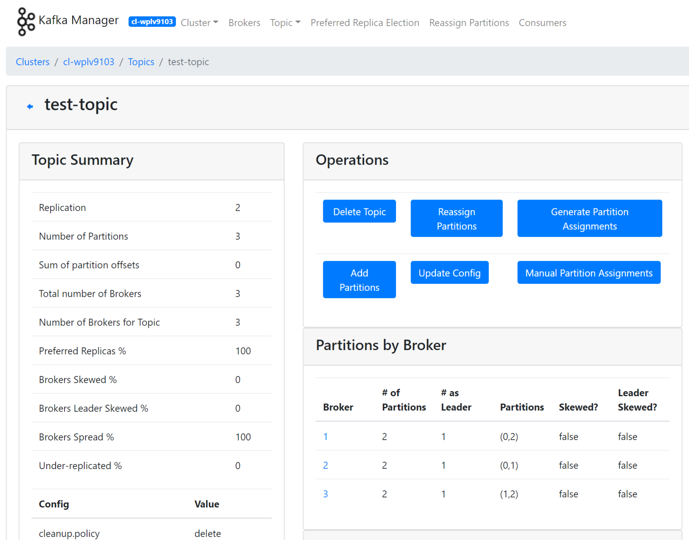
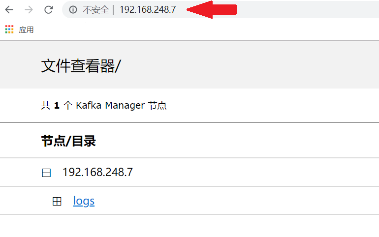
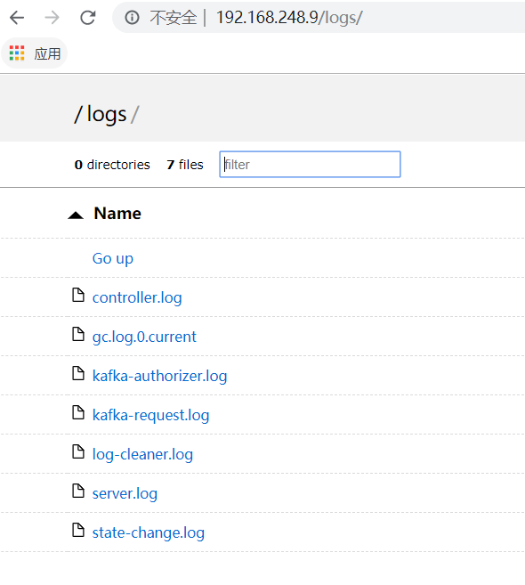

---
---
# Apache Kafka on QingCloud AppCenter 用户手册

## 简介

[Kafka](http://kafka.apache.org/) 是一种高吞吐量、低延迟、高可靠的分布式发布订阅消息系统。被广泛应用于网站活动追踪、日志监控、流式计算、事件采集、数据存储等应用场景。


`Kafka on QingCloud AppCenter` 将 Kafka 通过云应用的形式在 QingCloud AppCenter 部署，具有如下特性:

- 开箱即用，支持横向与纵向在线伸缩
- 系统自动健康检查，系统自动运维，降低企业使用成本
- 提供了[监控告警](https://docs.qingcloud.com/product/operation/alarm)功能更好的管理集群
- 节点上安装了 Kafka-manager，可以管理和监控多个 Kafka 集群
- 提供文件查看器方便排查问题（版本 Kafka 1.1.1 - QingCloud 1.5.0 起）
- 提供第三方监控 [zabbix](https://www.zabbix.com/) 平台接口（版本 kafka 2.3.0 - QingCloud 2.0.0 起）

>注意：Kafka 1.0.0 - QingCloud 1.1.6 及后续新版本提供的 Kafka-manager 安装在客户端节点上。客户端节点用户名：ubuntu ，密码：kafka 。Kafka-manager 显示的版本并非实际 Kafka 版本，我们以创建 Kafka 实际版本为主，并不会影响到您使用 Kafka 和 Kafka-manager 。

## 创建 Kafka


创建 Kafka 集群前，您需要先创建一个 VPC 网络，并在 QingCloud AppCenter 中创建一个 [Zookeeper](https://docs.qingcloud.com/product/big_data/zookeeper) 集群,其他地方创建的 ZooKeeper 集群识别不出来， 建议 Kafka 与 ZooKeeper 在一个私有网络中。

> 为了保障数据安全, Kafka 集群需要运行在受管私有网络中。所以在创建一个 Kafka 集群之前，需要 [创建一个 VPC](https://docs.qingcloud.com/product/network/vpc) 和一个受管私有网络，受管私有网络需要加入 VPC ，并开启 DHCP 服务（默认开启）。


### 第一步：基本设置


根据自己的需求填写 `名称` 和 `描述` ，不影响集群的功能，版本一般建议选择最新版本。

### 第二步：Kafka 节点设置


CPU、内存、节点数量、主机类型和磁盘大小根据自己实际需求进行选择即可，生产环境建议使用至少 3 个节点。

### 第三步：客户端节点设置


### 第四步：网络设置


出于安全考虑，所有的集群都需要部署在私有网络中，选择自己创建的网络中。

### 第五步：依赖服务设置


选择您所依赖的 ZooKeeper 集群。

### 第六步：参数设置


> 注意：offsets.topic.replication.factor 参数必须小于或者等于 Kafka broker 节点数，不能大于 Kafka broker 节点数，否则会无法消费消息，直至集群中 Kafka broker 节点数大于或者等于此参数。

按照自己的实际需求配置 Kafka 和 Kafka Manager 参数。

### 第七步: 用户协议

阅读并同意青云 AppCenter 用户协议之后即可开始部署应用。

### 第八步：Kafka-manager 配置

#### 自动添加集群配置到 Kafka-manager

    Kafka 创建完后，客户端节点预装的 Kafka Manager 会自动加载 Kafka 集群的相关配置。

#### 同时也可以手动添加集群配置到 Kafka-manager

如图所示


#### 具体步骤说明

配置 [VPN](https://docs.qingcloud.com/product/network/vpn) 或 [端口转发](https://docs.qingcloud.com/product/network/appcenter_network_config/config_portmapping) 后，确保本地可以访问集群网络。如下图所示，在本地浏览器里输入 `http://客户端节点IP:端口` ，端口可以在集群配置参数进行设置，默认为 9000

  >如果使用的版本是 Kafka 0.10.2.1 - QingCloud 1.1.6 ，可使用集群内任意节点的 IP


1. 如果配置时指定需要登录，请使用配置的帐号登录
2. 选择 Cluster，Add Cluster
3. 自定义一个名字，填写所连接的 Kafka 集群地址，青云提供的 Kafka 服务对应的命名空间路径为：zkhost1 : port , zkhost2 : port... / kafka / 集群 ID
    >例如 Kafka 集群 id 为 cl-j0yf8y1m , ZooKeeper 地址 : 192.168.0.1:2181 , 192.168.0.2:2181 , 192.168.0.3:2181 , 则填写 192.168.0.1:2181 , 192.168.0.2:2181 , 192.168.0.3:2181 / kafka / cl-j0yf8y1m

4. 选择 Kafka 对应的版本，例如 Kafka 版本为 1.1.1 ，可以选择 1.1.1 ，勾选 jmx 配置
5. 更改基本配置，save 后可以使用 kafka-manger 来管理和监控 Kafka 集群了

#### kafka-manager升级说明

若集群由老版本升级时，会出现 kafka-manager 的管理界面数据没有及时更新现象。这是由于 kafka 实际版本已经更新，而 zookeeper 中的注册数据未刷新，不影响正常使用。

操作步骤如下所示

1. Disable 集群

2. Enable 集群

3. 恢复正常数据


#### 最终效果图

如下图所示


## 集群使用

### 集群信息

在集群创建完毕后，可以在控制台 `Appcenter -> 集群列表` 标签下看到目前已经创建的集群信息

集群列表


点击集群 ID 可以查看该集群的详细信息


集群节点服务监控信息


集群基础资源监控信息：

  


### 配置参数

  点击 `配置参数` 可以修改 `Kafka 参数` ， `Kafka-manager 参数` 。下图中红圈标注的需要仔细审视

  

### 扩容集群

  点击 `扩容集群` ，可以在集群性能不足时提高集群的配置
  >硬盘扩容不会导致服务重启，扩容 cpu ，内存等核心资源则会导致服务重启

  

### 跨网访问

青云提供灵活的网络配置，一般建议 kafka 集群和客户端（生产者、消费者）都在同一个 VPC 下工作，来达到最高的性能。如果 Kafka 在实际使用中会出现 producer ，consumer 与 broker 都不在一个网段之中需要跨 VPC，可以考虑以下方法

1. 通过 [边界路由器](https://docs.qingcloud.com/product/network/border)、[IP Sec 隧道](https://docs.qingcloud.com/product/network/ipsec)、[GRE 隧道](https://docs.qingcloud.com/product/network/gre) 等方式把网络打通，这种方式适合于大规模复杂网络的情况。

2. 配置 [VPN](https://docs.qingcloud.com/product/network/vpn) ，这种方法通常用于本地开发测试。

3. 通过集群参数 advertised.host 和 port 对外暴露出来，这种方式只适合于单节点 kafka 集群。需要在 broker 所在的路由器上配置 [端口转发](https://docs.qingcloud.com/product/network/appcenter_network_config/config_portmapping) ，并且需要修改 broker 的 advertised host 与 advertised port 为路由器转发的源地址和源端口。这是因为 Kafka 各节点 (broker, producer, consumer) 之间是靠 advertised host 与 advertised port 通讯的。假设路由器的 IP 地址是 207.226.141.61 ，端口 9080 转发到 Kafka broker 192.168.0.10 端口 9092 ，点击配置参数，修改属性，修改 advertised.host.name 为 207.226.141.61 ，修改 advertised.port 为 9080 。

    


### kafka-manager 创建 topic

点击 `topic`，点击 `Create` ，若不单独给 topic 配置参数，会使用集群级别默认参数


### kafka-manager 管理 topic

点击 `topic`，可以在 `List` 里找到 topic 进行管理，修改 topic 参数



### kafka-manager 平衡分区 leader

点击 `Preferred Replica Election` 通过 Run 执行。（分区内必须有数据时才能使用）


### 日志及文件查看

为了更好的获取节点使用情况，青云提供了方便快捷的文件日志获取服务。配置 [VPN](https://docs.qingcloud.com/product/network/vpn) 或 [端口转发](https://docs.qingcloud.com/product/network/appcenter_network_config/config_portmapping) 后，确保本地可以访问集群网络。即可在本地浏览器里查看或下载相应节点的日志和文件。

在控制台 `Appcenter -> 集群列表` 标签下可以看到集群每个节点的信息，如节点角色，节点 IP 。对于 kafka-manager 节点，在浏览器输入`http://节点IP`可查看 Kafka Manager 的日志文件。



对于 kafka 节点，只需要获取其中一个节点 IP ，在本地浏览器输入 `http://节点IP` ，可查看全部 Kafka 节点的 Heap Dump 文件（ dump 目录）、数据文件（ kafka-logs 目录）和日志文件（ logs 目录）。


点击对应标题即可获取详细信息




## kafka 客户端命令行示例简介

>使用 Kafka 1.0.0 - QingCloud 1.1.6 及后续版本，客户端节点已经预装了下文用到的命令行工具，可以通过网页 [VNC](https://docs.qingcloud.com/product/computing/connect_instance) 登录，用户名：`ubuntu`，密码：`kafka`


### 创建 topic

创建一个 topic 为 test ，该 topic 分区为 3 ，副本为 1

```shell
$ kafka-topics.sh  --create --zookeeper 192.168.0.6:2181,192.168.0.8:2181,192.168.0.7:2181/kafka/cl-zom1un35 --replication-factor 1 --partitions 3 --topic test
Created topic "test".
```

### 查看 topic

查看集群所有 topic (`__consumer_offsets` 为默认创建)

```shell
$ kafka-topics.sh --list --zookeeper 192.168.0.6:2181,192.168.0.8:2181,192.168.0.7:2181/kafka/cl-zom1un35
__consumer_offsets
test
```

### 向 topic 发送消息

向 test 发送消息

```shell
$ kafka-console-producer.sh --broker-list 192.168.0.3:9092,192.168.0.4:9092,192.168.0.9:9092 --topic test
>hi
>hello world
>how are you
```

### 消费 topic 消息

消费 test 消息（若没有使用 --from-beginning ， 则从最新的开始消费）

```shell
$ kafka-console-consumer.sh --bootstrap-server 192.168.0.3:9092,192.168.0.4:9092,192.168.0.9:9092 --topic test --from-beginning
hi
hello world
how are you
```

### 查看 topic 消息分布情况

查看 test 消息分布情况

```shell
$ kafka-topics.sh --describe --zookeeper 192.168.0.6:2181,192.168.0.8:2181,192.168.0.7:2181/kafka/cl-zom1un35 --topic test
Topic:test	  PartitionCount:3	  ReplicationFactor:1	  Configs:
	     Topic: test	Partition: 0	Leader: -1	Replicas: 1	Isr: 1
	     Topic: test	Partition: 1	Leader: -1	Replicas: 2	Isr: 2
	     Topic: test	Partition: 2	Leader: 3	Replicas: 3	Isr: 3
```

### 修改 topic

修改分区

```shell
$ kafka-topics.sh -zookeeper 192.168.0.6:2181,192.168.0.8:2181,192.168.0.7:2181/kafka/cl-zom1un35 --alter --topic test  partitions 2

```

删除 topic 

```shell
$ kafka-topics.sh -zookeeper 192.168.0.6:2181,192.168.0.8:2181,192.168.0.7:2181/kafka/cl-zom1un35 --delete --topic test
Topic test is marked for deletion.
Note: This will have no impact if delete.topic.enable is not set to true.
```

### 平衡 topic

平衡 topic 分区 leader

```shell
$ kafka-preferred-replica-election.sh -zookeeper 192.168.0.6:2181,192.168.0.8:2181,192.168.0.7:2181/kafka/cl-zom1un35
Created preferred replica election path with {"version":1,"partitions":[{"topic":"__consumer_offsets","partition":34},{"topic":"__consumer_offsets","partition":36},{"topic":"__consumer_offsets","partition":27},...
```

### 查看消费者消费情况

检查 topic 消费者消费情况

```shell
$ kafka-consumer-groups.sh --bootstrap-server 192.168.0.3:9092,192.168.0.4:9092,192.168.0.9:9092 --describe --group my-group
Note: This will not show information about old Zookeeper-based consumers.


TOPIC                          PARTITION  CURRENT-OFFSET  LOG-END-OFFSET  LAG        CONSUMER-ID                                       HOST                           CLIENT-ID
test                          0          10              10              0          consumer-1-0000f0c2-eee7-432b-833b-c882334c8f71   /192.168.100.26                consumer-1
test                          1          7               7               0          consumer-1-0000f0c2-eee7-432b-833b-c882334c8f71   /192.168.100.26                consumer-1
```

>kafka 0.9.0.0 以前的版本用 kafka-consumer-offset-checker.sh 查看
```shell
$ kafka-consumer-offset-checker.sh  --zookeeper 192.168.0.6:2181,192.168.0.8:2181,192.168.0.7:2181/kafka/cl-zom1un35 --topic test --group my-group
```

### 更改 topic 配置参数

更改 topic 配置参数(也可以在创建的时候指定，例如创建时候最后跟上 --config a=b --config x=y)

```shell
$ kafka-configs.sh --zookeeper 192.168.0.6:2181,192.168.0.8:2181,192.168.0.7:2181/kafka/cl-zom1un35 --entity-type topics --entity-name test  --alter --add-config max.message.bytes=128000
Completed Updating config for entity: topic 'test'.
```

### 跨集群迁移方案 MirrorMaker 使用

Kakfa MirrorMaker 是 Kafka 官方提供的跨数据中心的流数据同步方案。其实现原理，其实就是通过从 Source Cluster 消费消息然后将消息生产到 Target Cluster ，即普通的消息生产和消费。用户只要通过简单的 consumer 配置和 producer 配置，然后启动 Mirror ，就可以实现准实时的数据同步。
具体可以参照官方详细文档 [Kafka-MirrorMaker](https://kafka.apache.org/documentation/) 。

步骤说明：
    - 在 Kafka-client 节点上创建消费配置文件和生产者配置文件，配置消费者和生产者参数
    - 执行 kafka-mirror-maker.sh 脚本文件（指定需要迁移的 topic），--whitelist 为迁移的 topic 白名单，可以使用通配符号，当不指定的时候，所有 topic 迁移到新的集群，--blacklist 为迁移的 topic 黑名单参数，当使用新的 consumer 时，该参数不支持。--whitelist 和 --blacklist 只能够使用一个。

示例如下（迁移 test 和 test1 topic 到目标集群）：

    1. 消费者配置 --- consumer.properties


    group.id=mirror-maker
    auto.commit.enable=true
    auto.commit.interval.ms=2000
    # 兼容老的0.8版本集群可以使用 zookeeper.connect
    # 0.9版本以上集群可以使用新的consumer，配置 bootstrap.server
    zookeeper.connect=192.168.0.11:2181,192.168.0.7:2181,192.168.0.9:2181/kafka/cl-hb1zzzht
    auto.offset.reset=smallest

    2. 生产者配置 --- producer.properties

     # 目标集群
     bootstrap.servers=10.45.10.33:9092,10.45.10.34:9092,10.45.10.35:9092
     acks=all
     retries=3
     # 批次大点，增加点吞吐量性能
     batch.size=16384
     buffer.memory=33554432
     linger.ms=1
     key.serializer=org.apache.kafka.common.serialization.StringSerializer
     value.serializer=org.apache.kafka.common.serialization.StringSerializer


   3.运行 kafka-mirror-maker.sh 执行数据迁移

    $ kafka-mirror-maker.sh --consumer.config consumer.properties --producer.config producer.properties --whitelist 'test,test1'

## 注意事项

- 青云提供 Kafka 在 ZooKeeper 上注册路径格式如下：zk1:2181,zk2:2181,zk3:2181/kafka/cluster_id , cluster_id 是创建 kafka 集群时候生成的集群 ID
- 请尽量合理选择和预留存储资源，合理配置数据存储周期和大小，尽量避免因为磁盘写满而造成的线上故障
- 开发的时候客户端尽量选择与服务端对应的版本
- 可以使用 kafka-manager 管理和修改 topic 配置、监控集群，也可以使用客户端节点或者自己安装客户端，使用命令行形式管理和使用集群
- offsets.topic.replication.factor 参数必须小于或者等于 Kafka broker 节点数，不能大于 Kafka broker 节点数，否则就会消费不了消息，直至集群中 Kafka broker 节点数大于或者等于此参数
- 请结合云平台提供的 `Appcenter -> 运维与管理 -> 监控告警 自动伸缩` 功能为机器添加更强大的保障

至此，`Kafka on QingCloud AppCenter` 的介绍到这里就告一个段落了。

在使用过程中如果遇到问题可以通过 `提交工单` 来获取帮助，我们将竭诚为您服务。

Have a nice day on QingCloud AppCenter !
