---
---

# Nifi 指南

[Nifi](https://nifi.apache.org/
) 是一个易于使用，功能强大且可靠的，主要用于处理和分发数据的软件，它支持功能强大且可扩展的有向图，用于数据路由，转换和系统中转逻辑。 Apache NiFi 的一些高级功能和目标包括：
- 基于Web的用户界面
  - 设计，控制，反馈和监视之间的无缝体验
- 高度可配置
  - 容错与保证交付
  - 低延迟且高吞吐量
  - 动态优先级
  - 可以在运行时修改流程
  - 背压(back pressure)
- 数据来源
  - 从头到尾跟踪数据流
- 针对可扩展性的设计
  - 构建自己的处理器等
  - 实现快速开发和有效测试
- 安全
  - SSL，SSH，HTTPS，加密内容等...
  - 多租户授权和内部授权/策略管理

## 创建 Nifi

在青云上，您可以很方便的创建和管理一个 Nifi 集群。青云的 Nifi 集群支持纵向、完全意义上的在线伸缩，即 Nifi 的在线伸缩对客户端是透明的， 用户的业务连续性不会因此而中断。同时青云的 Nifi 集群具有自我诊断与自我修复功能，即当系统发现某节点坏死时会自我修复，无需人为干预。 另外我们还提供了监控告警等功能来帮助您更好的管理集群。集群将运行于私有网络内，结合青云提供的高性能硬盘，在保障高性能的同时兼顾您的数据安全。

>注解
为了保障数据安全，Nifi 集群需要运行在受管私有网络中。所以在创建一个 Nifi 集群之前，至少需要一个路由器和一个受管私有网络，受管私有网络需要和路由器连接，并开启 DHCP 服务（默认开启）。

### 第一步：基本设置

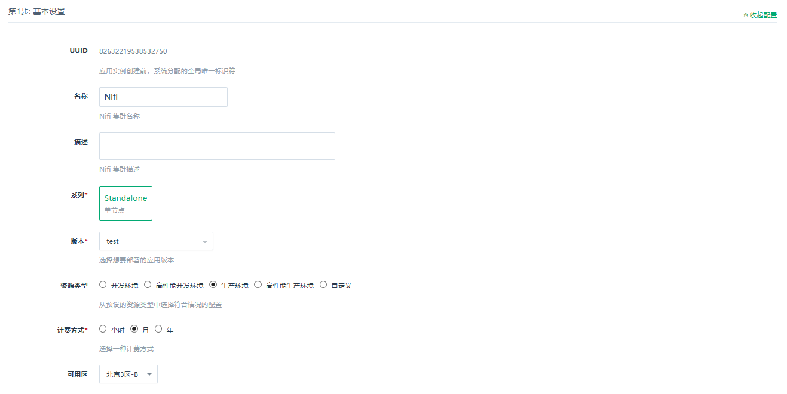

根据自己的需求填写 `名称` 和 `描述`，选择`资源类型`，版本一般建议选择最新版本。

### 第二步：网络设置

出于安全考虑，所有的集群都需要部署在私有网络中，选择自己创建的网络中。

### 第三步：服务环境参数设置

按照自己的实际需求配置 Nifi 参数。
可配置的环境参数包括:

- http页面端口：用户访问Nifi Console时，指定的端口。

按照自己的实际需求配置 Nifi 参数。

## 在线伸缩

**纵向伸缩**

由于 Nifi 的每个节点都有数据的全拷贝，并且数据都是要装载在内存里，所以当业务存放在 Nifi 里的数据量增大到一定程度的时候， 不可避免需要纵向扩容每个节点的内存。反之，如果节点的 CPU、内存使用并不大，可以降低配置。值得注意的是，在缩小内存的时候选择新配置的内存不能过小， 否则 Nifi 服务会启动不起来。Nifi 内存使用率可以查看 Nifi 详细页的监控图。在 Nifi 所在栏右键选择「扩容」即可做纵向伸缩。

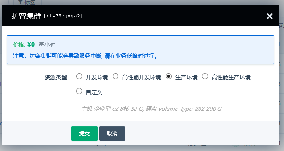

## 测试

### 测试过程

按照自己的实际需求配置并创建集群，等待部署完成。

### 测试结果

部署完成之后，在控制台下方会显示监控信息，同时在集群详细信息页面可以看到节点ip。

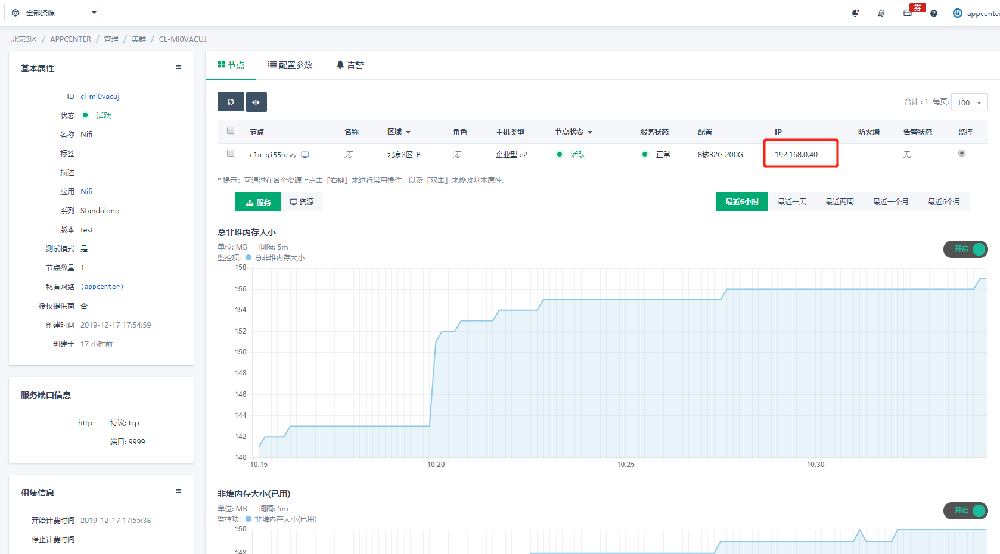

尝试连接 Nifi 的过程之前，请确保使用的客户端机器已加入配置过程中指定的`VxNet`网络，并确保 Nifi 集群的防火墙配置已允许`http页面端口`通行。

在浏览器中访问`${节点ip}:${http页面端口}/nifi`，如`http://192.168.0.2:8080/nifi`。若部署成功，便可以看到 Nifi 管理界面。

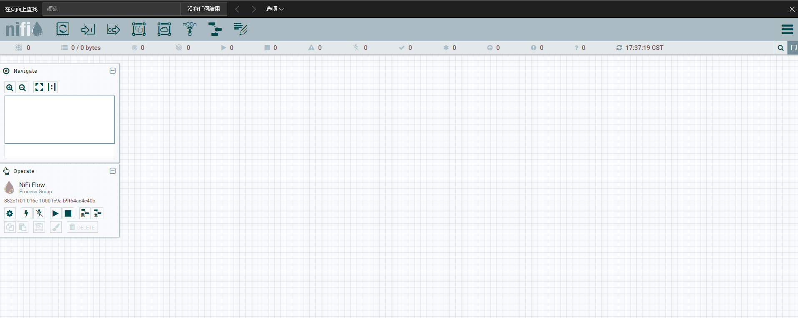

### 创建测试 Nifi 流程

- 打开 Nifi 主面板，点击左上角的第一个控件`processor`，拖入到面板空白处，在过滤框中输入`HTTP`字样，并在下方的列表中选择`HandleHttpRequest`，完成后点击`Add`按钮。

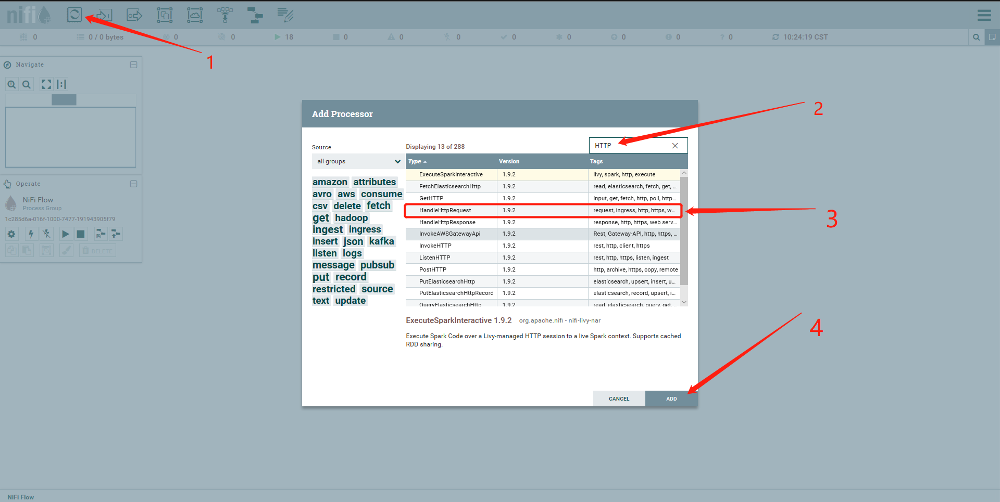

- 以同样的方式向 Nifi 主面板中添加`HandleHttpResponse`。

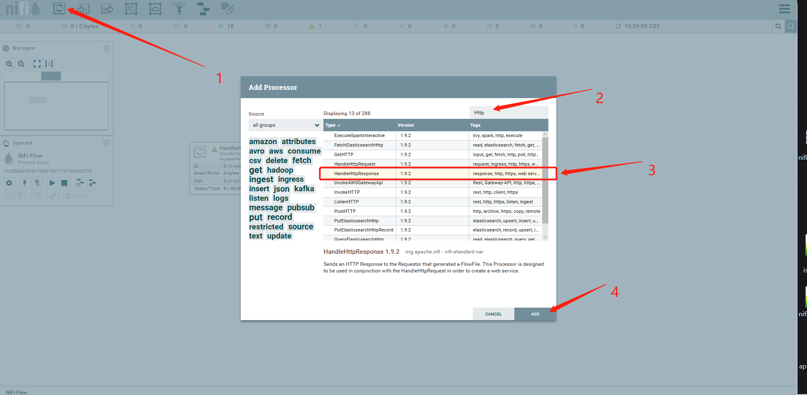

- 此时， 面板中有2个Processor，移到鼠标到`HandleHttpRequest`中央，会弹出箭头样图标，拖动箭头，移动至`HandleHttpResponse`处松开，在确认框中点击`Add`按钮。

- 配置`HandleHttpRequest`控件，右键点击该控件，在弹出框中点击`config`按钮，选择`properties`页签，依次配置`Listening Port`为9999，`Allowed Path`为`/test`，点击`HTTP Context Map`，选择`Create new service`创建新的控制器。

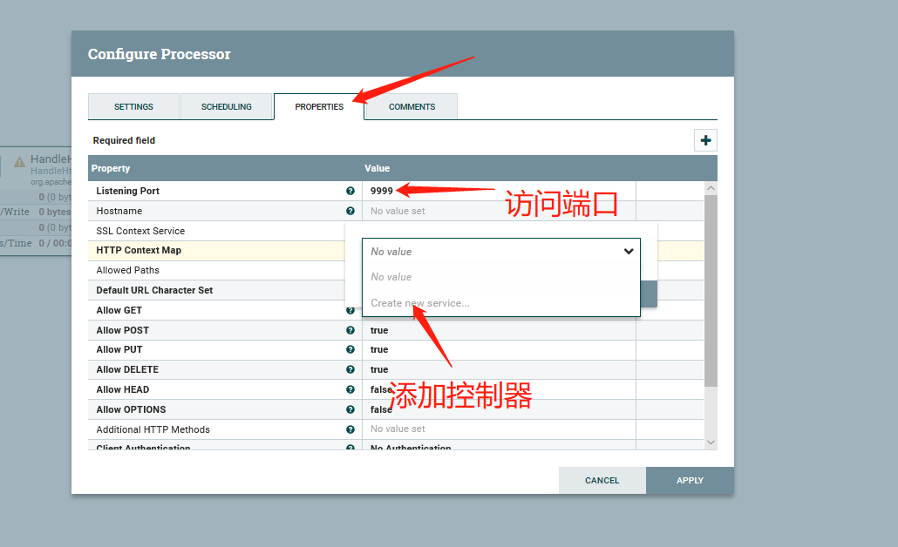

- 以默认配置创建`StandardHttpContextMap`。

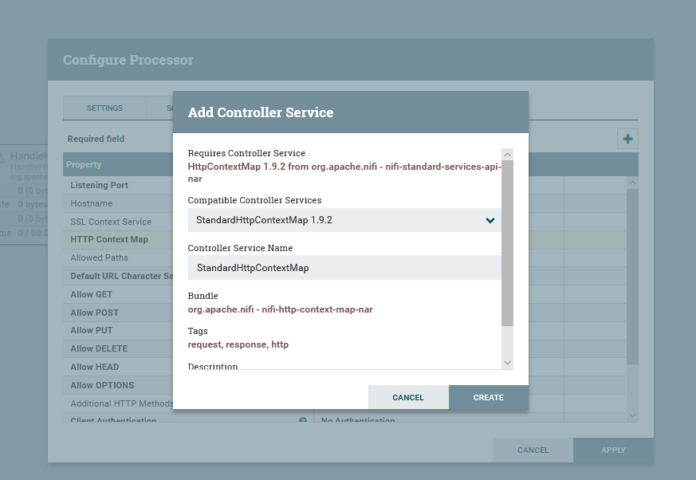

- 页面返回到`HandleHttpRequest`的`properties`页签后，点击`StandardHttpContextMap`右方的箭头进入其配置页面，点击右边的闪电样图标， 并以默认配置`enable`控制器。

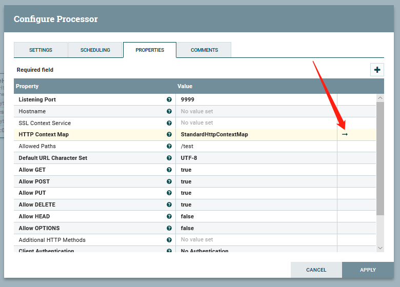
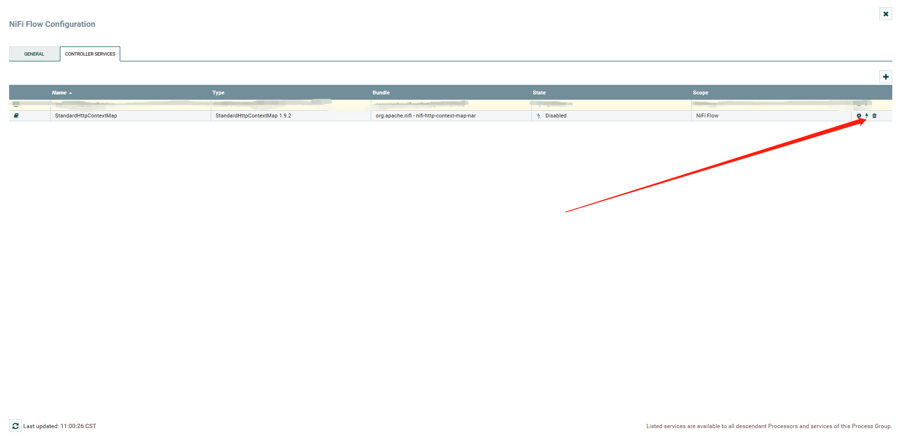

- 回到nifi主面板，右键点击`HandleHttpResponse`，选择`config`，在`properties`页签中，依次在`Http Status Code`中输入200，`Http Context Map`选择在`HandleHttpRequest`中创建好的`StandardHttpContextMap`。

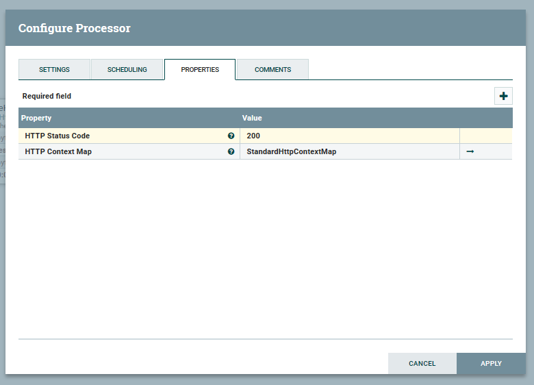

- 点击`HandleHttpResponse`的`setting`页签，勾选上`failure`和`success`后，点击`Apply`按钮。

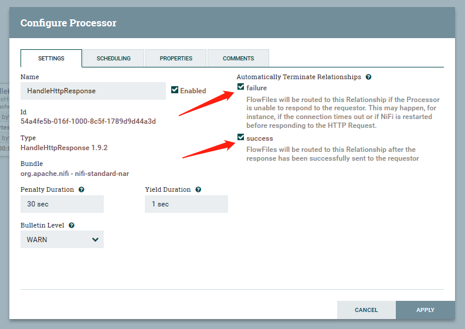

- 最后分别启动`HandleHttpRequest`和`HandleHttpResponse`控件。

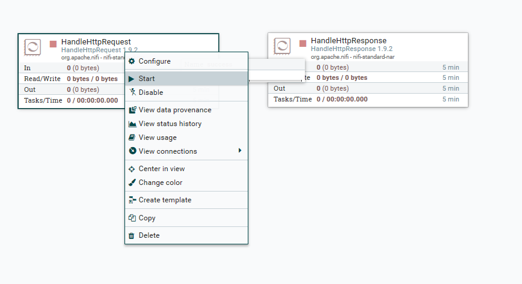

- 使用模拟HTTP请求客户端(如Postman)发送请求到`http://${ip}:9999/test`会，收到http status 200的返回。

## 监控和告警

- 我们提供了监控和告警服务，以帮助用户更好的管理和维护运行中的 Nifi 集群。

**监控服务**

首先对每个节点提供了资源监控，包括 CPU 使用率、内存使用率、硬盘使用率等。

其次，对每个节点提供了 Nifi 服务监控，包括节点的：
 - 总/已用/空闲/最大非堆内存大小：JVM的非堆内存使用情况
 - 总/已用/空闲/最大堆内存大小：JVM的堆内存使用情况
 - 堆内存占用百分比：JVM的堆内存使用情况
 - 可用处理器：可以使用的处理器数量，一个JVM对应了一个处理器
 - 处理器平均读取时间：处理器的平均响应时间
 - 总守护线程数：守护线程数量
 - 流程文件存储空间大小及占用百分比：监控`flowfile`的元信息存储空间
 
 - 流程内容存储空间大小及占用百分比：监控`flowfile`的内容存储空间
 - 数据源存储空间大小及占用百分比：监控制原始数据存储空间

**告警服务**

我们对每个节点 Nifi 服务是否正常进行监控并设置告警策略，一旦某个节点 Nifi 服务发生异常就进行告警。

虽然单节点出现异常并不影响集群的正常服务，但越早发现问题并及时解决是维护整个集群长期正常运行的最佳实践。另外，由于青云的 Nifi 有自我诊断与自我修复功能，通常情况这个告警只是一个提醒作用。
