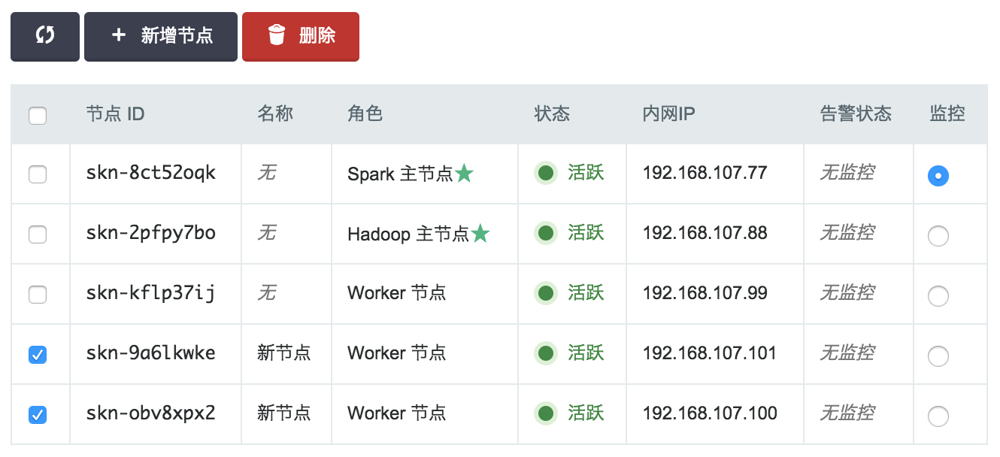

---
---

# Spark 指南

## 重要通知

>注解
青云的大数据平台会逐渐迁移到AppCenter上，不建议继续使用原下的Hadoop, Spark, HBase, Kafka, ZooKeeper, Redis, Memcached等服务，请使用新版集成了Hadoop 2.7.3和Spark 2.2.0并支持多模式切换的 [SparkMR服务](https://appcenter.qingcloud.com/apps/app-6iuoe9qs) ， 具体功能及用法详见 [SparkMR用户指南](http://appcenter-docs.qingcloud.com/user-guide/apps/docs/SparkMR/) 。AppCenter中的其他大数据服务可在 [应用中心](https://appcenter.qingcloud.com/apps) 找到，AppCenter中发布的大数据服务都是绿色图标并以xxx on QingCloud命名的，部署后可在  页面下可见。

Spark 是继 Hadoop 之后新一代的大数据分布式处理平台。它是一个基于内存、容错型的分布式计算引擎，与 Hadoop MapReduce 相比，计算速度要快100倍。 Spark 卓越的用户体验以及统一的技术堆栈基本上解决了大数据领域所有的核心问题，使得 Spark 迅速成为当前最为热门的大数据基础平台。

Spark 提供了多语言支持包括 Scala, Python, Java, R 等，特别适合迭代计算和交互式操作。它在 RDD（Resilient Distributed Dataset，一个容错的、并行的数据结构） 基础之上提供了 Spark streaming 流式计算，结构化数据处理组件 SparkSQL，机器学习库 MLlib 以及图计算 GraphX 等，详情请参阅 [Spark 官方网站](http://spark.apache.org) 。

## 系统部署架构

与 Hadoop 一样， Spark 采用的是 master/slave 架构。青云既提供纯计算引擎的 Spark 集群，也提供与 Hadoop HDFS 集成的 Spark 集群，后者 Spark 的 worker 节点运行在 Hadoop 的存储 HDFS DataNode 节点上。 如下图所示，青云 Spark 集群分三种节点类型：主节点 (Spark master node 和 Hadoop NameNode)，从节点 (Spark worker nodes 和 Hadoop DataNodes) 和客户端 (Driver node)。青云 Spark 目前 采用的是 Standalone cluster manager　进行集群资源管理，用户通过客户端与 Spark、Hadoop 集群交互，用户的 driver program 将运行在 driver node上。详情见下面测试 Spark 章节。


## 创建 Spark

大数据平台包括 Spark 的运维是非常繁琐的，而在青云上，您可以在２到３分钟创建一个 Spark 集群，集群支持横向与纵向在线伸缩，还提供了监控告警等功能，使得管理集群异常方便。 集群将运行于私有网络内，结合青云提供的高性能硬盘，在保障高性能的同时兼顾您的数据安全。

>注解
为了保障数据安全, Spark 集群需要运行在受管私有网络中。所以在创建一个 Spark 集群之前，至少需要一个路由器和一个受管私有网络，受管私有网络需要和路由器连接，并开启 DHCP 服务（默认开启）。

**第一步：选择基本配置**

在创建的对话框中，您需要选择 Spark 版本号、CPU、内存配置，集成 HDFS 与否，节点存储大小，填写名称（可选）和 worker 节点数量等。


>注解
主机配置１核2G 和2核４G 仅供测试使用；１个 Worker 节点（无 HDFS) 和２个 Worker 节点（有 HDFS)仅供测试使用。

**第二步：配置网络**

在配置网络的过程中，首先需要选择 Spark 要加入的私有网络，然后可以为 Spark 中的每个节点指定 IP， 也可以选择“自动分配”，让系统自动指定 IP。


**第三步：创建成功**

当 Spark 创建完成之后，您可以查看每个节点的运行状态。 如图所示，当节点显示为“活跃”状态，表示该节点启动正常。 当每个节点都启动正常后 Spark 集群显示为“活跃”状态，表示您已经可以正常使用 Spark 服务了。


## 测试 Spark

Spark 创建完成之后可以测试其可用性。

**创建 Spark Driver 主机**

在青云上创建 Spark 客户端主机, 首先打开映像市场，在工具分类中找到 Spark Client，然后点击使用，选择主机类型、CPU、内存，同时需要将该主机加入 Spark 同一私有网络。 假设创建好的 Spark 客户端的主机名为 i-tp5n8o28。该主机已经安装了 Spark, Hadoop, JRE 等软件并且做了一些配置的修改。您可以直接用这个主机进行下面的测试。 Spark 集群的主机名是按照不同角色定义的:

*   Spark master: -spark-master
*   Hadoop NameNode: -hadoop-master
*   Spark worker: -slave

假设 Spark master 的　URL 为 spark://skn-8ct52oqk-spark-master:7077。这个 URL 可以在您控制台 Spark 详情页查到，也可以在 Spark 提供的监控页查到(请参考下面的监控告警章节)

>注解
由于 Ubuntu 主机名对应 IP 127.0.0.1存在 [已知问题](https://wiki.apache.org/hadoop/ConnectionRefused)。所以先要在 /etc/hosts 文件里把127.0.0.1修改成主机的私网 IP (假设为192.168.10７.20)，同时还需要加上 Spark master，Hadoop NameNode (集成 HDFS) 和 workers 主机名(可不填)与私网 IP 的信息，改完后的 /etc/hosts 类似于：

```
192.168.107.20    localhost
192.168.107.20    i-tp5n8o28
192.168.107.77    skn-8ct52oqk-spark-master
192.168.107.88    skn-2pfpy7bo-hadoop-master
192.168.107.99    skn-kflp37ij-slave
```

**测试一**

这个测试是求1到1,000,000的和。在客户端主机里先切换成 root 用户(或者每次执行命令前加 sudo -E)，然后输入以下命令进入 Spark shell:

```
cd /usr/local/spark
./bin/spark-shell --master spark://skn-8ct52oqk-spark-master:7077
```

>注解
通常情况下你需要执行下面的命令 。SPARK_EXECUTOR_MEMORY 的大小不能超过节点可用内存，每个节点的可用内存可以通过 spark master 节点的8080端口查到(请参考下面的监控告警章节)。

```
SPARK_EXECUTOR_MEMORY=2g ./bin/spark-shell --master spark://skn-8ct52oqk-spark-master:7077
```

等 scala shell 准备好后您可以输入以下代码进行测试。您也可以用 pyspark 进入 python shell，该 shell 启动了 IPython, 您可以利用 IPython 的一些特性如 tab 功能等。

```
scala>val data = new Array[Int](1000000)
scala>for (i val distData = sc.parallelize(data)
scala>distData.reduce(_+_)
```

您能看到类似于这样的结果　res1: Int = 1784293664。

**测试二**

这个测试是统计  下的文件 README.md 中多少行包含单词 Spark, 不过该文件是存放在 Hadoop HDFS　文件系统中, 所以您在创建 Spark 的时候需要选择使用 HDFS。青云 Spark 的 HDFS 在创建的时候自动帮您生成了两个用户： /user/root 和 /user/ubuntu。假设 Hadoop HDFS 的 URL 为 hdfs://skn-2pfpy7bo-hadoop-master:9000，这个 URL 可以在您控制台 Spark 详情页查到， 也可以在 Hadoop 提供的监控页查到(请参考下面的监控告警章节)。您也需要把这个 host 的 IP　信息写到 /etc/hosts 文件里。然后在客户端主机里先切换成 root 用户(或者每次执行命令前加 sudo -E)，并执行下面命令把文件上传到 HDFS 中：

```
cd /usr/local/hadoop
bin/hadoop distcp file:///usr/local/spark/README.md hdfs://skn-2pfpy7bo-hadoop-master:9000/user/ubuntu/README.md
```

如果客户端没打开 Spark shell, 请参考测试一进入 Spark shell，然后输入以下代码测试：

```
scala>val textFile = sc.textFile("hdfs://skn-2pfpy7bo-hadoop-master:9000/user/ubuntu/README.md")
scala>textFile.filter(line => line.contains("Spark")).count()
```

您能看到类似于这样的结果　res4: Long = 19

**测试三**

这个测试来自 Spark 官方文档，测试的是 SparkSQL。同样，如果客户端没打开 Spark shell, 请参考测试一进入 Spark shell，然后输入以下代码测试：

```
scala>val sqlContext = new org.apache.spark.sql.SQLContext(sc)
scala>val df = sqlContext.read.json("examples/src/main/resources/people.json")
scala>df.show()
scala>df.printSchema()
scala>df.select("name").show()
```

您也可以把文件如同测试二一样上传到 HDFS 测试

## 在线伸缩

**增加节点**

您可以在 Spark 详细页点击“新增节点”按钮增加 worker，可以对每个新增节点指定 IP 或选择自动分配。


**删除节点**

您可以在 Spark 详细页选中需要删除的 worker 节点，然后点“删除”按钮。如果您的 Spark 是集成了 HDFS，那么不能一次删除多个节点，只能一个一个的删， 并且必须等到上个节点删除后且 decommission 结束才能删除下一个节点，否则数据会丢失，青云在此操作时会锁定 Spark 集群不让对其进行其它的操作，同时这个 decommission 状态可以从 Hadoop NameNode 的 50070 端口提供的监控信息观察到。Decommission 是在复制即将删除节点上的数据到别的节点上，如果您的数据量比较大，这个过程会比较长。 因为青云的 HDFS 副本因子默认为 2，所以当您的 Spark worker (Hadoop DataNode） 节点数为 3 的时候就不能再删除节点。如果您修改了 HDFS 的副本因子须记住对应的最少节点数， 同时要预先知道其它节点的总硬盘空间足够拷贝删除节点的内容，才能进行删除。



>注解
对集成 HDFS 的 Spark，删除节点是一个比较危险的操作，要仔细阅读上面的指南。

**纵向伸缩**

由于不同类节点压力并不同，所以青云 Spark 支持对 Spark master节点、Hadoop NameNode 和 Spark worker节点分别进行纵向伸缩。通常情况下两个主节点的压力不会太大， 在创建 Spark 的时候我们自动给两个主节点分配较低配置，但随着压力增大您可能需要对这些节点扩容。


## 升级

目前青云提供最新的版本1.4.1、1.5.0、1.6.0和2.0.1。旧版本的用户可以很方便的升级到新版本(也可以回退到旧版本)，先关闭 Spark 集群，然后右键 Spark，点击升级，选择新的版本号，最后启动集群即可。客户端 (driver) 升级可自行在现有的客户端主机里下载 [Spark](http://spark.apache.org/downloads.html)，也可以在映像市场工具分类中基于 Spark Client 重新创建一个主机。

## 监控和告警

Spark 和 Hadoop 提供了丰富的监控信息。如果需要通过公网访问这些信息您需要先在路由器上设置端口转发，同时打开防火墙相应的下行端口。Hadoop NameNode 默认端口是50070， Spark master 默认端口8080提供了集群的信息，Spark driver（您的客户端，基于映像市场工具分类中 Spark Client 创建的一个主机) 的默认端口是4040，提供了当前运行的 应用监控信息。因此私网可以访问以下 URL：

*   [http:/](http:/)/:50070
*   [http:/](http:/)/:8080
*   [http:/](http:/)/:4040


同时我们还提供了对每个节点资源的监控和告警服务，包括 CPU 使用率、内存使用率、硬盘使用率等，以帮助用户更好的管理和维护 Spark 集群。

## 查看 Job History

在运行 Spark 应用的时候，driver 提供了一个 Web URL (4040端口，见 [_监控和告警_](#guide-spark-monitoring)) 用于展示应用程序监控信息， 但这个 URL 会随着应用程序的退出而关闭，为查看 Spark　的历史应用程序信息，Spark　提供了 history server。首先您需要在 driver 上配置 history server。

**配置 history server**

在 driver 的 spark home 的 conf/spark-default.conf 文件里添加如下参数, 青云提供的 driver （您的客户端，基于映像市场工具分类中 Spark Client 创建的一个主机) 的 spark home 为 /usr/local/spark-，请根据您的 Hadoop 相应地修改下面的 。

```
spark.eventLog.enabled    true
spark.eventLog.dir        hdfs://:9000/spark/history
spark.eventLog.compress   true
```

上面的 spark.eventLog.dir 和下面的　spark.history.fs.logDirectory　指向的是 HDFS　的地址用来存储历史信息，所以需要先在 HDFS 里创建目录，在 driver 的 　hadoop home 下执行如下命令。

```
./bin/hdfs dfs -mkdir -p hdfs://:9000/spark/history
```

在 spark home 的 conf/spark-env.sh 里添加如下参数

```
export SPARK_HISTORY_OPTS="-Dspark.history.ui.port=18080 -Dspark.history.retainedApplications=5 -Dspark.history.fs.logDirectory=hdfs://:9000/spark/history"
```

**启动 history server**

在 spark home 下执行下面命令

```
./sbin/start-history-server.sh
```

然后您可以打开 [http:/](http:/)/:18080 查看 Job History

**参数详解**

以下的参数以 spark.history 开头的需要在 spark-env.sh 中的 SPARK_HISTORY_OPTS 中配置，以 spark.eventLog 开头的在 spark-defaults.conf 里配置。

*   spark.history.ui.port

　　默认值：18080，history server 的 WEB 端口

*   spark.history.retainedApplications

　　默认值：50，在内存中保存应用程序历史记录的个数，如果超过这个值，旧的应用程序信息将被删除，当再次访问已被删除的应用信息时需要重新构建页面

*   spark.history.updateInterval

　　默认值：10，单位秒，更新日志相关信息的时间间隔

*   spark.history.kerberos.enabled

　　默认值：false，是否使用 kerberos 方式登录访问 history server，如果设置为 true，就要配置下面的两个属性

*   spark.history.kerberos.principal

　　 history server 的 kerberos 主体名称

*   spark.history.kerberos.keytab

　　 history server 的 kerberos keytab 文件位置

*   spark.history.ui.acls.enable

　　默认值：false，授权用户查看应用程序信息的时候是否检查 ACL。如果启用，只有应用程序所有者和 spark.ui.view.acls 指定的用户可以查看应用程序信息，否则不做任何检查

*   spark.eventLog.enabled

　　默认值：false，是否记录 Spark 事件，用于应用程序在完成后重构 WEB UI

*   spark.eventLog.dir

　　保存日志相关信息的路径，可以是 hdfs:// 开头的 HDFS 路径，也可以是 file:// 开头的本地路径，注意都需要提前创建

*   spark.eventLog.compress

　　默认值：false，是否压缩 Spark 事件，当 spark.eventLog.enabled 为 true 的时候有效，默认使用的是 snappy

## 与 QingStor 对象存储集成

QingStor 对象存储为用户提供可无限扩展的通用数据存储服务，具有安全可靠、简单易用、高性能、低成本等特点。用户可将数据上传至 QingStor 对象存储中，以供数据分析。 由于 QingStor 对象存储兼容 AWS S3 API，因此 Spark 平台可以通过 AWS S3 API 与 QingStor 对象存储高效集成，以满足更多的大数据计算和存储场景。

有关 QingStor 的更多内容，请参考`QingStor 对象存储用户指南 `_

>注解
目前 Spark 与 QingStor 对象存储的集成仅支持北京3区-A，后续我们将开放更多的分区，敬请期待。目前支持的与QingStor集成的Spark版本包括2.0.1和 1.6.0 。

**第一步：在 Spark Client 主机中启用 S3 相关配置**

由于 QingStor 提供兼容S3的接口与 Spark 集成，我们已将 S3 相关的文件包和配置文件准备好，您只需要并将 spark-defaults.conf 中 spark.hadoop.fs.s3a.access.key 和 spark.hadoop.fs.s3a.secret.key 的属性值修改为您在青云的 access key 和 secret key 的值即可。 属性 spark.hadoop.fs.s3a.endpoint 默认设置为北京3区-A， 如以后Spark与QingStor集成支持更多分区，可通过修改此属性实现。

```
cd /usr/local/spark
vim conf/spark-defaults.conf
spark.hadoop.fs.s3a.endpoint=s3.pek3a.qingstor.com
spark.hadoop.fs.s3a.access.key=
spark.hadoop.fs.s3a.secret.key=
```

**第二步：测试 Spark 与 QingStor 对象存储的集成**

有两种方式可以启动 Spark： 通过 spark-shell 交互式运行和通过 spark-submit 提交 job 到 Spark集群运行，这两种方式都需要通过选项 “–jars $SPARK_S3” 来指定使用 S3 API相关的 jar 包。 假设您在 QingStor 上的 bucket 为 my-bucket, 下面以 spark-shell 为例， 列出4个常见的 Spark 与 QingStor 集成场景。

示例1：（针对基于 HDFS 的 Spark 集群）， 在 Spark 中读取到 HDFS 上的文件后将其存储到 QingStor 中。

```
# 首先需要将本地的一个测试文件上传到spark集群的HDFS存储节点上：
bin/hadoop distcp file:///usr/local/spark/README.md hdfs://skn-cyug5cbu-hadoop-master:9000/user/ubuntu/README.md

# 然后启动 spark-shell, 输入并执行如下代码将会读取 HDFS 上的 README.md 文件, 然后将其存为QingStor中"my-bucket"下的 test 文件：
cd /usr/local/spark
bin/spark-shell --master spark://skn-sg8d8ygm-spark-master:7077 --jars $SPARK_S3

val myQingStorFile = sc.textFile("hdfs://skn-cyug5cbu-hadoop-master:9000/user/ubuntu/README.md")
myQingStorFile.saveAsTextFile("s3a://my-bucket/test")
```

示例2：（针对基于 HDFS 的 Spark 集群），在 Spark 中读取 QingStor 上的文件，处理过后再存储到 HDFS 文件系统中

```
# 如下代码将会读取 QingStor 中 my-bucket 下的 test 文件，并显示其所包含的行数，然后将文件存储到 HDFS 文件系统中
val myQingStorFile3 = sc.textFile("s3a://my-bucket/test")
myQingStorFile3.count()
myQingStorFile3.saveAsTextFile("hdfs://skn-cyug5cbu-hadoop-master:9000/user/ubuntu/test")
```

示例3：在 Spark 中读取 QingStor 上的文件， 经过处理后将结果存储到到 QingStor 上的文件中。

```
#如下代码将会读取 QingStor 中 my-bucket 下的 test 文件， 从中选出包含字符串 "Spark" 的行， 最后将结果存储到 my-bucket 下的 qingstor-output 文件中
val myQingStorFile2 = sc.textFile("s3a://my-bucket/test").filter(line => line.contains("Spark"))
myQingStorFile2.saveAsTextFile("s3a://my-bucket/qingstor-output")
```

示例4：在 Spark 中创建元素值为 1 到 1000 的数组， 找出其中的奇数并对其求平方， 最后将结果存储到 QingStor 上的文件中。

```
val data = for (i x*x).saveAsTextFile("s3a://my-bucket/data")
```

>注解
如果在调用 parallelize 或 repartition 等方法后， RDD 对应的分区大小超过 2GB， 文件将不能正确存储到 QingStor 中， 此时请在方法参数中适当增大分区的个数， 以使得每个分区大小不超过 2GB 即可 。

## Spark on Yarn

用户可以在青云提供的Hadoop集群上（注意不是Spark集群）以Spark on Yarn的方式运行Spark job, 具体步骤如下：

**第一步：创建Hadoop集群**

Spark on yarn模式的job实际是运行在Hadoop集群的slave节点上，所以需要首先在青云平台创建Hadoop集群，集群创建方式请参考 [Hadoop用户指南](https://docs.qingcloud.com/product/big_data/hadoop) 。

**第二步：基于bigdata client映像创建Spark client主机**

该主机将作为Spark driver使用。 创建完成后按照 [Hadoop用户指南](https://docs.qingcloud.com/product/big_data/hadoop) , 结合第一步创建的Hadoop集群信息，将该Spark client主机配置为Hadoop client主机

**第三步： 使Spark client感知Hadoop集群**

修改该Spark client主机的/usr/local/spark/conf/spark-env.sh，添加如下内容：

```
export HADOOP_HOME=/usr/local/hadoop

export HADOOP_CONF_DIR=$HADOOP_HOME/etc/hadoop
```

**第四步： 运行测试程序**

以Spark shell 方式运行：

```
bin/spark-shell --master yarn --deploy-mode client --num-executors 3 --executor-cores 1 --executor-memory 1g
```

以cluster模式运行：

```
bin/spark-submit --class org.apache.spark.examples.SparkPi --master yarn --deploy-mode cluster --num-executors 3 --executor-cores 1 --executor-memory 1g examples/jars/spark-examples*.jar 10
```

运行完测试程序，可以在http://:8088查看job运行情况

**第五步： 调整Hadoop参数**

需要注意的是，如果是以spark-shell的方式运行Spark on yarn job，需要根据Hadoop集群slave节点内存配置调高Hadoop配置组的yarn.nodemanager.vmem-pmem-ratio参数，否则spark-shell启动会报错。 比如Hadoop的slave节点有8G内存的话，可以将该参数由默认的2.1调高到10。如果slave节点内存更大，可能需要进一步调高该参数。

典型错误如下:
```
17/03/01 16:44:48 ERROR TransportClient: Failed to send RPC 6379421795167784219 to /192.168.100.20:48104: java.nio.channels.ClosedChannelExceptionjava.nio.channels.ClosedChannelException

17/03/01 16:44:48 WARN YarnSchedulerBackend$YarnSchedulerEndpoint: Attempted to get executor loss reason for executor id 1 at RPC address 192.168.100.20:48109, but got no response. Marking as slave lost.
```
