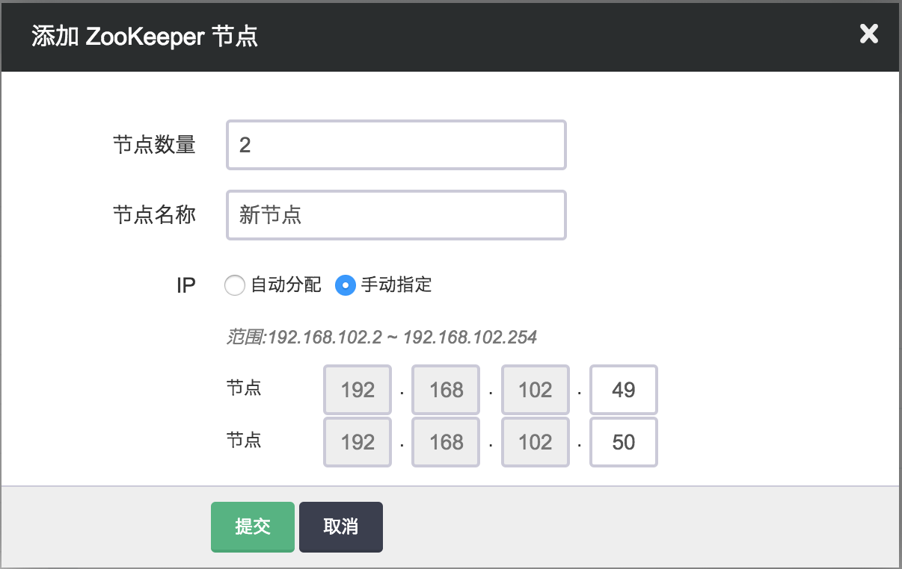
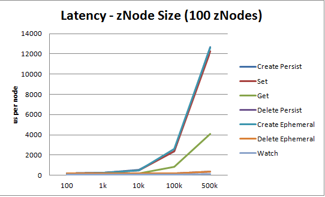

---
---

# ZooKeeper 指南

ZooKeeper 是一个高可用的分布式数据管理与系统协调软件，它可以为分布式应用提供状态同步、配置管理、名称服务、群组服务、分布式锁及队列、以及 Leader 选举等服务。

## 创建 ZooKeeper

在青云上，您可以很方便的创建和管理一个 ZooKeeper 集群。青云的 ZooKeeper 集群支持横向与纵向、完全意义上的在线伸缩，即 ZooKeeper 的在线伸缩对客户端是透明的， 用户的业务连续性不会因此而中断。同时青云的 ZooKeeper 集群具有自我诊断与自我修复功能，即当系统发现某节点坏死时会自我修复，无需人为干预。 另外我们还提供了监控告警等功能来帮助您更好的管理集群。集群将运行于私有网络内，结合青云提供的高性能硬盘，在保障高性能的同时兼顾您的数据安全。

>注解
为了保障数据安全, ZooKeeper 集群需要运行在受管私有网络中。所以在创建一个 ZooKeeper 集群之前，至少需要一个路由器和一个受管私有网络，受管私有网络需要和路由器连接，并开启 DHCP 服务（默认开启）。

**第一步：选择基本配置**

在创建的对话框中，您需要选择 ZooKeeper 版本号、CPU、内存配置，填写名称（可选）和节点数量。


>注解
目前集群节点数支持1、3、5、7、9，其中1个节点的 ZooKeeper 仅供测试使用。

**第二步：配置网络**

在配置网络的过程中，首先需要选择 ZooKeeper 要加入的私有网络。 然后可以为 ZooKeeper 中的每个节点指定 IP， 也可以选择“自动分配”，让系统自动指定 IP。


**第三步：创建成功**

当 ZooKeeper 创建完成之后，您可以查看每个节点的运行状态。 如图所示，当节点显示为“活跃”状态，表示该节点启动正常。 当每个节点都启动正常后 ZooKeeper 集群显示为“活跃”状态，表示您已经可以正常使用 ZooKeeper 服务了。


**第四步：测试 ZooKeeper**

ZooKeeper 创建完成之后可以进行连接测试。下载 [ZooKeeper](http://zookeeper.apache.org/releases.html) 并解压，您可以在本地测试，也可以在 ZooKeeper 同一私有网络或跨网络测试，如果客户端和 ZooKeeper 不在同一私有网络，您需要配置路由器端口转发， 请参考 [青云用户指南](https://docs.qingcloud.com/product/network/appcenter_network_config/) 。

现假设客户端和 ZooKeeper 在同一私有网络，ZooKeeper 集群有三个节点，IP 地址分别为192.168.100.10,192.168.100.11,192.168.100.12， 您可以通过如下命令连接 ZooKeeper。

```
bin/zkCli.sh|zkCli.cmd -server 192.168.100.10:2181,192.168.100.11:2181,192.168.100.12:2181
```

## 在线伸缩

**增加节点**

当 ZooKeeper 需增加节点以应付客户端逐步增多带来的压力，您可以在 ZooKeeper 详细页点击“新增节点”按钮。 新增节点数必须为偶数，最好每次增加两个。需注意的是，增加节点会影响 ZooKeeper 的性能，因为每个节点上需要进行数据同步。同样，您可以对每个新增节点指定 IP 或选择自动分配。



**删除节点**

当客户端连接并不多的时候您也可以在 ZooKeeper 详细页选中需要删除的节点，然后点“删除”按钮删除节点，以节省资源和费用。 同样，删除节点数只能为偶数，最好每次删除两个。


**纵向伸缩**

由于 ZooKeeper 的每个节点都有数据的全拷贝，并且数据都是要装载在内存里，所以当业务存放在 ZooKeeper 里的数据量增大到一定程度的时候， 不可避免需要纵向扩容每个节点的内存。反之，如果节点的 CPU、内存使用并不大，可以降低配置。值得注意的是，在缩小内存的时候选择新配置的内存不能过小， 否则 ZooKeeper 服务会启动不起来。ZooKeeper 内存使用率可以查看 ZooKeeper 详细页的监控图。在 ZooKeeper 所在栏右键选择「扩容」即可做纵向伸缩。


## 性能

我们对 ZooKeeper 集群做了延迟时间性能测试，以下是测试报告。

**测试条件**

广东１区，1C2G　3个节点的 ZooKeeper 集群。

**测试一**

异步并发操作 zNode 节点，大小为100字节，节点个数分别为10、100、1000、5000、10000，操作分别为 create persist zNode、set zNode、get zNode、delete persist zNode、create ephemeral zNode、delete ephemeral zNode、watch zNode。 测试结果如下，latency 单位为微秒


**测试二**

异步并发操作100个 zNode 节点， 节点大小分别为100 B、 1 KB、 10 kB、 100 KB、 500 KB, 测试操作同测试一。测试结果如下，latency 单位为微秒




## 监控和告警

我们提供了监控和告警服务，以帮助用户更好的管理和维护运行中的 ZooKeeper 集群。

**监控服务**

首先对每个节点提供了资源监控，包括 CPU 使用率、内存使用率、硬盘使用率等。

其次，对每个节点提供了 ZooKeeper 服务监控，包括节点的角色、最大／最小／平均响应延迟时间、接收请求数、发送响应数、活跃连接数、待处理连接数、zNode 个数等。

注解

ZooKeeper 3.3.6 没有活跃连接数的监控。

**告警服务**

我们对每个节点 ZooKeeper 服务是否正常进行监控并设置告警策略，一旦某个节点 ZooKeeper 服务发生异常就进行告警，并发送短信和邮件通知给用户。

虽然单节点出现异常并不影响集群的正常服务，但越早发现问题并及时解决是维护整个集群长期正常运行的最佳实践。另外，由于青云的 ZooKeeper 有自我诊断与自我修复功能，通常情况这个告警只是一个提醒作用。
