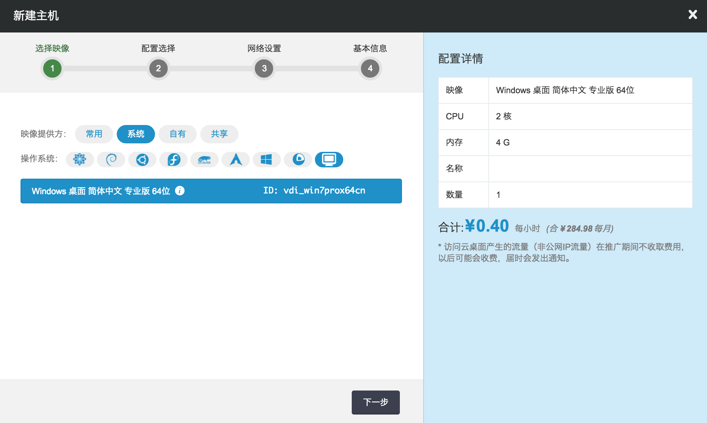
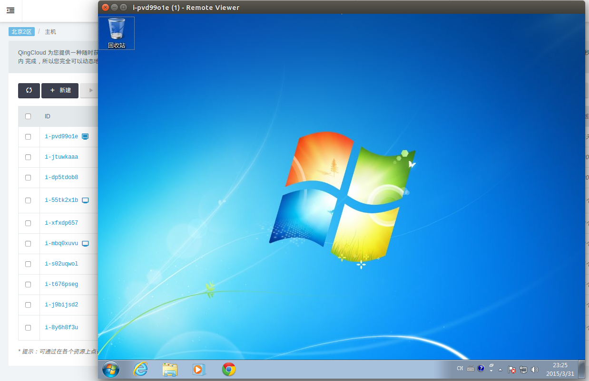

---
---

# 云桌面[¶](#guide-cloud-desktop "永久链接至标题")

通过 QingCloud 云桌面我们可以像使用本地计算机一样访问远程机器。支持加密传输、USB 重定向、语音、鼠标和键盘（粘贴复制）。 视频数据动态自适应网络情况和帧率动态调整，云桌面自动选择压缩模式，提供清晰的显示效果的同时减少网络流量。

注解

访问云桌面产生的流量（非公网IP流量）在推广期间不收取费用，以后可能会收费，届时会发出通知。

## 操作[¶](#id2 "永久链接至标题")

第一步：安装插件

> 
> 
> 
> 
> 警告
> 
> 目前插件只支持 Windows 下和 Debian 下的 Firefox 浏览器和不高于 39 的旧版本 Chrome 浏览器，暂不支持从 Mac 系统通过浏览器插件连接到云桌面。
> 
> 
> 
> **Debian**
> 
> 下载
> 
> > 
> > 
> > [[下载安装包]](https://beian.qingcloud.com/download/public/desktop-cloud/qingcloud-remote-desktop-plugin_1.0.0_all.deb)
> > 
> > 执行下列命令
> > 
> > 
> > 
> > ```
> > sudo apt-get install virt-viewer
> > sudo dpkg -i qingcloud-remote-desktop-plugin_1.0.0_all.deb
> > ```
> > 
> > 
> > 
> > 
> > 
> > 注解
> > 
> > Debian下目前插件只支持Firefox下
> > 
> > 
> > 
> > 
> 
> 卸载
> 
> > 
> > 
> > 方法一: 通过 Software Center 卸载。
> > 
> > 方法二: 执行下面命令
> > 
> > 
> > 
> > ```
> > sudo apt-get autoremove qingcloud-remote-desktop-plugin
> > ```
> > 
> > 
> > 
> > 
> 
> **Windows**
> 
> 下载
> 
> > 
> > 
> > [[下载用于 Windows 32位的安装包]](https://www.qingcloud.com/download/public/desktop-cloud/qingcloud-remote-desktop-plugin-x86-1.0.msi)
> > 
> > [[下载用于 Windows 64位的安装包]](https://www.qingcloud.com/download/public/desktop-cloud/qingcloud-remote-desktop-plugin-x64-1.0.msi)
> > 
> > 双击或者右键安装。（安装之前请先关闭杀毒软件:如360防火墙等）
> > 
> > 
> 
> 卸载
> 
> > 
> > 
> > 方法一: 右键安装包选择卸载。
> > 
> > 方法二: 控制面板进入卸载软件，选择“QingCloud Remote Console Plugin 卸载”。
> > 
> > 
> 
> 安装完插件请重启浏览器。
> 
> 
> 
> 注解
> 
> 插件可能会被浏览器自动阻止。点击地址栏的最右边的红叉，选择始终允许使用插件。Firefox 可以在插件管理处找到 QingCloud Remote Desktop Plugin，选择始终允许使用插件
> 
> 
> 
> 

第二步：创建一台云桌面主机

> 
> 
> 进入 QingCloud 控制台，点击左边导航条中的“计算与网络 -> 主机”，接着在右边区域点击“新建”按钮， 这时会弹出创建主机的向导。 首先选择支持云桌面的映像作为模版，比如Windows云桌面32位，点击“下一步”；
> 
> [](../computing/_images/run_cloud_desktop_select_image.png)
> 
> 接着指定 CPU 和内存的数量，可以使用顶部的推荐类型快速配置， 也可以自行定制各自的数量，点击“下一步”； 接着指定该主机将连接至哪些网络， 点击“下一步”； 接着给主机命名、并指定数量， 最后点击“创建”即可。
> 
> 

第三步: 连接云主机

> 
> 
> 等待云桌面主机启动以后，在主机 id 的右侧有一个小图标， 点击即可启动云桌面。
> 
> [](../computing/_images/connect_cloud_desktop_image.png)
> 
> 
> 
> 注解
> 
> 插件可能会被浏览器自动阻止。点击地址栏的最右边的红叉，选择始终允许使用插件。Firefox 可以在插件管理处找到 QingCloud Remote Desktop Plugin，选择始终允许使用插件
> 
> 
> 
> 

**使用 USB**

你可以插入 USB 设备，点击 USB Device Selection，选择你要的重定向的 USB 设备，点击 Close 即可。
