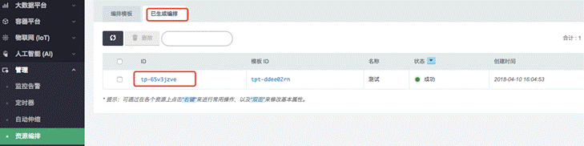

---
---

# 跨区域迁移方案

## 1. 迁移流程  

本迁移方案**适用于青云北京2区向其他区（如：北京3区B、C、D，广东2区A、B，上海1区A、B，雅加达区）的迁移，建议优选北京3区D和C区**，迁移流程图如下：

**在进行迁移时，建议有一个时间窗口做本次迁移。**

## 2. 网络相关迁移

### 2.1 申请新的公网IP

在新区创建新的公网IP及选择相应带宽。

注：如果涉及一级域名的备案，需要变更解析地址，请提前提交备案变更申请，具体参见备案变更文档。

### 2.2 抗D迁移

在新可用区创建或修改抗D服务。

### 2.3 CDN迁移

在新可用区创建或修改CDN服务。

## 3. 迁移映像

利用跨区复制功能将映像迁移到新区，如北京3区。

具体操作：将已有的自有映像利用跨区复制到新区，如下图：

## 4. 迁移资源

该迁移方法适用于青云**不适用**于AppCenter中的资源。

### 4.1 方法一  手动创建资源

步骤：

1、基于老区的资源，在新区手动创建资源包括：VPC、私有网络、云主机、硬盘、Nas、San、数据库、缓存等，例如：老区的主机都为性能型2C4G，硬盘是100G性能盘，新区主机可以选择基础型或者企业型主机，配置也是2C4G，硬盘为基础型或者企业型硬盘（注意：主机为基础型，硬盘也需要是基础型，主机为企业型，硬盘也必须是企业型），容量为100G。

> 注意：如果新区没有老区对应型号的机型，如老区有2C6G的性能型 / 超高性能主机，但新区没有对应型号，建议可以创建2C8G基础型 / 企业型主机。

2、将硬盘挂载到相应的主机上；

3、将新区的**主机关机**；

4、将资源对应关系通过工单告知青云，需要将老区和新区的资源一一对应，工单标题：[老区迁移]，工单里内容示例：例如：

北京2区资源   迁移到  北京3区C资源

i-adf12sdfd                    i-sdr12drf

vol-xj2mpzo2               vol-sr2mqjo2

通过青云控制台在新区查看迁移过来的资源，并验证数据完整性。

**【注意】通过该方法，请勿操作新老区的相关资源，且新区的硬盘保持【可用】状态（即不挂载）”。**

### 4.2 方法二  自动创建资源

利用青云提供的“资源编排”功能梳理旧可用区的网络拓扑，为下一步迁移做准备，具体操作如下：

1、创建模板，如下图：

2、选择“从当前资源抽取模板”

3、查看生成的网络拓扑（在新旧区均可查看该网络拓扑）

4、基于模板在新区一键创建新的资源。

5、将新区的**主机关机**；

6、发工单给青云，告知拓扑ID，如下图中的ID：tp-65v3jzve，工单标题：**[老区迁移]**

工单里内容示例：

请协助将北京2区的资源迁移到北京3区C，资源已经基于资源编排工具创建了，并且所有资源都已经关机，请将北京2区的资源迁移到北京3区C，拓扑ID：tp-65v3jzve。

 

7、通过青云控制台在新区查看迁移过来的资源，并验证数据完整性。

注意：如果云主机在基础网络，内网IP会变更。

注意：对比新主机和旧主机的配置，hostname会变为新的主机 ID、udev和fstab需重新配置

注意：如果新区没有老区对应型号的机型，如老区有2C6G的性能型 / 超高性能主机，但新区没有对应型号，系统会自动创建2C8G基础型 / 企业型主机，也就是会创建跟该机型接近配置的主机。

**通过该方法，请勿操作新老区的相关资源，且新区的硬盘保持【可用】状态（即不挂载）”。**

## 5. 参考部分

这部分内容为用户手动迁移PaaS服务的参考方法，用户可以作为迁移时的参考。

### 5.1 数据库（MySQL）迁移

**方法一（推荐）**、利用mysqldump工具（离线拷贝数据）

新区北京三区-BCD、广东2区-AB的「QingCloud MySQL Plus」的MySQL版本为5.7.18，且开启了GTID复制模式，因此从其他MySQL迁移数据时，需要通过导数据的方式来进行。

**步骤：**

1. 将老区的数据导出

在源数据库端使用 mysqldump 将需要的内容导出到 dump.sql 文件，导出数据需要排除mysql.user表，且不导出GTID标识。 这里假设源数据库的IP地址为192.168.0.100，导出语句为：

mysqldump --all-databases --single-transaction --triggers --routines --events  --host=192.168.0.100 --port=3306 --user=mysql_dev -p --ignore-table=mysql.user --set-gtid-purged=OFF > dump.sql

这里是导出了全部的数据，也可以选择导出部分数据库，更多详细使用方法请参考考 [mysqldump](https://dev.mysql.com/doc/refman/5.7/en/mysqldump.html)。

2. 在新区的数据导入

将上一步导出的 dump.sql 文件复制到一台能连接「QingCloud MySQL Plus」的主机后执行该 .sql 文件。 需要使用「QingCloud MySQL Plus」的高可用写IP来进行链接。假设高可用的写IP地址为 192.168.0.250，导入语句为：

mysql -umysql_dev -p -h192.168.0.250 < dump.sql

**参考[官网帮助](https://docs.qingcloud.com/product/database_cache/app_mysql_plus/index.html#%E6%95%B0%E6%8D%AE%E8%BF%81%E7%A7%BB)**

方法二、在线迁移

迁移服务可以将远端 MySQL 数据库的数据平滑迁移到 MySQL Plus 集群中。目前支持迁移的 MySQL 版本为 5.6~5.7。

**迁移说明：**

在线迁移时，会去远端 MySQL 复制全量数据，尽量在远端 MySQL 业务低峰期开启服务。

需要提供远端 MySQL 具有 super 权限 和 复制权限 的账户，并且要求远端 MySQL 开启 GTID 模式。

远端 MySQL 版本在 5.6 以下，可以参考方法一[数据迁移方案](https://docs.qingcloud.com/product/database_cache/app_mysql_plus/index.html#数据迁移)进行迁移。

迁移期间，写 IP 不可用。

该服务不会迁移远端 MySQL 的 mysql.user 表。

**迁移步骤：**

若原库与当前集群不在同一 VPC 下，使用 边界路由器（vpc board） 或 VPN ，打通原库与当前集群的网络。

点击「 在线迁移 」，将原库 MySQL 账户名（要有 super 权限）、密码、端口、IP 地址填入下图所示文本框，点击「 提交 」即开始迁移。

等待「 在线迁移 」服务完成。服务执行完成后，当前集群就成功获取了原库的全量数据并与原库配置了主从关系，如此则可以持续同步原库数据到当前集群。

选择业务低峰时段，切换业务到当前集群：

  a) 停止原库的业务。

  b) 校验当前集群与原库数据是否一致，若一致，则继续下一步。

  c) 点击 「 结束迁移 」，会自动重启 MySQL 集群。

  d) 将业务所连IP改为当前集群的VIP，恢复业务。

**参考[官网帮助]**(https://docs.qingcloud.com/product/database_cache/app_mysql_plus/index.html#%E5%9C%A8%E7%BA%BF%E8%BF%81%E7%A7%BB)

**方法三（不推荐）**、使用控制台备份功能（离线拷贝数据+实时同步数据）

说明：如果使用该方法迁移则无法用到青云最新的mysql plus产品，不推荐使用该方法。

1、通过控制的备份功能，创建数据库的备份

2、在控制台选择“存储”à”备份”，右键点击资源，选择“跨区复制备份”

3、在新区基于备份创建新的数据库

4、如果没有较长的中断时间窗口，建议通过Binglog做数据同步，具体操作如下：

1)         建立GRE隧道，将新区和老区之间通过专线或者互联网打通，具体方法见6.1节；

2)         接第3步操作，例如将新创建的数据库取名rdb_new, 然后登陆rdb_new的master节点, 执行change master to  master_host='老区主节点IP',master_user='qc_repl',master_password='密码',master_auto_position=1;因为这个rdb_new是用的备份创建的, 所以master_user master_password都一样, 那就改下master_host就可以了；

3)          这样数据库rdb_new就会从原来的rdb_old同步数据, 但是这里的问题, 也就是rdb的异步复制有可能出错, 复制有时候会出错, 当前最常见的解决方法是重建复制出错的库, 对应到这里就是, 重新迁移rdb_old的备份, 创建rdb_new_new, 然后.继续；

4)         设定一个中断时间窗口，在老区停止写数据库；

5)         等待新区和老区数据完全同步，并做**checksum**对比；

6)         同步完成后就可以将rdb_new设为主库就可以了。

### 5.2 PostgreSQL迁移

使用pg_dump（离线拷贝数据）

PostgreSQL的迁移方案见如下链接：

[https://docs.qingcloud.com/product/database_cache/postgresql/index.html#32-postgresql-%E6%95%B0%E6%8D%AE%E5%AF%BC%E5%87%BA%E5%92%8C%E5%AF%BC%E5%85%A5](https://docs.qingcloud.com/product/database_cache/postgresql/index.html#32-postgresql-数据导出和导入)

### 5.3 MongoDB迁移

使用mogodump（离线拷贝数据）

MongoDB的迁移方案见如下链接：

[https://docs.qingcloud.com/product/database_cache/mongodb_replication/index.html#%E6%95%B0%E6%8D%AE%E5%AF%BC%E5%87%BA%E5%92%8C%E5%AF%BC%E5%85%A5](https://docs.qingcloud.com/product/database_cache/mongodb_replication/index.html#数据导出和导入)

### 5.4 Redis迁移

使用**redis_migrate.sh** **（**离线拷贝数据）

如果您目前有 **Redis( >= 2.6.0)** 数据库数据想迁移到 **Redis on QingCloud** 上来，可以使用下列的方式来迁移：

[https://docs.qingcloud.com/product/database_cache/redis-standalone/index.html#%E8%BF%81%E7%A7%BB%E7%8E%B0%E6%9C%89%E6%95%B0%E6%8D%AE](https://docs.qingcloud.com/product/database_cache/redis-standalone/index.html#迁移现有数据)

从 Redis standalone 迁移数据到 Redis cluster：

注意：在做迁移之前建议对原 Redis standalone 做备份，因为上述操作是对数据进行迁移而不是拷贝。

以使用下列的方式来迁移：

[https://docs.qingcloud.com/product/database_cache/redis-cluster/index.html#%E8%BF%81%E7%A7%BB](https://docs.qingcloud.com/product/database_cache/redis-cluster/index.html#迁移)

### 5.5ElasticSearch迁移

使用对象存储或者dump工具进行迁移

ElasticSearch的迁移方案见如下链接：

[https://docs.qingcloud.com/product/big_data/elk/#%E6%95%B0%E6%8D%AE%E8%BF%81%E7%A7%BB](https://docs.qingcloud.com/product/big_data/elk/#数据迁移)

### 5.6大数据平台迁移

大数据平台的迁移请发送工单或者同销售联系。

### 5.7 管理单元

监控告警、自动伸缩策略，定时器等均可以根据新的需求在新可用区中重新创建。

## 6. 迁移辅助工具

### 6.1  同步数据或传输线路--专线

为了在您的资源迁移或跨区部署中提供更好的网络保障，目前控制台已经支持开通「同城/异地 VPC 跨区专线互联」功能，帮助您建立北京2区及北京3区之间（或其他可用区间） VPC 私有网路的对等直连。该功能依托于青云QingCloud 已建成的京沪和沪广骨干网及 10+ 线自主 BGP 出口网络资源优势，既能更好的保障的互联网访问需求，同时又提供了两地数据中心间业务系统的实时数据交互能力。例如，您需要在北京2区现有的业务 VPC 网络与北京3区的业务 VPC 网络之间建立数据交互，或者您需要将北京2区某业务VPC内资源迁移／备份到北京3区的业务 VPC 内，则可通过在控制台上的内网之间与两地专线之间（延迟大约 3ms 左右）分别建立 GRE 隧道连接来实现。

**北京2区到北京3区、上海1区、广东2区可以申请专线，具体步骤为：**

1、通过工单系统申请内网专线的权限；

2、通过控制台申请专线IP，如下图

3、建立GRE隧道

可以参考在线帮助：https://docs.qingcloud.com/product/network/gre

## 7. 迁移生成拓扑时的问题汇总

### 创建拓扑时失败的处理

描述：出下下图任意一个，问题的处理方法

1、基于该模板新建一个

2、修改映像

3、点击提交

4、生成新模板

### 内存大小非法

1、基于该模板新建一个

2、修改配置

3、点击提交

4、生成新模板

### PaaS服务密码错误

这个是paas应用，带的密码。 您点击paas对应的资源，对其进行编辑即可。 因为密码是敏感信息，系统没有保存，默认变为星号了。您手动配置一个可用的即可。

在编排的页面上，点击paas资源，就可以修改密码了。
