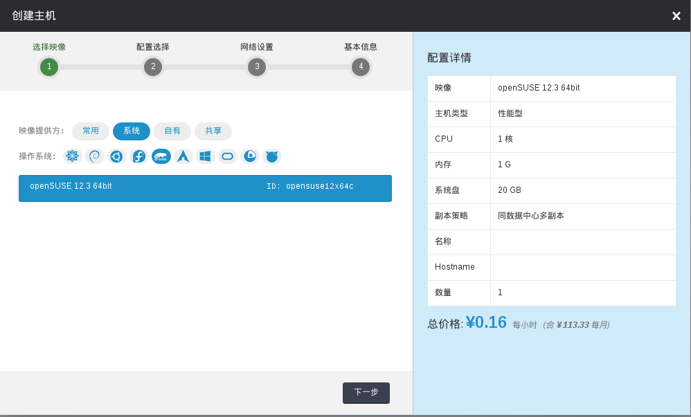
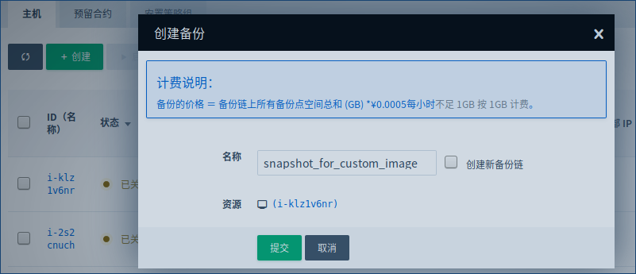
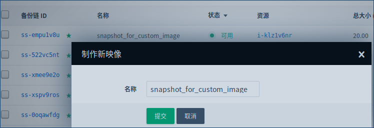
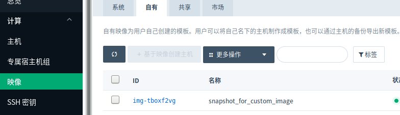
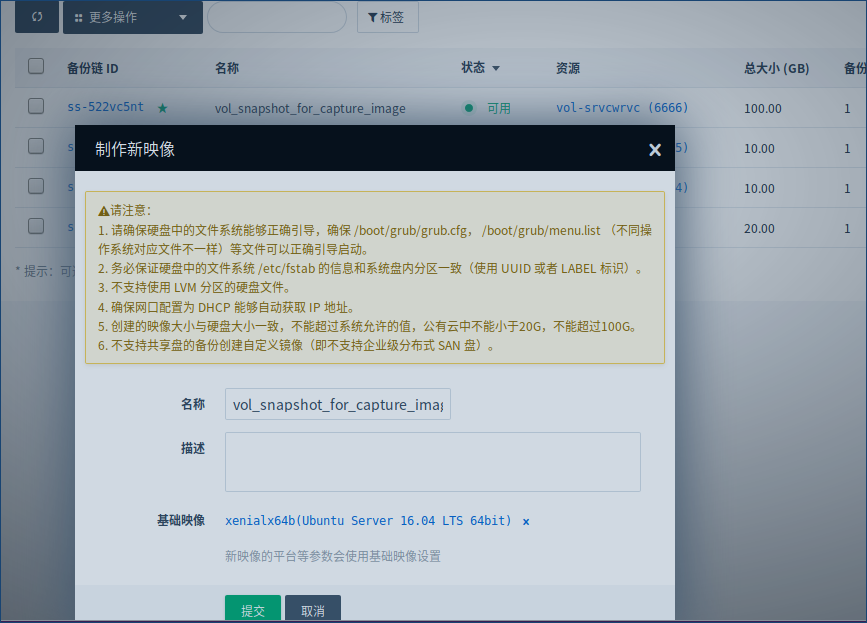

---
---

# 映像（Image）

映像（Image）是一个包含了软件及必要配置的机器模版。 作为基础软件，操作系统是必须的，您也可以根据自己的需求将任何应用软件 （比如，数据库、中间件等）放入映像中。

映像分为两类。其一是青云官方提供的，称之为“系统映像”， 包括了各种 Linux、Windows 等操作系统， 各系统映像的初始本地终端用户名和密码均可在各映像的详情描述中找到。 其二是用户通过捕获一个主机来自行创建的，名为“自有映像”， （需要注意，主机在关机状态下才能被捕获为映像）。其三是用户自己在数据盘中安装好操作系统之后， 备份数据盘， 将数据盘的备份捕获为自定义镜像。系统映像全局可见可用，自有映像只有用户本人可见可用。

主机（Instance）是以虚拟机器的形式运行在青云中的映像副本。 基于一个映像，您可以创建任意数量的主机。在创建主机时， 您需要指明 CPU 和内存的配置。青云允许您任意指定 CPU、内存的数量， 也允许您在主机创建之后随时再行调整。

# 青云提供的开源操作系统

系统映像为官方提供的模板。QingCloud 会提供主流的Linux、Windows 模板，并根据上游厂商更新版本时及时制作新模板。

* Linux 系列
 * ArchLinux
 * CentOS 5.8/6.4/6.5/6.6/6.8/7/7.1/7.2/7.3/7.4
 * Debian Jessie/Stretch/Wheezy
 * Fedora 18/20/22/24
 * OpenSUSE 12.3
 * Ubuntu 14.04/16.04/
* BSD 系列
 * FreeBSD
* 容器相关
 * CoreOS

## 在创建主机时使用

在创建主机时，第一步就是选择您青睐的操作系统，如下图所示：



## 青云提供的内网镜像源代理

为了方便更新Linux操作系统，我们提供了内网镜像代理，可供无法访问公网的主机更新系统。代理地址如下：

Ubuntu: http://mirrors.ks.qingcloud.com
支持区域:
  * 北京3区

使用方法

```
sudo sed -i s/us.archive.ubuntu.com/mirrors.ks.qingcloud.com/g /etc/apt/sources.list
sudo sed -i s/cn.archive.ubuntu.com/mirrors.ks.qingcloud.com/g /etc/apt/sources.list
sudo sed -i s/security.ubuntu.com/mirrors.ks.qingcloud.com/g /etc/apt/sources.list
sudo apt-get update
```

# 通过主机备份捕获的镜像
用户在 "计算" - "主机" 先将自己的某个主机关机，右键选择"创建备份"，创建可以制作为镜像的备份。 



待备份完成之后，在控制台上选择 "存储" - "备份"，找到之前的备份，并右键选择"制作新映像"。 



待完成之后，可以在 "计算" - "映像" - "自有" 中看到刚才创建的映像。




# 通过数据盘备份捕获的镜像

用户也可以将自定义镜像上传到云主机挂载的硬盘中，使用硬盘的快照制作成用户自定义的镜像。

## 限制条件
您需要注意以下的限制条件:
1. 用户自定义的镜像创建的主机不能重置密码；
2. 某些监控信息可能采集不到；
3. 不支持使用lvm分区的镜像；
4. 根据自定义的映像文件创建的主机在挂载硬盘后硬盘的映射关系无法显示(即 vol-XXX 和 /dev/sdX 之间的映射关系)；
5. 自定义的镜像的大小不能超过设置的值，公有云中不能超过 100G 不能小于 20G。 

## 注意事项
1. 在使用自定义的系统盘创建自定义镜像时，务必保证 /etc/fstab 的信息和系统盘内分区一致；
2. 确保 /boot/grub/grub.cfg，/boot/grub/menu.list (不同操作系统对应文件不一样)等文件可以正确引导启动；
3. 确保网口配置为 dhcp 能够自动获取 ip 地址。 


## 操作步骤
示例 1: 将本地的 20G 系统盘的映像上传到青云环境上。 务必确保本地系统盘上的 /etc/fstab，/etc/network/ 等文件信息正确。

1. 云主机创建新的硬盘，大小也为 20G (和本地系统盘的大小一致；如果系统盘的大小小于 20G，也需要创建 20G 的云硬盘)；

2. 挂载新创建的硬盘到某台云主机上；

3. 拷贝本地的 test2.img 镜像文件到云主机上；

    ```scp -i $KEY_PATH test2.img root@eip:~/```

4. 云主机安装 qemu 软件支持使用 qemu-img 转换格式，或者在本地转换也可以(如果用户本地转换格式，此步骤可省略)

    ```sudo apt-get install qemu kernel-package linux-source build-essential```

5. 将 test2.img（假定是 qcow2 格式的镜像），转化为 raw 格式，并放到云硬盘中；也可以直接转化成 raw 格式后拷贝到云主机；

    ```qemu-img convert -f qcow2 test2.img -p -O raw test_raw.img```

6. 如果镜像的大小小于所创建的云硬盘，使用如下指令修改镜像的大小 (当镜像的大小和云盘一致时，忽略此步骤)；
必须保证raw格式的镜像大小和云硬盘大小一致，之后才能使用dd拷贝镜像到硬盘

    例如：镜像的大小只有 128M ，此时将镜像的大小调整为云硬盘的大小 20G 。 

    ```qemu-img resize test.img +19G```

    ```qemu-img resize test.img +896M```

7. 将 raw 格式的镜像文件拷贝到硬盘中；

    ```dd if=test_raw.img of=/dev/vdc```

    完成之后， lsblk 如果没有显示 vdc 的分区信息，可以使用:

    ```partprobe /dev/vdc```

    更新下硬盘的分区信息；

8. 将云硬盘制作备份；

9. 根据云硬盘备份创建用户自定义镜像。 



创建镜像完成之后，可以在 "计算" - "映像" - "自有" 中看到刚才创建的映像。 选择镜像， 并点击 "基于映像创建主机"　可以创建新的主机。 


**用户也可以自己制作云硬盘中的分区， 并将已有的镜像的分区逐个上传到云硬盘中；之后再安装好grub和引导文件。 **

## 青云提供的开源操作系统镜像模板

系统映像为官方提供的模板。 QingCloud 会提供主流的 Linux、Windows 模板，并根据上游厂商更新版本时及时制作新模板。

* Linux 系列
 * arch201609x64a
 * centos58x86/centos65x64d/centos63x64/centos64x64/centos64x64a/centos65x64/centos68x64/centos7x64d等
 * debian8x64/debian87x64/debian91x64等
 * fedora18x86a/fedora18x64b/fedora20x64/fedora20x64b/fedora22x64/fedora24x64
 * opensuse12x64/opensuse12x64a/opensuse12x64b/opensuse12x64c
 * trustysrvx64e/trustysrvx64h/xenial3x64/xenial4x64a等
* BSD 系列
 * freebsd10u1x64/freebsd11u0x64
* 容器相关
 * coreose
