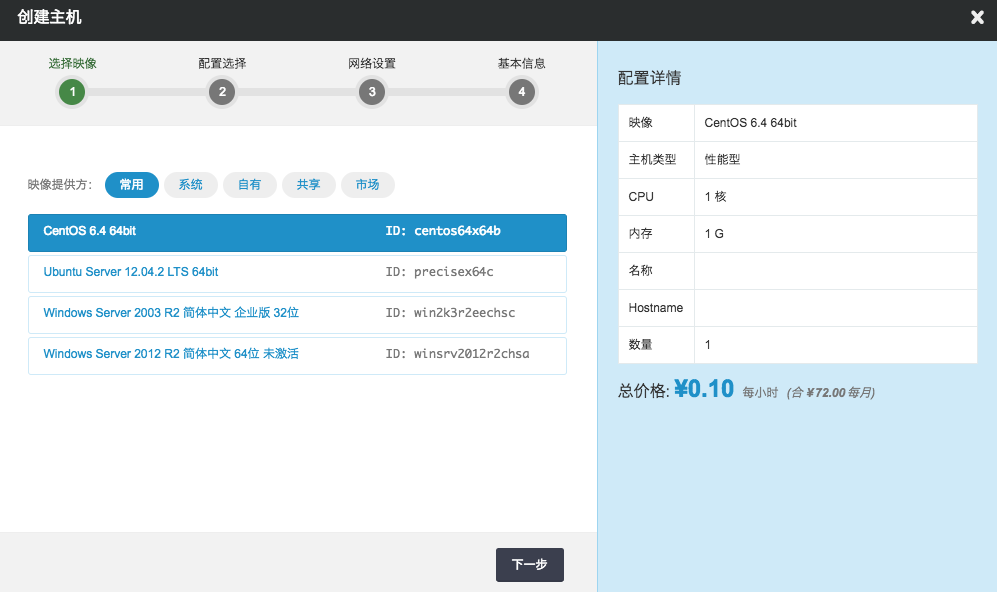
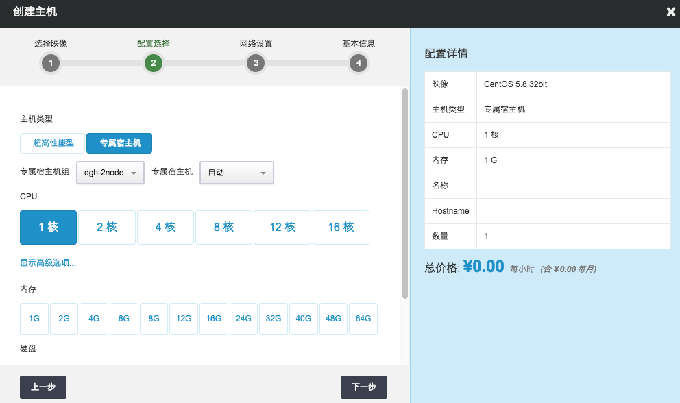
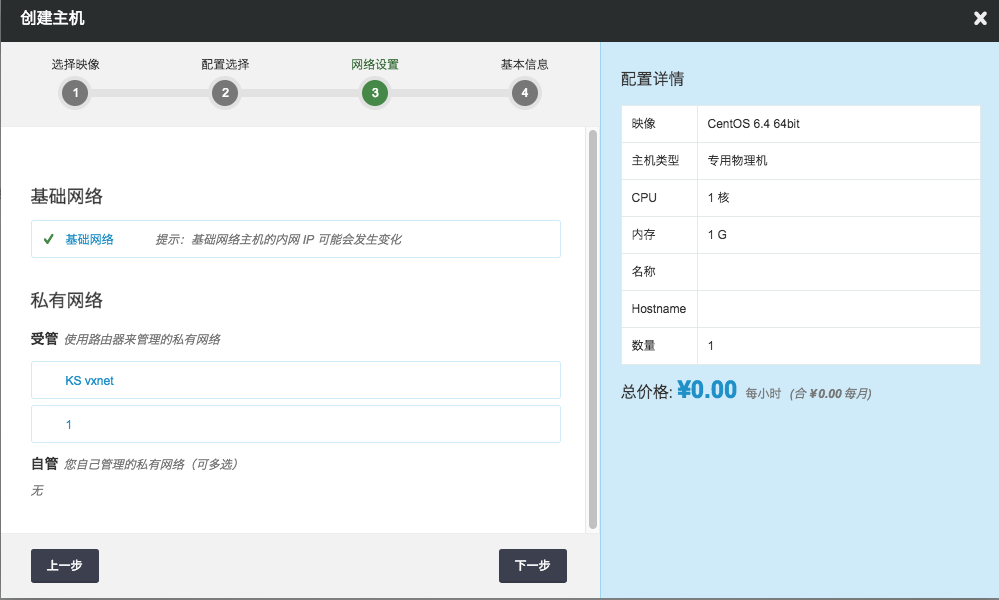
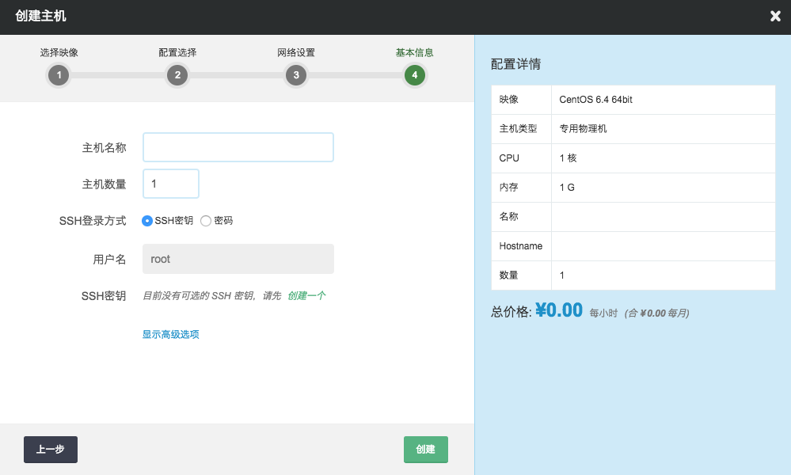
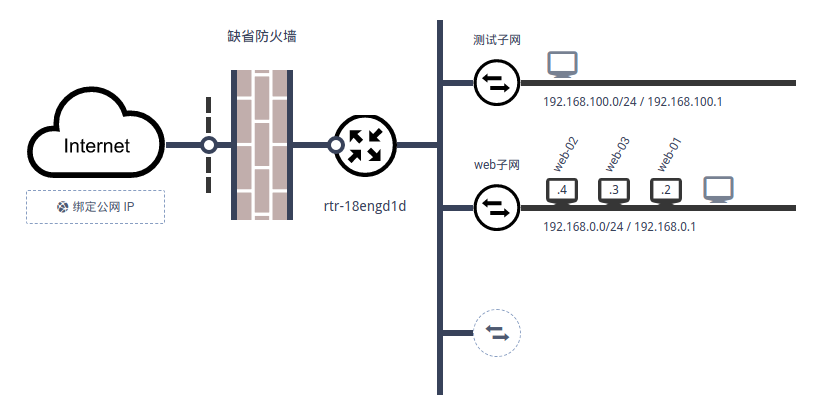
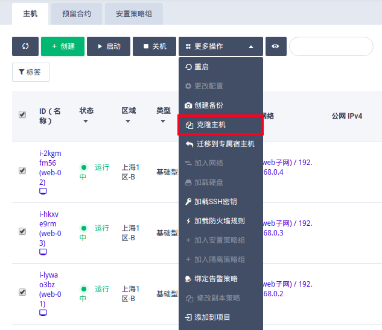
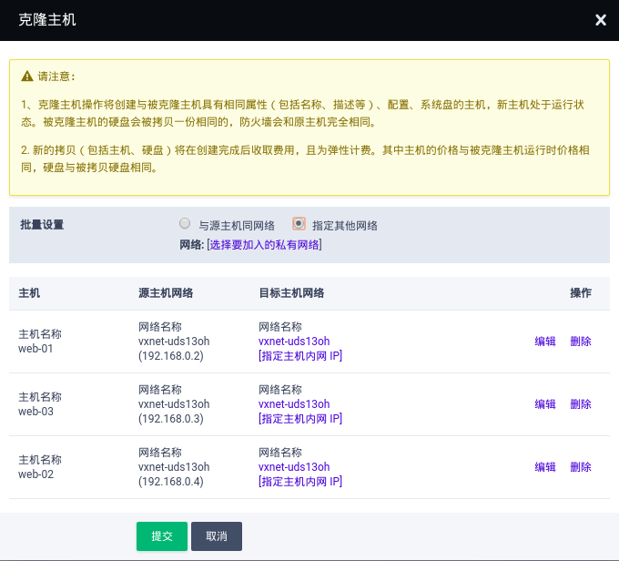
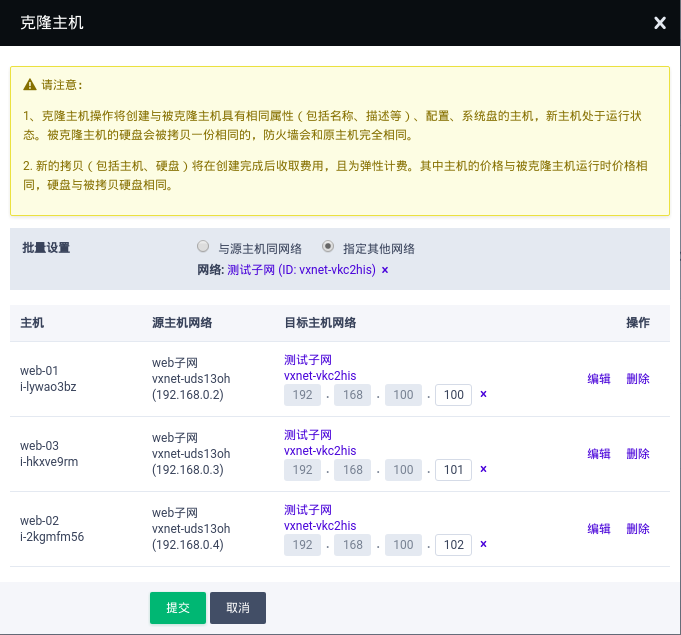
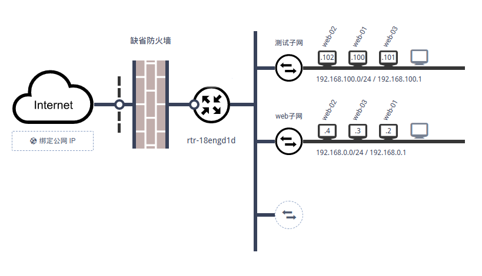
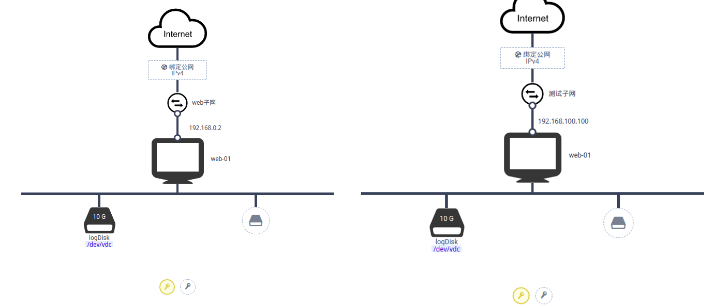

---
---

# 主机( Instance )

青云 IaaS 平台所交付的主机服务，是云计算的核心业务，也是用户最为关系的计算的核心。

# 主机类型

青云 IaaS 平台提供如下几种类型的主机，可以按照自己的实际情况进行选择。

## 基础型 （ S1 ）

基础型主机提供从 1C 1G - 8C 32G 的可选配置，是面向个人或中小团队用户推出的入门型主机类型，以极高的性价比满足低负载应用、轻量 Web 应用、开发测试环境、轻量级企业服务等使用场景需求。

|实例类型    |CPU    |内存    |内网带宽    |
|:----|:----|:----|:----|
|s1.small.r1   |1核    |1G    |0.2 Gbps    |
|s1.small.r2   |1核    |2G    |0.2 Gbps    |
|s1.small.r4   |1核    |4G    |0.2 Gbps    |
|s1.large.r1   |2核    |2G    |0.5 Gbps    |
|s1.large.r2   |2核    |4G    |0.5 Gbps    |
|s1.large.r4   |2核    |8G    |0.5 Gbps    |
|s1.xlarge.r1  |4核    |4G    |0.8 Gbps    |
|s1.xlarge.r2  |4核    |8G    |0.8 Gbps    |
|s1.xlarge.r4  |4核    |16G    |0.8 Gbps    |
|s1.2xlarge.r1 |8核    |8G    |1.2 Gbps    |
|s1.2xlarge.r2 |8核    |16G    |1.2 Gbps    |
|s1.2xlarge.r4 |8核    |32G    |1.2 Gbps    |

## 企业型 ( E1 )

企业型主机提供从 2C 4G - 32C 128G 的可选配置，是面向严肃的企业级生产应用环境设计的高性能高可靠计算实例资源，满足企业客户核心数据库、在线业务系统、传统企业服务等使用场景需求。

|实例类型    |CPU    |内存    |内网带宽    |
|:----|:----|:----|:----|
|e1.large.r2   |2核    |4G    |1.5 Gbps    |
|e1.large.r4   |2核    |8G    |1.5 Gbps    |
|e1.large.r8   |2核    |16G    |1.5 Gbps    |
|e1.xlarge.r1  |4核    |4G    |2 Gbps    |
|e1.xlarge.r2  |4核    |8G    |2 Gbps    |
|e1.xlarge.r4  |4核    |16G    |2 Gbps    |
|e1.xlarge.r8  |4核    |32G    |2 Gbps    |
|e1.2xlarge.r1 |8核    |8G    |3 Gbps    |
|e1.2xlarge.r2 |8核    |16G    |3 Gbps    |
|e1.2xlarge.r4 |8核    |32G    |3 Gbps    |
|e1.2xlarge.r8 |8核    |64G    |3 Gbps    |
|e1.3xlarge.r1 |12核    |12G    |4.5 Gbps    |
|e1.3xlarge.r2 |12核    |24G    |4.5 Gbps    |
|e1.3xlarge.r4 |12核    |48G    |4.5 Gbps    |
|e1.3xlarge.r8 |12核    |96G    |4.5 Gbps    |
|e1.4xlarge.r1 |16核    |16G    |5.5 Gbps    |
|e1.4xlarge.r2 |16核    |32G    |5.5 Gbps    |
|e1.4xlarge.r4 |16核    |64G    |5.5 Gbps    |
|e1.4xlarge.r8 |16核    |128G    |5.5 Gbps    |
|e1.6xlarge.r2 |24核    |48G    |8 Gbps    |
|e1.6xlarge.r4 |24核    |96G    |8 Gbps    |
|e1.6xlarge.r8 |24核    |192G    |8 Gbps    |
|e1.8xlarge.r2 |32核    |64G    |10 Gbps    |
|e1.8xlarge.r4 |32核    |128G    |10 Gbps    |

## 企业型 ( E2 )

企业型主机提供从 2C 4G - 32C 512G 的可选配置，企业型 e2 主机采用独享 CPU模式，可提供更高更稳定的计算性能，并针对人工智能工作负载进行优化，满足企业更严苛的性能要求。

|实例类型    |CPU    |内存    |内网带宽    |
|:----|:----|:----|:----|
|e2.large.r2   |2核    |4G    |1.5 Gbps    |
|e2.large.r4   |2核    |8G    |1.5 Gbps    |
|e2.large.r8   |2核    |16G    |1.5 Gbps    |
|e2.xlarge.r1  |4核    |4G    |2 Gbps    |
|e2.xlarge.r2  |4核    |8G    |2 Gbps    |
|e2.xlarge.r4  |4核    |16G    |2 Gbps    |
|e2.xlarge.r8  |4核    |32G    |2 Gbps    |
|e2.2xlarge.r1 |8核    |8G    |3 Gbps    |
|e2.2xlarge.r2 |8核    |16G    |3 Gbps    |
|e2.2xlarge.r4 |8核    |32G    |3 Gbps    |
|e2.2xlarge.r8 |8核    |64G    |3 Gbps    |
|e2.3xlarge.r1 |12核    |12G    |4.5 Gbps    |
|e2.3xlarge.r2 |12核    |24G    |4.5 Gbps    |
|e2.3xlarge.r4 |12核    |48G    |4.5 Gbps    |
|e2.3xlarge.r8 |12核    |96G    |4.5 Gbps    |
|e2.4xlarge.r1 |16核    |16G    |5.5 Gbps    |
|e2.4xlarge.r2 |16核    |32G    |5.5 Gbps    |
|e2.4xlarge.r4 |16核    |64G    |5.5 Gbps    |
|e2.4xlarge.r8 |16核    |128G    |5.5 Gbps    |
|e2.6xlarge.r2 |24核    |48G    |8 Gbps    |
|e2.6xlarge.r4 |24核    |96G    |8 Gbps    |
|e2.6xlarge.r8 |24核    |192G    |8 Gbps    |
|e2.8xlarge.r2 |32核    |64G    |12 Gbps    |
|e2.8xlarge.r4 |32核    |128G    |12 Gbps    |
|e2.8xlarge.r8 |32核    |256G    |12 Gbps    |
|e2.8xlarge.r16 |32核    |512G    |12 Gbps    |

## 专业增强型 ( P1 )

专业增强型主机提供从 2C 4G - 32C 256G 的可选配置，是面向企业级用户全新推出的 vCPU 独享型虚拟主机，可为用户提供更高的计算性能、更大的内存带宽与稳定性，满足企业用户对 CPU 主频及网络吞吐性能有极高要求，且需要独享 vCPU 资源的应用系统，特别适用于企业核心数据库、线上关键业务等应用场景。

|实例类型    |CPU    |内存    |内网带宽    |
|:----|:----|:----|:----|
|p1.large.r2   |2核    |4G    |1.5 Gbps    |
|p1.large.r4   |2核    |8G    |1.5 Gbps    |
|p1.large.r8   |2核    |16G    |1.5 Gbps    |
|p1.xlarge.r1  |4核    |4G    |2 Gbps    |
|p1.xlarge.r2  |4核    |8G    |2 Gbps    |
|p1.xlarge.r4  |4核    |16G    |2 Gbps    |
|p1.xlarge.r8  |4核    |32G    |2 Gbps    |
|p1.2xlarge.r1 |8核    |8G    |3 Gbps    |
|p1.2xlarge.r2 |8核    |16G    |3 Gbps    |
|p1.2xlarge.r4 |8核    |32G    |3 Gbps    |
|p1.2xlarge.r8 |8核    |64G    |3 Gbps    |
|p1.3xlarge.r1 |12核    |12G    |4.5 Gbps    |
|p1.3xlarge.r2 |12核    |24G    |4.5 Gbps    |
|p1.3xlarge.r4 |12核    |48G    |4.5 Gbps    |
|p1.3xlarge.r8 |12核    |96G    |4.5 Gbps    |
|p1.4xlarge.r1 |16核    |16G    |5.5 Gbps    |
|p1.4xlarge.r2 |16核    |32G    |5.5 Gbps    |
|p1.4xlarge.r4 |16核    |64G    |5.5 Gbps    |
|p1.4xlarge.r8 |16核    |128G    |5.5 Gbps    |
|p1.6xlarge.r2 |24核    |48G    |8 Gbps    |
|p1.6xlarge.r4 |24核    |96G    |8 Gbps    |
|p1.6xlarge.r8 |24核    |192G    |8 Gbps    |
|p1.8xlarge.r2 |32核    |64G    |12 Gbps    |
|p1.8xlarge.r4 |32核    |128G    |12 Gbps    |
|p1.8xlarge.r8 |32核    |256G    |12 Gbps    |
|p1.16xlarge.r4|64核    |256G    |25 Gbps    |

## 性能型

经过 QingCloud 优化的存储技术，IO 吞吐性能最高可达 128 MB/s，该类型主机的推荐使用场景包括 Web 应用服务器、开发环境、轻量级企业服务等。

| CPU | 内存 | 性能型块存储| 容量型块存储 |
|:----|:----|:----|:----|
|1核~32核|1GB ~128GB|10 GB ~ 2 TB|100 GB ~ 5 TB|

## 超高性能型

经过 QingCloud 优化的存储技术，IO 吞吐性能最高可达 200 MB/s，随机读写性能最高可达 25000 IOPS，该类型主机的推荐使用场景包括核心数据库，在线业务系统，传统企业服务，大数据处理等高 IOPS、网络负载重的场景。

| CPU | 内存 | 超高性能型块存储| 容量型块存储 |
|:---- |:---- |:----|:----|
|1核~32核|1GB ~128GB|10 GB ~ 2 TB|100 GB ~ 5 TB|

## 其它

* GPU 主机 是具备 GPU 加速计算能力的实例，可同时提供 GPU 和 CPU 计算资源，大幅提高机器学习及科学计算等大规模计算框架的运行速度，为搭建人工智能及高性能计算平台提供基础架构支持。主要应用场景包括人工智能深度学习、高性能计算、图形图像处理等领域。

* 物理主机 提供高性能、资源独享、安全隔离的专属物理主机群组，满足各类核心应用对高性能及稳定性的需求，同时提供完整的设备管理权限及运维服务。适用于对超高性能和合规有需求的场景，例如高性能计算、大规模数据分析，传统核心数据库 Oracle RAC等业务。

* 专属宿主机 服务向用户提供专用物理宿主机资源，用以部署虚拟实例。部署于专属宿主机之上的实例，称为专属实例。专属实例在硬件层级与其他用户所部署实例保持物理隔离。

# 虚拟主机操作指南

## 创建主机

登录青云[终端控制台](https://console.qingcloud.com/)

### 步骤一，选择映像

### 步骤二，选择合适的配置

### 步骤三，网络配置

### 步骤四，其它配置

### 创建成功，开始运行

## 克隆主机

### 克隆主机功能简介

克隆主机功能可以让主机在运行的状态下，创建出一份具有相同配置、内网网段、系统盘数据、挂载数据盘数据的主机，有助于业务不中断服务时方便地进行环境复制。该功能还支持批量操作，您可以一次性的批量克隆出多台主机，解决集群架构下的快速环境复制问题。

### 操作指南

1、登录青云[终端控制台](https://console.qingcloud.com/)，切换至“计算”--“主机”。在要克隆的主机上点击鼠标右键，在弹出的菜单中选择“克隆主机”。

或者勾选要克隆的主机，点击“更多操作”，在下拉菜单中点击“克隆主机”。

2、在弹出的提示框中，您可选择克隆主机的目标网络，之后点击“确定”，触发克隆主机任务。

默认目标网络是原主机的网络，点击“编辑”可以选择新主机要加入的网络并指定 IP 地址，如果不指定 IP 地址则由系统分配。

>注解
克隆原主机需要原主机使用的镜像是可用状态。如果原主机启动的镜像被删除了的话，克隆会失败。

### 批量克隆主机

克隆主机支持批量操作，您可以一次性的批量克隆出多台主机，解决集群架构下的快速环境复制问题。下面以一个场景来讲解批量克隆主机的方法。

假设现有系统的架构如下：

现要将 web01 - 03 这三台主机批量克隆到“测试子网”中。在主机列表中复选要克隆的主机，点击“更多操作”，在下拉菜单中点击“克隆主机”。

在“批量设置”处，选择“指定其他网络”，点击“[选择要加入的私有网络]"，在弹窗中选择“测试子网”。

如需为克隆后的主机指定 IP，点击“[指定主机内网 IP]”为要指定 IP 的主机指定克隆后的 IP 地址。

点击“提交”即可发起批量克隆主机任务。

通过比较，克隆后的主机与源主机具有相同的名称、配置、挂载盘、数据、SSH 密钥、防火墙等。

