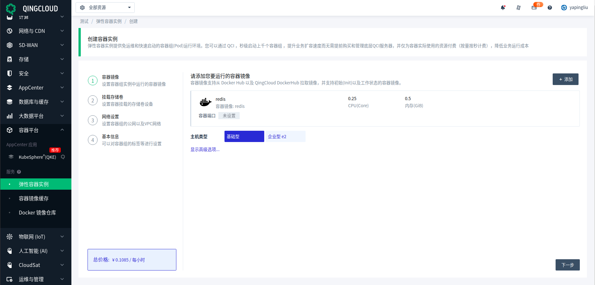
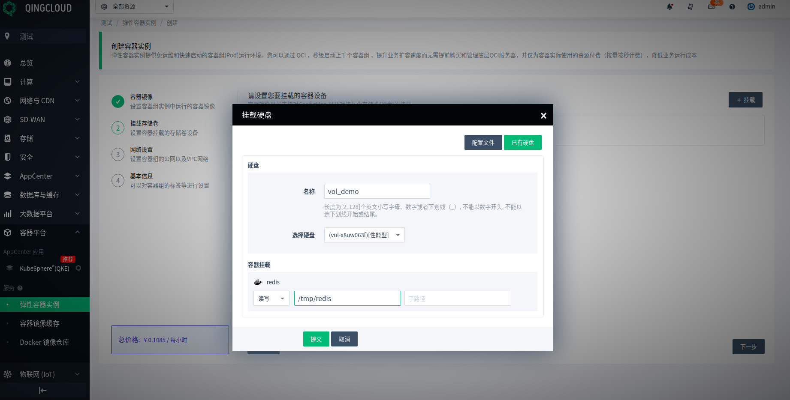
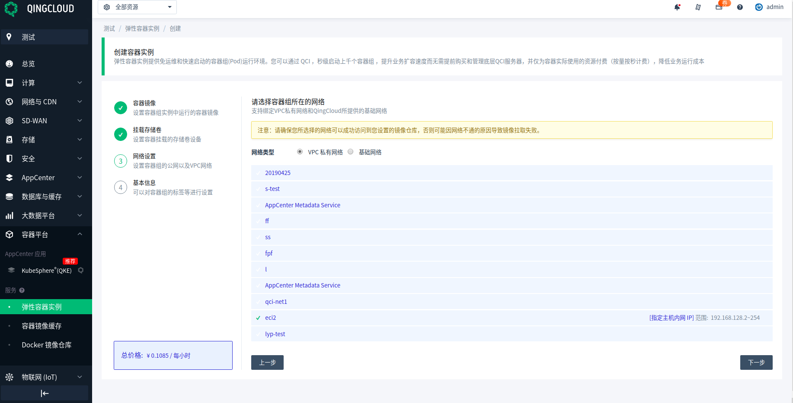
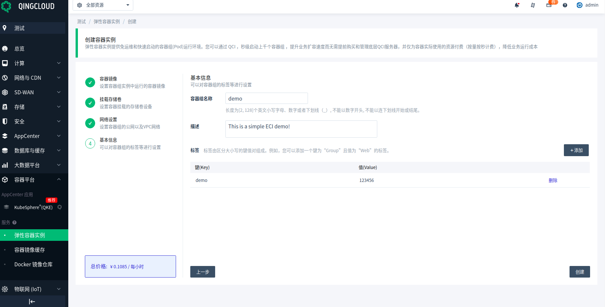
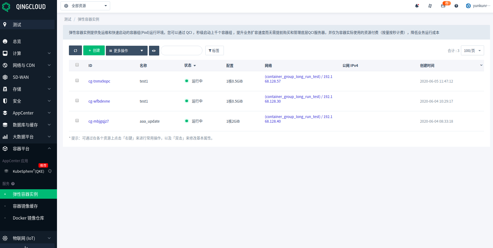
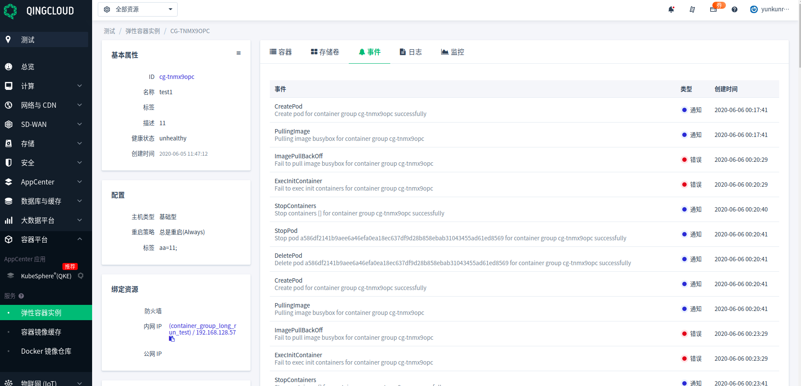
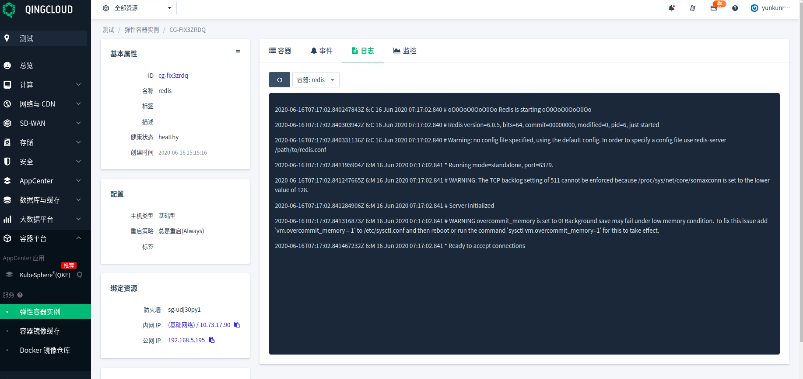
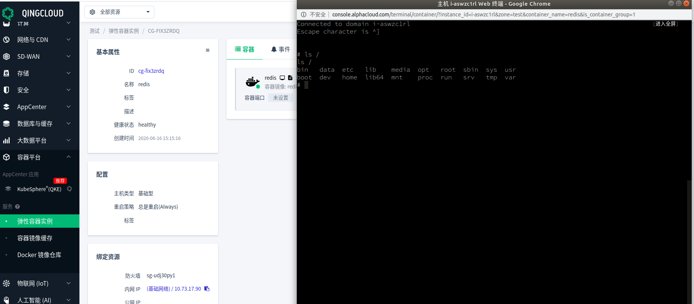

---
---

# 弹性容器实例 (ECI) 用户指南[¶](#id1 "永久链接至标题")

## 简介[¶](#id2 "永久链接至标题")

近年来，随着容器技术的广泛普及，容器技术与云原生这些术语也越来越频繁地进入到人们的视野。由于 Serverless 与容器技术天然的亲和性， Serverless 容器运行服务顺理成章地成为了践行容器技术以及云原生生态的必经之路。

青云弹性容器实例 (Elastic Container Instance) 是借助于青云云平台构建的 Serverless 容器运行服务，在提供 vm 级别的安全和资源隔离能力的同时，针对容器运行环境进行了相关优化。只需要提供相应的镜像，无需管理底层底层服务器，即可以低成本，免运维地运行相关业务，从而将复杂的基础设施维护和业务开发解耦开来。

青云弹性容器实例(Elastic Container Instance)集成了云平台主机，存储以及网络等资源，在云平台上只需要完成指定容器镜像，指定存储卷，配置网络和指定基本信息四步，便可快速地创建 ECI ，以容器为单位支持容器地自动巡检和修复。

## 创建 ECI[¶](#id3 "永久链接至标题")

借助于青云云平台，您可以随时方便地创建和管理 ECI 实例。支持在线更新，同时具有容器健康状态检查功能，即当系统发现某个 ECI 实例内部某些容器状态异常（比如异常退出），相关容器状态将在相关 ECI 实例详情页面展示出来，并且系统将根据实例重启策略来决定是否重启整个 ECI 实例， 另外您还可以借助 ECI 详情页面提供地监控功能来帮助您更好地管理集群。ECI 既可以运行在VPC网络中，也可以借助于基础网络，通过绑定公网 IP 的方式暴露在公网当中。借助青云提供的硬盘可以将需要持久化存储的数据存放在硬盘当中。您可以根据业务需求灵活地选择相应的网络模式和硬盘挂载策略。

### 准备工作

下面将以 VPC 网络模式为例，说明如何创建 ECI 实例。

#### 网络

通常可以将 ECI 实例运行在受管私有网络中。若还未创建 VPC 和私有网络，可以参考文档[创建 VPC](https://docs.qingcloud.com/product/network/vpc) 和[创建私有网络](https://docs.qingcloud.com/product/network/appcenter_network_config/create_vxnet) 。

#### 硬盘

根据业务需求，有时候可能需要将数据持久化存储起来。 若还未创建硬盘，可根据页面提示创建一个。 硬盘的类型需要与 ECI 主机类型匹配，具体规则可以参考[容器组机器类型与硬盘类型的匹配策略](#diskmountstrategy) 。

#### 防火墙

处于数据安全的考虑，可以对 VPC 网络或者处于基础网络并且绑定外网 EIP 的 ECI 实例指定对应的防火墙。若还未创建防火墙，可以参考文档[创建防火墙](https://docs.qingcloud.com/product/security/security_group) 。

准备工作完毕之后，接下来进入容器平台的弹性容器实例页面，点击创建进入容器组的创建页面。

第一步，指定容器镜像，这里需要至少添加一个容器镜像。这些指定的镜像将属于同一个容器组。

第二步，点击下一步，进入“挂载存储卷”页面，点击“挂载”，指定 ECI 实例需要挂载的存储卷。目前存储卷支持2种格式：
1. [配置文件](#configmap)
2. [已有硬盘](#flexvolume)

简单起见，假设需要挂载的是之前创建好的硬盘。在“选择硬盘列表”里已经提前创建好的硬盘。

第三步，点击下一步，进入“网络设置”页面，“网络类型”选择提前创建的 VPC 网络。

最后一步，点击下一步，进入到“基本信息”页面，填写容器的基本信息。填写完成，点击“创建”系统便开始后台创建 ECI 实例。

## ECI 相关概念[¶](#id4 "永久链接至标题")

青云弹性容器实例 (Elastic Container Instance) 中的核心概念是容器组 (Container Group)  。本文将以容器组范围和单个容器范围 2 个维度为您介绍ECI 相关概念。

### 容器组范围

- 容器组：一组可以被调度到同一台宿主机上的容器集合。这些容器共同构成了容器组的生命周期并共享容器组的网络和存储资源。容器组的概念与 Kubernetes 中 Pod 概念类似。在部署过程中需要为容器组分配资源。容器组中的单一容器可以使用的资源不能超过容器组的限制。例如：一个 1 vcpu 资源的容器组中可以包含 2 个分别使用 0.5 vcpu 的容器。

- 健康状态：包含 3 种状态：checking 代表容器组初始状态，healthy 代表容器组当前状态正常，unhealthy 代表容器组当前状态异常。

- 共享内存：容器组内容器之间共享内存的大小（单位 MB ），申请的共享内存应小于容器组实际申请的物理内存的 1/2 ，默认关闭。

- 镜像缓存：是否开启镜像缓存。

    > 注意： 容器组的重启策略仅决定组内容器的逻辑行为，容器组不会被自动重启

- 容器组状态

    - 等待中：容器组正在创建中。
    - 运行中：容器组中所有的容器都已被创建，并且至少有一个容器正在运行。
    - 重启中：容器组正在重启中。
    - 更新中：容器组正在更新中。
    - 删除中：容器组正在删除中。
    - 失败：容器组状态异常，系统将在一个小时之内自动删除处于异常状态的容器组，失败状态的容器组不会收取任何费用。

### 单个容器范围

- 镜像拉取策略：包括尝试重新下载镜像，有先使用本地镜像和仅使用本地镜像，使用方法与 k8s 类似。

- 容器状态

    - 等待中（ waiting ）：容器的初始状态。
    - 创建但尚未启动（ created ）：容器创建完成但是尚未启动。
    - 运行中（ running ）：容器已经创建，并且正在运行。
    - 已终止（ terminated ）：容器终止退出，包括成功终止与失败终止。

- 存储卷：容器中的文件是非持久化存储的，这样会给容器应用带来一些问题。首先，当容器崩溃重启之后，之前存储的文件会丢失。其次，当在一个 ECI 中同时运行多个容器时，常常需要在这些容器之间共享文件。ECI 支持通过存储卷的方式来解决这两个问题。您可以将外部存储卷挂载到指定的容器组，存储卷的生命周期独立于容器组。每个容器组中声明的存储卷由容器组中的所有容器共享。目前 ECI 支持 2 种类型的存储卷：

    - 配置文件（创建时声明），提供了向 ECI 注入配置数据的方法，并且只需以明文形式填入配置数据。

    - 硬盘（提前创建），写入硬盘的数据可以在 ECI 销毁时依然保留，适用于 MySQL 、Redis 等场景。

    > 注意： 配置文件和硬盘挂载的子路径 sub_path 表示的是存储介质内的子路径，与 k8s sub_path 类似。

- Docker 镜像：容器应用打包的标准格式，在部署容器化应用时需要指定镜像，镜像可以来自于 Docker Hub ，青云镜像服务，或者您的私有 Registry 。镜像 ID 可以由镜像所在仓库 URI 和镜像 Tag（缺省为 latest）唯一确认。特别地，对于公有镜像仓库可以直接填写镜像名称和 Tag（可省略）。

- 仓库类型：包含公有仓库和私有仓库。其中私有仓库需要添加镜像仓库凭证。

- 镜像仓库凭证：包含镜像仓库地址（例如：dockerhub.qingcloud.com ），用户名（例如：tester ）和密码（例如：123456 ）三个部分。

- 容器端口：指定容器需要暴露的协议（ TCP 或者 UDP ）和端口。

- 容器类型：包含初始容器和工作容器。初始容器在工作容器之前启动，一般用来进行一些环境初始化的工作。初始容器串行按序执行，工作容器是常驻在容器组中的，并行执行。

- CPU 和内存：每个 ECI 实例内支持最多 20 个容器，实例内每个容器的资源支持自定义配置，但汇总到 ECI 实例级别需要满足 CPU 和内存约束。对于未满足的情况，ECI 会执行自动规整操作，计费按照规整后 CPU 和内存值进行计费。

- 最大日志容量：单个容器保存的最大日志大小，超过指定阈值大小，系统稍后便会选择一个合适的时间截取日志。

- 其他容器参数：

    ECI 通过容器镜像中的预设参数来启动容器。如果您想覆盖镜像的启动默认值，可以使用以下参数进行配置，语义与 docker 完全相同：

    - 工作目录：指定工作目录。
    - 启动命令：启动命令列表。
    - 启动参数：启动参数列表。
    - 环境变量：容器环境变量列表。

## 重启策略[¶](#id5 "永久链接至标题")

- 若重启策略为 Always（默认）：容器组中有容器处于非运行状态时重启容器组。
- 若重启策略为 OnFailure ：容器组中有容器异常退出时重启容器组。
- 若重启策略为 Never ：任何情况下不重启容器组。

## 网络[¶](#id6 "永久链接至标题")

容器组内的容器共享相同的 IP 地址和端口号。目前 ECI 支持 2 种网络模式：

1. 私有网络模式，在该模式下如果您希望在 ECI 中运行的业务能够访问外网，比如从 Docker Hub 拉取公有镜像，需要将 VPC 网络与指定 EIP 绑定。
2. 基础网络模式，加入指定基础网络，并且将容器组与指定 EIP 绑定。

## Debug 与调试[¶](#id7 "永久链接至标题")

当您的容器行为出现异常时，您可以获取容器中的相关日志和事件来排查问题。

登临容器平台中的弹性容器实例页面。

选择您需要查看日志的容器组。

### 查看事件

单击事件即可查看当前容器组对应的事件。

### 查看日志。

单击日志并选择需要查看的容器即可查看当前容器中的日志信息。

### 调试 ECI

单击容器终端图标，连接到指定容器。

    > 注意需要保证容器的状态在运行中才能建立连接。

## 镜像缓存[¶](#id8 "永久链接至标题")

ECI 容器组实例创建过程中，大部分时间消耗在镜像下载阶段，为加速 ECI 容器组创建速度，ECI 提供镜像缓存功能，用户事先将需要用到的镜像作为硬盘快照缓存，在创建ECI容器组实例时基于快照创建，避免或减少镜像层下载，从而提升 ECI 容器组实例创建速度。具体的提升速度跟容器组使用的镜像个数，镜像大小和镜像仓库网络因素决定。

镜像缓存的创建过程与容器组的创建过程类似，创建完成之后点击需要对应的缓存，可以查看到其详细信息。比如镜像全称和大小。

## 关于资源计费的说明[¶](#id9 "永久链接至标题")

### 容器组

ECI 容器组按小时计费，容器组页面上的费用预览计费仅包括基础资源费用。ECI 创建时指定的外部资源即镜像缓存、硬盘、防火墙、公网 IP、 VPC 网络资源费用将会另外计算。容器组基础资源费用的计算周期以容器组创建时间为起点，以容器组销毁时间为终点。

### 镜像缓存

镜像缓存按小时计费，创建镜像缓存根据指定的缓存大小收取不同的缓存费用，支持的镜像缓存大小区间为 [20G, 500G] ，默认大小 20G 。镜像缓存的计费周期以镜像缓存创建时间为起点，以镜像缓存销毁时间为终点。与容器组的计费周期相互独立。

## FAQ 及注意事项[¶](#id10 "永久链接至标题")

### VPC

若 ECI 实例位于 VPC 网络当中，并且需要访问外网(比如拉取公有仓库镜像)，需要提交给指定的 VPC 网络绑定 EIP，否则容器内部访问外网会失败。

### 端口

同一个 ECI 实例当中的容器共享同一个网络命名空间，因此在使用容器的时候请自行合理安排端口的分配，避免同一个 ECI 实例内不同容器之间的端口冲突。

### 镜像缓存

镜像缓存列表中的镜像大小不等于镜像所占硬盘空间的实际大小，比如大小为 7G 的镜像，导入缓存后显示大小为 4G 左右，而实际所占用空间在 14G 左右。估算单个缓存能够容纳的镜像个数应以实际占用空间为准。

### 配额

ECI 相关资源的配额如下：

| 资源类型 | 配额 |
|-------------|------------------------|
| 基础型容器组 | 10 |
| 企业型 e2 | 10 |
| 镜像缓存 | 20 |

> 注意：如果配额不足请通过工单申请。

### 拉取容器镜像超时阈值

| 资源操作 | 超时时间 |
|-------------|------------------------|
| 创建容器组 | 30 分钟 |
| 创建镜像缓存 | 6 小时 |

> 注意：在创建镜像缓存和容器组的过程中，系统拉取镜像的时间取决于环境的网络情况。推荐将一些常用的镜像提前推送到诸如 [青云容器镜像仓库](https://docs.qingcloud.com/product/container/docker_hub.html) 或者阿里云镜像仓库，这样将显著缩短镜像拉取时间和容器组启动时间，加速效果视网络情况而定。

### 容器组机器类型与硬盘类型的匹配策略

| 主机类型 | 可挂载的硬盘类型 |
|-------------|------------------------|
| 基础型 | 基础型硬盘、性能型硬盘和容量型硬盘 |
| 企业型 e2	| 超高性能型、企业级SSD硬盘和容量型硬盘 |

### 限制

- 单个容器组最多创建 20 个容器
- 单个容器组最多创建 10 个 label
- 单个缓存最多存储 20 个镜像
- 目前调试终端只支持 sh shell

### 失败资源的删除

对于创建失败的资源，建议用户手动定期清理。或者系统将在稍后合适的时间 ( 一般一个小时左右 ) 自动删除失败的资源。特别的，对于创建过程中处于 pending 状态的容器组，在其加入网络并获取 IP 后，可以手动强制删除。对于大多数情形，推荐在系统离开 pending 状态以后，再进行删除操作。
