---
---

# Harbor

> 升级版本前请手工备份系统配置，详见[升级集群](#upgrade-harbor)。

[Harbor](https://goharbor.io/) 是一个开源的企业级私有 Docker 镜像仓库方案，用于存储和分发 Docker 镜像，并提供基于角色的权限控制、仓库间 Image 异步复制、LDAP/AD 支持、图形界面等功能。

Harbor on QingCloud 将 Harbor 制作成了 App，能直接在 AppCenter 进行一键部署，并提供了一个高可用、高安全、高性能的解决方案，具有如下特性：

* 镜像存储同时支持 QingStor 对象存储和本地挂盘存储
  * 其中本地存储不支持高可用，且受单磁盘容量限制，只建议测试使用
  * 正式使用建议使用 QingStor 对象存储来保证高可用和无限容量（ QingStor 对象存储是 QingCloud 提供的通用海量非结构化数据存储服务，具有安全可靠、简单易用、高性能、低成本等特点）
* 支持应用节点横向和纵向伸缩
* 高可用
* 一键部署

## 部署镜像仓库

**准备**

在部署 App 之前，您需要创建一个 VPC 网络和一个负载均衡器。另外，如果使用 [QingStor 对象存储](https://www.qingcloud.com/products/qingstor/) 做后端存储，则还需要创建一个 QingStor 对象存储的 Bucket 。

* 创建 VPC 和关联一个 Vxnet 私有网络，详情见 [VPC 指南](https://docs.qingcloud.com/product/network/vpc)。

> 注意：Harbor 采用 Docker Compose 部署，用来部署 Harbor 的 VPC 请不要使用 `172.17.0.0/16` 和 `172.18.0.0/16` 这两个网段。

* 创建负载均衡器
  * 创建一个负载均衡器，然后创建一个监听器，用于 Harbor UI 的访问入口。监听器可为 HTTP 或 HTTPs 协议( HTTPs 协议请在负载均衡器的 HTTPs 监听器里勾选 “负载均衡器监听协议通过 X-Forwarded-Proto 头字段获取负载均衡器的监听协议” )，并可支持私有或公有负载均衡器，如果为私有则只能用于内网访问，详情见[负载均衡器指南](https://docs.qingcloud.com/product/network/loadbalancer)

* 配置防火墙规则
  * 针对上一步负载均衡器的设置，在防火墙上配置允许下行规则 80/TCP (HTTP) 或 443/TCP (HTTPS) 端口

* 使用 QingStor 对象存储的用户创建 Bucket（使用本地存储的用户请跳过此步）
  * Bucket 为 QingStor 对象存储用于存储的容器单位，详情见[创建 Bucket](https://docs.qingcloud.com/qingstor/)

## 创建 Harbor App

**基本设置**

填写集群基本信息，包括名称和描述。

  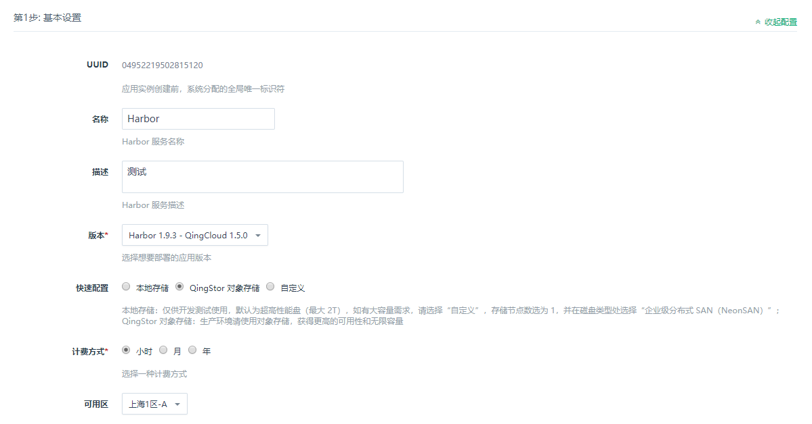

**主服务节点设置**

填写主服务节点 CPU、内存等配置信息，配置节点数量（默认为 2 个），关联负载均衡器。

  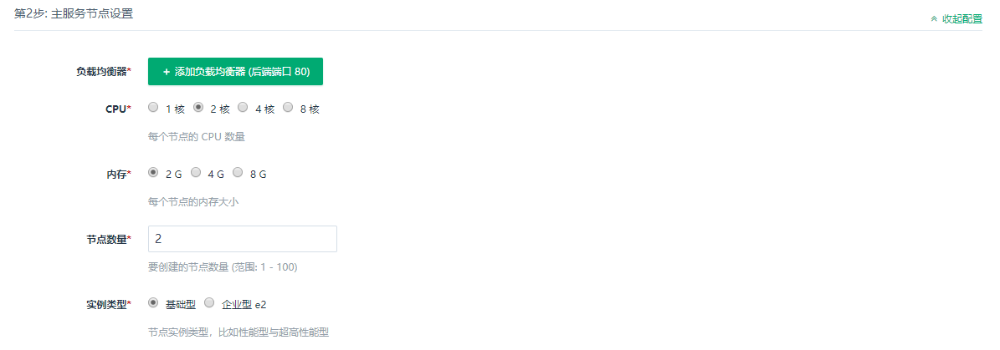

**数据库节点设置**

填写数据库节点 CPU、内存、磁盘大小等配置信息，数据库用于 Harbor 业务数据的存储。镜像漏洞扫描和垃圾清理等操作会增加数据库压力，建议尽可能提高数据库节点配置。

  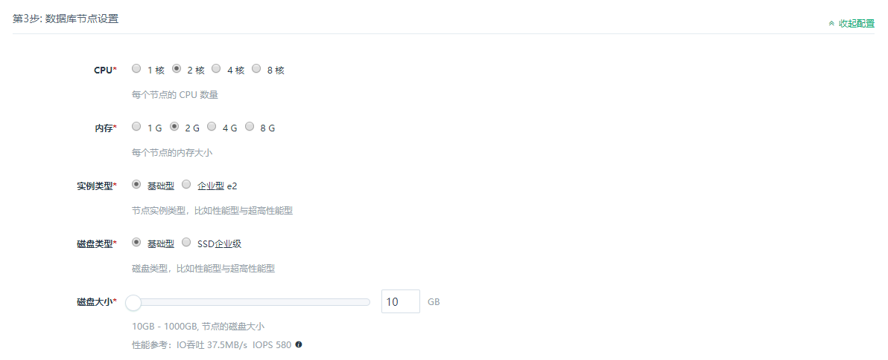

**缓存节点设置**

填写缓存节点 CPU、内存等配置信息，缓存用于 Harbor 的 Session 和镜像 Manifest 信息的存储。

  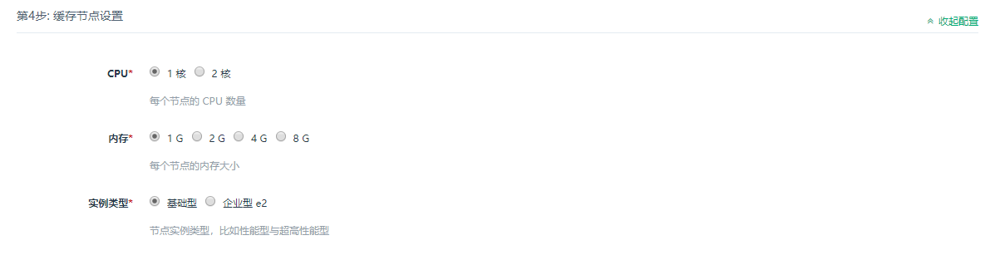

**存储节点设置**

> 注意：本节点只建议用做开发和测试环境使用，大规模生产环境建议使用扩展性更好和无限容量的 QingStor 对象存储。

强烈建议用户首选 QingStor 对象存储做镜像文件的存储。如果不能使用 QingStor 对象存储，用户可以创建此节点做镜像文件的存储。磁盘大小可以随着数据量的上升随时调整。默认节点数为 0 ，表示使用 QingStor 对象存储。

  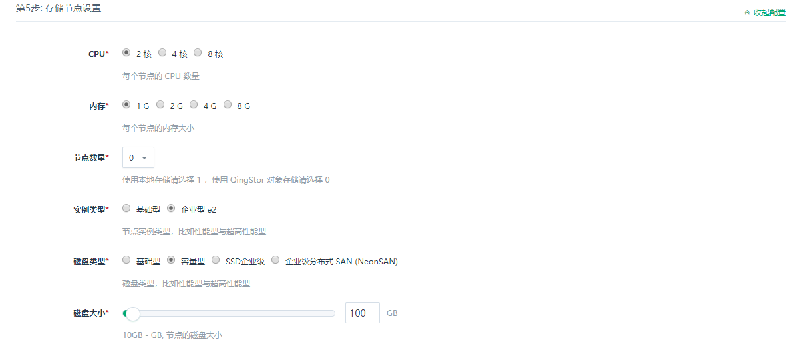

> 注意：企业级分布式 SAN（NeonSAN）目前只开放了部分区，包括：北京 3B/C/D ，广东 2A/B 和 上海 1A/B。

**任务节点设置**

任务节点 (Jobservice) 主要用于执行一些耗时的操作，如：与其他 Harbor 仓库间异步复制镜像，镜像垃圾回收，漏洞扫描等，如果您暂时不需要这些后台任务操作，可以设置节点数为 0 ，后续可以通过增加节点重新开启。

> 注意：当后台任务节点数为 0 时，用户仍然可以在 Harbor 界面上点选镜像复制、垃圾回收等操作，但此时 Harbor 界面会有报错提示。

  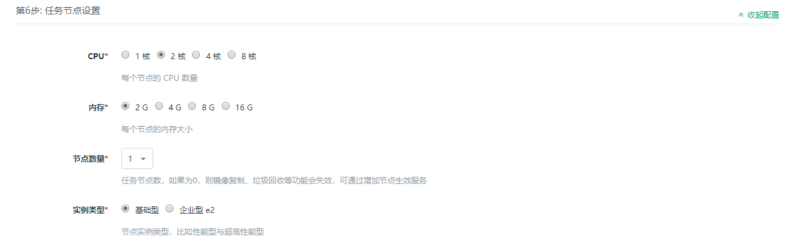

**日志节点设置**

  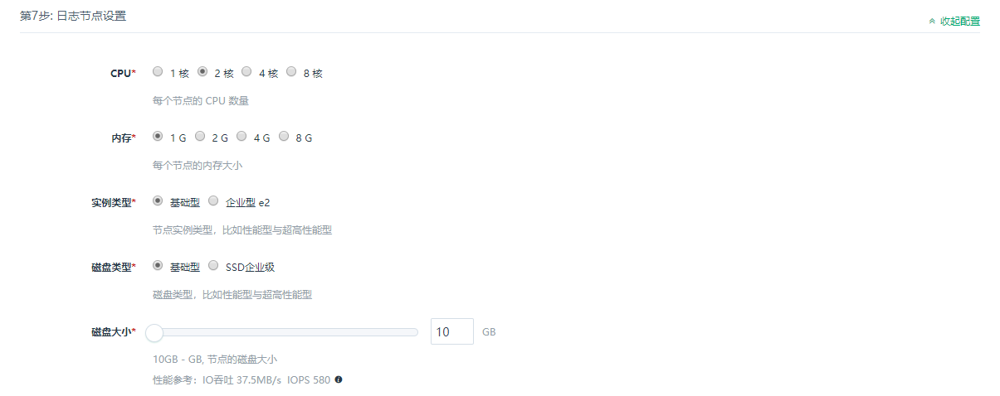

填写日志节点 CPU、内存等配置信息，日志节点记录 Harbor 服务中所有组件的日志信息，日志文件存储于目录 `/var/log/harbor/` 下。

> 注意：`Harbor 1.9.3 - QingCloud 1.5.0` 版本添加了更为便捷的[在线获取日志方法](#faq)，`Harbor 1.7.1 - QingCloud 1.2.0` 以前的版本需在 `/var/log/harbor/yyyy-MM-dd/` 目录下按日期查看日志，`Harbor 1.7.1 - QingCloud 1.2.0` 版本直接在 `/var/log/harbor/` 目录下查看日志。

**网络设置**

  

选择服务部署的私有网络，可以选择之前创建的任意网络。

> 注意：Harbor 采用 Docker Compose 部署，用来部署 Harbor 的 VPC 请不要使用 `172.17.0.0/16` 和 `172.18.0.0/16` 这两个网段。

**服务环境参数设置**

  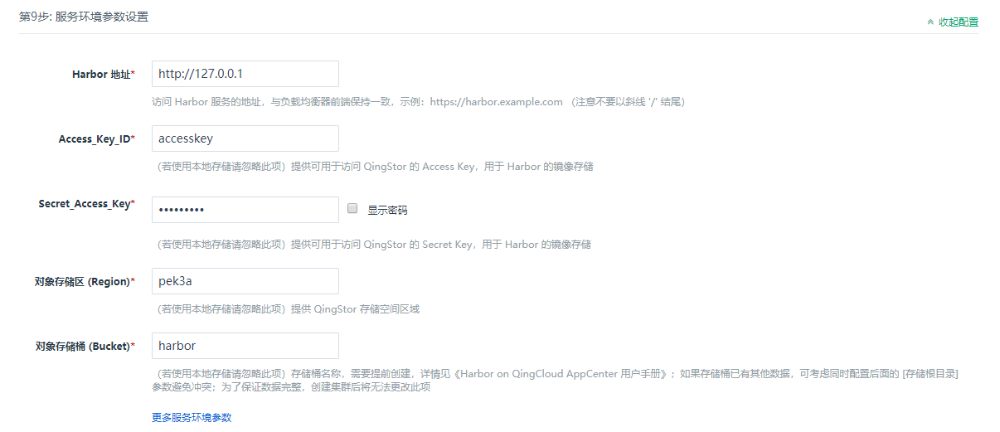

* **Harbor 地址**:

  服务地址，用户访问的 Web 和 docker login/push/pull 使用的地址，这个地址必须与负载均衡器前端地址和协议保持一致，可以是 IP 地址或 Domain 域名，比如：`http://harbor.tools.qingcloud.com`；如果为 HTTPs，则对应访问地址也为 https:// ，比如：`https://192.168.2.1` ；最后不要以 `/` 结束

* **Access_Key_ID & Secret_Access_Key & Zone**:

  > 使用本地存储的用户请跳过此项配置

  使用 QingStor 对象存储服务来存储镜像文件，这里填写可用于访问 QingStor 对象存储服务的Access密钥信息和区域，access_key_id 和 secret_access_key 是青云提供给用户的授权密钥，可以在 API密钥 中创建

* **QingStor 对象存储 Bucket & RootDirecotry**:

  > 使用本地存储的用户请跳过此项配置

  配置存储镜像数据在 QingStor 对象存储的 Bucket 名称和根目录，设置好后，镜像数据会存于这个 Bucket 和 RootDirecotry 之下，用户需要事先创建好

* <s>**Registry 只读模式**</s>

  > 从版本 `Harbor 1.7.1 - QingCloud 1.2.0` 起移除了此项配置，用户可通过 Harbor 界面进行相应操作

  是否设置只读模式，配置后只允许 docker 进行 pull 操作，一般用于在清理镜像的时候操作。

**用户协议**

阅读并同意青云 AppCenter 用户协议之后即可开始部署应用。

## 查看集群信息

在集群创建完毕后，待所有节点的“服务状态”显示为“正常”时，Harbor 就可以使用了。可以在控制台 AppCenter -> 云应用 标签下看到目前已经创建的集群，点击集群 ID 可以查看该集群的详细信息：

  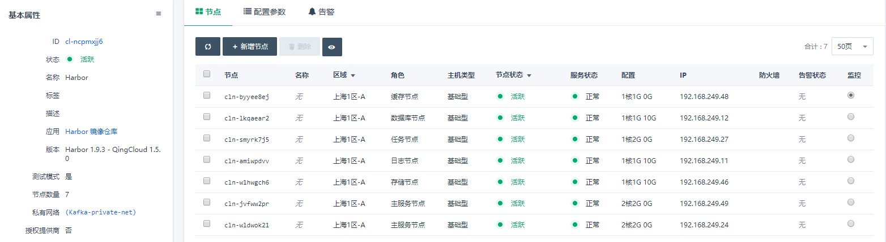

## 修改配置参数

点击配置参数可以修改参数。

  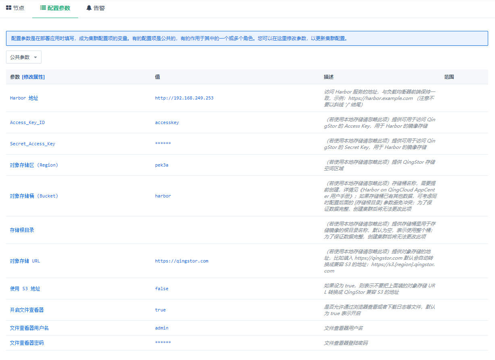

## 横向扩容

> 注意：增删任务节点会导致 Harbor 服务重启，从而有有短暂时间（ 1 分钟以内）的不可用，请在业务低谷时操作！

点击新增节点可以增加相应角色的节点

  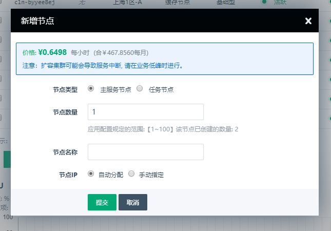

点击删除可以删除选中的节点

## 纵向扩容

点击扩容集群，可以在集群性能不足时提高集群的配置：

  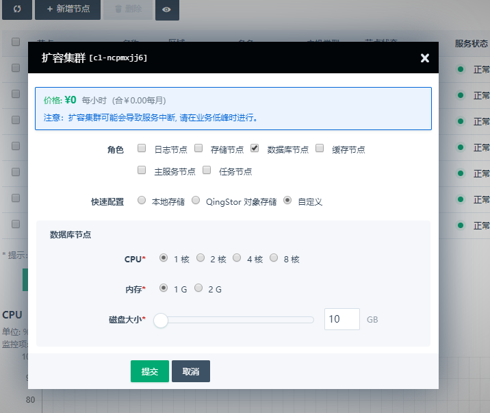

## <a name="upgrade-harbor"></a>升级集群

本应用不支持滚动升级，需要关闭集群进行升级。

> 注意：`Harbor 1.7.1 - QingCloud 1.2.0` 以前的版本在升级前请手工备份修改过的 Harbor 配置，包括 LDAP 、邮箱等，升级完毕后需要手工重新填写；`Harbor 1.7.1 - QingCloud 1.2.0` 以后的版本不再需要这些手工操作。如需协助请通过工单获得支持。

  

如果设置了 LDAP 认证，请在升级前手工备份，并在升级后重新填写（如果没设置过则不需要操作）：

  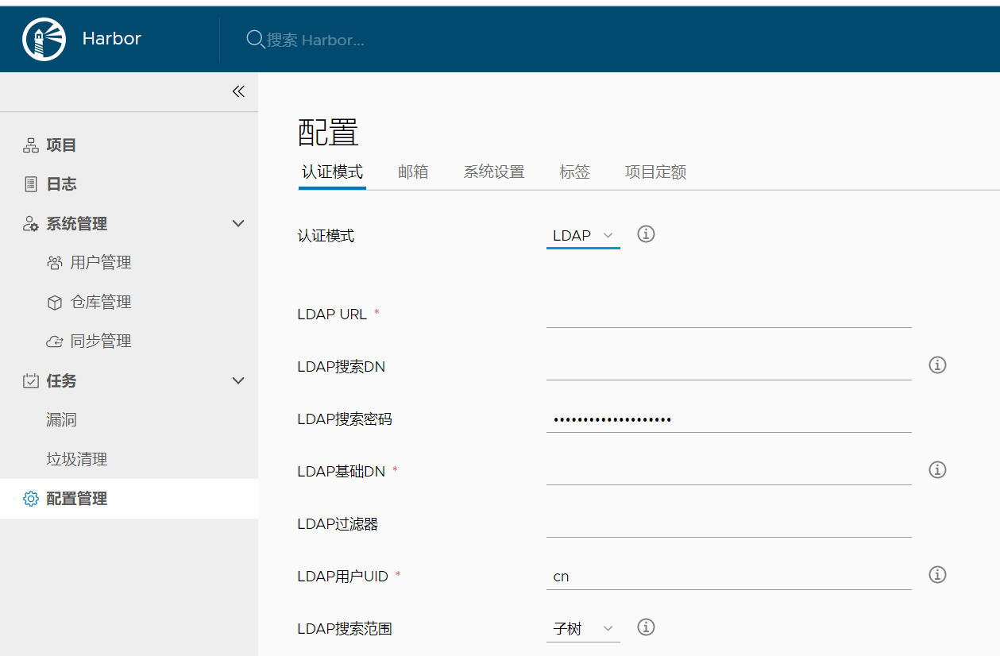

如果修改过下面的默认配置，请在升级后重新填写（如果没设置过则不需要操作）：

  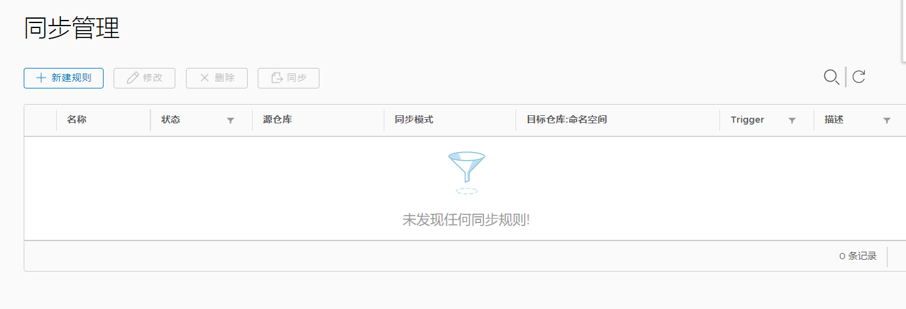

如果设置过邮箱信息，请在升级前手工备份，并在升级后重新填写（如果没设置过则不需要操作）：

  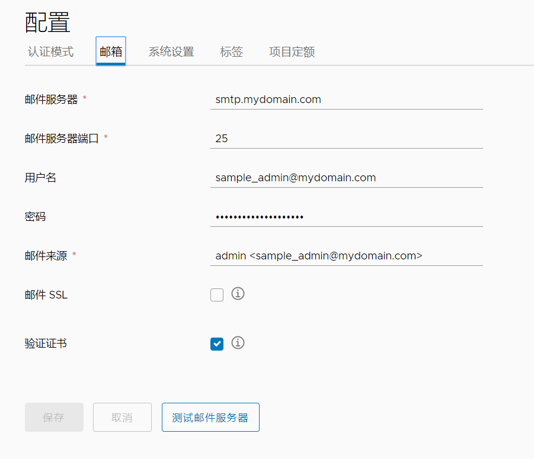

如果修改过下图中的默认配置，请在升级后重新填写（如果没设置过则不需要操作）：

  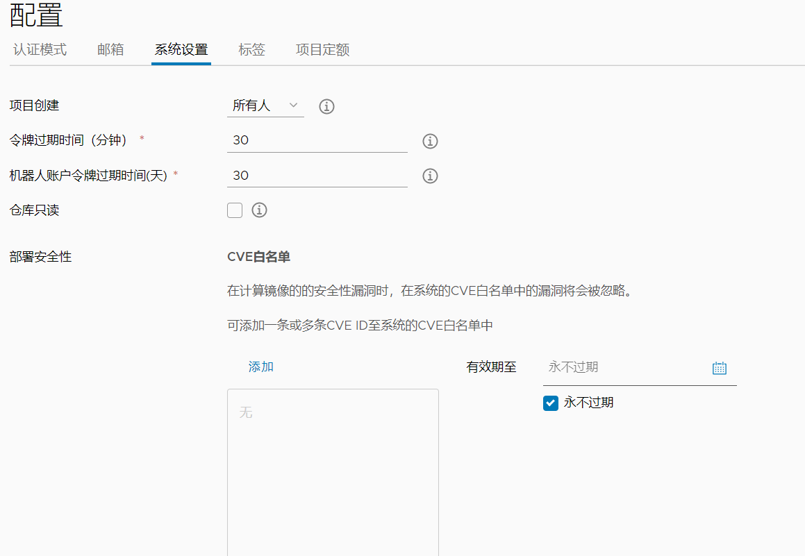

## 使用镜像仓库

**Console 访问**

通过浏览器访问 Harbor 镜像仓库，地址为之前填写的 Harbor 地址，如这里的 [http://192.168.249.253](http://192.168.249.253)

初始账户密码为： `admin/Harbor12345`

  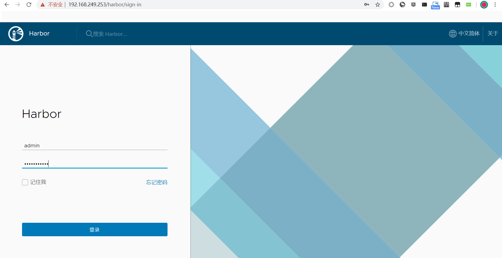

  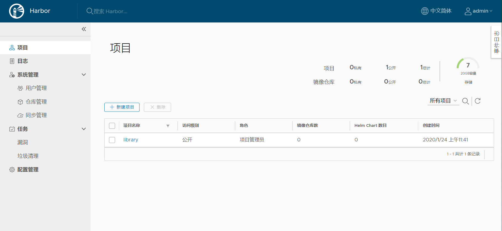
详情请参考 [Harbor 用户手册](https://github.com/goharbor/harbor/blob/master/docs/user_guide.md)，镜像复制功能请参考 [replicating-images](https://github.com/goharbor/harbor/blob/master/docs/user_guide.md#replicating-images)。

**Docker 访问**

* 修改 Docker 的 --insecure-registry 配置，用于支持 Self-signed Certificate 或 HTTP 协议，详见 [Docker 文档](https://docs.docker.com/registry/insecure/)

* 重启 docker service 服务，比如较新版本的 Linux 下执行命令 `systemctl restart docker`。

Login

```
docker login -u [username] -p [password] yourhub.domain.com
```

Push & Pull

```
docker [push|pull] yourhub.domain.com/projectname/reponame:tagname
```

## Garbage Collect 清理 Blob

可通过 Harbor 界面“配置管理”菜单下的“垃圾清理”页进行操作，可选手动执行或者让 Harbor 定时执行。

  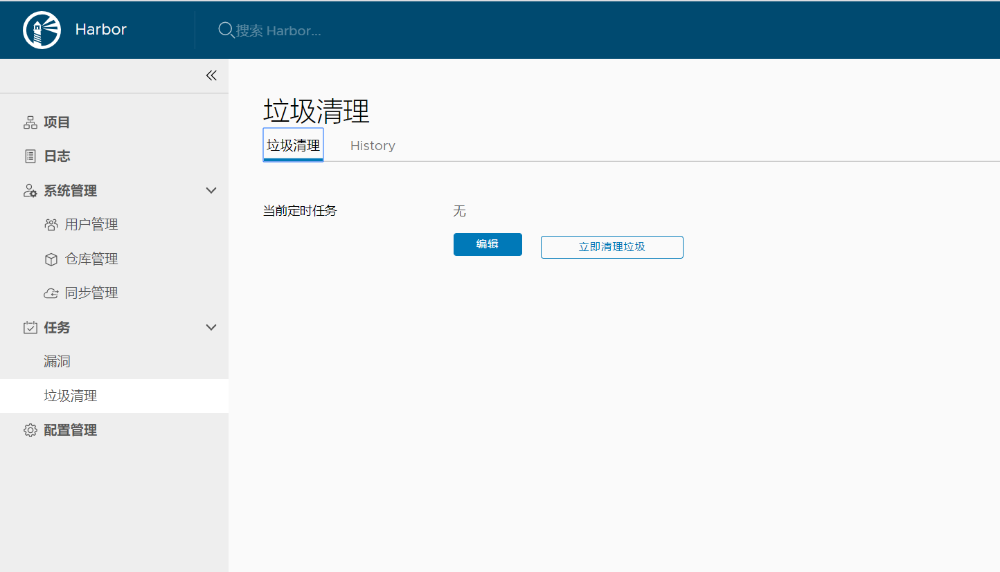

> `Harbor 1.9.3 - QingCloud 1.5.0` 版本需要先在 Harbor 的 web 界面的项目里删除相关资源，再选择界面里的垃圾清理功能。

> `Harbor 1.7.1 - QingCloud 1.2.0` 之前的版本，需要按以下步骤操作。

在清理 Image 之前，需要停止写操作，通过配置参数 ReadOnly 切换成只读模式。

* 设置只读模式，保存更新

  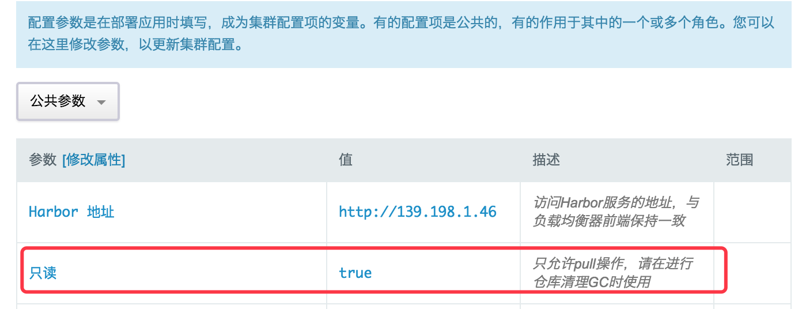

* 在 Console 的管理菜单中选择“清理镜像”

  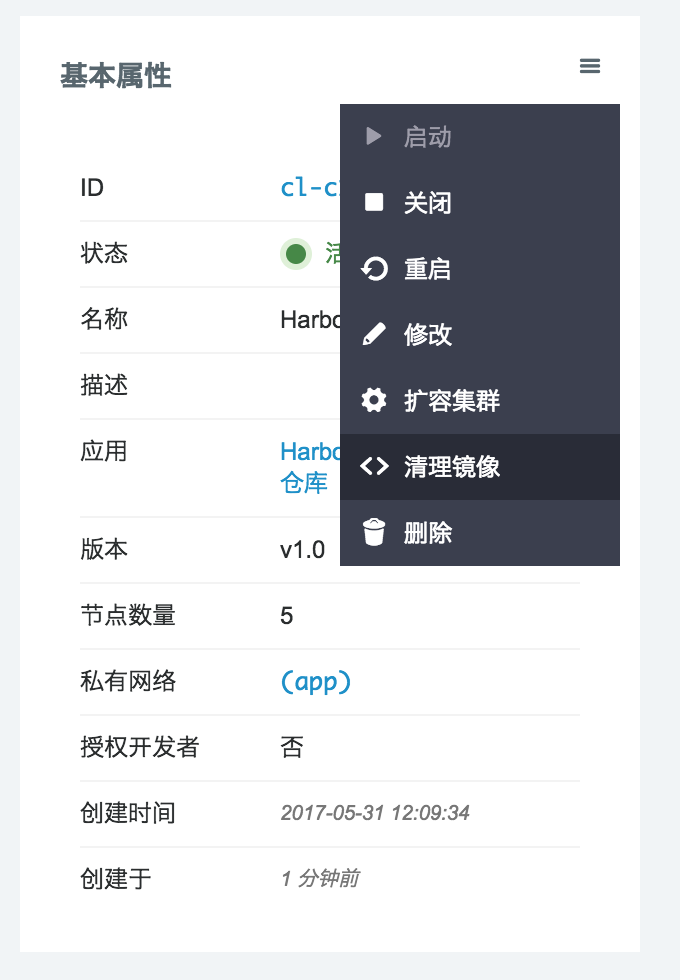

* 去除只读模式，保存更新

## 重置Harbor密码 & 清理任务日志

* 如果管理员丢失了 Harbor 的 admin 账户密码，可以按以下操作恢复成初始账户密码 `admin/Harbor12345`。

  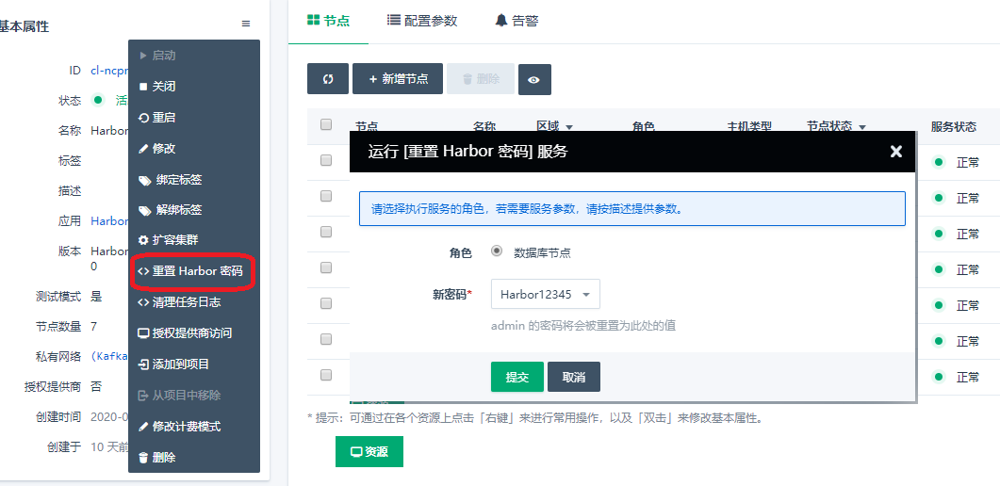

* 任务节点在执行操作后会产生日志，占用日志节点空间，可以使用 `清理任务日志` 功能按条件清理。
  
  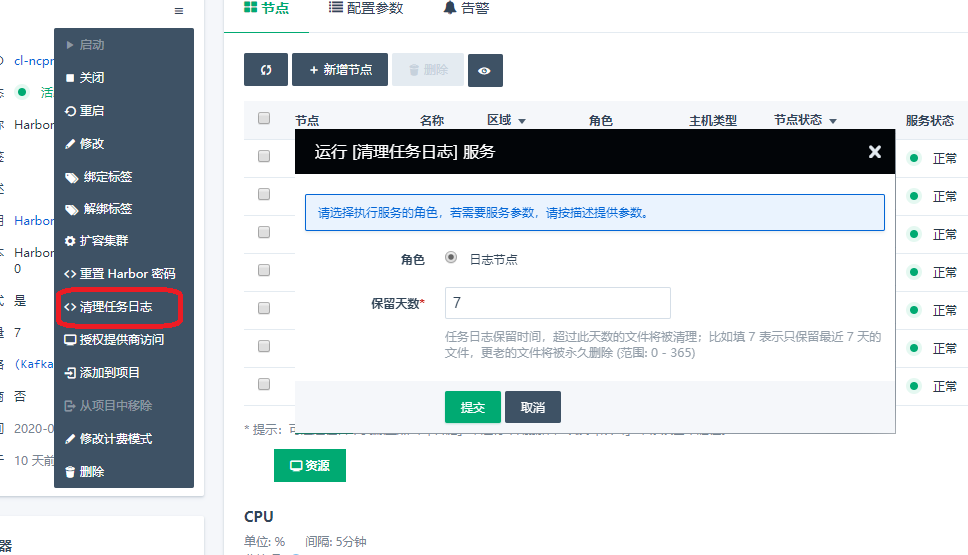


## FAQ

* VNC 登陆账户和密码是多少？

  `ubuntu / p12cHANgepwD`，拥有 sudo 能力。

* 如何查看日志？

  `Harbor 1.7.1 - QingCloud 1.2.0` 之前的版本登陆“日志节点”的 VNC，日志文件在 `/var/log/harbor` 内，以天为单位。
  `Harbor 1.9.3 - QingCloud 1.5.0` 版本在浏览器输入云平台资源管理界面上显示的日志节点 IP 获取(端口80)，如图所示
  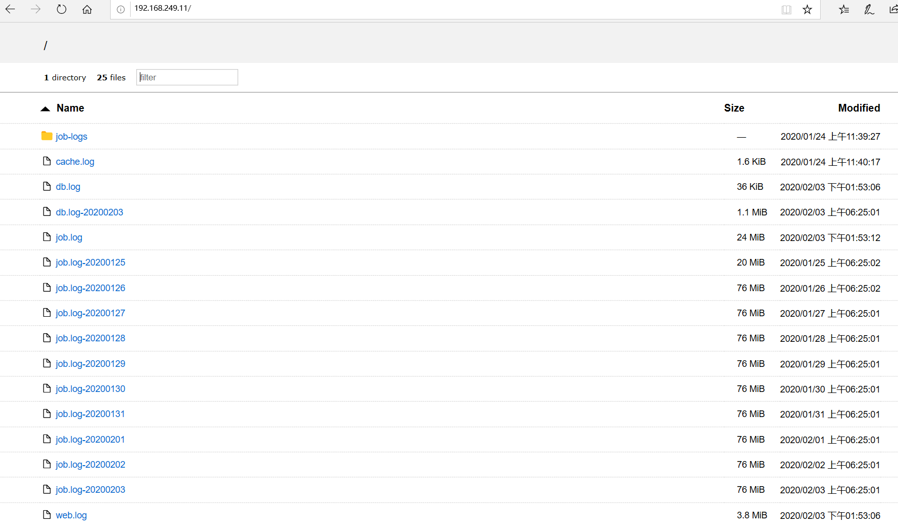
  > 由于资源主机所在网络无法直接与外网连通，所以需要配置 [VPN](https://docs.qingcloud.com/product/network/vpn) 或 配置 [VPC 端口转发](https://docs.qingcloud.com/product/network/appcenter_network_config/config_portmapping)

* 使用 HTTPs 超时了？

  确认前端负载均衡器的 https 监听器中 “负载均衡器监听协议通过 X-Forwarded-Proto 头字段获取负载均衡器的监听协议” 已勾选。

  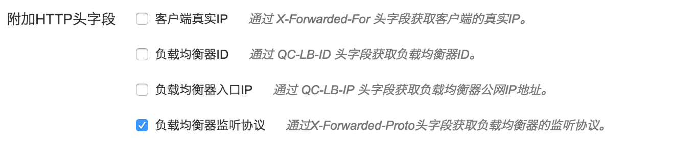

## 版本历史

### Harbor 1.9.3 - QingCloud 1.5.0
* 升级到 Harbor 1.9.3
* 新增镜像安全扫描功能
* 优化日志节点磁盘占用
* 修复镜像复制失败的问题
* 新增支持通过浏览器自助查看日志等文件

### Harbor 1.7.6 - QingCloud 1.3.1
* 升级到 Harbor 1.7.6 版本（修复漏洞 https://nvd.nist.gov/vuln/detail/CVE-2019-16097）
* 新增支持 Helm Chart 仓库
* 修复了镜像复制功能的一个 Bug
* 新增支持对接第三方 S3 对象存储
* 修复了系统配置丢失的问题，升级前请手动备份原有配置，详见用户指南（https://docs.qingcloud.com/product/container/harbor.html#升级集群）

### Harbor 1.7.5 - QingCloud 1.3.0
* 升级到 Harbor 1.7.5 版本
* 新增支持 Helm Chart 仓库
* 新增支持更多兼容的对象存储地址

### Harbor 1.7.4 - QingCloud 1.2.1
* 升级到 Harbor 最新版本 1.7.4；
* 新增支持使用 NeonSAN 作为本地存储的磁盘；
* 修复了 Harbor 日志节点健康检查脚本的 bug ，此 bug 会在 DNS 查询慢的时候导致集群创建失败

### Harbor 1.7.1 - QingCloud 1.2.0
* 升级到 Harbor 最新稳定版 1.7.1 ，包含 Harbor 的多项改进
  - 优化页面加载速度
  - 在线垃圾回收
  - 开启日志轮转防止容量耗尽
* 修复了系统配置丢失的问题，升级前请手动备份原有配置，详见用户指南。

### Harbor 1.1.1 - QingCloud 1.1.0
* 新增了对本地存储的支持，没有购买 QingStor 对象存储的用户可以使用此版本部署 Harbor
* 修复了 bug ：镜像复制节点没有加载自定义的对象存储地址

### Harbor 1.1.1 - QingCloud 1.0.4
* 支持选择对象存储地址

### Harbor 1.1.1 - QingCloud 1.0.3
* 更新内部证书

### Harbor 1.1.1 - QingCloud 1.0.2
* 优化 Cache 连接时间
* 增强启动检测机制
* 修复 Pull 的稳定性

### Harbor 1.1.1 - QingCloud 1.0.1
* 修复 HTTPs 监听器 Push 异常

### Harbor 1.1.1 - QingCloud 1.0
* 基于VMware Harbor v1.1.1版本
* 镜像存储集成 QingStor 对象存储服务
* 支持应用节点横向和纵向扩容
* 一键式安装
* 一键清理镜像
* 支持只读模式