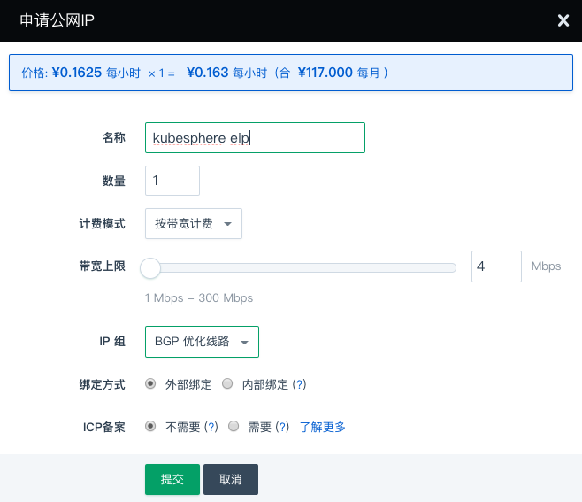
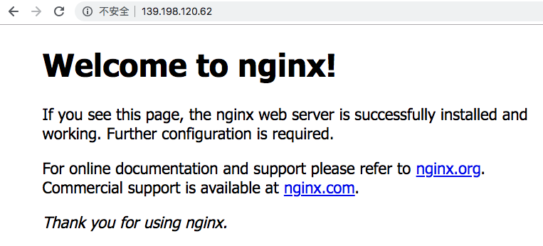
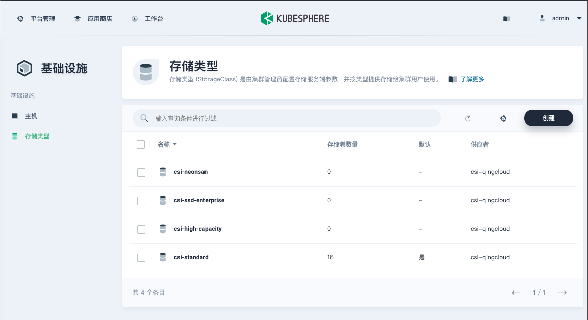

---
---

# KubeSphere®️（QKE） 用户指南

## <a name="intro"></a>简介

[Kubernetes (K8s)](https://kubernetes.io/) 是目前主流的开源容器调度平台，具有自动部署、自动伸缩、应用管理等功能。

[KubeSphere](https://kubesphere.io/) 是在 Kubernetes 之上构建的企业级分布式多租户容器管理平台，帮助企业轻松应对多租户、工作负载和集群管理、服务与网络管理、应用管理、镜像仓库管理和存储管理等业务场景，是 CNCF 会员，已通过 Kubernetes 一致性验证。

QingCloud Kubernetes Engine (QKE) 服务集成了云平台的主机、存储、网络等资源，可以在青云平台一键部署高可用的 KubeSphere 集群，支持集群自动巡检和修复，支持一键升级到新版本，工单 24 小时随时响应，并由 KubeSphere 核心团队提供专业支持和服务：

- 集成 [Calico](https://www.projectcalico.org/)、[Flannel](https://github.com/coreos/flannel) 网络插件供用户选择使用
- 集成 ipvs、iptables 代理模式供用户选择使用
- 集成 [qingcloud-csi](https://github.com/yunify/qingcloud-csi) 存储插件，可以自动创建存储资源，支持基础型、企业型、容量型、企业分布式 NeonSAN 等云平台硬盘，支持硬盘自动扩容和自动迁移
- 集成 [qingcloud-cloud-controller-manager](https://github.com/yunify/qingcloud-cloud-controller-manager) 云平台管理插件，可以自动创建负载均衡器、公网 IP，一键直达公网访问
- 支持一键增删工作节点
- `自 QKE 2.0.0 起` 支持一键部署 GPU 节点
- 可插拔 [OpenPitrix 应用商店](https://kubesphere.com.cn/docs/zh-CN/installation/install-openpitrix/)（需通过 [集群参数](#install-modules) 开启），提供应用商店与应用的生命周期管理，支持通过 3 种方式一键部署应用
- 可插拔 [DevOps 系统](https://kubesphere.com.cn/docs/zh-CN/installation/install-devops/)（需通过 [集群参数](#install-modules) 开启），支持 Binary-to-Image（B2I）、Source-to-Image（S2I）快速制作镜像，提供代码依赖缓存支持，以及代码质量管理与流水线日志等功能
- 可插拔 [日志系统](https://kubesphere.com.cn/docs/zh-CN/installation/install-logging/)（需通过 [集群参数](#install-modules) 开启），提供了强大且易用的日志查询、接收与管理功能，支持基于多租户的日志查询
- 可插拔 [微服务治理](https://kubesphere.com.cn/docs/zh-CN/installation/install-servicemesh/)（需通过 [集群参数](#install-modules) 开启），无代码侵入实现熔断、蓝绿发布、流量管控、链路追踪等完善的微服务治理功能
- 可插拔 [通知告警系统](https://kubesphere.com.cn/docs/zh-CN/installation/install-alert-notification/)（需通过 [集群参数](#install-modules) 开启），支持灵活的告警策略和告警规则，支持邮件通知，及时处理潜在问题
- 可插拔 [Metrics Server](https://kubesphere.com.cn/docs/zh-CN/installation/install-metrics-server/)（需通过 [集群参数](#install-modules) 开启），支持对 Deployment 设置 [弹性伸缩 (HPA)](https://kubernetes.io/docs/tasks/run-application/horizontal-pod-autoscale-walkthrough/)，支持根据集群的监控指标如 CPU 使用率和内存使用量来设置弹性伸缩
- 支持集群节点[自动弹性伸缩](https://docs.qingcloud.com/product/operation/autoscaling.html#id2)，根据资源指标数据的变化，自动完成节点的增减
- 支持多集群聚合[统一监控面板](https://docs.qingcloud.com/product/operation/dashboard)

组件版本对应关系如下：

| QKE | KubeSphere | Kubernetes | Docker CE | OS
| --- | --- | --- | --- | ---
| 2.0.0 | 2.1.1 | 1.16.7 | 19.03.4 | Ubuntu 18.04.3 LTS
| 1.0.1 | 2.0.2 | 1.13.5 | 18.06.2 | Ubuntu 18.04.2 LTS
| 1.0.0 | 2.0.1 | 1.13.5 | 18.06.2 | Ubuntu 16.04.6 LTS

## <a name="create-qke"></a>创建 QKE

在青云上，您可以很方便的创建和管理一个 QKE 集群。支持横向在线伸缩，同时具有自我诊断功能，即当系统发现某节点坏死时在控制台显示状态。 另外我们还提供了监控告警等功能来帮助您更好的管理集群。集群将运行于私有网络内，结合青云提供的硬盘，在保障高性能的同时兼顾您的数据安全。

### <a name="prepare"></a>准备工作

#### <a name="prepare-network"></a>网络

为了保障数据安全， QKE 集群需要运行在受管私有网络中。若还未创建 VPC 和私有网络，可根据页面提示创建一个，也可以参考 [创建 VPC](https://docs.qingcloud.com/product/network/vpc#%E5%88%9B%E5%BB%BA) 和 [创建私有网络](https://docs.qingcloud.com/product/network/appcenter_network_config/create_vxnet#2%E5%88%9B%E5%BB%BA%E7%A7%81%E6%9C%89%E7%BD%91%E7%BB%9C) 提前创建好。


> 注意：受管私有网络需要加入 VPC，并开启 DHCP 服务（默认开启）。如果 VPC 选择的网段是 `172.30.0.0/16`，那需要修改 docker 默认网段，避免冲突。 

  

  

#### <a name="create-access-key"></a>API 密钥

存储、网络等插件通过 API 密钥与云平台交互并创建资源，需要通过 [API 密钥管理页面](https://console.qingcloud.com/access_keys/) 预先创建好。


#### <a name="prepare-volumes"></a>硬盘

请确保至少 230GB、14 块硬盘配额。硬盘的默认类型与 QKE 集群主机类型一致。如果配额不足请通过工单申请。

#### <a name="prepare-lb"></a>负载均衡器和防火墙

当要创建高可用的集群（三个主节点）时，需要 1 个负载均衡器配额，1 个防火墙配额。

当要通过 EIP 暴露 KubeSphere Console 时，需要 1 个额外的负载均衡器配额，1 个额外的防火墙配额。

如果配额不足请通过工单申请。

### <a name="basic-config"></a>选择基本配置

在创建的对话框中，您需要填写名称 (可选)，选择 QKE 版本号以及选择计费方式。 


#### <a name="express-config"></a>快速配置

系统默认提供了以下快速配置组：

- 基础型开发测试环境为全部节点选择了基础型主机及相应存储，工作节点标记为 worker=node_perf。
- 企业型开发测试环境为全部节点选择了企业型主机及相应存储，工作节点标记为 worker=node_super_perf。
- 基础型生产环境为全部节点选择了基础型主机及相应存储，工作节点标记为 worker=node_perf。
- 企业型生产环境为全部节点选择了企业型主机及相应存储，工作节点标记为 worker=node_super_perf。

可以通过选择上面的快速配置组快速创建集群，也可根据自身需求选择自定义方式配置节点。如果选择自定义方式，需要注意至少要创建 2 个与主节点主机类型一致的工作节点（都是基础型或都是企业型），其他主机类型的节点可按需创建。


> 对于有多种工作节点的集群，部署有挂盘的工作负载时要选择正确的存储类型，请参考 [主机类型与存储类型](#instance-storage-class)。

#### <a name="network-config"></a>网络设置

选择集群主机所在的私网，私网需要在创建集群前准备好。  


#### <a name="dependencies"></a>依赖服务设置


##### <a name="etcd-service"></a>etcd 服务

k8s 集群使用 etcd 作为后端存储，建议使用青云提供的 [etcd 服务](https://appcenter.qingcloud.com/apps/app-fdyvu2wk) 单独部署和管理，以获得更好的可用性和容错性。

> etcd 集群和 QKE 集群需部署在同一 VPC 下。

> 更多详情可参考 k8s 官方文档 [Options for Highly Available topology](https://kubernetes.io/docs/setup/production-environment/tools/kubeadm/ha-topology)。

如果创建 QKE 集群时没有选择独立的 etcd 服务，系统将使用内置在主节点的 etcd。

> 注意：内置 etcd 会占用 QKE 主节点的资源并无法增删节点，生产环境建议独立部署 [etcd 服务](https://appcenter.qingcloud.com/apps/app-fdyvu2wk)。

##### <a name="elk-service"></a>ELK 服务

QKE 集群的日志组件使用 [Elasticsearch](https://github.com/elastic/elasticsearch) 作为后端存储，建议使用青云提供的 [ELK 服务](https://appcenter.qingcloud.com/apps/app-p6au3oyq/ELK) 单独部署和管理，以获得更好的可用性和可维护性。

> ELK 集群和 QKE 集群需部署在同一 VPC 下。

如果创建 QKE 集群时没有选择独立的 ELK 服务，系统将使用内置的 Elasticsearch。

> 注意：内置 Elasticsearch 会占用 k8s 集群的资源并依赖 k8s 进行管理，在 k8s 集群发生故障期间 Elasticsearch 可能无法正常工作。生产环境建议独立部署 [ELK 服务](https://appcenter.qingcloud.com/apps/app-p6au3oyq/ELK) 。

#### <a name="cluster-env"></a>服务环境参数设置

| 参数 | 描述
| -- | --
| API 密钥 | QingCloud IaaS API 密钥 (https://console.qingcloud.com/access_keys/)，此密钥将被用来创建云平台的资源，比如负载均衡器、PV 挂盘等
| 安装 KubeSphere | 选择是否安装 KubeSphere，默认为 true 表示安装 KubeSphere 以及监控组件
| KubeSphere 控制台 EIP | 如果希望通过公网 LoadBalancer 方式访问 KubeSphere 控制台，可在此选择可用的 EIP，将为此 EIP 自动创建一个负载均衡器并绑定；如果没安装 KubeSphere，无需设置此参数
| 选装组件 | 选装希望安装的组件，注意：此选项只有在选项 [安装 KubeSphere] 为 true 时才会生效，而且此选项只负责安装组件，清空此选项并不会执行卸载操作，如需卸载请手动操作；安装这些组件可能需要较长时间，请耐心等待
| Kubernetes EIP 地址 | Kubernetes 的外网访问地址，请按照 IPv4 格式填写。例如：139.198.123.23；注意：修改此项会重启所有主节点的 kube-apiserver 从而导致 kube-apiserver 服务短暂中断，建议在业务低谷时间操作
| 主机 hosts 记录 | 自定义添加到 /etc/hosts 文件的记录，比如 '192.168.2.2 host1,192.168.2.3 host2'，多条记录用逗号分割
registry-mirrors | 完整的 Docker 镜像服务地址，比如 `https://mirror.harbor.local`；多个地址之间用空格隔开
| insecure-registries | 需要通过非安全的 HTTP 或不受信任的 HTTPS 访问的 Docker 仓库，比如 mirror.harbor.local，多个地址通过空格切分
| Docker 网桥地址 | Docker 网桥的 IP 地址和子网掩码，请按照标准的 CIDR 格式填写。默认为 172.30.0.1/16；注意：修改此项需要通过集群菜单依次重启所有 k8s 节点（包括主节点、基础型节点、企业型节点和 GPU 节点），请在业务低谷时操作
| Docker 清理天数 | 每天凌晨 2 点 35 分自动清理指定天数之前创建的 Docker 容器、镜像、网络等闲置资源，默认为 3 表示只清理创建时间超过 3 天（72 小时）的闲置资源；0 表示不自动清理 (范围: 0 - 30)
| Pod 网段 | Pod 网段，请按照标准的 CIDR 格式填写。例如：10.10.0.0/16
| Service 网段 | Service 网段，请按照标准的 CIDR 格式填写。例如：10.96.0.0/16
| 集群内 DNS 域名 | 集群内的 DNS 域名，用于 Kubernetes Services
| NodePort 范围 | 每个节点可分配的 NodePort 范围，例如 ‘30000-32767’。
| 最大 pod 数量 | 每个节点上可运行的最大 pod 数量，默认为 120
| 网卡插件 | 选择网卡插件（calico 或 flannel）
| Proxy Mode | 选择一种 Proxy Mode（ipvs 或 iptables）
| Kubernetes 日志级别 | Kubernetes 的日志级别，数字越大记录越详细，也会占用更多日志空间。遇到问题可以调整日志级别进行 debug；注意：修改此项会重启所有 k8s 组件（kube-apiserver、kube-controller-manager、kube-scheduler、kube-proxy）从而导致服务短暂中断，建议在业务低谷时间操作 (范围: 0 - 10)
| 日志保留天数 | KubeSphere 使用 ElasticSearch 存储日志，可通过配置此参数自动清理指定天数之前的日志，0 表示不自动清理 (范围: 0 - 30)
| audit-policy-file | 设置审计规则文件路径，路径为空或文件不存在则不记录审计日志；可通过客户端节点登录到所有主节点并把规则文件放到 /etc/kubernetes/audit/policies/ 目录下；系统已内置默认审计规则文件 /etc/kubernetes/audit/policies/default.yaml；注意：修改此项会重启所有主节点的 kube-apiserver 从而导致 kube-apiserver 服务短暂中断，建议在业务低谷时间操作
| audit-log-maxage | 自动清理指定天数之前产生的审计日志文件，默认为 7 表示自动清理创建时间超过 7 天的审计日志文件；注意：在开启审计日志的情况下修改此项会重启所有主节点的 kube-apiserver 从而导致 kube-apiserver 服务短暂中断，建议在业务低谷时间操作 (范围: 0 - 30)
| audit-log-maxsize | 自动轮转达到指定文件大小的审计日志文件，以 MB 为单位，默认为 1 表示当审计日志文件达到 1 MB 以后触发自动轮转；注意：在开启审计日志的情况下修改此项会重启所有主节点的 kube-apiserver 从而导致 kube-apiserver 服务短暂中断，建议在业务低谷时间操作 (范围: 1 - 200)
| audit-log-maxbackup | 最多保留指定数量的审计日志文件，默认为 100 表示最多保留最近的 100 个审计日志文件；注意：在开启审计日志的情况下修改此项会重启所有主节点的 kube-apiserver 从而导致 kube-apiserver 服务短暂中断，建议在业务低谷时间操作 (范围: 1 - 100)
| 用户 SSH 公钥 | 在此填入 SSH 公钥来通过 SSH 连接到集群节点

#### <a name="install-modules"></a>开启选装组件
QKE 默认仅最小化安装 KubeSphere，可通过“选装组件”参数开启其他组件，各组件的功能说明可参考 [KubeSphere 官方文档](https://kubesphere.com.cn/docs/zh-CN/installation/pluggable-components/)。


### <a name="created"></a>创建成功

当 QKE 创建完成之后，您可以查看每个节点的运行状态。当节点的服务状态显示为“正常”状态，表示该节点启动正常。 当每个节点都启动正常后 QKE 集群显示为“活跃”状态，表示您已经可以正常使用 QKE 服务了。

## <a name="test-qke"></a>测试 QKE

### <a name="client-node"></a>使用客户端节点

QKE 集群创建完成之后可以进行测试，创建集群一般在 6〜12 分左右（视选装的组件而定）。找到客户端节点，点击 vnc 图标。

使用 `root / k8s` 登录。首次登录需要修改密码。登录客户端节点后可以通过 ssh 免密登录其他节点。 
	
  

执行  

```shell
kubectl get pods --all-namespaces
```

程序返回所有 pod 状态，整个集群工作正常。

### <a name="use-qke"></a>使用 QKE

集群创建完成后，确认 KubeSphere 的后端都已正常运行。
```shell
# kubectl get po -n kubesphere-system
NAME                                     READY   STATUS      RESTARTS   AGE
ks-account-c6dbfbdbb-7l8td               1/1     Running     2          43m
ks-apigateway-7bb9bccc6d-ghpkp           1/1     Running     0          43m
ks-apiserver-769d57ddbc-mj79h            1/1     Running     0          41m
ks-console-f5bf76dd4-qqmkh               1/1     Running     0          42m
ks-console-f5bf76dd4-xfrj6               1/1     Running     0          42m
ks-controller-manager-6fb548b8dc-qqcd8   1/1     Running     0          43m
ks-docs-77c4796dc9-sjsdh                 1/1     Running     0          42m
kubesphere-installer-79k96               0/1     Completed   0          44m
openldap-84857748b4-4pv89                1/1     Running     0          43m
redis-78ff75bddc-rcrtp                   1/1     Running     0          43m
```

#### <a name="visit-k8s-eip"></a>通过 EIP 访问 Kubernetes 资源

通过 EIP 访问 Kubernetes 资源需要 Kubernetes Apiserver 证书添加 EIP 记录，并且确保 EIP 能够访问到 Kubernetes Apiserver。用户需要 1. 在 QKE 配置 Kubernetes EIP 地址，2. 确保 EIP 与 Kubernetes Apiserver 相连通，3. 修改 kubeconfig 中 server 字段的值。

> 此示例中，VPC 绑定的 EIP 为 139.198.190.141

##### <a name="k8s-eip-config"></a>1. 在 QKE 配置 Kubernetes EIP 地址

QKE 的 Kubernetes EIP 地址可以在 QKE 创建时指定，也可以在 QKE 运行时更新。运行时修改 QKE 的 Kubernetes EIP 地址会造成 Kubernetes Apiserver 重启，不建议频繁更新。


##### <a name="k8s-eip-connection"></a>2. 确保 EIP 与 Kubernetes Apiserver 相连通

提供通过 VPC 端口转发和通过负载均衡器 2 种示例方法，确保 EIP 与 Kubernetes Apiserver 6443 端口相连通。

##### <a name="k8s-eip-port-forward"></a>2.1. 通过 VPC 端口转发

对于 QKE 所在 VPC 绑定了 EIP 可以采用此方法。

找到访问 Kubernetes Apiserver 的私有网络 IP 地址。对于一个主节点的 QKE，到 QKE 详情页查询 QKE 主节点私有网络 IP 地址。


对于高可用的 QKE，访问 Kubernetes Apiserver 的私有网络 IP 地址应为 QKE 创建时创建的私有网络负载均衡器的 IP，负载均衡器名为 QKE 集群 ID。


VPC 配置转发规则，源端口可以根据用户实际情况配置，内网 IP 为访问 Kubernetes Apiserver 的私有网络 IP 地址，内网端口为 6443，
> 此示例中 VPC 端口转发源端口为 16443

  

打开 VPC 网络绑定的防火墙下行端口，


##### <a name="k8s-eip-lb"></a>2.2. 通过负载均衡器

对于通过负载均衡器访问到 QKE Kubernetes Apiserver 的集群可以采用此方法。
将外部绑定类型 EIP 绑定至负载均衡器。


##### <a name="kubeconfig"></a>3. 修改 kubeconfig 中 server 字段的值

> 请确保用户本地主机主机可访问 EIP。

首先在 Kubeconfig 标签页将 QKE 的 Kubernetes Kubeconfig 拷贝到用户本地主机，然后修改 Kubeconfig 文件中的 server 字段。


##### <a name="kubeconfig-port-forward"></a>3.1. 通过 VPC 端口转发

通过 VPC 端口转发，server 的值应设置为 `https://VPC绑定EIP: VPC端口转发源端口`。示例为 `https://139.198.190.141:16443`。

```shell
$ cat admin.conf
apiVersion: v1
clusters:
- cluster:
    certificate-authority-data: ...
    server: https://139.198.190.141:16443
  name: kubernetes
contexts:
- context:
    cluster: kubernetes
    user: kubernetes-admin
  name: kubernetes-admin@kubernetes
current-context: kubernetes-admin@kubernetes
kind: Config
preferences: {}
users:
- name: kubernetes-admin
  user:
    client-certificate-data: ...
$ kubectl get no --kubeconfig admin.conf 
NAME         STATUS    ROLES             AGE       VERSION
i-2h8z0yah   Ready     master            1h        v1.16.7
i-fkrjiogt   Ready     master            1h        v1.16.7
i-hxvba1qe   Ready     worker            1h        v1.16.7
i-jnvuwr6t   Ready     master            1h        v1.16.7
i-ktdt8pwe   Ready     worker            1h        v1.16.7
i-z8rbb2qt   Ready     worker            1h        v1.16.7
```

##### <a name="kubeconfig-lb"></a>3.2. 通过负载均衡器

通过负载均衡器, server 的值应设置为 `https://负载均衡器绑定EIP: 6443`。示例为 `https://139.198.186.186:6443`。

```shell
$ cat admin.conf
apiVersion: v1
clusters:
- cluster:
    certificate-authority-data: ...
    server: https://139.198.186.186:6443
  name: kubernetes
contexts:
- context:
    cluster: kubernetes
    user: kubernetes-admin
  name: kubernetes-admin@kubernetes
current-context: kubernetes-admin@kubernetes
kind: Config
preferences: {}
users:
- name: kubernetes-admin
  user:
    client-certificate-data: ...
$ kubectl get no --kubeconfig admin.conf 
NAME         STATUS    ROLES             AGE       VERSION
i-2h8z0yah   Ready     master            2h        v1.16.7
i-fkrjiogt   Ready     master            2h        v1.16.7
i-hxvba1qe   Ready     worker            2h        v1.16.7
i-jnvuwr6t   Ready     master            2h        v1.16.7
i-ktdt8pwe   Ready     worker            2h        v1.16.7
i-z8rbb2qt   Ready     worker            2h        v1.16.7
```

#### <a name="visit-ks-console"></a>访问 KubeSphere 控制台

> 首次登录 KubeSphere 请使用如下默认管理员账户信息, 登录后务必及时修改密码！
>
> | 用户名 | 密码 |
> | -- | --
> |admin@kubesphere.io | P@88w0rd

##### <a name="visit-ks-without-eip"></a>没有设置 “KubeSphere 控制台 EIP” 参数的 QKE 集群

KubeSphere Dashboard 以 NodePort 的形式暴露在端口 30880，您可以在 VPC 上设置端口转发到任一集群节点 (非Client节点) 的此端口来访问 KubeSphere Dashboard。还需要配置的如下图所示。

> 此示例中，端口是30880，在实际使用中，您需要根据 `kubectl get svc -n kubesphere-system ks-console` 命令返回结果来查看具体端口号。


> 如果 VPC 绑定了公网 IP，用户通过公网 IP 访问 KubeSphere Dashboard 还需要配置 VPC 所绑定的防火墙的下行规则，放行通过公网 IP 对 30880 端口的访问。
>
> 

配置规则保存后，您就可以使用 VPC 的公网 IP 地址来访问 KubeSphere 了，如下图


##### <a name="visit-ks-with-eip"></a>设置了 "KubeSphere 控制台 EIP" 参数的 QKE 集群

可在 QingCloud 控制台 QKE 集群详情页的 "KubeSphere 控制台链接" 标签页找到 KubeSphere 控制台访问链接。


可直接单击链接访问 KubeSphere 控制台

## <a name="horizontal-scale"></a>在线伸缩

### <a name="add-node"></a>手工增加节点

当 QKE 需增加节点以应付应用逐步增多带来的压力，您可以在 QKE 详情页点击“新增节点”按钮，建议新增节点类型与集群主节点类型一致。添加成功详情页会显示服务状态为活跃。

> __注意__：`QKE v1.0.1` 以及更老的版本只支持同一种类型的工作节点，如果之前是性能型节点，那么之后也只能增加性能型节点，如果增加了其他类型的节点，可能会导致需要挂载硬盘的工作负载无法启动。

### <a name="delete-node"></a>手工删除节点

当客户端连接并不多的时候您也可以在 QKE 详情页选中需要删除的节点，然后点“删除”按钮删除节点，以节省资源和费用。此操作要保证 QKE 集群内有足够资源容纳迁移的 Pod。

### <a name="delete-node"></a>自动添加删除节点

使用 Console 控制台运维工具的[自动伸缩](https://docs.qingcloud.com/product/operation/autoscaling)功能，选择指定的 QKE 集群以及节点类型，操作类型选择“调整应用节点梳理”

配置自动伸缩的阈值及相应的伸缩规则：

配置完成后，当阈值被触发后，相应集群会自动进行节点增删操作，通知列表中的用户会收到通知。

## <a name="monitor-plane"></a>多集群监控
使用 Console 控制台运维工具的[监控Dashboard](https://docs.qingcloud.com/product/operation/dashboard)功能，创建监控面板和图表，选择指定的 QKE 集群、节点以及指标，


#### <a name="delete-node-pvc-failed"></a>删除节点后挂载存储卷的容器组迁移失败问题解决办法

使用云平台硬盘作为存储服务的有状态副本集的容器组所在节点被删除后，可能会遇到此有状态副本集的容器组无法在其他节点重新创建的问题。要查看集群内被删除容器组挂载存储卷的 volumeattachment 对象是否正常清理，将此 volumeattachment 对象删除后，重新创建的容器组可以正常挂载存储卷。

- 找到无法重新创建的容器组
```
# kubectl get po -n demo-project nginx-perf-7
NAME           READY   STATUS              RESTARTS   AGE
nginx-perf-7   0/1     ContainerCreating   0          22h
```

- 查看容器组无法重新创建的原因，显示挂载存储卷失败
```
# kubectl describe po -n demo-project nginx-perf-7
...
Events:
  Type     Reason       Age                  From                 Message
  ----     ------       ----                 ----                 -------
  Warning  FailedMount  51s (x604 over 22h)  kubelet, i-e5ri86tg  Unable to mount volumes for pod "nginx-perf-7_demo-project(087b3391-8990-11e9-9b03-525433ce642d)": timeout expired waiting for volumes to attach or mount for pod "demo-project"/"nginx-perf-7". list of unmounted volumes=[nginx-neonsan-pvc]. list of unattached volumes=[nginx-neonsan-pvc default-token-znp5w]
```

- 找到未挂载上的存储卷 `nginx-neonsan-pvc-nginx-perf-7`
```yaml
# kubectl get po -n demo-project nginx-perf-7 -oyaml
...
spec:
    volumes:
      - name: nginx-neonsan-pvc
        persistentVolumeClaim:
            claimName: nginx-neonsan-pvc-nginx-perf-7
...
```

- 找到未挂载上的存储卷对应的 PV `pvc-93e24c1d88d711e9`, 到 QingCloud 控制台查看硬盘名为 `pvc-93e24c1d88d711e9` 的硬盘应为可用状态。
```
# kubectl get pvc nginx-neonsan-pvc-nginx-perf-7 -n demo-project
NAME                             STATUS   VOLUME                 CAPACITY   ACCESS MODES   STORAGECLASS   AGE
nginx-neonsan-pvc-nginx-perf-7   Bound    pvc-93e24c1d88d711e9   100Gi      RWO            neonsan        44h
```

- 找到 PV `pvc-93e24c1d88d711e9` 对应的 volumeattachment 对象名 `csi-8b2ed050e78ad6f3a5491af35c9351358856ae15cc874262ca0b78a1c332b883`
```yaml
# kubectl get volumeattachment -oyaml|grep pvc-93e24c1d88d711e9 -B 16
    apiVersion: storage.k8s.io/v1
    kind: VolumeAttachment
    metadata:
        creationTimestamp: 2019-06-07T03:52:13Z
        deletionGracePeriodSeconds: 0
        deletionTimestamp: 2019-06-09T00:47:49Z
        finalizers:
        - external-attacher/csi-qingcloud
        name: csi-8b2ed050e78ad6f3a5491af35c9351358856ae15cc874262ca0b78a1c332b883
        resourceVersion: "1178846"
        selfLink: /apis/storage.k8s.io/v1/volumeattachments/csi-8b2ed050e78ad6f3a5491af35c9351358856ae15cc874262ca0b78a1c332b883
        uid: a21a70df-88d7-11e9-aed1-525433888127
    spec:
        attacher: csi-qingcloud
        nodeName: i-5n8osu8t
        source:
            persistentVolumeName: pvc-93e24c1d88d711e9
```

- 查看未被正常清理的 volumeattachment 对象, status.detachError 显示 `node "XXX" not found`
```yaml
# kubectl get volumeattachment csi-8b2ed050e78ad6f3a5491af35c9351358856ae15cc874262ca0b78a1c332b883 -oyaml
    apiVersion: storage.k8s.io/v1
    kind: VolumeAttachment
    metadata:
        creationTimestamp: 2019-06-07T03:52:13Z
        deletionGracePeriodSeconds: 0
        deletionTimestamp: 2019-06-09T00:51:53Z
        finalizers:
        - external-attacher/csi-qingcloud
        name: csi-8b2ed050e78ad6f3a5491af35c9351358856ae15cc874262ca0b78a1c332b883
        resourceVersion: "1180401"
        selfLink: /apis/storage.k8s.io/v1/volumeattachments/csi-8b2ed050e78ad6f3a5491af35c9351358856ae15cc874262ca0b78a1c332b883
        uid: a21a70df-88d7-11e9-aed1-525433888127
    spec:
        attacher: csi-qingcloud
        nodeName: i-5n8osu8t
        source:
            persistentVolumeName: pvc-93e24c1d88d711e9
    status:
        attached: true
        detachError:
            message: node "i-5n8osu8t" not found
            time: 2019-06-09T00:52:12Z
```

- 编辑 volumeattachment 对象，删去 `finalizers` 部分
```yaml
# kubectl edit volumeattachment csi-8b2ed050e78ad6f3a5491af35c9351358856ae15cc874262ca0b78a1c332b883 -oyaml
    apiVersion: storage.k8s.io/v1
    kind: VolumeAttachment
    metadata:
        creationTimestamp: 2019-06-07T03:52:13Z
        deletionGracePeriodSeconds: 0
        deletionTimestamp: 2019-06-09T00:51:53Z
        name: csi-8b2ed050e78ad6f3a5491af35c9351358856ae15cc874262ca0b78a1c332b883
        resourceVersion: "1180401"
        selfLink: /apis/storage.k8s.io/v1/volumeattachments/csi-8b2ed050e78ad6f3a5491af35c9351358856ae15cc874262ca0b78a1c332b883
        uid: a21a70df-88d7-11e9-aed1-525433888127
    spec:
        attacher: csi-qingcloud
        nodeName: i-5n8osu8t
        source:
            persistentVolumeName: pvc-93e24c1d88d711e9
...
```

- 观察容器组状态，5 分钟左右可挂载上存储卷，没有其他问题情况下容器组可恢复运行状态
```
# kubectl get po -n demo-project nginx-perf-7
NAME           READY   STATUS    RESTARTS   AGE
nginx-perf-7   1/1     Running   0          23h
```

### <a name="vertical-scale"></a>垂直扩容

如果需要给节点增强配置或降低配置，可以使用扩容集群的功能。 此操作会造成扩容节点暂时不可用，要保证 QKE 集群内有足够资源容纳迁移的 Pod。


可以在接下来的界面中调整不同角色的容量。


### <a name="upgrade"></a>升级

`QKE v2.0.0` 支持原地升级，老版本高可用集群（三个主节点）可以在不中断现有业务的情况下升级到最新版本，单个主节点集群在升级过程中 k8s apiserver 会有短暂中断。

> **注意**：由于升级过程需要消耗较多的磁盘 IO 以及 CPU，**生产环境请在业务低谷期操作，升级过程中请避免部署新工作负载或者变更配置等操作**。

> 升级前请确保所有 k8s 节点（包括主节点和工作节点）的 /data 数据盘至少有 50G 的可用空间。

> 注意：客户端节点所有数据以及 k8s 节点 /data 目录以外的数据会在重启后重置，如果有此类自定义的数据请先备份后再升级

> 请确保客户端节点处于开机运行状态

> 升级一般需要 1〜2 小时，请耐心等待

> 注意：`QKE v1.0.0` 基于 `Ubuntu 16.04` 操作系统，在升级完成后，可能会在 KubeSphere 页面上遇到 CPU 使用率显示不正确的情况，这是由操作系统内核原因造成，需要在升级后根据业务情况关闭集群然后再开启集群来解决（此操作会把操作系统替换成 `Ubuntu 18.04`）。

## <a name="integrate-iaas"></a>与 QingCloud IaaS 的整合

### <a name="integrate-lb"></a>负载均衡器

从 `QKE v1.0.1` 版本起集成了 [QingCloud 负载均衡器插件](https://github.com/yunify/qingcloud-cloud-controller-manager) 支持将 KubeSphere 内部的服务和 QingCloud IaaS 的负载均衡器关联起来，通过负载均衡器将服务暴露给集群外部调用。LB 插件具体用法请参考[文档](https://github.com/yunify/qingcloud-cloud-controller-manager/blob/v1.3.4/docs/configure.md)。根据中国大陆工信部的规定，所有在大陆境内运行的服务都必须进行 ICP 备案。只要在互联网能访问并且使用大陆公网 IP 地址的域名都需要备案。

Service 的 type 设置为 LoadBalancer，然后在 metadata 中增加以下 annotations:

- `service.beta.kubernetes.io/qingcloud-load-balancer-type`
  
> 负载均衡器的承载能力类型，与 [create_loadbalancer](https://docs.qingcloud.com/product/api/action/lb/create_loadbalancer.html) 接口中的 loadbalancer_type 取值范围相同。
  
- `service.beta.kubernetes.io/qingcloud-load-balancer-eip-ids`
  
  > 负载均衡器上绑定的 EIP ID，最多支持4个，这个 annotation 表示要创建的是 “公网” 类型的负载均衡器。 EIP 必须是可用的 EIP，系统会自动创建负载均衡器。

整体如下面的例子：

#### <a name="integrate-lb-eip"></a>1. QingCloud 控制台创建公网 IP。



#### <a name="integrate-lb-eip-id"></a>2. 得到公网 IP 的 ID。


#### <a name="integrate-lb-ks-service"></a>3. 在 KubeSphere Dashboard 创建 LoadBalancer 类型服务。


#### <a name="integrate-lb-visit"></a>4. 通过公网 IP 访问到集群内部服务。



### <a name="integrate-storage"></a>存储

从 `QKE v1.0.1` 版本起内置了 [QingCloud CSI](https://github.com/yunify/qingcloud-csi)，可以动态创建基于 QingCloud IaaS 上的硬盘的 PVC，并挂载到 Pod，当 Pod 迁移时，硬盘会自动随着 Pod 迁移到其他主机上。KubeSphere 的存储卷使用方法见[文档](https://docs.kubesphere.io/advanced-v1.0/zh-CN/storage/pvc/)。

#### <a name="integrate-neonsan"></a>使用 NeonSAN 硬盘

QKE 在支持 NeonSAN 硬盘的区创建了 neonsan 存储类型，用户可以在 KubeSphere 控制台创建 NeonSAN 存储卷。

##### <a name="integrate-neonsan-pvc"></a>创建存储卷时"存储卷设置"处的存储类型选择 "neonsan" 存储类型


##### <a name="integrate-neonsan-workload"></a>创建工作负载挂载 NeonSAN 存储卷


#### <a name="integrate-nfs"></a>对接 NFS 服务端

QKE 预安装了 NFS 客户端程序，用户对接 NFS 服务端时应确保 QKE 各节点有权限挂载 NFS 服务端文件夹。用户可以使用 [Kubernetes 官方方法对接 NFS 服务端](https://kubernetes.io/docs/concepts/storage/volumes/#nfs)，这是一种静态分配存储卷方法，分配和回收存储卷过程复杂，可对接多个 NFS 服务端。为了方便用户对接 NFS 服务端，QKE 预置了 [NFS 动态分配器](https://github.com/helm/charts/tree/master/stable/nfs-client-provisioner)，支持动态分配存储卷，分配和回收存储卷过程简便，可对接一个 NFS 服务端。

示例 NFS 服务端 IP 为 192.168.0.4，NFS 共享文件夹为 /data

##### <a name="integrate-nfs-install"></a>在 QKE client 节点，执行 Helm 安装命令

```shell
$ helm install --name ks stable/nfs-client-provisioner --set nfs.server=192.168.0.4 --set nfs.path=/data --set image.repository=kubesphere/nfs-client-provisioner --namespace=kube-system
NAME:   ks
LAST DEPLOYED: Tue May 14 20:20:44 2020
NAMESPACE: kube-system
STATUS: DEPLOYED
```

> `QKE v1.0.1` 及更早版本请执行下面的命令：
> ```shell
> $ helm install --name ks /opt/kubernetes/k8s/addons/nfs-client-provisioner/ --set nfs.server=192.168.0.4 --set nfs.path=/data --namespace kube-system
> ```

##### <a name="integrate-nfs-status"></a>查看 NFS 动态分配器容器组在正常运行状态

```shell
$ kubectl get po -n kube-system |grep nfs-client
ks-nfs-client-provisioner-cc7f5db98-c4b2m   1/1     Running   0          6s
```
##### <a name="integrate-nfs-storage-class"></a>查看 NFS 存储类型

```
$ kubectl get sc nfs-client
NAME         PROVISIONER                               AGE
nfs-client   cluster.local/ks-nfs-client-provisioner   26m
```

##### <a name="integrate-nfs-verify"></a>验证
可以通过动态创建 NFS 存储卷和工作负载挂载 NFS 存储卷验证

## <a name="delete-qke"></a>删除 QKE

用户删除集群可以在 APPCenter 集群列表页选中待删除集群，在更多操作中选择删除，可删除 QKE 集群。集群删除后会进入回收站，用户可以到回收站恢复或永久删除集群，回收站中资源保存 2 小时之后会自动永久删除。集群永久删除后用户可手动删除 QKE 集群残留资源，如硬盘、负载均衡器、防火墙。

## <a name="contract-billing"></a>关于合约价格的说明

QKE 页面上的费用预览计费仅包括集群基础资源费用。QKE 创建时会自动创建的硬盘、负载均衡器，QKE 创建时快速创建的依赖服务、公网 IP 资源费用将会另外计算。使用 QKE 时用户创建的硬盘、负载均衡器、防火墙也将另外计算。

### <a name="additional-billing"></a>QKE 创建时另外计费资源

|资源|个数|说明|
|:--:|:--:|:--:|
|硬盘|14|安装 KubeSphere 会自动创建硬盘|
|负载均衡器|2|高可用集群会自动创建 1 个负载均衡器，KubeSphere 控制台通过公网 IP 暴露会自动创建 1 个负载均衡器|
|防火墙|2|高可用集群会自动创建 1 个防火墙，KubeSphere 控制台通过公网 IP 暴露会自动创建 1 个防火墙|
|依赖服务|2|快速创建外接 etcd 会创建 1 个 etcd 集群，快速创建外接 ELK 会创建 1 个 ELK 集群|


## <a name="faq"></a>FAQ 及注意事项

### <a name="faq-vpc"></a>VPC 网段
如果 VPC 选择 172.30.0.0/16，需要修改 Docker 默认网段，避免冲突。

> 

| 参数 | 默认值
| --- | ---
| Docker 网桥地址	| 172.30.0.1/16

### <a name="switch-ks"></a>修改 [安装 KubeSphere] 参数
[安装 KubeSphere] 参数在创建集群后无法修改，请在创建集群前规划好集群用途。

> 

| 参数 | 默认值
| --- | ---
| 安装 KubeSphere | 选择是否安装 KubeSphere，默认为 true 表示安装

### <a name="instance-and-storage-class"></a>主机类型与存储类型
系统会根据主节点的主机类型自动指定 k8s 的默认存储类型，比如，如果主节点是基础型主机，那么默认的 k8s 存储类型就是 `csi-standard`（基础型），而 KubeSphere 安装时会自动使用默认的存储类型进行挂盘操作，因此，创建集群时至少要有基础型节点才会保证 KubeSphere 安装成功。

在此基础上，如果需要其他类型的工作节点（比如企业型节点或 GPU 节点），可以按需创建。需要注意的是，由于已经指定了与主机类型一致的存储类型为默认类型，其他类型的工作节点在部署需要挂盘的应用时，需要明确指定正确的存储类型，从而把工作负载调度到和主节点类型一致的工作节点上，比如：如果希望把 Mysql 部署在企业型节点上，则需要指定存储类型为企业型，从而调度这个 Pod 到企业型节点上：

```yaml
kind: PersistentVolumeClaim
spec:
  accessModes:
    - ReadWriteOnce
  storageClassName: csi-ssd-enterprise
  # ...
```

> 当前集群支持的存储类型可通过 KubeSphere 页面 `http://ks-console-ip:port/infrastructure/storageclasses` 查看。
>
> 

### <a name="docker-registry"></a>镜像仓库连通性
k8s 上的工作负载需要拉取 Docker 镜像，请确保集群所在私网能够访问相应的镜像仓库。

> 如果使用公网镜像仓库，比如 docker.io，请确保 VPC 绑定了公网 IP。  

> 如果使用私有镜像仓库，比如青云提供的 [Harbor 镜像仓库](https://docs.qingcloud.com/product/container/harbor.html)，请确保 QKE 所有节点可以访问到 Harbor 的负载均衡器地址。注意：如果 Harbor 后端使用的是 QingStor 对象存储，还要确保 QKE 所有节点可以访问到 QingStor 对象存储。

### <a name="firewall"></a>防火墙
基础网络部署请将集群缺省防火墙开通 6443 和节点端口范围（默认为 30000-32767，请以创建集群时选择的范围为准）。

> 

| 参数 | 默认值
| --- | ---
| NodePort 范围	| 30000-32767

### <a name="all-in-one-node"></a>单节点集群
从 `QKE v2.0.0` 版本起支持创建单节点集群（只创建一个主节点），方便用户快速测试使用。用户可以随时增加工作节点对集群进行扩容（无法增加主节点）。
> 注意：默认情况下 QKE 执行 KubeSphere 最小化安装（只包含监控组件），如需开启全部组件，需要创建工作节点（云平台挂盘限制，每台主机最多挂载 10 块普通硬盘，而完整安装 KubeSphere 共需要 11 块硬盘）。

### <a name="scale-master-nodes"></a>增删主节点
目前版本 QKE 不支持增删主节点，请提前规划好集群用途创建单 master 或者三 master（HA）集群。

### <a name="remove-worker-node"></a>删除工作节点失败
删除工作节点时，QKE 会首先执行命令 `kubectl drain nodes --ignore-daemonsets --timeout=2h` 从而确保工作负载都成功迁移到其他节点，然后再执行删除节点的操作。有时此操作会因为一些原因失败，比如工作负载使用了本地资源（文件系统等），或者其他节点负载较高不足以接纳所有工作负载，此时建议人工执行 `kubectl drain nodes` 命令查看具体失败原因从而可以采取相应的措施。
> **注意**：请不要人工执行 `kubectl delete nodes` 命令以免造成无法恢复的结果。

### <a name="login-node"></a>登录节点

#### <a name="login-node-vnc"></a> 通过 VNC 登录
可以直接在青云控制台通过客户端节点的 VNC 窗口免密登录其他节点，客户端节点的用户名密码是 `root / k8s`，初次登录会提示修改密码。建议选用至少 8 位字符的复杂密码增强安全性。

> 

#### <a name="login-node-ssh"></a> 通过 SSH 登录
也可以先在集群参数配置 SSH Key，然后直接免密登录所有节点。注意 SSH 密钥格式，要以算法（比如 ssh-rsa）开头，参照下面表格中的说明。

> 注意：所有节点的 SSH 服务已禁止以密码形式登录，请按照本文档使用 SSH 密钥的形式来增强安全性。

> 

| 参数 | 说明
| --- | ---
| 用户 SSH 公钥	| 以算法、密钥、注释（可省略）这三部分表示，三部分之间用空格隔开，比如，ssh-rsa AAAA... user@i-xxx

### <a name="delete-cluster"></a>删除集群
从 2.0.0 版本起，销毁 QKE 集群后，平台会自动销毁集群内创建的负载均衡器、硬盘等资源。

更早的版本需要手动删除负载均衡器、VPC 等相关资源。

从老版本升级到 2.0.0 版本后，升级前的资源需要手动处理，升级后创建的资源可以自动处理。

## <a name="kubesphere-docs"></a>更多操作示例和文档

[KubeSphere 官网](https://kubesphere.com.cn/docs/zh-CN/) 以清晰简明的图文，介绍 KubeSphere 各项服务及使用方法。

- [快速入门](https://kubesphere.com.cn/docs/zh-CN/quick-start/quick-start-guide/) 准备了多个快速入门的示例帮助您了解 KubeSphere 容器平台的基本使用流程，带您快速上手 KubeSphere
- [管理员指南](https://kubesphere.com.cn/docs/zh-CN/multi-tenant/intro/) 指导管理员如何使用平台提供的管理功能
- [用户指南](https://kubesphere.com.cn/docs/zh-CN/application/app-template/) 指导用户如何使用平台提供的基本功能
- [开发者指南](https://kubesphere.com.cn/docs/zh-CN/developer/helm-specification/) 帮助用户以多种不同的方式快速安装 KubeSphere
- [API 文档](https://kubesphere.com.cn/docs/zh-CN/api-reference/api-docs/)
- [常见问题](https://kubesphere.com.cn/docs/zh-CN/faq/faq-install/)

## <a name="release-history"></a>版本历史

### 2.0.0
1. 升级到 Ubuntu 18.04.3 LTS 64 bit
1. 升级到 Docker 19.03.4
1. 升级到 Kubernetes 1.16.7
1. 升级到 QingCloud CSI v1.1.1
1. 升级到 QingCloud Cloud Controller Manager v1.4.4
1. 升级到 Helm 2.14.3
1. 升级到 KubeSphere 2.1.1
1. 新增支持 GPU 节点
1. 同时支持多种类型的工作节点

### 1.0.1
1. 基于 Ubuntu 18.04.1 LTS 64 bit 操作系统
1. 内置 KubeSphere 高级版 v2.0.2 提供 Kubernetes 管理运维、DevOps、微服务治理等功能
1. 内置 QingCloud Cloud Controller Manager v1.3.6，可自动创建云平台负载均衡器并暴露服务
1. 内置 NFS，Ceph RBD，Glusterfs 客户端程序
1. 优化 KubeSphere console 链接地址显示
1. 禁止将 Qingcloud 镜像仓库地址设置为 registry mirror
1. QKE 集群自动伸缩
1. 删除私有镜像仓库服务环境参数
1. 优化预制资源名
1. 内置 KubeSphere v2.0.2
1. 删除 Harbor 和 Gitlab 容器镜像
1. 在支持的区创建 NeonSAN 存储类型
1. 支持 EIP 访问 Kubernetes
1. 新增安装 KubeSphere 选项，默认安装
1. insecure registry 输入正则检查
1. 内置 arping
1. 删除 latest tag 的容器镜像
1. 内置 NFS 动态分配 Helm Chart
1. 在 Qingcloud 控制台显示 Kubeconfig
1. 启用 kube 和系统资源保留
1. 启用 Docker 日志 rotation
1. 修复 hosts aliases 输入参数检测缺陷
1. 修复 max pods 参数在工作节点失效缺陷
1. 修复审计日志文件路径输入参数检测缺陷
1. 修复创建集群时创建软链接失败缺陷

### 1.0.0
1. 内置 Kubernetes v1.13.5
1. 基于 KubeSphere 高级版 v2.0.1 提供 Kubernetes 管理运维、DevOps、微服务治理等功能
1. 集成 QingCloud CSI v0.2.1，Pod 可直接挂载云平台块存储
1. 集成 QingCloud Cloud Controller Manager v1.3.4，可自动创建云平台负载均衡器并暴露服务
1. 支持 Master 节点高可用
1. 可选内置或者外置 etcd 集群
1. 可选内置或者外置 ES 服务