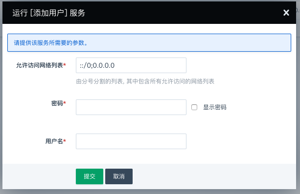
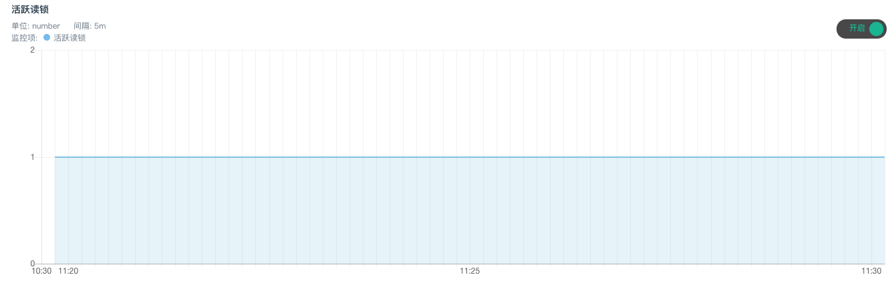

---
---

# ChronusDB on QingCloud 用户手册

## 创建步骤

### 基本设置

这里可以填写集群的描述等信息。

计费方式可选小时、合约。若开启自动备份，则在每天指定时间段都会创建一次备份。

**注解**：需要注意的是 「ChronusDB on QingCloud」 使用 Page cache 与最终一致模型，通常情况下我们不推荐您开启自动备份功能。

### 节点设置

可以选择基础型或者企业型e2数据库实例，以及数据库的配置、磁盘大小。磁盘大小决定了数据库最大容量，您的数据和日志会共享这块磁盘。

### 网络设置

数据库集群服务只能加入已连接路由器的私有网络，并确保该私有网络的 DHCP 处于『打开』状态。 使用一个数据库独享的私有网络的好处是方便您对其做『过滤控制』，同时也不影响其它私有网络的设置。

### 服务环境参数设置

在这一步可以创建初始的数据库账号，并设置数据库服务的配置参数。

### 用户协议

阅读并同意青云AppCenter用户协议之后即可开始部署应用。

## 集群信息

### 基本属性

这里显示了集群的基本信息。

### 服务端口信息

集群提供了高可用IP，您可以直接使用高可用IP对集群进行操作。

**注解**: 由于集群采用无主构架，我们更加建议您直接使用节点IP进行对集群的操作，可以更加灵活的控制集群的负载。

### 服务功能

点开基本属性旁边的下拉按钮，可以看到 ChronusDB 提供的服务功能。

### 节点列表

这里列出节点及其IP，可以使用这里列出的任意IP来对集群进行操作。同时显示了每个节点的服务状态。

### 配置参数

这里列出了集群的所有配置参数。仅供展示，我们不支持您对它们进行修改。

### 监控告警

可以对集群节点配置告警策略，及时掌握集群的资源和服务状况。

### 备份恢复

可以对集群进行手动备份，也可以在集群列表页面右键选择备份时间进行自动备份。

如果需要从备份创建出一个独立于原有数据库服务的新数据库服务， 可以在详情页的『备份』标签下右键相应的备份点，再选择『从备份创建集群』即可。

**注解：**需要注意的是「ChronusDB on QingCloud」使用 Page cache 与最终一致模型，通常情况下我们不推荐您使用备份功能。

### 用户列表

展示已有的数据库账号信息。

## 服务功能概述

### 添加账号

要创建新账号时，需要指定账号密码和授权访问的网络。

### 修改账号

要修改已有账号时，需要指定账号密码和授权访问的网络。

### 删除账号

这里填写要删除的账号名。

### 增删节点

可以根据需要增加集群节点，需要注意的是为了尽快的完成增加节点操作，让计算资源更快的被集群应用，增加节点的过程不会对原有数据迁移。

> **注解：**
>
> 1.「ChronusDB on QingCloud」在增加节点时，不支持对数据的重新分布。
>
> 2.「ChronusDB on QingCloud」暂不支持对集群进行删除节点操作。

### 扩容集群

可以对一个运行中的数据库服务进行在线扩容，调整CPU/内存/磁盘空间大小。

**注解**：扩容需要在开机状态下进行，扩容时链接会有短暂中断，请在业务低峰时进行。

### 监控

这里提供了每台主机的资源监控和服务监控。服务监控统计了一些用于性能分析的常用的 Metrics 信息，可用于定位分析数据库的性能。资源监控统计了主机的资源信息，如: CPU使用率、硬盘IOPS情况等，可用于查看系统性能是否到达瓶颈。

### 性能测试

参见[货车数据采集分析](../app_ChronusDB_use/ChronusDB_and_IoT.html)和[基础设施 CPU 数据收集分析](../app_ChronusDB_use/ChronusDB_and_analysis.html)

### 集群的使用

参见[ChronusDB on QingCloud 使用方法](../app_ChronusDB_use/index.html)
