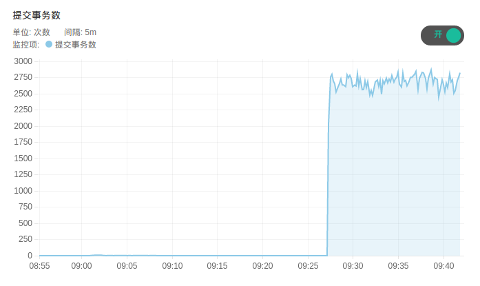

---
---

# QingCloud MySQL Plus 用户手册

## 旧版 MySQL Plus 文档

请访问[这里](../app_mysql_plus_1.0/index.html)

## RDB MySQL 文档

请访问[这里](../rdbs_mysql.html)

## 简介

MySQL 是全球最受欢迎的开源数据库之一，QingCloud MySQL Plus 云数据库是基于 MySQL 提供的高可用、高性能数据库服务，支持一主多从高可用架构，并具备安全、自动备份、监控告警、自动扩容等全套管理功能。


### 产品系列

QingCloud MySQL Plus 提供三个系列：基础版、高可用版、金融版。

| 系列     | 说明                                                                                                       | 适用场景                                                           |
| :------- | :--------------------------------------------------------------------------------------------------------- | :----------------------------------------------------------------- |
| 基础版   | 面向个人用户或中小型团队用户推出的单节点数据库版本，成本低，可实现极高的性价比。                           | 适用于个人学习、小型网站、开发测试等使用场景。                     |
| 高可用版 | 面向企业级生产环境推出的双节点数据库版本，采用一主一从的经典高可用架构，提供数据库的高可用保障。           | 适用于大中型企业生产库、互联网、电商零售、物流、游戏等行业应用。   |
| 金融版   | 面向金融级生产环境推出的三节点数据库版本，采用一主两从的三节点架构，保证数据的强一致性，提供金融级可靠性。 | 适用于对数据安全性要求非常高的金融、证券、保险等行业的核心数据库。 |


各系列实例规格如下：

| 系列     | vCPU | 内存      | vCPU/内存比   | 最大 IOPS  | 存储空间             |
| --------| ---- | --------- | ------------- | ---------- | -------------------- |
| 基础版   | 1~8  | 1GB~32GB  | 1:1，1:2，1:4 | 500~2500   | 基础型：10G~2000G    |
| 高可用版 | 2~32 | 4GB~128GB | 1:2，1:4，1:8 | 2000~30000 | SSD企业型：10G~2000G，NeonSAN：100G~5000G |
| 金融版   | 2~32 | 8GB~256GB | 1:4，1:8      | 2000~30000 | SSD企业型：10G~2000G，NeonSAN：100G~5000G |


### 产品特性

**性能强大**

l 基础版和高可用版支持 TokuDB 和 InnoDB 双存储引擎，TokuDB 实现更高的压缩比，存储空间的利用率提升 50%，大幅降低存储成本，适用于各类大数据分析场景。

l 高可用版和金融版可为用户提供更高的计算性能与稳定性。

**安全性**

l 网络隔离

QingCloud MySQL Plus 运行于私有网络内，与其他租户 100% 二层隔离；

l 实时副本

多重实时副本保障数据存储介质安全，确保数据不会丢失；

l 账户保护

严密账户保护，保障数据安全；


**灵活性**

l 多系列选择

提供单节点基础版、双节点高可用版及三节点金融版，可根据业务需求选择适合版本；

l 灵活弹性

可弹性灵活调整 CPU、内存、硬盘，轻松应对大并发负载；

l 配置丰富

节点配置最高支持 32 核 vCPU、256GB内存、30000 IOPS、5000GB 硬盘空间；


**高可用**

l 业务高可用

高可用版/金融版采用一主多备架构，主从秒级切换，确保业务高可用。主节点发生故障时，集群自动响应并选出新的主节点，从节点发生故障可自动重建并与主节点保持一致。

l 金融级数据强一致

高可用版采用一主一从双节点架构，通过半同步复制技术维护数据库可用性与数据一致性，相比异步复制更安全；

金融版基于 Paxos 协议，采用一主两备三节点架构, 保障数据强一致性, 自动脑裂保护处理。

l 跨区容灾

高可用版及金融版可实现多可用区主从部署，具有跨可用区容灾能力，提升数据安全性及容灾能力；


**自动运维**

l 自动备份

可设置自动备份策略，对 MySQL 集群进行自动备份并实时监控备份状态；

l 监控告警

通过绑定告警策略可对 MySQL 集群节点和 CPU、内存等服务状态进行实时监控并通知用户；

l 自动扩容

通过[自动伸缩功能](https://docs.qingcloud.com/product/operation/autoscaling)可在 MySQL 集群磁盘容量达到阈值时进行自动扩容。

**读写分离**

适用于高可用版、金融版。

l 最多支持添加 5 个只读实例节点，分担更多的读请求；

l 提供高可用读 IP、高可用写 IP 分别对应数据库的读和写；

l 支持添加 1-2 个 proxy 节点，提供高可用Proxy IP，由 Proxy 做读写分离。


## 注意事项

高可用版：

1. 禁止使用 MEMORY 存储引擎，否则会有复制问题。
2. 不要修改同步状态或直接连上从节点进行写操作。

金融版：

1. 只支持 InnoDB 存储引擎。
2. 每个表必须显示提供主键。
3. 不支持 savepoints。
4. 不要修改同步状态或直接连上从节点进行写操作。

## 创建步骤

本小节以创建高可用版本为例。

### 基本设置

这里可以填写集群的描述等信息并选择应用系列，应用版本，数据库内核以及计费方式。


若开启自动备份，则在每天指定时间段都会创建一次备份。

多可用区域将节点分散部署在不同区，可用性高。单可用区域将节点部署在同一个区，网络延迟最低。

**注解**：只有选择部署在『region』（比如北京三区）时，才可以选择部署方式。如果您选择『多可用区部署』，则集群所有节点将分散部署在当前 region 中的所 有zone，反之，如果选择『单可用区部署』，则集群所有节点将部署在当前region中的某一个 zone 中。

### 主实例设置

可以选择数据库的硬件配置，磁盘大小。磁盘大小决定了数据库最大容量以及 IOPS 能力，您的数据和日志会共享这块磁盘。


### 网络设置

数据库集群服务只能加入已连接路由器的私有网络，并确保该私有网络的 DHCP 处于『打开』状态。 使用一个数据库独享的私有网络的好处是方便您对其做『过滤控制』，同时也不影响其它私有网络的设置。

**注解**：此处展示的私有网络，其部署方式与[基本设置](#基本设置)中选择的部署方式是一致的。也就是说，如果您选择的集群部署方式是多可用区部署，则只能看到多可用区的私有网络。关于如何在region创建VPC、私有网络，请参考[区域(region)与可用区(zone)](https://docs.qingcloud.com/product/region)。


### 服务环境参数设置

设置数据库服务的配置参数。


### 用户协议

阅读并同意青云AppCenter用户协议之后即可开始部署应用。

## 集群信息

### 基本属性

这里显示了集群的基本信息。


### 服务端口信息

集群提供三个高可用 IP：

- 高可用读IP：可将请求在所有节点之间进行负载分担，提高读取性能，消除单点故障。

- 高可用写IP：始终指向 Master 节点。

- 高可用 Proxy IP：始终指向 Proxy 实例的 Master 节点。


**注解**:

1. 务必使用读IP执行读请求，以将所有读请求按轮询方式分摊到所有节点；务必使用写 IP 执行写请求，以保证切主后不影响业务。
2. Proxy 实例用于读写分离。Proxy IP 作为集群预留 IP ，如未创建用 Proxy 实例该 IP 仍然被占用但是无法访问。

### 服务功能

点开基本属性旁边的下拉按钮，可以看到提供的服务功能。


### 节点列表

显示了每个节点的服务状态。如果需要下载同步的日志，需要点击标志，展示 IP 后进行下载。


### 配置参数

这里列出了可以修改并持久化的配置参数。没有标注会重启服务的参数，都可以运行时修改，对服务没有影响。


**注解**：会自动重启服务的参数已经在描述中说明，请在业务低峰时进行修改。

**部分参数说明**：
> 1. `Ftp_user` 和 `Ftp_password`，点击同步日志后，需使用该账号下载节点上的日志，`Ftp_user` 在集群创建后不支持修改。
> 2. `Load_read_requests_to_master`，决定是否将读请求负载到 master 节点，默认为 `NO`，此时读请求只负载到 slave 节点。
> 3. `Audit_log_policy`，写审计日志的策略，提供 `ALL`、`LOGINS`、`QUERIES` 和 `NONE` 四种策略，默认为 `NONE`，此时不会记录审计日志。
> 4. `Audit_log_format`，审计日志文件格式，提供 `OLD`、`NEW` 和 `JSON` 三种格式，其中 `OLD` 和 `NEW` 分别为旧的和新的 XML 格式，注意修改该参数会自动重启服务。
> 5. `Audit_log_rotate_on_size`，单个审计日志文件大小，默认为 `100 MB`，范围为 `20 MB` ~ `2 GB`。
> 6. `Audit_log_rotations`，保留审计日志文件数量，默认为 `6`，在集群创建时和创建后均不支持修改。

### 监控告警

可以对集群节点配置告警策略，及时掌握集群的资源和服务状况。


### 备份恢复

可以对集群进行手动备份，也可以在集群列表页面右键选择备份时间进行自动备份。


如果需要从备份创建出一个独立于原有数据库服务的新数据库服务， 可以在详情页的『备份』标签下右键相应的备份点，再选择『从备份创建集群』即可。


**注解**：仅备份主实例的主节点。恢复集群时会保留原集群的数据库账号密码。

### 节点状态

展示主实例的角色信息。


**注解**：基础版集群不具备该功能。

### 账号列表

展示除运维账号外的 MySQL 账号。


## 服务功能概述

### 添加账号

要创建新账号时，需要指定账号密码和授权访问的数据库，创建成功后可查看 [账号列表](#账号列表)。


**注解**：

1. 系统保留 root 、qc_check 、 qc_repl 账号来进行自动化运维和数据同步，请勿删除这三个账号，以免破坏系统的运行。
2. 如果加密认证选项为 `YES` 则需要开启 [SSL传输加密](#ssl传输加密) 后该用户才可以用于连接数据库。
3. 支持添加`高级权限`账户，但是，仅能创建一个。
4. 添加用户成功后，如使用 Proxy 实例进行读写链接，需要重启 Proxy 实例来同步主实例用户信息。

### 删除账号

这里填写要删除的账号名。


### SSL传输加密

可选择是否开启 SSL传输加密，默认关闭。更多详细信息参考 [MySQL SSL](https://dev.mysql.com/doc/refman/5.7/en/creating-ssl-rsa-files.html)


**注解**：开启该服务后，需要在同 vxnet 主机获取证书。下载命令如下：
```
wget ftp://master_ip/ca.pem ftp://master_ip/client-cert.pem ftp://master_ip/client-key.pem --ftp-user=ftpuser --ftp-password=ftppassword
```

### 增删节点

可以根据需要增加集群节点。仅可以修改 只读实例 和 Proxy 实例 节点数量。添加只读实例节点的任务执行时间跟集群主实例的数据量有关系，数据量大时，任务执行时间会久一些，添加节点不影响集群的读写。


**注解**：

1. 不能修改主实例节点数量。
2. 基础版集群不支持增删节点服务。

### 扩容集群

可以对一个运行中的数据库服务进行在线扩容，调整CPU/内存/磁盘空间大小。


**注解**：

1. 点选需要扩容的角色以及扩容后的规格，点击提交即可完成扩容。扩容需要在开机状态下进行，扩容时链接会有短暂中断，请在业务低峰时进行。
2. 不支持资源降配。

支持自动扩容,通过点击控制台的`运维与管理`下的`自动伸缩`点击创建。


### 同步日志

同步日志支持选择同步日志个数（保留六个日志文件），将 mysql-slow.log、mysql-error.log 和 mysql-audit.log 拷贝到系统的FTP目录，可以在内网下载到本地进行分析。


**注解**：点选运行服务的角色，点击提交即可完成。


### 在线迁移

迁移服务可以将远端 MySQL 数据库的数据平滑迁移到 QingCloud MySQL Plus 集群中。目前支持迁移的 MySQL 版本为 5.6~5.7。

**迁移说明：**

> 1. `在线迁移可将远端集群的数据迁移到当前集群。`
> 2. 在线迁移时，会去远端 MySQL 复制全量数据。
> 3. 需要提供远端 MySQL 具有 super 权限 和 复制权限 的账户，并且要求远端 MySQL 开启 GTID 模式。
> 4. 远端 MySQL 版本在 5.6 以下，可以参考[数据迁移方案](#数据迁移)进行迁移。
> 5. 迁移期间，可通过 高可用写 IP 查看同步状态。
> 6. 为了保护集群运维账户，该服务不会同步远端 MySQL 的用户，需要使用者迁移完成后添加远端 MySQL 用户信息到本集群中。
> 7. 迁移前在远端集群设置 `connect_timeout=30`；远端集群和本集群均设置 `max_allowed_packets=1G`、`slave_pending_jobs_size_max=1G`、`interactive_timeout=3600`、`wait_timeout=3600`、`net_read_timeout=1800`、`net_write_timeout=1800`。
> 8. 迁移期间远端集群不要执行 DDL 语句。
> 9. 迁移期间不要在本集群控制台执行任何操作。
> 10. 不支持从高版本 MySQL 迁移到 低版本 MySQL。
> 11. 该服务仅会在主实例运行，当集群有只读实例时，服务运行失败，有 Proxy 实例不影响服务运行。
> 12. 开启在线迁移服务后，自动备份功能将会失效，建议暂时关闭自动备份。

**迁移步骤：**

> 1. 若原库与当前集群不在同一 VPC 下，使用 边界路由器（vpc board） 或 VPN ，打通原库与当前集群的网络。
> 2. 点击「 在线迁移 」，将原库 MySQL 账户名（要有 super 权限 和 复制权限）、密码、端口、IP 地址填入下图所示文本框，点击「 提交 」即开始迁移。
> 3. 等待「 在线迁移 」服务完成。服务执行完成后，当前集群就成功获取了原库的全量数据并与原库配置了主从关系，如此则可以持续同步原库增量数据到当前集群。
> 4. 若当前集群与原库同版本且同私有网络，可执行[交换预留IP](#交换预留IP)来快速切换业务。否则，按第5步切换业务。
> 5. 选择合适时段，切换业务到当前集群（切换时，远端 MySQL 必须要停写以保证数据一致性）：
>
> ```
>   a) 停止原库的业务。
>
>   b) 校验当前集群与原库数据是否一致，若一致，则继续下一步。
>
>   c) 点击 「 结束迁移 」，会自动重启 MySQL 集群。
>
>   d) 将业务所连IP改为当前集群的VIP，恢复业务。
>
> ```


### 交换预留IP

交换预留IP用于同版本且同私有网络中的当前集群与远端源集群之间在「在线迁移 」后交换VIP，省去人工停业务、检查数据一致性、执行结束迁移、更换业务所连VIP等步骤，实现业务快速切换。

**注意事项：**

> 1、为使操作步骤中的「 在线迁移 」尽可能执行成功，须参考[在线迁移](#在线迁移)中的迁移说明。
>
> 2、为确保数据一致性，「 交换预留IP 」时会设置远端源集群只读。

**操作步骤：**

> 1、在当前新创建的集群提前添加与远端源集群中相同的业务账号，便于后续「 交换预留IP 」完成后立即恢复业务。
>
> 2、在当前新创建的集群点击「 在线迁移 」，将远端源集群的MySQL账号(具备Super和复制权限)、密码、高可用写IP、端口信息填入文本框，点击「 提交 」即开始迁移。
>
> 3、等待「 在线迁移 」任务执行完成，在当前新创建的集群点击「 交换预留IP 」，如下图所示选择需要交换的集群ID后提交，执行完成后业务便切换到当前集群。


### 监控

这里提供了每台主机的资源监控和服务监控。服务监控统计了SHOW GLOBAL STATUS中的信息，可用于定位分析数据库的性能。资源监控统计了主机的资源信息，如CPU使用率、硬盘IOPS情况等，可用于查看系统性能是否到达瓶颈。




## 数据迁移

「QingCloud MySQL Plus」的MySQL版本为5.7.26 & 5.6.42，且开启了 GTID 复制模式，因此从其他MySQL迁移数据时，需要通过导数据或者 QingCloud MySQL Plus 支持的数据导入服务的方式来进行。

### 在线数据迁移

参考[在线迁移服务](#在线迁移)。

### 数据导出

在源数据库端使用 mysqldump 将需要的内容导出到 dump.sql 文件，导出数据需要排除 mysql.user 表，且不导出 GTID 标识。
这里假设源数据库的IP地址为 192.168.0.100，导出语句为：

```bash
mysqldump --all-databases --single-transaction --triggers --routines --events  --host=192.168.0.100 --port=3306 --user=mysql_dev -p --ignore-table=mysql.user --ignore-table=mysql.db --ignore-table=mysql.tables_priv --set-gtid-purged=OFF > dump.sql
```

这里是导出了全部的数据，也可以选择导出部分数据库，更多详细使用方法请参考 [mysqldump](https://dev.mysql.com/doc/refman/5.7/en/mysqldump.html)。

### 数据导入

将上一步导出的 dump.sql 文件复制到一台能连接「QingCloud MySQL Plus」的主机后执行该 .sql 文件。
需要使用「QingCloud MySQL Plus」的高可用写IP来进行链接。假设高可用的写IP地址为 192.168.0.250，导入语句为：

```bash
mysql -umysql_dev -p -h192.168.0.250 < dump.sql
```

## 基准测试

数据库基准性能测试为 sysbench 0.5。

**测试方法：**

1. 准备测试数据

    ```shell
    ./sysbench0.5_base/bin/sysbench --mysql-host=192.168.0.3 --mysql-port=3306 --mysql-user=test --mysql-password=Test_2019 --mysql-db=testdb --mysql-table-engine=innodb --test=./sysbench0.5_base/share/sysbench/oltp.lua --oltp_tables_count=20 --oltp-table-size=1000000 --oltp-index-updates=2 --oltp-read-only=off --rand-type=special --max-time=600 --max-requests=0 --percentile=99 --oltp-point-selects=4 --num-threads=128 prepare
    ```
2. 运行测试

    ```shell
    ./sysbench0.5_base/bin/sysbench --mysql-host=192.168.0.244 --mysql-port=3306 --mysql-user=test --mysql-password=Test_2019 --mysql-db=testdb --mysql-table-engine=innodb --test=./sysbench0.5_base/share/sysbench/oltp.lua --oltp_tables_count=20 --oltp-table-size=100000 --oltp-index-updates=2 --oltp-read-only=off --rand-type=special --max-time=600 --max-requests=0 --percentile=99 --oltp-point-selects=4 --num-threads=128 run
    ```

基准测试建议您自己来做，以获得对测试数据最真实的第一手资料。
